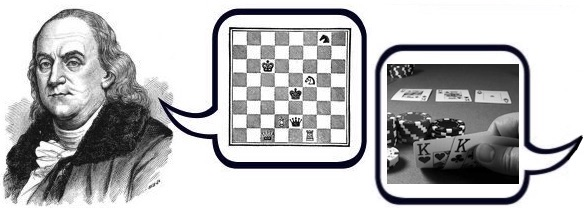
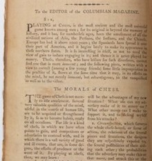

Morals of Poker
===============================================================================

*October 7, 2017*

In 1786, Benjamin Franklin published an essay called "The Morals of Chess"[^Franklin1786]
where he argues that concerning chess:

>   Several very valuable qualities of the mind, useful in the course of human life,
>   are to be acquired or strengthened by it, so as to become habits, ready on all
>   occasions.

Chess is an example of a game with a rich enough structure that one can 
infer from the best strategies for it,
emblematic norms of action that have far more generality---morals.

Similarly, well-versed poker players will know poker to have
*"valuable qualities of the mind, useful in the course of human life."*
In the spirit of Franklin's essay,
I have tried to enumerate the "Morals of Poker."

[^Franklin1786]: Franklin, B. (1786). The Morals of Chess. *The Columbian Magazine*, 1, 159--161.         
    <https://folk.uio.no/gatandbe/chessmorals.pdf>

### 1. You do not achieve without trying

You have to show up and to risk something to achieve anything.
You do not win if you do not play.

### 2. Know your place

Pay attention.
It's great that you showed up, but now you have to do the right things
at the right times.
Let others act. Watch and learn from them.
Act when it is your turn,
not outside of it, and not late.
As things change, know your place within them
and adapt to the situation.

### 3. Stand up for yourself

No one else is going to do it for you.
When you know your place is a winning one---the right one,
you ought to have the gumption to defend your position aggressively.

### 4. You cannot lie much

While a lot can be gained by representing yourself with confidence,
eventually you have to back it up with something real.
You earn your reputation with what you project and what you produce.
You cannot bluff everyone forever.

### 5. Shit happens

Sometimes the worst thing happens, sometimes the best.
There is no luck, no streaks, no karma.
There will be up-swings and down-swings.

### 6. Discipline and patience pays

Because shit will happen, you have to be able to ride the waves.
Cultivate your conscientiousness so that you will be ready for hard times.
Do not get suckered into taking risks that you should not.
Consistently stick to your best plan, but adapt your plan.
Do not lose sight of your long-term goals.

### 7. Opportunity missed is opportunity lost

Again, pay attention!
*Carpe diem!*
As Action Bronson said,
"Opportunity be knocking, you gotta let a motherfucker in".
The flip side of Franklin's aphorism "A penny saved is a penny earned"
should be that "A penny missed is a penny lost".
The opportunities that you let walk-by are opportunity *losses*.

### 8. Cut your losses

What is done is done.
You are never pot-committed to past bets,
only to what you can win now.
Learn from the past, but do not carry it into decisions you can make now.

### 9. Never be rash

If you do not have peace of mind, do not set yourself up to make any important decisions.
Come back to the issues when you are ready to take them seriously.

### 10. Everyone is full of shit

They are all apes, and you are too.

