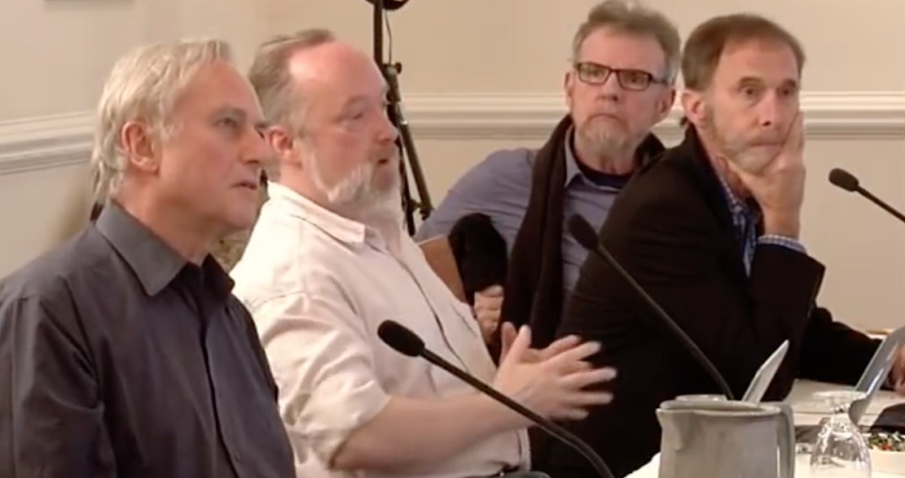

Participants introduce themselves
================================================================================

*[Day 1, morning, 1st session](https://www.youtube.com/watch?v=Ju4C_ITlBsU&list=PLrxfgDEc2NxYQuZ5T6CSdS8uafdh0kmDL&index=0)*

1.  **Nicholas Pritzker** - Investor worth $1.3 B, sponsored the event.

2.  **Sean Carroll** - Conference organizer.  Physicist/cosmologist at Cal Tech.
    Philosophy minor; philosophy grad courses with John Rawls and Robert Nozick.
    Wishes he had written a book about atheism.
    Disagrees with Sam Harris that morality can be based on science.
    Compatibilist, but curious about free will.

    Sean's books include a textbook on general relativity: 
    *[Spacetime and Geometry](https://www.amazon.com/Spacetime-Geometry-Introduction-General-Relativity/dp/9332571651/)*,
    and popular books: *[From Eternity to Here](https://www.amazon.com/Eternity-Here-Quest-Ultimate-Theory/dp/0452296544/)* 
    and *[The Particle at the End of the Universe](https://www.amazon.com/Particle-End-Universe-Higgs-Boson/dp/0142180300/)*. [^SeanBooks]

    Sean blogs at [preposterousuniverse.com](http://www.preposterousuniverse.com/blog/)

3.  **Richard Dawkins** - Oxford biologist.  If not naturalism then what?  Super-human
    is surely possible, but what would supernatural even mean?

    Richard's books include 
    *[The Selfish Gene](https://www.amazon.com/Selfish-Gene-Anniversary-Landmark-Science/dp/0198788606/)*, 
    *[The Blind Watchmaker](https://www.amazon.com/Blind-Watchmaker-Evidence-Evolution-Universe/dp/0393351491/)*, 
    and *[The God Delusion](https://www.amazon.com/God-Delusion-Richard-Dawkins/dp/0618918248/)*. [^RichardBooks]

4.  **Don Ross** - Ph.D. philosophy of science.  Works in both philosophy and economics.
    Interested in the unification of economics with other sciences.
    Economics as the study of information systems.

    *. [^Ladyman2007]
        ](img/ETMG.jpg)

    Wrote *Every Thing Must Go* with James Ladyman as a critical polemic against 
    metaphysics with pre-scientific views.

    > Philosophers, for the most part, analytic philosophers particularly, have failed to
    > really promote naturalism and give it its proper innings because of lingering commitments
    > to pre-scientific worldviews.

    David Lewis, for example, does not take contemporary physics seriously.

    > [Analytic metaphysics,] as practiced in the world's best philosophy departments right now,
    > it's virtually all nonsense.  It virtually all presupposes demonstrably false physics.
    
    QFT is inconsistent with the presuppositions of most analytic metaphysics.
    What if we take real physics seriously?
    What about the special sciences?
    Science should provide us with a general worldview.
    Runs an experimental economics lab at the U of Capetown.
    Would like to change his mind about the philosophy of mathematics
    since he changes it often.

    Don's books include
    *[Dennett's Philosophy: A Comprehensive Assessment](https://www.amazon.com/Dennetts-Philosophy-Comprehensive-Don-Ross/dp/026268117X/)*,
    *[Economic Theory and Cognitive Science: Microexplanation](https://www.amazon.com/Economic-Theory-Cognitive-Science-Microexplanation/dp/0262681684/)*, 
    *[Every Thing Must Go: Metaphysics Naturalized](https://www.amazon.com/Every-Thing-Must-Metaphysics-Naturalized/dp/0199573093/)*, and
    *[What Is Addiction?](https://www.amazon.com/What-Addiction-MIT-Press-Ross/dp/0262513110/)*. [^DonBooks]

5.  **Alex Rosenberg** - Started in physics.  Works in the philosophy of biology.
    Views that naturalism is deeply incompatible with Sellars' *manifest image*
    (the obvious furniture of reality in contrast to the *scientific image*).
    Wrote *The Atheist Guide to Reality for which others in the room call him a "maddog reductionist".

    *. [^Rosenberg2011]
        ](img/atheists-guide-to-reality.jpg)

    Alex's books include
    *[Philosophy of Biology: A Contemporary Introduction](https://www.amazon.com/Philosophy-Biology-Contemporary-Introduction-Introductions-ebook/dp/B000SKK6H4/)*\, 
    *[Philosophy of Science: A Contemporary Introduction](https://www.amazon.com/Philosophy-Science-Contemporary-Introduction-Introductions-ebook/dp/B0076XCV1A/)*\, and
    *[The Atheist's Guide to Reality](https://www.amazon.com/Atheists-Guide-Reality-Enjoying-Illusions/dp/0393344118/)*\. [^AlexBooks]

6.  **Owen Flanagan** - Philosopher.  Embraces Sellars' view that 

    >   The aim of philosophy, abstractly formulated, is to understand how things in 
    >   the broadest possible sense of the term hang together in the broadest possible sense of the term. [^Sellars1963]

    Grew up Catholic.  Studied with Quine and some of his students.
    The best philosophy is continuous with science.  Interested in consciousness and
    ethics.  Disturbed by the way philosophers moan about the "hard problem".
    Wrote *Varieties of Moral Personality - Ethics and Psychological Realism*.
    Believes that ethics can be naturalized.
    Morality is just a social institution.
    You can't derive is from ought, but you can make inferences to the best explanation
    about what you ought to do, and there are often competing goods.
    Tries to combat the issue that most Americans have trouble finding meaning in
    a naturalistic worldview.
    Also studies classical Chinese and Indian philosophy.
    Free will is a black hole in philosophy that other cultures avoid discussing.
    Also interested in *positive illusions* - are false beliefs always bad?

    Owen's books include
    *[Varieties of Moral Personality: Ethics and Psychological Realism](https://www.amazon.com/Varieties-Moral-Personality-Psychological-Realism/dp/0674932196/)*,
    *[Consciousness Reconsidered](https://www.amazon.com/Consciousness-Reconsidered-Press-Owen-Flanagan/dp/0262560771/)*,
    *[The Really Hard Problem: Meaning in a Material World](https://www.amazon.com/Really-Hard-Problem-Meaning-Material/dp/0262512483/)*, and
    *[The Bodhisattva's Brain: Buddhism Naturalized](https://www.amazon.com/Bodhisattvas-Brain-Buddhism-Naturalized-Press/dp/0262525208/)*. [^OwenBooks]

7.  **Simon DeDeo** - Started in cosmology at U Chicago.  Studied with Hilary Putnam.
    Studies complexity theory at the Sante Fe Inst.
    Self-described platonist, functionalist.  Studies social systems with group theory. 

    Simon doesn't have a book, but like others here, he has published several articles in peer reviewed journals. [^SimonArticles]

8.  **Terrence Deacon** - Began college in physics.  Got interested cybernetics.
    Co-authored a 900 page book on the Apple-II computer.
    Charles Pierce's work made him drop-out of physics and write a philosophy thesis on Pierce.
    Interested in neuroscience and biological anthropology.
    Tracer techniques in neuroscience.
    Worked in cross-species neuron transplantation.
    Anti-theist but engages the Templeton Foundation.
    Interested in rethinking the concept of information.
    How do we get reference and normativity?
    How does a molecule become about something?
    Does not think that brains are like computers.
    Is still a functionalist, but thinks our theories of computation are not
    adequate to explain brains.

    Terrence's books include
    *[The Symbolic Species: The Co-evolution of Language and the Brain](https://www.amazon.com/Symbolic-Species-Co-evolution-Language-Brain/dp/0393317544/)* and
    *[Incomplete Nature: How Mind Emerged from Matter](https://www.amazon.com/Incomplete-Nature-Mind-Emerged-Matter/dp/0393343901/)*. [^TerrenceBooks]

9.  **Rebecca Goldstein** - Grew up in an orthodox Jewish home.
    As a child, read *Our Friend the Atom* and Bertrand Russell's *Why I am not a Christian* [^Russell1957]\.
    Wanted to be a physicist.  Sydney Morganbesser convinced her to study philosophy of science.
    Went to Princeton to study philosophy.  Wanted to study foundations of quantum mechanics.
    Then read Thomas Nagel's "What it is like to be a bat". [^Nagel1974]
    She is a materialist but fascinated by the mind-body problem.
    Was driven to write philosophical novels out of frustration of philosophy's dependence
    on character, intuitions, and presuppositions.
    Thinks she ruined her philosophy career with her first novel *Mind-body Problem*.
    Fascinated by philosophy of mathematics.
    Thinks Godel's work leads to mathematical realism.
    Would like to believe that philosophy can make progress past people's intuitions,
    but isn't yet convinced.

    Rebecca's books include:
    *[The Mind Body Problem](https://www.amazon.com/Mind-Body-Problem-Contemporary-American-Fiction/dp/0140172459/)*\,
    *[Incompleteness: The Proof and Paradox of Kurt G&ouml;del](https://www.amazon.com/Incompleteness-Proof-Paradox-G%C3%B6del-Discoveries/dp/0393327604/)*\, and
    *[Betraying Spinoza: The Renegade Jew Who Gave Us Modernity](https://www.amazon.com/Betraying-Spinoza-Renegade-Modernity-Encounters/dp/0805211594/)*. [^RebeccaBooks]

10. **Daniel Dennett** - Philosopher at Tuft's. Quine was his hero and mentor.
    Didn't study any science originally, but realized he needed to know something about the
    brain.  Studied with Gilbert Ryle. Got informal education from many scientists.
    Doesn't spend much time with many philosophers these days.

    > I think this is a wonderfully chosen group. When I think of all the people in the field of
    > philosophy that aren't here, I am so glad they are not.

    Like Owen he is appalled that despite the progress naturalism has made in the last few decades,
    there is a retrograde gang of philosophers that do armchair philosophy that is not worth a damn.
    Willfred Sellars nailed it: philosophy should be about helping our intuitions understand how
    the manifest image goes with the scientific image, to bring consilience.
    Compatiblist.  Thinks the brain should be thought of as having humuncular functionalism.

    > The brain is a largely anarchic assemblage of selfish neurons that have agendas.

    Concerning the manifest/scientific image, in one sense there is no color,
    but if you call the front desk and say there is no color TV in your hotel room,
    they will know what you mean.

    Dan's books include
    *[Consciousness Explained](https://www.amazon.com/Consciousness-Explained-Daniel-C-Dennett/dp/0316180661/)*\, 
    *[Darwin's Dangerous Idea: Evolution and the Meanings of Life](https://www.amazon.com/DARWINS-DANGEROUS-IDEA-EVOLUTION-MEANINGS/dp/068482471X/)*\, 
    *[Freedom Evolves](https://www.amazon.com/Freedom-Evolves-Daniel-C-Dennett/dp/0142003840/)*\, and
    *[Breaking the Spell: Religion as a Natural Phenomenon](https://www.amazon.com/Breaking-Spell-Religion-Natural-Phenomenon/dp/0143038338/)*\. [^DanBooks]

--------------------------------------------------------------------------------

*[Day 1, morning, 2nd session](https://www.youtube.com/watch?v=qeyBqxY3MsQ&index=1&list=PLrxfgDEc2NxYQuZ5T6CSdS8uafdh0kmDL)*

11. **Massimo Pigliucci** - Started as an evolutionary biologist,
    studying gene-environment interactions,
    nature/nurture.  Midlife crisis lead him to move to NYC and get a second Ph.D. in philosophy.
    Became a philosophy professor at CUNY.
    Science and philosophy do different things, but are both part of *scientia*.
    Interested in the demarcation problem.
    Thinks that philosophy does make progress.
    Has a tattoo:
    
    > Truth springs from argument amongst friends. -- Hume ([misattributed](https://en.wikiquote.org/wiki/David_Hume))

    Likes Ladyman and Ross' book which changed his mind about many things.

    Massimo's books include:
    *[Tales of the Rational](https://www.amazon.com/Tales-Rational-Skeptical-Essays-Science-ebook/dp/B008S1JP4U/)*\, 
    *[Denying Evolution: Creationism, Scientism, and the Nature of Science](https://www.amazon.com/Denying-Evolution-Creationism-Scientism-Science/dp/0878936599/)*\, 
    *[Making Sense of Evolution](https://www.amazon.com/Making-Sense-Evolution-Foundations-Evolutionary/dp/0226668371/)*\, and 
    *[Nonsense on Stilts: How to Tell Science From Bunk](https://www.amazon.com/Nonsense-Stilts-Tell-Science-Bunk/dp/0226667863/)*\. [^MassimoBooks]

12. **David Poeppel** - Undergrad in cell biology and linguistics.  Then worked
    as an actor before going to grad school.
    Runs a human brain science lab at NYU, studying the temporal structural
    of perceptual experience.  The parts list of the brain.
    Thinks neuroscience has generally failed so far.
    So far neuroscience has been successful at the "maps problem"
    making finer resolution maps of the brain, but not yet many conceptual advances.

    David doesn't have a book, but like others here, he has published several articles in peer reviewed journals. [^DavidArticles]

13. **Jennifer Ouellette** - Science writer.  Recoiled from an evangelical religious family.
    Married to Sean Carroll.

    Jennifer blogs at [twistedphysics.typepad.com](http://twistedphysics.typepad.com/)

14. **Jerry Coyne** - Evolutionary biologist at U Chicago.
    Incompatiblist: consciousness and free will are an illusion, not meaning that they
    aren't real, but they are not what they seem to be.
    Realized that to teach evolution it was necessary to argue against religion.

    > We are collations of molecules that obey the laws of physics,
    > and sometimes it appears that we do that rationally, but a lot of times we don't.
    > My replacement for free will would be the statement: Our decisions are made by
    > internal forces that we don't understand, and that we should deep-six the idea of
    > free will in terms of this statement.

    Are there other ways to know besides science (art, music, literature)?
    For example, if your kid tells you they are hungry,
    that's a way of knowing that is not science.

    **(Ryan, the author of these notes)**: When your kid says something, it's still scientific
    insofar as it's a rough mix of being empirical/verifiable/falsifiable.
    You could ask your kid to repeat in case you mis-heard them;
    you could look closely to verify you aren't mis-identifying them;
    you can verify (insofar as you get accurate feedback from the kid) that their hunger subsides after feeding them;
    empirically improving your confidence in the information.

    Jerry's books include
    *[Speciation](https://www.amazon.com/Speciation-Jerry-Coyne/dp/0878930892/) and
    *[Why Evolution Is True](https://www.amazon.com/Why-Evolution-True-Jerry-Coyne/dp/0143116649/). [^JerryBooks]

    Jerry blogs at [whyevolutionistrue.wordpress.com](https://whyevolutionistrue.wordpress.com/)

15. **Steven Weinberg** - Works in particle physics, QFT, and cosmology.
    One of the founders of the Standard Model. [^Weinberg1967]
    Serious BAMF.
    Nobel laureate in physics in 1979 for his contributions with Abdus Salam and Sheldon Glashow
    to the unification of the weak and electromagnetic forces.

    Reality and naturalism:
    
    > I'm all for them, but I'm not sure what they are.

    Consciousness and mathematics:
    
    > I think I know what they are, but I don't see how they fit into natural science.

    Confesses he has strong views on emergence, morality, and free will that are
    unlikely to change.

    Steven's books include textbooks: 
    *[The Quantum Theory of Fields, Vol 1-3](https://www.amazon.com/Quantum-Theory-Fields-Foundations/dp/0521670535/)* and
    *[Cosmology](https://www.amazon.com/Cosmology-Steven-Weinberg/dp/0198526822/)*\,
    and popular books:
    *[The First Three Minutes](https://www.amazon.com/First-Three-Minutes-Modern-Universe/dp/0465024378/)* and
    *[Dreams of a Final Theory](https://www.amazon.com/Dreams-Final-Theory-Scientists-Ultimate/dp/0679744088/)*\. [^StevenBooks]

16. **Janna Levin** - (Introduced herself later in the day 1, afternoon, 1st session.)
    TODO. [^JannaBooks]

[^SeanBooks]: @Carroll_2003_Spacetime_and_Geometry_An_Ontroduction_to_General\,
    @Carroll_2010_From_Eternity_to_Here_The_Quest_for_the_Ultimate\, and
    @Carroll_2012_The_Particle_at_the_End_of_the_Universe_How\.
[^RichardBooks]: @Dawkins_1976_The_Selfish_Gene\,
    @Dawkins_1986_The_Blind_Watchmaker\, and
    @Dawkins_2006_The_God_Delusion\.
[^DonBooks]: @Ross_2000_Dennetts_Philosophy_A_Comprehensive_Assessment\,
    @Ross_2005_Economic_Theory_and_Cognitive_Science\,
    @Ladyman_2007_Every_Thing_Must_Go_Metaphysics_Naturalised\, and 
    @Ross_2010_What_Is_Addiction\.
    Published after this workshop: @Ross_2013_Scientific_Metaphysics\.
[^AlexBooks]: @Rosenberg_2008_Philosophy_of_Biology_A_Contemporary_Introduction\,
    @Rosenberg_2011_The_Atheists_Guide_to_Reality\, and
    @Rosenberg_2012_Philosophy_of_Science_A_Contemporary_Introduction\.
[^OwenBooks]: @Flanagan_1991_Varieties_of_Moral_Personality_Ethics\, 
    @Flanagan_1992_Consciousness_Reconsidered\,
    @Flanagan_2007_The_Really_Hard_Problem_Meaning_in_a_Material\, and
    @Flanagan_2011_The_Bodhisattvas_Brain_Buddhism_Naturalized\.
[^SimonArticles]: For example, see @DeDeo_2010_Inductive_game_theory_and_the_dynamics_of_animal and
    @DeDeo_2011_Effective_theories_for_circuits_and_automata\.
[^TerrenceBooks]: @Deacon_1997_The_Symbolic_Species_The_Co_evolution_of_Language and
    @Deacon_2011_Incomplete_Nature_How_Mind_Emerged_from_Matter\.
[^RebeccaBooks]: @Goldstein_1983_The_Mind_Body_Problem\,
    @Goldstein_2005_Incompleteness_The_Proof_and_Paradox_of_Kurt\, and
    @Goldstein_2006_Betraying_Spinoza_The_Renegade_Jew_Who_Gave_Us\.
    Published after this workshop: @Goldstein_2015_Plato_at_the_Googleplex_Why_Philosophy_Wont_Go\.
[^DanBooks]: @Dennett_1992_Consciousness_Explained\, 
    @Dennett_1995_Darwins_Dangerous_Idea_Evolution\, 
    @Dennett_2003_Freedom_Evolves\, and 
    @Dennett_2006_Breaking_the_Spell_Religion_as_a_Natural\.
[^MassimoBooks]: @Pigliucci_2000_Tales_of_the_Rational\, 
    @Pigliucci_2002_Denying_Evolution_Creationism_Scientism\, 
    @Pigliucci_2006_Making_Sense_of_Evolution\, and 
    @Pigliucci_2010_Nonsense_on_Stilts_How_to_Tell_Science_From_Bunk\.
    Published after this workshop: @Pigliucci_2017_How_to_Be_a_Stoic_Using_Ancient_Philosophy\.
[^DavidArticles]: For example, @Hickok_2007_The_cortical_organization_of_speech_perception and 
    @Lau_2008_A_cortical_network_for_semantics_deconstructing\.
[^JerryBooks]: @Coyne_2004_Speciation and @Coyne_2009_Why_Evolution_Is_True\.
[^StevenBooks]: @Weinberg_1977_The_First_Three_Minutes\,
    @Weinberg_1992_Dreams_of_a_Final_Theory\,
    @Weinberg_1995_The_Quantum_Theory_of_Fields_Vol_1_Foundations\,
    @Weinberg_1995_The_Quantum_Theory_of_Fields_Vol_2_Modern\,
    @Weinberg_2000_The_Quantum_Theory_of_Fields_Vol_3_Supersymmetry\, and 
    @Weinberg_2008_Cosmology\.
[^JannaBooks]: @Levin_2002_How_the_Universe_Got_Its_Spots and 
    @Levin_2006_A_Madman_Dreams_of_Turing_Machines\.
[^Ladyman2007]: @Ladyman_2007_Every_Thing_Must_Go_Metaphysics_Naturalised\.
[^Nagel1974]: @Nagel_1974_What_is_it_like_to_be_a_bat\.
[^Rosenberg2011]: @Rosenberg_2011_The_Atheists_Guide_to_Reality\.
[^Russell1957]: @Russell_1957_Why_I_Am_Not_a_Christian_and_Other_Essays\.
[^Sellars1963]: @Sellars_1963_Science_Perception_and_Reality\, p. 1.
[^Weinberg1967]: @Weinberg_1967_A_model_of_leptons\.

<!-- REFERENCES -->

