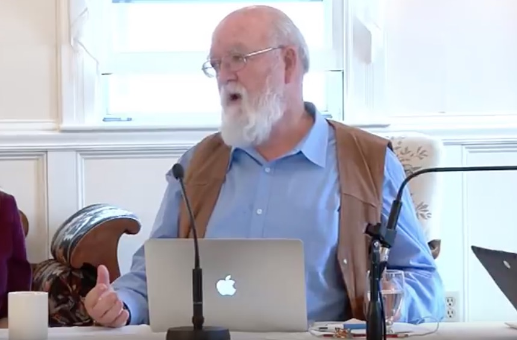

What is reality?
================================================================================

*[Continuing Day 1, morning, 2nd session](https://www.youtube.com/watch?v=qeyBqxY3MsQ&index=1&list=PLrxfgDEc2NxYQuZ5T6CSdS8uafdh0kmDL)*

**Alex**

> There's nothing but fermions and bosons.

.
    In this all encompassing equation, fermions are the quanta of the $\psi$ fields and
    bosons are the quanta of the $g$, $A$, and $\Phi$ fields.
    ](img/carroll-standard-model-action.jpg)

Physics has not yet bottomed out, but we don't have to know the fundamental ontology
(string theory or otherwise).  Perhaps it won't ever bottom out.
Naturalism doesn't require us to take sides on matters at the frontiers of physics.
Naturalism can trust two (three) features of physics to not change (despite possible future revolutions):

1.  *__Resolute denial of teleology__*: no backward causation from the future
    pulling events in some trajectory, or any eminent causation that involves some
    kind of representation of what the future must be like.
    The denial of purpose and goals in physics:
    no sucessor theory to the succession of theories since Newton
    is likely to include any scope for teleological causal processes.
2.  *__Second law of thermodynamics__*: generates the time asymmetries in physics.
    Further, all the asymmetries in physics are a result of the time asymmetries.
    (**Ryan**: really? maybe.)
3.  *__Reductionism__*: is a metaphysical thesis that denies downward causation; physics is causally closed.
    The explanatory power of the special sciences are an epistemic thesis and not
    a metaphysical one, and 
    *represent cognitive limitations of humans and no fundamental facts about the organization of reality*.

**(Ryan)**

I think Alex goes too far with his last points about reductionism.
Emergent facts about reality are still facts, interesting, and arguably metaphysically real,
albeit not in the same way as (more) fundamental physics.
I agree that we should emphasize that reductionism means that there is no
downward causation.

Let us label Alex's position that tends to deny the reality of ontologies
that emerge or supervene on physics as *eliminative reductionism*.

 (1738-1739),
    an image of an automata that symbolizes a view of reductionism.
    ](img/vaucansons-digesting-duck.jpg)

**Sean**

If we buy that particle physics has no teleology in it, is it nevertheless useful to talk
about emergent phenomena as having teleological explanation?  The length of the
neck of the giraffe has a purpose, for example.

**Alex**

Sure, we can help ourselves to that vocabulary, but we should acknowledge that
we are engaging in a somewhat misleading set of metaphors, similar to the
issue of "design" in evolutionary biology.
But if we were to ignore this distinction, we would miss the big difference
between Aristotilian and Newtonian mechanics.

**Don**

You (Alex) are committed to the view that *"physics fixes all the facts"*.
But fundamental physics does not address all the facts, and the most interesting
facts are the ones that are the most general.
What you mean is that if we had a computer that could in principle
calculate all the fundamental physics (Laplace's demon)
then we could derive all the facts of the special sciences.
It's very hard for me to see what could constitute evidence for that claim.
That looks like a statement of metaphysical faith.
We should be a little bit verificationist.

**(Ryan)**

I agree Don has clarified the issue of what reductionism
entails, but he shouldn't be skeptical about it, as we verify that physics
is causally closed every time we look for new experimental effects beyond it.

Perhaps it's worth defining a concept of *entailment* to denote the claim
that a description of reality in terms of fundamental physics fixes the
higher-level claims of the special sciences.
Is there a difference between "*A* reduces to *B*" and "*B* entails *A*"?

**Steven**

Why should we have this kind of philistinism?
Is the manifest image something that makes sense and is permissible to us?  Sure.
Barack Obama is real and Santa Claus is not, and not for reasons that require
particle physics.

>   Why should we not use this kind of principled philistinism of
>   refusing to think deeply, but using "real" the way we use other terms
>   in our everyday life.  Why shouldn't we do this in physics or science also.
>   Is there really a philosophical discontinuity between the kind of reasoning
>   we do in everyday life and science that makes this kind of naive view of
>   reality impermissible in one where it is useful in the other.

Further,

>   Everyone in this room has used the word "real" in an unreflective,
>   unphilosophical, unsophisticated way and I don't see any reason for barring
>   its use in the sciences also.

I took a philosophy course from Max Black at Cornell,
whom whenever asked if something is real, said the answer is "yes".

Temperature is real; protons are real; the constitution is real; this newspaper is real;
but real in different ways.

**Dan**

I agree with you (Steven).  We should remember that there is another camp of
philosophers (and scientists) that say that the manifest image is what is real and causal (has hegemony),
and the posits of physics are instrumentalist fantasies.

>   "Quantum particles: the dreams that stuff is made of" -- David Moser

Now, we as naturalist are committed to the ontology of the physical sciences,
but we shouldn't go to the other extreme and deny the reality of the manifest image.

>   We can count the glasses on the table.

**Alex**

(Back-pedaling)  That's not a thesis I was defending.
There's nothing but fermions and bosons... *and everything that is made up of*
fermions and bosons.
The physical facts fix all the facts.
There are also chemical facts, biological facts, economic facts.
But if you fix the relations of the fermions and bosons in one chunk of spacetime
the same as another, then you get all the same emergent phenomena as well.
However, you won't have the same historical facts, following the points from
the thought experiment called "[Swampman](https://en.wikipedia.org/wiki/Swampman)".

 
    is the subject of a thought experiment by Donald Davidson [^Davidson2001]
    about identity and meaning.
    ([Image](https://www.redbubble.com/people/petemandik/works/24183232-swampman)
    by [Pete Mandik](https://www.instagram.com/p/BLSD0iaDe9d/).)
    ](img/swampman-mandik.jpg)

**Steven**

I suppose you would say The Constitution of the United States,
not the paper its printed on but the ideas it represents,
is real because it exists in the brains of people.

**Alex**

>   To first approximation.

**Sean**

What about the Schr&ouml;dinger equation?

\begin{equation}
    \label{eq:schrodinger_equation}
    i \hbar \: \frac{\partial}{\partial t} | \psi \rangle = \hat{H} | \psi \rangle
\end{equation}

**Alex**

I agree, and several others have pointed out, the ontology of mathematical relations is perplexing.

>   The biggest problem for me philosophically is: what is the metaphysics and epistemology of mathematical truths?

**Terrence**

>   To what extent is this not a Cartesian view, in which you have just given up half the world? ...
>   There's the teleological stuff, and it's all just illusion.

**(Ryan)**

Not sure, but what I think what Terrence is getting at is that
Alex's skepticism about higher ontology and the manifest image
can be seen as being analogous to Descartes' radical skepticism about information from his empirical senses.
I'm assuming he's implying that a more thorough reflection (in the scientific realist sense)
would recognize realism at higher levels?
Perhaps he's arguing that some of it may even be teleological??

**Alex**

Some, like Dan, will say that teleology is a garden variety causal process
that involves blind variation and natural selection operating at many different levels
and using many different mechanisms to produce adaptation.
Not only that, we should also recognize that Darwin naturalized teleology and purpose,
giving the real causal mechanism underlying it.
Darwin showed that there is *not* any teleology
in nature, it's all just an overlay.

**Steven**

I have to agree with you (Alex) because so much of the progress in the history
of science has been in removing teleology from explanation,
for example,
in Aristotle's physics and in the biology before Darwin.

**Dan**

As communicators of science, we have a political obligation to not be misunderstood.
Richard agrees with you (Alex) that there isn't any biological design in nature
and coined the term *designoid*, meaning apparently designed, however,
I think this is a mistake.

Two Harvard medical students in a bar were discussing the marvels inside a single cell.
One of them says to the other, "How can evolution possibly be true?"

There's an idea out there that evolutionary biologists should downplay the
marvelousness of nature.  "There's no design in nature; examples of brilliant biological
design are an embarrassment to science."  But what evolution accomplishes is often
stupendously clever.  Evolution *should* be properly called a *design process*
and can be contrasted with *pseudo design*, being cases where there appears to be
design with function but its actually noise, such as Sidney Harris' comic
with a blackboard filled with fake physics scribbled on it that is really meaningless.

    ](img/sharris-1.png)

Biological design is typically better than what engineers can achieve
(in terms of optimization, energy efficiency, etc.).

**[Steven](https://www.youtube.com/watch?v=qeyBqxY3MsQ&feature=youtu.be&list=PLrxfgDEc2NxYQuZ5T6CSdS8uafdh0kmDL&t=2782)**

>   I thought the design of the genetic code was pretty bad. [^BadGeneticCode]

[^BadGeneticCode]: Since there are 64 combinations of 4 nucleotides taken 3 at a time per codon and only 20 amino acids, 
    the code is degenerate---more than one codon per amino acid, in most cases 
    (see [link](https://www.bx.psu.edu/~ross/workmg/GeneticCodeCh13.htm)).

**Alex**

The more you look into it, the more you realize how good the design is given the constraints.
We could talk about that more, but moving on...

The political implications of naturalism give me pause.
In 1860, on hearing the suggestion that mankind was descended from the apes, 
the wife of the Bishop of Worcester is said to have exclaimed,

>   My dear, descended from the apes! Let us hope it is not true, but if it is, 
>   let us pray that it will not become generally known. [^WifeWorcester1860]

[^WifeWorcester1860]: See the analysis by [Quote Investigator](https://quoteinvestigator.com/2011/02/09/darwinism-hope-pray/).

I'm afraid the political implications of naturalism are a stick with which to beat naturalists.

>   It would be great if someone could convince me that
>   the manifest image is reconcilable [with the scientific image]
>   because that would make naturalism far more marketable.

)](img/alex-scientism.jpg)

Leaving politics for now, and continuing on about design:

>   Blind variation and natural selection is, of course, the source of all adaptations in the biological realm,
>   but my view is that it is also the source of all adaptations in the human and cultural realm,
>   including all of the wonderful inventions and artifacts that we have produced.
>   Blind variation and natural selection is the only process operating in the ontogeny
>   and the development of the brain that producess behavior which is adaptative
>   whether it means scratching an itch, or making a cup, or a pen, or an Apple computer.
>   There's no design anywhere; it's all blind variation and natural selection.

**Dan**

>   Or that's design and it's just not a top-down designer.
>   You see, what I think you are doing, and in a way, Richard too,
>   is you are taking the folk ideology of design more seriously than you should.
>   Look, the term "atom" means indivisible in Greek.
>   So, we should say: "Oh! There aren't any atoms. There aren't any atoms."?
>   No! Instead, we said: "Turns out, you can divide an atom."
>   ...
>   I think it is an easier pedagogical task to convince people that there's design
>   without a designer, design without an intelligent designer,
>   than it is to convince them that there isn't any design.

**Alex**

>   So, our objective should be to change everybody's conceptual economy
>   while leaving the tokens that they use in everyday speech---changing the meanings of the words?

**Dan**

>   My design stance works exactly as well on biology as on any artifact.
>   And, biology is, in my terms, reverse engineering---reverse engineering the biosphere.
>   If it is reverse engineering, then the biologists are helping themselves
>   to design concepts left, right, and center.
>   And we should say: look, there's a perfectly naturalistic,
>   non-intelligent-design sense of design that is everywhere evident in biology.
>   ...
>   What Darwin did is showed how to naturalize the concept of design.
>   And, biologically generated design is not second-rate design.

**Alex**

>   It's the only kind of design.

**Dan**

>   It's the only kind of design... I agree about that too.

All the things that people marvel about design is in evolutionary 
design---the very things that Paley talks about. [^WatchmakerAnalogy]

[^WatchmakerAnalogy]: See William Paley on the "[watchmaker analogy](https://en.wikipedia.org/wiki/Watchmaker_analogy)".

**Jerry**

>   What is politically incorrect about using the word "adaptation" instead of "design."
>   It seems to me that the word "design" enables theism.
>   So we should just replace it.

**Dan**

>   Notice that it is not a substantive debate.
>   We all agree about the marvels of the biosphere,
>   and we agree that there is a naturalistic explaination of them.
>   The question is: should we be afraid that if we use the word "design",
>   we are giving a hostage to the creationists and the intelligent designers?

**Nicholas**

>   I hope that you scientists aren't so concerned about politcal correctness
>   and are concerned simply about clarity.
>   Because I hope, we can figure out, even as laymen, if you are clear,
>   how not to misconstrue what you are saying.
>   I would urge that.
>   Otherwise, you might actually muddy what you are saying,
>   and that would be a shame.

**(Ryan)**

-   Preplanned design and evolutionary design both generate real functioning solutions.
    Designoids are *not* solutions.  They are apparent, not real design.
-   It still seems useful to distinguish between *preplanned* and *evolutionary* design processes.
-   Evolutionary design is not always better.
-   I think Dan does a better job talking about design in 
    his later [talk at The Royal Institution](https://www.youtube.com/watch?v=AZX6awZq5Z0).
-   We should have noted earlier that the Schr&ouml;dinger equation is
    not only a mathematical statement;
    it's an empirically verified physical law
    (or at least a confirmed regularity of nature).
    Weinberg will remind us of this later , below.

).
    ](img/human-eye-backwards.jpg)

--------------------------------------------------------------------------------

**[Massimo](https://www.youtube.com/watch?v=qeyBqxY3MsQ&feature=youtu.be&list=PLrxfgDEc2NxYQuZ5T6CSdS8uafdh0kmDL&t=3188)**

I want to go back to Alex's response, or lack thereof, to Don:
Everything is just fermions and bosons,
but that is not the interesting discussion.
The interesting question is: 
*Are the laws of physics necessary and sufficient to derive 
everything known in the special sciences?*

TODO: CONTINUE HERE

-   Philip Anderson - "More is different" [^Anderson1972]

[^Anderson1972]: @Anderson_1972_More_is_different\.

TODO...

**Steven**

TODO...

**Alex**

>   It's not just mathematics.

**Steven**

TODO...

**Sean**

>   They were here before us.

**Steven**

TODO.

**Alex**

TODO...

**Steven**

TODO...

**Alex**

TODO...

**Steven**

TODO...

>   Well, it's the relations that are real.

TODO...

**Don**

TODO...

>   Imagine a universe that would have exactly the same description,
>   in the ideal physics that no one has yet come up with,
>   as the description we would give of this universe...

TODO...

**Sean**

TODO.

--------------------------------------------------------------------------------

**[Richard](https://www.youtube.com/watch?v=qeyBqxY3MsQ&feature=youtu.be&list=PLrxfgDEc2NxYQuZ5T6CSdS8uafdh0kmDL&t=3614)**

TODO...

>   Natural design has no foresight.  Human design can look ahead and say,
>   "If we go on polluting, in a century's time, ...",
>   and Nature doesn't do that. Nature optimizes in the short term...

**(Ryan)**

TODO: highlight Richard's point.

**Dan**

TODO...

>   We are the first reason representers.

TODO: termites vs Gaud&iacute;.

*, 
    designed by Antoni Gaud&iacute;.
    Unlike the termite mound, the Gaud&iacute;'s work was built with a plan in mind. 
    (Image credit: [link](https://geneticliteracyproject.org/2017/02/13/evolution-mind-termite-colonies-termites-models-human-brain/))
    ](img/termites-vs-gaudi.jpg)

I have a paper called "[The Evolution of Reasons](http://ase.tufts.edu/cogstud/dennett/papers/evolutionofreasons.pdf)" [^Dennett2014]

[^Dennett2014]: @Dennett_2014_The_Evolution_of_Reasons\.

>   What is this for?

TODO...

**Jerry**

TODO.

**Dan**

>   But we're still going to use the word "function" and "what is it for"?

**Alex**

TODO...

--------------------------------------------------------------------------------

**[Owen](https://www.youtube.com/watch?v=qeyBqxY3MsQ&feature=youtu.be&list=PLrxfgDEc2NxYQuZ5T6CSdS8uafdh0kmDL&t=3945)**

TODO...

**Sean**

TODO.

>   Something is real if it forms an important part of a useful way
>   of talking about the actual world.

**Alex**

>   So reality is contingent on utility?

**Sean**

>   Well, our description of reality is contingent on utility at the very least.
>   I certainly could imagine talking about reality in way that never referred to
>   the concept of the constitution of the United States and would not be mistaken
>   in any way.  I could just list all the fermions and bosons and have them evolve
>   according to the Schr&ouml;dinger equation; I would not be wrong, but I would be
>   missing something really interesting, and I can't come up with a better word
>   than "useful".

>   I could talk about the molecules in the atmosphere in our room right now
>   atom-by-atom, kinetic theory.  I would be missing the opportunity to describe
>   some very useful regularities about the behavior of the atmosphere of this room,
>   in terms of pressure and density and the laws of thermodynamics.
>   And also, I have no right to think that the description in terms of atoms
>   or fermions and bosons is the bottom one.
>   And I don't want the reality of atoms to depend on the year that I'm talking
>   about it.  So I think all the different levels have a claim to reality that is
>   essentially equally strong.

**Jerry**

TODO.

**Terrence**

TODO.

Real teleology.

**Alex**

TODO.

**Massimo**

TODO.

**Alex**

TODO.

**Jerry**

TODO.

**Sean**

>   My working definition is that naturalism is the idea that the natural world is all
>   that exists.  The world is not divided into separate realms that would in any
>   useful way be called natural and supernatural.

**Simon**

TODO.

**Alex**

TODO.

**Rebecca**

TODO.

**Simon**

TODO.

**Alex**

TODO.

**David**

TODO.  What is explanation?

**Alex**

TODO.

**Dan**

TODO: pragmatism.

>   We are left with a sort of comical situation where the scientists are
>   comfortable with little bit loosey-goosey, rough-and-ready sense of
>   explanation.  They know what they mean by real.  They know what they
>   mean by explanation.  And you're not letting them have that.
>   You, who wants to honor science, are holding science to a higher
>   and more unrealistic standard of definition than the scientists
>   themselves are using.

**Don**

TODO.

**Sean**

TODO: give the last word.

**Alex**

TODO.

&nbsp;

Ryan's summary
--------------------------------------------------------------------------------

1.  Alex put out some provacative claims, including:
    -   There is no teleology.
    -   The second law of thermodynamics generates the time asymmetries in physics.
        Further, all the asymmetries in physics are a result of the time asymmetries.
    -   The explanatory power of the special sciences are an epistemic thesis and
        not a metaphysical one, and represent cognitive limitations of humans 
        and no fundamental facts about the organization of reality.
1.  In the last thesis about reductionism, Alex clearly goes too far.
    How ontologically eliminative should a naturalist be?
1.  Steven defends the multi-level realist.
1.  What is the metaphysics of abstract objects?
1.  Some tangents on design and designoid
1.  Are the laws of physics necessary and sufficient to derive 
    everything known in the special sciences?

[^Davidson2001]: @Davidson_2001_Knowing_ones_own_mind\.

<!-- REFERENCES -->

