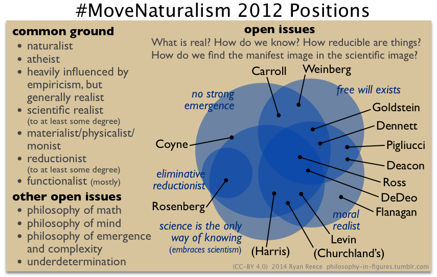

**"Moving Naturalism Forward" workshop, October 25-29, 2012**

Description of the workshop from [Sean Carroll's event page](http://preposterousuniverse.com/naturalism2012/):

>   Over four centuries of scientific progress have convinced most professional philosophers and scientists of the validity of naturalism: the view that there is only one realm of existence, the natural world, whose behavior can be studied through reason and empirical investigation. The basic operating principles of the natural world appear to be impersonal and inviolable; microscopic constituents of inanimate matter obeying the laws of physics fit together in complex structures to form intelligent, emotive, conscious human beings.
>    
>   In the public sphere, debates continue between naturalism and spiritual or religious or dualistic worldviews, and those debates are worth having. But it is also important for those committed to naturalism to address the very difficult questions raised by replacing folk psychology and morality by a scientifically-grounded understanding of reality. We would like to understand how to construct meaningful human lives in a world governed by the laws of nature. Some specific questions include:
>   
>   -   **Free will.** If people are collections of atoms obeying the laws of physics, is it sensible to say that they make choices?
>   -   **Morality.** What is the origin of right and wrong? Are there objective standards?
>   -   **Meaning.** Why live? Is there a rational justification for finding meaning in human existence?
>   -   **Purpose.** Do teleological concepts play a useful role in our description of natural phenomena?
>   -   **Epistemology.** Is science unique as a method for discovering true knowledge?
>   -   **Emergence.** Does reductionism provide the best path to understanding complex systems, or do different levels of description have autonomous existence?
>   -   **Consciousness.** How do the phenomena of consciousness arise from the collective behavior of inanimate matter?
>   -   **Evolution.** Can the ideas of natural selection be usefully extended to areas outside of biology, or can evolution be subsumed within a more general theory of complex systems?
>   -   **Determinism.** To what extent is the future determined given quantum uncertainty and chaos theory, and does it matter?
>   
>   This workshop brought together a small number of researchers and writers to tackle the project of moving naturalism forward by making progress on these issues.

You can view the video recordings of the workshop in [Sean's youtube playlist](https://www.youtube.com/watch?v=Ju4C_ITlBsU&list=PLrxfgDEc2NxYQuZ5T6CSdS8uafdh0kmDL).

In these webpages, I have recorded my notes taken from watching this workshop.
Rather than make a transcript, I have tried to take "minutes"---I have generally
summarized what people said in my own words, but still writing in blocks with a speaker,
like a transcript or screenplay, but only verbatim in parts.
I have interrupted the discussion occasionally with my own opinions, denoted **(Ryan)**.

Please let me know what you think in the comments.
Please do not hold the speakers at this workshop responsible for
my poor precises of their positions.
Please help me correct errors (my email is at the bottom of each page).

Contents
--------------------------------------------------------------------------------

1.  [Day 1: *introductions, what is real?, emergence and reduction*](day1.html)  -- (in progress)
1.  [Day 2: *morality, meaning, free will and consciousness*](day2.html)  -- (TODO)
1.  [Day 3: *philosophy and science, final thoughts*](day3.html)  -- (TODO)
1.  Ryan's summary  -- (TODO)

Philosophy in figures draft image
--------------------------------------------------------------------------------

I have a blog of images called [philosophy-in-figures.tumblr.com](http://philosophy-in-figures.tumblr.com/).
I made a draft figure to note my views of the differences of interesting positions among the speakers at this workshop.

Draft figure (2014-12-04) to be eventually posted on [philosophy-in-figures.tumblr.com](http://philosophy-in-figures.tumblr.com/)

Links to other information about naturalism
--------------------------------------------------------------------------------

-   [Naturalism](http://plato.stanford.edu/entries/naturalism/) - SEP
-   [Naturalism](http://www.iep.utm.edu/naturali/) - IEP
-   [Naturalism](http://en.wikipedia.org/wiki/Naturalism_(philosophy)) - Wikipedia
-   [Naturalism.org](http://www.naturalism.org/) 
    -   ["Ionian Enchantment: A Brief History of Scientific Naturalism"](http://www.naturalism.org/worldview-naturalism/history-of-naturalism)

