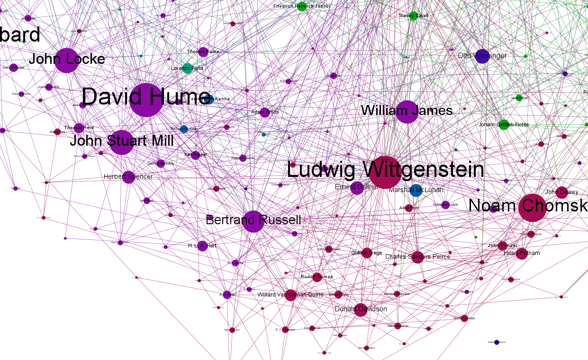

Contents
================================================================================

1.  [Invitation to scientific philosophy](invitation.html) -- a place to start in the discussion of philosophy of science and naturalism.   **(in progress)**
1.  [The scientific method](scientific-method.html) -- the key to epistemology.   **(in progress)**
1.  [Philosophy of statistics](statistics.html)  (TODO)
1.  [Scientific realism](scientific-realism.html) -- the key to metaphysics.   **(in progress)**
1.  [Naturalism](naturalism.html) -- a metaphilosophy that says science should bootstrap philosophy.  (TODO)
1.  [Philosophy of mathematics](math.html)   (TODO)
1.  [Philosophy of physics](physics.html)   (TODO)
1.  [Philosophy of mind](mind.html)   (TODO)
1.  [Ethics](ethics.html)   (TODO)
1.  [Philosophy of the future](future.html)   (TODO)

### Note this is under construction

This site is my working draft of notes from philosophy papers I read.
I share it here for collaborators and perhaps general interest (when I get it better organized).
If you find any of it useful, please let me know, but please don't distribute widely yet.
I hope to pubish these outlines or some version of them on my blog:
[statisticalsignificance.net](http://statisticalsignificance.net/).

Also developing here
--------------------------------------------------------------------------------

-   [Ryan's philosophy reading list](http://rreece.github.io/philosophy-reading-list/)

<!---

-   [A short glossary of philosophy for scientists and engineers](glossary-of-philosophy-for-scientists.html)  (TODO)
-   [A hypothetical dialog between Plato and Carnap](reality-dialog.html)  (TODO)

-->

