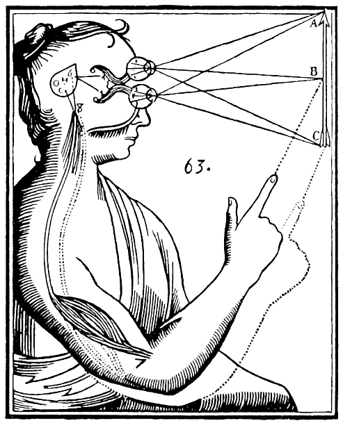

Philosophy of mind
================================================================================

What is consciousness?

Lorem ipsum dolor sit amet, consectetur adipisicing elit, sed do eiusmod tempor
incididunt ut labore et dolore magna aliqua. Ut enim ad minim veniam, quis
nostrud exercitation ullamco laboris nisi ut aliquip ex ea commodo consequat.
Duis aute irure dolor in reprehenderit in voluptate velit esse cillum dolore
eu fugiat nulla pariatur. Excepteur sint occaecat cupidatat non proident,
sunt in culpa qui officia deserunt mollit anim id est laborum.

<!-- PAGETOC -->

Consciousness
--------------------------------------------------------------------------------

-   sentience
-   phenomenal vs access consciousness
-   embodiment
-   subconscious
-   Freud
-   Jung
-   Mach [^Mach1914]
-   Putnam
-   Nagel [^Nagel1974]
-   Churchland's
-   Dennett [^Dennett1991]
-   Chalmers [^Chalmers1996]

[^Chalmers1996]: @Chalmers_1996_The_Conscious_Mind_In_Search_of_a_Fundamental\.
[^Dennett1991]: @Dennett_1991_Consciousness_Explained\.
[^Mach1914]: @Mach_1914_The_Analysis_of_Sensations_and_the_Relation\.
[^Nagel1974]: @Nagel_1974_What_is_it_like_to_be_a_bat\.

Dualism
--------------------------------------------------------------------------------

-   mind-body problem
-   Plato
-   Descartes 
-   G&ouml;del
-   Kripke

{#fig:Descartes-mind-body}

Physicalism
--------------------------------------------------------------------------------

-   Materialism
-   See the outline on [Naturalism](naturalism.html).
-   Descartes and Elisabeth, Princess of Bohemia
-   Marx
-   Churchland's [^MacFarquhar2014]
-   Montero [^Montero1999]
-   Nail
-   Ney
-   Sean Carroll on QFT and experimental high energy physics ruling out
    the role of any newphysics in the functioning of the brain.
    -   <https://twitter.com/RyanDavidReece/status/1285682311112122370>
    -   [YouTube: Is there free will? | David Eagleman and Lex Fridman](https://www.youtube.com/watch?v=8f92iPYmiGY&t=298)
    -   See also: [Bracketing human experience](physics.html#bracketing-human-experience)

[^MacFarquhar2014]: @MacFarquhar_2014_Two_Heads_A_marriage_devoted_to_the_mind_body\.
[^Montero1999]: @Montero_1999_The_Body_Problem\.

Panpsychism
--------------------------------------------------------------------------------

-   Chalmers
-   rejection of dualism vs physicalism dichotomy
-   Conway's "freewill theorem"

Neuroscience
--------------------------------------------------------------------------------

-   Experimental neuroscience
    -   Libet experiments
-   Computational neuroscience
    -   Blue Brain Project

Free will
--------------------------------------------------------------------------------

-   [Reflections on Free Will](https://www.samharris.org/blog/item/reflections-on-free-will) - Daniel Dennett
-   [The Marionette's Lament](https://www.samharris.org/blog/item/the-marionettes-lament) - Sam Harris
-   [Caricaturing free will](http://www.pawelpachniewski.com/mental-contractions/2014/08/caricaturing-free-will/) - Pawel Pachniewski
-   [Dennett and Harris try to bridge the gap](https://www.youtube.com/watch?v=vFa7vFkVy4g) - Waking Up podcast
-   [Free will is dead, let's bury it.](http://backreaction.blogspot.ch/2016/01/free-will-is-dead-lets-bury-it.html) - Sabine Hossenfelder

My thoughts
--------------------------------------------------------------------------------

Lorem ipsum dolor sit amet, consectetur adipisicing elit, sed do eiusmod tempor
incididunt ut labore et dolore magna aliqua. Ut enim ad minim veniam, quis
nostrud exercitation ullamco laboris nisi ut aliquip ex ea commodo consequat.
Duis aute irure dolor in reprehenderit in voluptate velit esse cillum dolore
eu fugiat nulla pariatur. Excepteur sint occaecat cupidatat non proident,
sunt in culpa qui officia deserunt mollit anim id est laborum.

Annotated bibliography
--------------------------------------------------------------------------------

### Nagel, T. (1974). What is it like to be a bat?

-   @Nagel_1974_What_is_it_like_to_be_a_bat

#### My thoughts

-   TODO

--------------------------------------------------------------------------------

### Dennett, D. (1991). *Consciousness Explained*.

-   @Dennett_1991_Consciousness_Explained

#### My thoughts

-   TODO

--------------------------------------------------------------------------------

### Chalmers, D. (1996). *The Conscious Mind: In Search of a Fundamental Theory*.

-   @Chalmers_1996_The_Conscious_Mind_In_Search_of_a_Fundamental

#### My thoughts

-   TODO

--------------------------------------------------------------------------------

### Kurzweil, R. (2012). *How to Create a Mind*.

-   @Kurzweil_2012_How_to_Create_a_Mind

#### My thoughts

-   TODO

--------------------------------------------------------------------------------

### More articles to do

-   TODO

Links and encyclopedia articles
--------------------------------------------------------------------------------

<a id="link:encyclopedia_articles" class="closed" onclick="toggle_more('encyclopedia_articles')">
Click to show links
</a>

### SEP

-   [Agency](http://plato.stanford.edu/entries/agency/)
-   [Behaviorism](http://plato.stanford.edu/entries/behaviorism/)
-   [Computational Theory of Mind](http://plato.stanford.edu/entries/computational-mind/)
-   [Consciousness and Intentionality](https://plato.stanford.edu/entries/consciousness-intentionality/)
-   [Dualism](http://plato.stanford.edu/entries/dualism/)
-   [Eliminative Materialism](http://plato.stanford.edu/entries/materialism-eliminative/)
-   [Elisabeth, Princess of Bohemia (1618-1680)](http://plato.stanford.edu/entries/elisabeth-bohemia/)
-   [Externalism About Mental Content](http://plato.stanford.edu/entries/content-externalism/)
-   [Fichte, Johann Gottlieb (1762-1814)](https://plato.stanford.edu/entries/johann-fichte/)
-   [Frame Problem](http://plato.stanford.edu/entries/frame-problem/)
-   [Functionalism](http://plato.stanford.edu/entries/functionalism/)
-   [Mental Causation](http://plato.stanford.edu/entries/mental-causation/)
-   [Mental Representation](http://plato.stanford.edu/entries/mental-representation/)
-   [Mind in Indian Buddhist Philosophy](http://plato.stanford.edu/entries/mind-indian-buddhism/)
-   [Multiple Realizability](http://plato.stanford.edu/entries/multiple-realizability/)
-   [Physicalism](http://plato.stanford.edu/entries/physicalism/)
-   [Qualia: The Knowledge Argument](http://plato.stanford.edu/entries/qualia-knowledge/)
-   [Quantum Approaches to Consciousness](http://plato.stanford.edu/entries/qt-consciousness/)
-   [Representational Theories of Consciousness](http://plato.stanford.edu/entries/consciousness-representational/)
-   [Self-consciousness](https://plato.stanford.edu/entries/self-consciousness/)

### IEP

-   [Animal Minds](http://www.iep.utm.edu/ani-mind/)
-   [Behaviorism](http://www.iep.utm.edu/behavior/)
-   [Consciousness](http://www.iep.utm.edu/consciou/)
-   [Dualism](http://www.iep.utm.edu/dualism/)
-   [Epiphenomenalism](http://www.iep.utm.edu/epipheno/)
-   [Functionalism](http://www.iep.utm.edu/functism/)
-   [Lucas-Penrose Argument about G&ouml;del's Theorem, The](http://www.iep.utm.edu/lp-argue/)
-   [Identity Theory](http://www.iep.utm.edu/identity/)
-   [Immortality](http://www.iep.utm.edu/immortal/)
-   [Intentionality](http://www.iep.utm.edu/intentio/)
-   [Internalism and Externalism in the Philosophy of Mind and Language](http://www.iep.utm.edu/int-ex-ml/)
-   [Knowledge Argument Against Physicalism](http://www.iep.utm.edu/know-arg/)
-   [Objects of Perception](http://www.iep.utm.edu/perc-obj/)
-   [Qualia](http://www.iep.utm.edu/qualia/)
-   [Relational Models Theory](http://www.iep.utm.edu/r-models/)
-   [Sellars: Philosophy of Mind](http://www.iep.utm.edu/sellars/)
-   [Solipsism and the Problem of Other Minds](http://www.iep.utm.edu/solipsis/)
-   [Stoic philosophy of mind](http://www.iep.utm.edu/stoicmind/)
-   [Supervenience and Determination](http://www.iep.utm.edu/superven/)
-   [Supervenience and Mind](http://www.iep.utm.edu/supermin/)
-   [Theory of Mind](http://www.iep.utm.edu/theomind/)

### Wikipedia

-   [AI-complete](http://en.wikipedia.org/wiki/AI-complete)
-   [Artificial Intelligence](http://en.wikipedia.org/wiki/Artificial_intelligence)
-   [Behaviorism](http://en.wikipedia.org/wiki/Behaviorism)
-   [Cartesian theater](http://en.wikipedia.org/wiki/Cartesian_theater)
-   [Charles Whitman](https://en.wikipedia.org/wiki/Charles_Whitman)
-   [Checker shadow illusion](https://en.wikipedia.org/wiki/Checker_shadow_illusion)
-   [Consciousness](http://en.wikipedia.org/wiki/Consciousness)
-   [Eliminative materialism](https://en.wikipedia.org/wiki/Eliminative_materialism)
-   [Extended Mind](http://en.wikipedia.org/wiki/The_Extended_Mind)
-   [Free will](http://en.wikipedia.org/wiki/Free_will)
-   [Free will theorem](http://en.wikipedia.org/wiki/Free_will_theorem)
-   [Fichte, Johann Gottlieb (1762-1814)](https://en.wikipedia.org/wiki/Johann_Gottlieb_Fichte)
-   [Functionalism](https://en.wikipedia.org/wiki/Functionalism_(philosophy_of_mind))
-   [Integrated information theory](http://en.wikipedia.org/wiki/Integrated_information_theory)
-   [Internalism and externalism](https://en.wikipedia.org/wiki/Internalism_and_externalism)
-   [Knowledge argument](http://en.wikipedia.org/wiki/Knowledge_argument)
-   [Materialism](https://en.wikipedia.org/wiki/Materialism)
-   [Moravec's paradox](https://en.wikipedia.org/wiki/Moravec%27s_paradox)
-   [Multiple realizability](https://en.wikipedia.org/wiki/Multiple_realizability)
-   [Philosophy of mind](http://en.wikipedia.org/wiki/Philosophy_of_mind)
-   [Physicalism](https://en.wikipedia.org/wiki/Physicalism)
-   [Reductionism](https://en.wikipedia.org/wiki/Reductionism)
-   [Unsolved problems in neuroscience, List of](http://en.wikipedia.org/wiki/List_of_unsolved_problems_in_neuroscience)
-   [Vertiginous question](https://en.wikipedia.org/wiki/Vertiginous_question)
-   [Zombie, Philosophical](https://en.wikipedia.org/wiki/Philosophical_zombie)

### Others

-   [Chalmers' Guide to the Philosophy of Mind](http://consc.net/guide.html)
-   [The empty brain: Your brain does not process information, retrieve knowledge or store memories](https://aeon.co/essays/your-brain-does-not-process-information-and-it-is-not-a-computer) - Robert Epstein
-   [Symbol grounding problem](http://www.scholarpedia.org/article/Symbol_grounding_problem) - scholarpedia

### Videos

-   [Dennett, Daniel. (2019). Consciousness, Qualia and the "Hard Problem".](https://www.youtube.com/watch?v=LdhHyvOhkCs)
-   [Dennett, Daniel. (2017). From Bacteria to Bach and Back: The Evolution of Minds.](https://www.youtube.com/watch?v=IZefk4gzQt4)
-   [Seth, Anil. (2017). The Neuroscience of Consciousness.](https://www.youtube.com/watch?v=xRel1JKOEbI)

<!-- REFERENCES -->
