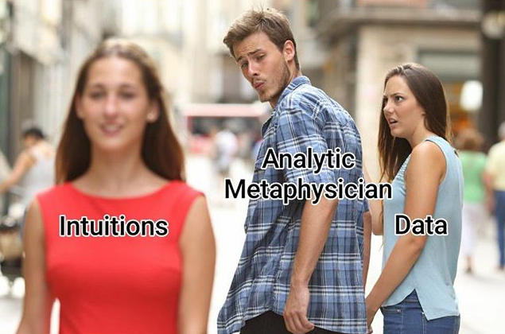

Naturalism
================================================================================

Naturalism is a unifying view of philosophy and science.
It is an attitude about how philosophy should be done (a meta-philosophy)
and about how philosophy relates to science.
Regardless of how one views the realism debate
(discussed in the [previous outline](scientific-realism.html)),
naturalism shows a provocative, unifying way of viewing the projects of
philosophy and science.

Here we also discuss additional _**meta-philosophical**_ issues
and other worldviews in constrast to naturalism.

<!-- PAGETOC -->

What is naturalism?
--------------------------------------------------------------------------------

### First pass

-   Natural philosophy

Sellars:

>   The aim of philosophy, abstractly formulated, is to understand how
>   things in the broadest possible sense of the term hang together in the
>   broadest possible sense of the term. Under 'things in the broadest
>   possible sense' I include such radically different items as not only
>   'cabbages and kings', but numbers and duties, possibilities and finger
>   snaps, aesthetic experience and death. To achieve success in philosophy
>   would be, to use a contemporary turn of phrase, to 'know one's way
>   around' with respect to all these things... [^Sellars1963p1]

TODO: Manifest image and scientific image - Sellars

-   Sellars, W. (1963). "Philosophy and the scientific image of man" in @Sellars_1963_Science_Perception_and_Reality

.](img/all_i_see_are_equations.png){#fig:all-i-see-are-equations .tallimg}

Maddy defines naturalism:

>   These days, as more and more philosophers count themselves as naturalists,
>   the term has come to mark little more than a vague science-friendliness.
>   To qualify as unnaturalistic, a contemporary thinker has to insist,
>   for example, that epistemology is an a priori discipline with nothing to
>   learn from empirical psychology or that metaphysical intuitions show
>   quantum mechanics to be false.  [^Maddy2007p1]

>   So our inquirer will continue her investigation of the world in her familiar
>   ways, despite her encounter with Descartes and his meditator. She will ask
>   traditionally philosophical questions about what there is and how we know it,
>   just as they do, but she will take perception as a mostly reliable guide to
>   the existence of medium-sized physical objects, she will consult her
>   astronomical observations and theories to weigh the existence of black holes,
>   and she will treat questions of knowledge as involving the relations between
>   the world---as she understands it in her physics, chemistry, optics, geology,
>   and so on---and human beings---as she understands them in her physiology,
>   cognitive science, neuroscience, linguistics, and so on.
>   While Descartes's meditator begins by rejecting science and common sense in
>   the hope of founding them more firmly by philosophical means, our inquirer
>   proceeds scientifically and attempts to answer even philosophical questions
>   by appeal to its resources. For Descartes's meditator, philosophy comes
>   first; for our inquirer, it comes second---hence 'Second Philosophy'
>   as opposed to 'First'. Our Character now has a name: she is the
>   Second Philosopher.  [^Maddy2007p18]

Jacobs:

>   Naturalism is an approach to philosophical problems that interprets them as
>   tractable through the methods of the empirical sciences or at least, without
>   a distinctively a priori project of theorizing.  [^Jacobs2002]

Naturalism could be defined as a support for philosophy that is filtered for
plausibility given the information from science[^Ladyman2007pX].
See the [Outline on the science method](scientific-method.html#is-there-a-universal-scientific-method).

Maudlin gives clear naturalist attitude at the start of *The Metaphysics within Physics*:

>   [M]etaphysics, insofar as it is concerned with the natural world,
>   can do no better than to reflect on physics.
>   Physical theories provide us with the best handle we have on what there is,
>   and the philosopher's proper task is the interpretation and elucidation
>   of those theories. In particular, when choosing the fundamental posits
>   of one's ontology, one must look to scientific practice rather than to
>   philosophical prejudice. [^Maudlin2007p1]

Papineau:

>   The term "naturalism" has no very precise meaning in contemporary philosophy.
>   Its current usage derives from debates in America in the first half of the last century.
>   The self-proclaimed "naturalists" from that period included John Dewey, Ernest Nagel,
>   Sidney Hook and Roy Wood Sellars. These philosophers aimed to ally philosophy
>   more closely with science. They urged that reality is exhausted by nature,
>   containing nothing "supernatural", and that the scientific method should
>   be used to investigate all areas of reality, including the "human spirit"
>   (Krikorian 1944, Kim 2003). 
>
>   So understood, "naturalism" is not a particularly informative term as
>   applied to contemporary philosophers. The great majority of contemporary
>   philosophers would happily accept naturalism as just characterized---that is,
>   they would both reject "supernatural" entities, and allow that science is
>   a possible route (if not necessarily the only one) to important truths about
>   the "human spirit". [^Papineau2007]

[^Jacobs2002]: @Jacobs_2002_Naturalism\. 
[^Ladyman2007pX]: @Ladyman_2007_Every_Thing_Must_Go_Metaphysics_Naturalised\, p. TODO (find error correcting filters).
[^Maddy2007p1]: @Maddy_2007_Second_Philosophy, p. 1.
[^Maddy2007p18]: @Maddy_2007_Second_Philosophy, p. 18--19.
[^Maudlin2007p1]: @Maudlin_2007_The_Metaphysics_Within_Physics\, p. 1.
[^Papineau2007]: @Papineau_2007_Naturalism\.
[^Sellars1963p1]: @Sellars_1963_Science_Perception_and_Reality\, p. 1.

### Second pass

A very diverse set of thinkers are often characterized as naturalists or aligned
with naturalism, at the expense of much clarity in the term, but naturalism
generally consists of varying degrees of either or both:

1.  ***epistemological/methodological naturalism*** - an epistemic respect for
    science and empiricism;
    a methodological commitment to the
    [scientific method](http://rreece.github.io/outline-of-philosophy/scientific-method.html)
    of justifying empirical claims as a route to knowledge,
    if not the chief or perhaps (with a sufficiently broad definition)
    the only route to knowledge.
    *Science should be guiding in what we claim to know*.
2.  ***metaphysical/ontological naturalism*** - has a variety of claims and interpretations,
    but they center on the premise that if we have any claim to what there is,
    it better be informed by and consistent with science.
    It often involves a skepticism of *a priori* metaphysics
    (statements about what there is that come prior to empirical information),
    and sometimes has further qualified ontological commitments to the products of science,
    which concerns the debate of [scientific realism](http://rreece.github.io/outline-of-philosophy/scientific-realism.html).
    Another claim associated with ontological naturalism and closely
    related to epistemological naturalism is a rejection of ontologies to which we
    do not have demonstrable, access *i.e.* supernatural entities,
    which can be seen as a claim to a type of monism as opposed to dualism about ontology.
    There is *one* (natural) world.
    At the least, it is a claim that
    *science should be guiding in what we claim there is*.

Also:

-   Methodological vs ontological naturalism
-   Jenkins [^Jenkins2016]
-   Sean Carroll: "There is *one* (natural) world."
-   Prasetya, Y. (2021). Methodological naturalism and scientific success. [^Prasetya2021]

[^Jenkins2016]: @Jenkins_2016_Epistemological_naturalisms\.
[^Prasetya2021]: @Prasetya_2021_Methodological_naturalism_and_scientific_success\.

### History

-   Discussion by McEvilley [^McEvilley2002p325]
-   Archilochus
-   Thales
-   Anaximander
-   Xenophanes

Riepe on the characteristics of naturalism in Indian thought:

>   1.  The naturalist accepts sense experience as the most important avenue of knowledge.
>   2.  The naturalist believes that knowledge is not esoteric, innate, or intuitive (mystical).
>   3.  The naturalist believes that the external world, of which man is an integral part, is objective
>       and hence not "his idea" but an existent apart from his, your, or anyone's consciousness.
>   4.  The naturalist believes that the world minifests order and regularity and that,
>       contrary to some opinion, this does not exclude human responsibility.
>       This order cannot be changed merely by thought, magic, sacrifice, or prayer,
>       but requires an actual manipulation of the external world in some physical way.
>   5.  The naturalist rejects supernatural teleology. The direction of the world is
>       caused by the world itself.
>   6.  The naturalist is humanistic. Man is not simply a mirror of deity or the absolute
>       but a biological existent whose goal it is to do what is proper to man.
>       What is proper to man is discovered in a naturalistic context by the
>       moral philosopher. [^Riepe1961pX]

-   See also: [Indian empiricism](human-condition.html#indian-empiricism)

[^McEvilley2002p325]: @McEvilley_2002_The_Shape_of_Ancient_Thought_Comparative_studies\, p. 325--333.
[^Riepe1961pX]: @Riepe_1961_The_Naturalistic_Traddition_in_Indian_Thought\, p. TODO.

Unity of philosophy and science
--------------------------------------------------------------------------------

### Continuity

-   Philosophy and science are continuous in concerns.
-   Philosophy is the nursury of budding programs that become specialized sciences.
-   TODO: find more refs.

Descartes (often seen as anti-naturalist, explain, but he) wrote in 1644,

>   Philosophy as a whole is like a tree; of which the roots are Metaphysics,
>   the trunk is Physics, and the branches emerging from this trunk are all
>   the other branches of knowledge. These branches can be reduced to three
>   principal ones, namely, Medicine, Mechanics, and Ethics. [^Descartes1644pxxiv]

Russell:

>   In the welter of conflicting fanaticisms, one of the few unifying forces is
>   scientific truthfulness, by which I mean the habit of basing our beliefs
>   upon observations and inferences as impersonal, and as much divested of
>   local and temperamental bias, as is possible for human beings. To have
>   insisted upon the introduction of this virtue into philosophy, and to have
>   invented a powerful method by which it can be rendered fruitful, are the
>   chief merits of the philosophical school of which I am a member. The habit
>   of careful veracity acquired in the practice of this philosophical method
>   can be extended to the whole sphere of human activity, producing, wherever
>   it exists, a lessening of fanaticism with an increasing capacity of
>   sympathy and mutual understanding. In abandoning a part of its dogmatic
>   pretensions, philosophy does not cease to suggest and inspire a way of
>   life. [^Russell1945pX]

-   Lugg, A. (2006). Russell as a precursor of Quine. [^Lugg2006]
-   In the boat with Neurath.
-   *International Encyclopedia of Unified Science*

Sellars:

>   Philosophy in an important sense has no special subject-matter which
>   stands to it as other subject-matters stand to other special disciplines.
>   If philosophers did have such a special subject-matter, they could turn it
>   over to a new group of specialists as they have turned other special
>   subject-matters to non-philosophers over the past 2500 years, first with
>   mathematics, more recently psychology and sociology, and, currently,
>   certain aspects of theoretical linguistics. What is characteristic of
>   philosophy is not a special subject-matter, but the aim of knowing one's
>   way around with respect to the subject-matters of all the special
>   disciplines. [^SellarsTODO]

[^Descartes1644pxxiv]: @Descartes_1982_Principles_of_Philosophy\, p. xxiv.
[^Russell1945pX]: @Russell_2003_History_of_Western_Philosophy, p. TODO.
[^Lugg2006]: @Lugg_2006_Russell_as_a_precursor_of_Quine\.
[^SellarsTODO]: TODO.

### Consilience

-   William Whewell (1794-1866)
    -   *Philosophy of the Inductive Sciences* (1840)
-   Wilson, E.O. (1998). *Consilience*. [^Wilson1998]
-   Convergence of evidence
-   Unity of knowledge
-   The Canberra Plan
    -   See SEP: [Naturalism](https://plato.stanford.edu/entries/naturalism/)

>   The scientific world conception is characterised not so much by theses of its own, but
>   rather by its basic attitude, its points of view and direction of research. The goal ahead
>   is *unified science*. The endeavour is to link and harmonise the achievements of individual
>   investigators in their various fields of science. From this aim follows the emphasis
>   on *collective efforts*, and also the emphasis on what can be grasped intersubjectively;
>   from this springs the search for a neutral system of formulae, for a symbolism freed
>   from the slag of historical languages; and also the search for a total system of
>   concepts. [^VCManifesto1929s2]

[^VCManifesto1929s2]: @Hahn_1973_The_scientific_conception_of_the_world_The_Vienna\, &sect; 2.
[^Wilson1998]: @Wilson_1998_Consilience\.

### Progress

-   Does philosophy make any progress?
-   Does science make any progress?
-   Philosophy as a nursury for budding sciences.
-   Callard, A. (2018). [How philosophy makes progress](https://dailynous.com/2018/05/27/how-philosophy-makes-progress-agnes-callard/).
-   Priest, G. (2020). Philosophy and its history: An essay in the philosophy of philosophy. [^Priest2020]

See also:

-   [Scientific progress](scientific-realism.html#scientific-progress)

[^Priest2020]: @Priest_2020_Philosophy_and_its_history_An_essay\.

Rejection of *a priori* metaphysics
--------------------------------------------------------------------------------

### Early modern

-   Descartes' non-natural method
-   Locke on the rejection of innate ideas
-   Hume's fork, again. See: [Analytic/synthetic distinction](scientific-method.html#analyticsynthetic-distinction).

Kant in his *Prolegomena to Any Future Metaphysics*:

>   My object is to persuade all those who think Metaphysics worth studying, 
>   that it is absolutely necessary to pause a moment, 
>   and, neglecting all that has been done, 
>   to propose first the preliminary question, 
>   'Whether such a thing as metaphysics be at all possible?'
>   
>   If it be a science, how comes it that it cannot, like other sciences, 
>   obtain universal and permanent recognition? If not, how can it maintain
>   its pretensions, and keep the human mind in suspense with hopes, never ceasing, 
>   yet never fulfilled? Whether then we demonstrate our knowledge or our ignorance 
>   in this field, we must come once for all to a definite conclusion respecting 
>   the nature of this so-called science, which cannot possibly remain on its present footing. 
>   It seems almost ridiculous, while every other science is continually advancing, 
>   that in this, which pretends to be Wisdom incarnate, for whose oracle every 
>   one inquires, we should constantly move round the same spot, without gaining 
>   a single step. And so its followers having melted away, we do not find men 
>   confident of their ability to shine in other sciences venturing their 
>   reputation here, where everybody, however ignorant in other matters, 
>   may deliver a final verdict, as in this domain there is as yet no standard 
>   weight and measure to distinguish sound knowledge from shallow talk. [^Kant1783]

### Analytic/continental divide

-   [Counter-Enlightenment](https://en.wikipedia.org/wiki/Counter-Enlightenment)
    -   G.W.F. Hegel (1770-1831)
    -   Martin Heidegger (1889-1976)
    -   Criticism of Kant
    -   Berlin, I. (1973). "The Counter-Enlightenment".
-   Cassirer-Heidegger debate
    -   Heidegger, M. (1929). What is metaphysics? [^Heidegger1929]
    -   Carnap, R. (1932). The elimination of metaphysics through logical analysis of language. [^Carnap1932]
    -   Friedman, M. (2000). *A Parting of the Ways: Carnap, Cassirer, and Heidegger*. [^Friedman2000]
    -   Friedman, M. (2002). Carnap, Cassirer, and Heidegger: The Davos disputation and twentieth century philosophy. [^Friedman2002]
    -   Gabriel, G. (2003). Carnap's "Elimination of metaphysics through logical analysis of language". [^Gabriel2003]
    -   Luchte, J. (2007). [Martin Heidegger and Rudolf Carnap: Radical Phenomenology, Logical Positivism and the Roots of the Continental/Analytic Divide](https://luchte.wordpress.com/martin-heidegger-and-rudolf-carnap-radical-phenomenology-logical-positivism-and-the-roots-of-the-continentalanalytic-divide/).
    -   Dresser, S. (2020). [Does philosophy reside in the unsayable or should it care only for precision? Carnap, Heidegger and the great divergence](https://aeon.co/essays/heidegger-v-carnap-how-logic-took-issue-with-metaphysics).

[^Carnap1932]: @Carnap_1932_The_elimination_of_metaphysics_through_logical\.
[^Friedman2000]: @Friedman_2000_A_Parting_of_the_Ways_Carnap_Cassirer\.
[^Friedman2002]: @Friedman_2002_Carnap_Cassirer_and_Heidegger_The_Davos\.
[^Gabriel2003]: @Gabriel_2003_Carnaps_Elimination_of_metaphysics_through\.
[^Heidegger1929]: @Heidegger_1929_What_is_metaphysics\.

### Metaphysical naturalism

TODO: While promoting the careful gathering of empirical information,
naturalism is not against (largely non-empirical) rational pursuits like mathematics.
Indeed some naturalist may even see logic and mathematics as scientific pursuits
of *a priori* truths.

TODO: Naturalism shares much in common with schools of thought surrounding positivism,
through its respect for science and skepticism of *a priori* metaphysics,
but naturalism is a more general distinction,
being a more much longer thread throughout the history of philosophy and science.

{#fig:distracted-boyfriend-meme-intuitions-data}

Quine in "Natural kinds":

>   At this point let me say that I shall not be impressed by protests that I am
>   using inductive generalizations, Darwin's and others, to justify induction,
>   and thus reasoning in a circle. The reason I shall not be impressed by this
>   is that my position is a naturalistic one;
>   I see philosophy not as an *a priori* propaedeutic or groundwork for science,
>   but as continuous with science. I see philosophy and science as in the same
>   boat---a boat which, to revert to Neurath's figure as I so often do,
>   we can rebuild only at sea while staying afloat in it. There is no external
>   vantage point, no first philosophy. All scientific findings, all scientific
>   conjectures that are at present plausible, are therefore in my view as welcome
>   for use in philosophy as elsewhere. [^Quine1969pX]

More Quine:

>   I also expressed, at the beginning, my unswerving belief in external
>   things---people, nerve endings, sticks, stones. This I reaffirm. I
>   believe also, if less affirmly, in atoms and electrons, and in
>   classes. Now how is all this robust realism to be reconciled with the
>   barren scene that I have just been depicting? *The answer is
>   naturalism: the recognition that it is within science itself, and not
>   some prior philosophy, that reality is properly to be identified
>   and described.* [^Quine1981p21]

Opening lines to *ETMG*:

>   This is a polemical book. One of its main contentions is that contemporary analytic 
>   metaphysics, a professional activity engaged in by some extremely intelligent and 
>   morally serious people, fails to qualify as part of the enlightened pursuit of 
>   objective truth, and should be discontinued. [^Ladyman2007pi]

-   TODO: Maddy

See also:

-   [Natural kinds](#natural-kinds)

[^Kant1783]: @Kant_1912_Prolegomena_to_Any_Future_Metaphysics\, p. 2--3.
[^Ladyman2007pi]: @Ladyman_2007_Every_Thing_Must_Go_Metaphysics_Naturalised\, p. i.
[^Quine1969pX]: @Quine_1969_Ontological_Relativity_and_Other_Essays\, p. TODO.
[^Quine1981p21]: @Quine_1981_Theories_and_Things\, p. 21 (emphasis added).
    A similar quote can be found in @Quine_1981_Reply_to_Stroud, p. 474.

Physicalism
--------------------------------------------------------------------------------

### Introduction

-   Physicalism and monism
-   Parmenides
-   Materialism, physicalism, functionalism
-   Alyssa Ney on dualism, physicalism, neutral monism

See also:

-   [Physicalism](mind.html#physicalism) in the [Outline on Philosophy of Mind](mind.html)

### Uniformity of nature

-   Part of methodological naturalism, but also a result of empirical confirmation.
-   TODO: find ref for Cox's art, that stars have standard spectra.
-   Limits on deviations in $\alpha_\mathrm{EM}$

See also:

-   [Bracketing human experience](physics.html#bracketing-human-experience)
    in the [Outline on Philosophy of Physics](physics.html)

 (2011)](img/Geraldine-Cox-All-matter-is-the-same.jpg){#fig:Geraldine-Cox-All-matter-is-the-same}

See also:

-   [Uniformity of nature](scientific-method.html#uniformity-of-nature) in the [Outline on the scientific method](scientific-method.html)

### Criticism

-   TODO

Reductionism
--------------------------------------------------------------------------------

### Introduction

Leibniz:

>   If controversies were to arise, there would be no more need of disputation
>   between two philosophers than between two accountants. For it would suffice
>   to take their pencils in their hands, and say to each other:
>   *Calculemus*---Let us calculate.[^Leibniz-De-Arte-Combinatoria]

, 2013).](img/the-scientific-universe.png){#fig:the-scientific-universe}

-   Compare with the model of levels in @Oppenheim_1958_Unity_of_science_as_a_working_hypothesis.
-   [The Metaphysical Unity of Science Project](https://metascience.xyz/the-project) at U. of Bristol

Wittgenstein:

>   Every statement about complexes can be analysed into a statement about their
>   constituent parts, and into those propositions which completely
>   describe the complexes. [^Wittgenstein1922L20201]

Alex Rosenberg is a mad dog against emergence. Video:
[Alex Rosenberg interviewed for *Why Are We Here?*](https://www.whyarewehere.tv/people/alex-rosenberg/)

, 2014).](img/reductionism.png){#fig:reductionism}

-   Reductive and non-reductive physicalism
    -   Morris [^Morris2019]
-   Fundamentality:
    -   Ney [^Ney2018]
-   Why "physics is fundamental"
-   Physicalism
-   Hempel's dilemma
-   [Robert Sapolsky (2010) lecture: Chaos and Reductionism](https://www.youtube.com/watch?v=_njf8jwEGRo)

[^Leibniz-De-Arte-Combinatoria]: Leibniz has similar quotes in several works.
    This quote is taken from a translation of his first book, *Dissertatio de arte combinatoria*,
    written in 1666 [@Leibniz_1989_Dissertatio_de_Arte_Combinatoria, 73].
    TODO: Actually, I haven't found this yet.
    See also @Leibniz_1951_The_Art_of_Discovery, p. 51.
    Supposedly it is also in Russell's *A Critical Exposition of the Philosophy of Leibniz*.
[^Morris2019]: @Morris_2019_Physicalism_Deconstructed_Levels_of_reality\.
[^Ney2018]: @Ney_2018_The_Politics_of_Fundamentality\.
[^Wittgenstein1922L20201]:@Wittgenstein_1961_Tractatus_Logico_Philosophicus\, line 2.0201.

### Criticism

-   Schweber, S.S. (1993). The ebb and flow of reductionism. [^Schweber1993]

Wittgenstein:

>   There are, indeed, things that cannot be put into words.
>   They *make themselves manifest*. They are what is mystical. [^WittgensteinTLP_6_522]

[^Schweber1993]: @Schweber_1993_The_ebb_and_flow_of_of_reductionism\.
[^WittgensteinTLP_6_522]: @Wittgenstein_1961_Tractatus_Logico_Philosophicus\, 6.522.

Natural kinds
--------------------------------------------------------------------------------

### Introduction

Part of metaphysical naturalism.

-   Plato: *Phaedrus* 265e
-   Quine, W.V.O. (1969). Ontological relativity. [^Quine1969p26]
-   Quine, W.V.O. (1969). Natural kinds. [^Quine1969p114]
-   [Introduction: Pursuing a naturalist metaphysics](https://www.academia.edu/6778507/Introduction_Pursuing_a_Naturalist_Metaphysics_1) [^Ross2013]

, 2015).](img/how-naturalists-climb-the-ladder-to-realism.png){#fig:how-naturalists-climb-the-ladder-to-realism}

Ladyman & Ross:

>   According to the account we will give, science tells us many surprising
>   things, but it does not impugn the everyday status of objects like tables
>   and baseballs. These are, we will argue, aspects of the world with sufficient
>   cohesion at our scale that a group of cognitive systems with practically
>   motivated interest in tracking them would sort them into types for book-keeping
>   purposes. [^Ladyman2007p5]

See also:

-   [Outline on scientific realism](scientific-realism.html)
-   [Outline on philosophy of mathematics](math.html#naturalism)

[^Ladyman2007p5]: @Ladyman_2007_Every_Thing_Must_Go_Metaphysics_Naturalised\, p. 5.
[^Quine1969p26]: @Quine_1969_Ontological_Relativity_and_Other_Essays\, pp. 26--68.
[^Quine1969p114]: @Quine_1969_Ontological_Relativity_and_Other_Essays\, pp. 114--138.
[^Ross2013]: @Ross_2013_Scientific_Metaphysics\.

### Criticism

-   Hennig: "What are the true clusters?"

See also:

-   [Clustering](statistics.html#clustering) in the [Outline on statistics](statistics.html)
-   [Constructive empiricism](scientific-realism.html#constructive-empiricism) in the [Outline on scientific realism](scientific-realism.html)
-   [Nominalism](math.html#nominalism) in the [Outline on mathematics](math.html).

Rejection of the supernatural
--------------------------------------------------------------------------------

### Introduction

-   Part of methodological naturalism.
    -   Not an a priori assumption but an empirical conclusion
    -   Dennett: Naturalism is a method of explaining a magic trick without appealing to magic.
-   How to define magic and what it could be.
    -   Aleister Crowley: Magick "is the Science and Art of causing change to occur in conformity with Will."
    -   To the degree you can control the physical world, naturalists would call this "technology".
-   The Lewis-Anscombe debate
    -   [The Lewis-Anscombe debate](http://thecslewis-studygroup.org/the-c-s-lewis-study-group/lewis-genre/theology/miracles-2/the-lewisanscombe-debate/)
    -   The rewrite of chapter 3 in *Miracles* [^Lewis1947]

Jenkins says naturalism is

>   the view that a broadly scientific world-view is correct, and there exists
>   nothing supernatural or otherwise spooky. [^Jenkins2014]

See also:

-   [Atheism](human-condition.html#atheism)

[^Jenkins2014]: @Jenkins_2014_Naturalism_and_norms_of_inference\.
[^Lewis1947]: @Lewis_1947_Miracles_A_Preliminary_Study\.

### Miracles

-   Hume - "Of Miracles"
-   Scott Aaronson. (2001). [Letter to James Randi](https://www.scottaaronson.com/writings/randi.html). [^Randi2001]
    -   *The Low Kolmogorov Complexity (LKC) Principle*: Under any reasonable encoding, the universe has low Kolmogorov complexity.

See also:

-   [Atheism](human-condition.html#atheism).

[^Randi2001]: @Aaronson_2001_Letter_to_James_Randi\.

### Criticism

-   TODO

Scientism
--------------------------------------------------------------------------------

### As a pejorative

Schopenhauer:

>   Mere experience is no more a substitute for thinking than reading is. Pure
>   empiricism is related to thinking as eating is to digestion and assimilation.
>   When empiricism boasts that it alone has, through its discoveries, advanced
>   human knowledge, it is as if the mouth should boast that it alone keeps the
>   body alive. [^SchopenhauerThinking7]

-   Sorell [^Sorell1991]
-   *Science Unlimited? The Challenges of Scientism* [^Boudry2018]
-   TODO: find examples

[^Boudry2018]: @Boudry_2018_Science_Unlimited_The_Challenges_of_Scientism\.
[^SchopenhauerThinking7]: @Schopenhauer_2014_Essays_and_Aphorisms\, On thinking for yourself, section 7.
[^Sorell1991]: @Sorell_1991_Scientism_Philosophy_and_the_Infatuation\.

### Honorific reinterpretation

-   Rosenberg: *The Atheist's Guide to Reality* [^Rosenberg2011AGR]
-   Glymour, C. (2011). [Manifesto on positivism](https://web.archive.org/web/20190430005518/http://choiceandinference.com/2011/12/23/in-light-of-some-recent-discussion-over-at-new-apps-i-bring-you-clark-glymours-manifesto/).
    -   Nelson Goodman: "There are two kinds of people in the world: the logical positivists and the god-damned English professors."
    -   "Carnap was the grandfather of artificial intelligence: his students, Walter Pitts and Herbert Simon, were among the fathers."
-   Lawhead: "My Scientism" [^Lawhead20016]

[^Lawhead20016]: @Lawhead_2016_My_Scientism\.
[^Rosenberg2011AGR]: @Rosenberg_2011_The_Atheists_Guide_to_Reality\.

### Other ways of knowing

-   Methodological naturalism
-   What are the limits of science?
-   Are there other ways of knowing?
-   Is there any unique project left for metaphysics?
    -   "Are the questions of metaphysics more fundamental than those of science?" [^Ney2019]
-   Scruton, R. (2015). Scientism and the humanities. [^Scruton2015]
    -   *Naturwissenschaften* and *Geisteswissenschaften*
-   [Feminist perspectives on argumentation](https://plato.stanford.edu/entries/feminism-argumentation/)
-   Chick Corea. (2020). [Memorizing versus knowing](https://www.youtube.com/watch?v=XI8NiMewmEg).

Boghossian:

>   Especially within the academy, but also and inevitably to some extent outside
>   of it, the idea that there are "many equally valid ways of knowing
>   the world," with science being just one of them, has taken very deep root.
>   In vast stretches of the humanities and social sciences, this sort of 
>   "postmodernist relativism" about knowledge has achieved the status of orthodoxy.
>   I shall call it (as neutrally as possible) the doctrine of
>   
>   *Equal Validity:*      
>   There are many radically different, yet "equally valid" ways of knowing the world,
>   with science being just one of them. [^Boghossian2006p2]

Scruton:

>   In our present circumstances the impression arises that, outside the hard
>   sciences, just about anything goes, and that the humanities have neither a
>   method nor a received body of knowledge, it being up to the professor to
>   decide what to teach in his class. [^Scruton2015p132]

>   Art critics have a discipline, and it is one that involves reasoning and
>   judgment. It is not a science, and what it describes forms no part of the
>   physical world, which does not contain Olympia or anything else that you
>   see in Manet's painting. Yet someone who thought that art criticism is
>   therefore deficient, and ought to be replaced by the study of pigments,
>   is surely missing the point. There are forms of human understanding that
>   can be neither reduced to science nor enhanced by it.  [^Scruton2015p140]

See also:

-   [Is there a universal scientific method?](file:///Users/reece/at-github/rreece.github.io/outline-of-philosophy/scientific-method.html#is-there-a-universal-scientific-method)

[^Boghossian2006p2]: @Boghossian_2006_Fear_of_Knowledge\, p. 2.
[^Ney2019]: @Ney_2019_Are_the_questions_of_metaphysics_more_fundamental\.
[^Scruton2015]: @Scruton_2015_Scientism_and_the_humanities\.
[^Scruton2015p132]: @Scruton_2015_Scientism_and_the_humanities\, p. 132-3\.
[^Scruton2015p140]: @Scruton_2015_Scientism_and_the_humanities\, p. 140-1\.

Moral naturalism
--------------------------------------------------------------------------------

TODO.

See the [Outline on ethics](ethics.html#moral-naturalism).

Criticisms of naturalism
--------------------------------------------------------------------------------

### Attacks

-   [Naturalistic fallacy](https://en.wikipedia.org/wiki/Naturalistic_fallacy)
    -   Introduced by Moore, G.E. (1903). *Principia Ethica*.
    -   See also: [Criticism of moral naturalism](ethics.html#criticism-1) in the [Outline on ethics](ethics.html)
-   Postmodernism and social construction
    -   Gorton, W.A. (2010). [The philosophy of social science: Criticisms of naturalism](http://www.iep.utm.edu/soc-sci/#H2). *Internet Encyclopedia of Philosophy*.
-   ["Science Wars"](https://en.wikipedia.org/wiki/Science_wars)
    -   1996 "Science Wars" issue of *Social Text*, 46. Duke University Press.
    -   Henriques, G. (2012). [Revisiting the Science Wars: Toward a scientific humanistic worldview](https://www.psychologytoday.com/us/blog/theory-knowledge/201206/revisiting-the-science-wars). *Psychology Today*.
    -   Kofman, A. (2018). [Bruno Latour, the post-truth philosopher, mounts a defense of science](https://www.nytimes.com/2018/10/25/magazine/bruno-latour-post-truth-philosopher-science.html). *New York Times*.
-   Tautological:
    -   Of course science (scientia) is the domain of all knowledge if the tent is large enough.
    -   TODO: Perhaps this line can be found in the work of Pigliucci?
-   Epistemic pessimism
    -   Gefter, A. & Hoffman, D.D. (2016). [The case against reality](https://www.theatlantic.com/science/archive/2016/04/the-illusion-of-reality/479559/). *The Atlantic*. [^Gefter2016]
-   Decolonising science
    -   Descoping the success/objectivity of science
    -   Prescod-Weinstein, C. (2015). [Decolonising science reading list](https://medium.com/@chanda/decolonising-science-reading-list-339fb773d51f).
    -   Prescod-Weinstein, C. (2017). [Scientists must challenge what makes studies scientific](https://www.americanscientist.org/blog/macroscope/scientists-must-challenge-what-makes-studies-scientific). *American Scientist*. [^PrescodWeinstein2017]
    -   Roy, R.D. (2018). [Decolonise science: Time to end another imperial era](https://theconversation.com/decolonise-science-time-to-end-another-imperial-era-89189).
-   Decolonising philosophy
    -   Alpert, A. (2020). [Philosophy's systemic racism](https://aeon.co/essays/racism-is-baked-into-the-structure-of-dialectical-philosophy).
-   Science takes faith
    -   Davies, P. (2007). [Taking science on faith](https://www.nytimes.com/2007/11/24/opinion/24davies.html). *New York Times Opinion*.

[^Gefter2016]: @Gefter_2016_The_case_against_reality\.
[^PrescodWeinstein2017]: @Prescod_Weinstein_2017_Scientists_must_challenge_what_makes_studies\.

### Rebutals

-   ["Science Wars"](https://en.wikipedia.org/wiki/Science_wars)
    -   Paul R. Gross and Norman Levitt. (1994). *Higher Superstition: The Academic Left and Its Quarrels With Science*.
-   [Sokal Affair](https://en.wikipedia.org/wiki/Sokal_affair)
    -   Sokal [^Sokal1996]
    -   Weinberg, S. (1996). [Sokal's Hoax](https://physics.nyu.edu/faculty/sokal/weinberg.html). *The New York Review of Books*. [^Weinberg1996]
-   Defenses of naturalism:
    -   *Every Thing Must Go* [^Ladyman2007]
    -   Rosenberg, A. [Why I am a naturalist](http://opinionator.blogs.nytimes.com/2011/09/17/why-i-am-a-naturalist/). *New York Times*. [^Rosenberg2011]
    -   Mallon, R. (2019). [Naturalistic approaches to social construction](https://plato.stanford.edu/entries/social-construction-naturalistic/). *Stanford Encyclopedia of Philosophy*. 
-   Criticisms of postmodernism:
    -   Boghossian, P. (2006). *Fear of Knowledge*. [^Boghossian2006]
    -   Hicks, S. (2010). [Why Kant is the turning point](http://www.stephenhicks.org/2010/01/19/why-kant-is-the-turning-point-ep/).
    -   Hicks, S. (2011). *Explaining Postmodernism*. [^Hicks2011]
    -   Video: [Explaining Postmodernism In 2018 - Stephen Hicks](https://www.youtube.com/watch?v=-BGbHG63x8w)
    -   Sartwell, C. (2015). [Philosophy returns to the real world](http://opinionator.blogs.nytimes.com/2015/04/13/philosophy-returns-to-the-real-world/). *New York Times*. [^Sartwell2015]
    -   Pluckrose, H. (2016). [Why I no longer identify as a feminist](https://areomagazine.com/2016/12/29/why-i-no-longer-identify-as-a-feminist/). *Areo*. [^Pluckrose2016]
    -   Pluckrose, H. (2017). [How French "intellectuals" ruined the west: Postmodernism and its impact, explained](https://areomagazine.com/2017/03/27/how-french-intellectuals-ruined-the-west-postmodernism-and-its-impact-explained/). *Areo*. [^Pluckrose2017]
-   Anti-dogma
    -   Harris, S. (2007). [Response to Paul C. Davies](https://samharris.org/response-to-paul-c-davies/).
    -   Siegel, E. (2016). [No, science is not faith-based](https://medium.com/starts-with-a-bang/no-science-is-not-faith-based-ddc9be25efba). [^Siegel2016]
-   [Grievance Studies Affair](https://en.wikipedia.org/wiki/Grievance_studies_affair) AKA "Sokal squared"
    -   Mounk, Y. (2018). [What an audacious hoax reveals about academia](https://www.theatlantic.com/ideas/archive/2018/10/new-sokal-hoax/572212/). *The Atlantic*.
    -   Beauchamp, Z. (2018). [The controversy around hoax studies in critical theory, explained](https://www.vox.com/2018/10/15/17951492/grievance-studies-sokal-squared-hoax). *Vox*.
    -   Pluckrose, H., Lindsay, J.A., & Boghossian, P. (2018). [Academic grievance studies and the corruption of scholarship](https://areomagazine.com/2018/10/02/academic-grievance-studies-and-the-corruption-of-scholarship/). *Areo*.
    -   [Grievance Studies Hoax](https://rationalwiki.org/wiki/Grievance_studies_hoax) - rationalwiki.org
-   Facing post-fact politics
    -   Pomerantsev, P. (2016). [Why we're post-fact](https://granta.com/why-were-post-fact/). *Granta*. [^Pomerantsev2016]
    -   Heer, J. (2017). [America's first postmodern president](https://newrepublic.com/article/143730/americas-first-postmodern-president). *The New Republic*. [^Heer2017]
    -   Cadwalladr, C. (2017). [Daniel Dennett: I begrudge every hour I have to spend worrying about politics](https://www.theguardian.com/science/2017/feb/12/daniel-dennett-politics-bacteria-bach-back-dawkins-trump-interview). *The Guardian*. [^Cadwalladr2017]
    -   Williams, C. (2017). [Has Trump stolen philosophy's critical tools?](https://www.nytimes.com/2017/04/17/opinion/has-trump-stolen-philosophys-critical-tools.html) *The New York Times*. [^Williams2017]
    -   Leah, R. (2018). ["How do you separate fact and opinion?" Rudy Giuliani mused. Then, Stephen Colbert offered an answer](https://www.salon.com/2018/05/08/how-do-you-separate-fact-and-opinion-rudy-giuliani-mused-then-stephen-colbert-offered-an-answer/). *Salon*. [^Leah2018]
    -   Friedersdorf, C. (2018). [Why can't people hear what Jordan Peterson is saying?](https://www.theatlantic.com/politics/archive/2018/01/putting-monsterpaint-onjordan-peterson/550859/). *The Atlantic*.

[^Boghossian2006]: @Boghossian_2006_Fear_of_Knowledge\.
[^Cadwalladr2017]: @Cadwalladr_2017_Daniel_Dennett_I_begrudge_every_hour_I_have\.
[^Heer2017]: @Heer_2017_Americas_first_postmodern_president\.
[^Hicks2011]: @Hicks_2011_Explaining_Postmodernism_Skepticism_and_socialism\.
[^Ladyman2007]: @Ladyman_2007_Every_Thing_Must_Go_Metaphysics_Naturalised\.
[^Leah2018]: @Leah_2018_How_do_you_separate_fact_and_opinion_Rudy\.
[^Pluckrose2016]: @Pluckrose_2016_Why_I_no_longer_identify_as_a_feminist\.
[^Pluckrose2017]: @Pluckrose_2017_How_French_intellectuals_ruined_the_west\.
[^Pomerantsev2016]: @Pomerantsev_2016_Why_were_post_fact\.
[^Rosenberg2011]: @Rosenberg_2011_Why_I_am_a_naturalist\. 
[^Sartwell2015]: @Sartwell_2015_Philosophy_returns_to_the_real_world\. 
[^Siegel2016]: @Siegel_2016_No_science_is_not_faith_based\.
[^Sokal1996]: @Sokal_1996_A_physicist_experiments_with_cultural_studies\,
    @Sokal_1996_Transgressing_the_Boundaries_Towards\,
    @Sokal_1998_Fashionable_Nonsense_Postmodern_Intellectuals\.
[^Weinberg1996]: @Weinberg_1996_Sokals_Hoax\.
[^Williams2017]: @Williams_2017_Has_Trump_stolen_philosophys_critical_tools\.

### Counter rebutals

-   Defenses of postmodernism:
    -   McManus, M. (2018). [A review of *Explaining Postmodernism* by Stephen Hicks](https://areomagazine.com/2018/10/17/a-review-of-explaining-postmodernism-by-stephen-hicks/comment-page-1/). *Areo*.
    -   Video: [Cuck Philosophy: A Critique of Stephen Hicks' "Explaining Postmodernism"](https://www.youtube.com/watch?v=EHtvTGaPzF4)
    -   Perrin, A.J. (2017). [Stop blaming postmodernism for post-truth politics](http://www.chronicle.com/article/Stop-Blaming-Postmodernism-for/240845). *The Chronicle of Higher Education*. [^Perrin2017]
    -   McManus, M. (2020). [Myth and mayhem: A leftist critique of Jordan Peterson](https://areomagazine.com/2020/04/19/myth-and-mayhem-a-leftist-critique-of-jordan-peterson/). *Areo*. [^McManus2020]
-   Criticisms of the Grievance Studies Hoax
    -   Hughes, V. & Aldhous, P. (2018). [Here's what critics say about that big new hoax on gender studies](https://www.buzzfeednews.com/article/virginiahughes/grievance-studies-sokal-hoax).
    -   Egginton, W. (2018). [What the 'Grievance Studies' Hoax really shows](https://www.nytimes.com/2018/10/06/opinion/grievance-studies-hoax.html). *New York Times*.
-   Criticisms of scientism:
    -   Thomas, B. (2015). [A disease of scienceyness](https://medium.com/@writingben/a-disease-of-scienceyness-7b5571a34953). [^Thomas2015]
    -   Konnikova, M. (2012). [Humanities aren't a science. Stop treating them like one](http://blogs.scientificamerican.com/literally-psyched/humanities-arent-a-science-stop-treating-them-like-one/). *Scientific American Blogs*. [^Konnikova2012]
    -   McCrea, A. (2019). [The magical thinking of guys who love logic](https://theoutline.com/post/7083/the-magical-thinking-of-guys-who-love-logic). [^McCrea2019]
    -   Shifrel, Z. (2019). [The logic fetishists](https://blog.usejournal.com/the-logic-fetishists-464226cb3141).
    -   Dang, H. & Bright, L.K. (2021). [How to make sense of contradictory science papers](https://nautil.us/issue/100/outsiders/how-to-make-sense-of-contradictory-science-papers). *Nautilus*.

Dang & Bright:

>   Fortunately, these norms of assertion don’t constrain science. We rightly
>   tolerate the fact that it is, essentially, what you could politely call
>   guesswork. Researchers must constantly be open to nature surprising them,
>   and spread out over conceptual space, exploring whatever may be found. The
>   trouble is that the general social esteem in which people hold science
>   makes it natural for them to make an unhelpful assumption.
>   That if scientific claims differ from the sort of claims each of us make
>   every day, it is because the scientific ones have a better standing—better
>   checked, have more evidence behind them, carry greater weight than our
>   everyday assertions. [^Dang2021]

-   Criticisms of New Atheism:
    -   Torres, P. (2021). [Godless grifters: How the New Atheists merged with the far right](https://www.salon.com/2021/06/05/how-the-new-atheists-merged-with-the-far-right-a-story-of-intellectual-grift-and-abject-surrender/). *Salon*.
-   Relationship to SJW vs IDW battles
    -   "Logic bros"
    -   Realists (platonists), independent of politics, often find themselves in the company
        of traditional-values conservatives in the rejection of naive
        postmodernism.
    -   L.K. Bright [claims](https://twitter.com/lastpositivist/status/1250945854590124036)
        that the SJW vs IDW divide is a recasting of nominalism vs platonism.

<blockquote class="twitter-tweet">

For future reference <a href="https://t.co/n9nr5C6dRn">pic.twitter.com/n9nr5C6dRn</a>
&mdash; Liam Bright (&comm;lastpositivist)
<a href="https://twitter.com/lastpositivist/status/1250923132082368512?ref_src=twsrc%5Etfw">April 16, 2020</a>
</blockquote>

[^Dang2021]: @Dang_2021_How_to_make_sense_of_contradictory_science_papers\.

### Culture wars

-   The Two Cultures
    -   C.P. Snow
-   2 + 2 = 5 Twitter controversy
    -   <https://twitter.com/kareem_carr/status/1288991602069970946>
    -   <https://twitter.com/EpiEllie/status/1291744508376383488>
    -   <https://twitter.com/kareem_carr/status/1295765400236498949>
    -   [equitablemath.org](https://equitablemath.org/)
-   The Trans Divide
    -   Chappell, S.G. & Lawford-Smith, H. (2018). [Transgender: a dialogue](https://aeon.co/essays/transgender-identities-a-conversation-between-two-philosophers).
    -   Lawford-Smith, H. & Marshall, R. (2019). [Thinking about climate change, global justice, and trans](https://www.3-16am.co.uk/articles/thinking-about-climate-change-global-justice-and-trans).
        -   [Richard Marshall resigned](https://leiterreports.typepad.com/blog/2019/03/3am-magazines-radical-chic-motto-whatever-it-is-were-agianst-it-turns-out-to-be-bullocks.html)
            from 3AM Magazine because they withdrew the above interview.
    -   Flaherty, C. (2019). [The trans divide](https://www.insidehighered.com/news/2019/07/19/divide-over-scholarly-debate-over-gender-identity-rages).
    -   Bermudez, J.L. et al. (2019). [Philosophers should not be sanctioned over their positions on sex and gender](https://www.insidehighered.com/views/2019/07/22/philosophers-should-not-be-sanctioned-their-positions-sex-and-gender-opinion).
    -   Alcoff, L. et al. (2019). [On philosophical scholarship of gender: A response to "12 Leading Scholars"](https://blog.apaonline.org/2019/08/07/on-philosophical-scholarship-of-gender-a-response-to-12-leading-scholars/).
    -   Bettcher, T.M. et al. (2021). [Open letter concerning transphobia in philosophy](https://sites.google.com/view/trans-phil-letter/).
    -   Jacobson, D. et al. (2021). [Open letter concerning academic freedom](https://sites.google.com/view/open-letter-stock-freedom/).
    -   Stock, K. (2021). [The sinister attempts to silence gender critical academics](https://www.spectator.co.uk/article/the-sinister-attempts-to-silence-gender-critical-academics).
    -   Stock, K. (2021). [I refuse to be bullied into silence](https://www.dailymail.co.uk/news/article-9155659/I-refuse-bullied-silence-PROFESSOR-KATHLEEN-STOCK.html).
-   Diversity in philosophy
    -   Gross, D.A. (2021). [Peter Singer is committed to controversial ideas](https://www.newyorker.com/culture/the-new-yorker-interview/peter-singer-is-committed-to-controversial-ideas). *The New Yorker*. April 25, 2021.

[^Konnikova2012]: @Konnikova_2012_Humanities_arent_a_scienceStop_treating_them\.
[^McCrea2019]: @McCrea_2019_The_magical_thinking_of_guys_who_love_logic\.
[^McManus2020]: @McManus_2020_Myth_and_mayhem_A_leftist_critique_of_Jordan\.
[^Perrin2017]: @Perrin_2017_Stop_blaming_postmodernism_for_post_truth\.
[^Thomas2015]: @Thomas_2015_A_disease_of_scienceyness\.

Other worldviews
--------------------------------------------------------------------------------

-   Worldview/Weltanschauung
-   Other meta-philosophies
    -   Dualism, religion, mysticism
    -   Theology, appologetics
    -   Evangelism, jihad
    -   New Age Movement
-   Lots can be learned from other worldviews without 100% agreement.
    -   Presocratics
    -   Stoicism
    -   Buddhism
    -   Continental philosophy
    -   Existentialism
    -   Native American philosophy
    -   Etc.

See also:

-   [Outline on the human condition](human-condition.html)

My thoughts
--------------------------------------------------------------------------------

Lorem ipsum dolor sit amet, consectetur adipisicing elit, sed do eiusmod tempor
incididunt ut labore et dolore magna aliqua. Ut enim ad minim veniam, quis
nostrud exercitation ullamco laboris nisi ut aliquip ex ea commodo consequat.
Duis aute irure dolor in reprehenderit in voluptate velit esse cillum dolore
eu fugiat nulla pariatur. Excepteur sint occaecat cupidatat non proident,
sunt in culpa qui officia deserunt mollit anim id est laborum.

Annotated bibliography
--------------------------------------------------------------------------------

<a id="link:annotated_bibliography" class="closed" onclick="toggle_more('annotated_bibliography')">
Click to show annotated bibliography
</a>

### Quine, W.V.O. (1969). Epistemology Naturalized.

-   TODO

#### My thoughts

-   TODO

--------------------------------------------------------------------------------

### Quine, W.V.O. (1969). Natural Kinds.

-   TODO

#### My thoughts

-   TODO

--------------------------------------------------------------------------------

### Bhaskar, R. (1979). *The Possibility of Naturalism*.

#### 1. Section

-   TODO

#### My thoughts

-   TODO

--------------------------------------------------------------------------------

### Ross, D. *et al.* (2000). *Dennett's Philosophy: A Comprehensive Assessment*.

#### 1. Section

-   TODO

#### My thoughts

-   TODO

--------------------------------------------------------------------------------

### Maddy, P. (2007). *Second Philosophy*.

#### 1. Section

-   TODO

#### My thoughts

-   TODO

--------------------------------------------------------------------------------

### Sellars, W. (1963). Empircism and Philosophy of Mind.

-   @Sellars_1963_Science_Perception_and_Reality

#### My thoughts

-   TODO.

--------------------------------------------------------------------------------

### More articles to do

-   @Putnam_2016_Naturalism_Realism_and_Normativity\.

Links and encyclopedia articles
--------------------------------------------------------------------------------

<a id="link:encyclopedia_articles" class="closed" onclick="toggle_more('encyclopedia_articles')">
Click to show links
</a>

### SEP

-   [Descartes' method](https://plato.stanford.edu/entries/descartes-method/)
-   [d'Holbach, Baron Paul-Henri Thiry (1723-1789) ](http://plato.stanford.edu/entries/holbach/)
-   [Fundamentality](https://plato.stanford.edu/entries/fundamentality/)
-   [Hume, David (1711-1776)](http://plato.stanford.edu/entries/hume/)
-   [Locke's Philosophy of Science](https://plato.stanford.edu/entries/locke-philosophy-science/)
-   [Metaphysics](https://plato.stanford.edu/entries/metaphysics/)
-   [Miracles](http://plato.stanford.edu/entries/miracles/)
-   [Monism](http://plato.stanford.edu/entries/monism/)
-   [Multiple Realizability](http://plato.stanford.edu/entries/multiple-realizability/)
-   [Natural Kinds](http://plato.stanford.edu/entries/natural-kinds/)
-   [Natural Law Theories](http://plato.stanford.edu/entries/natural-law-theories/)
-   [Naturalism](http://plato.stanford.edu/entries/naturalism/)
-   [Naturalism in Legal Philosophy](http://plato.stanford.edu/entries/lawphil-naturalism/)
-   [Naturalism in the Philosophy of Mathematics](http://plato.stanford.edu/entries/naturalism-mathematics/)
-   [Neutral monism](https://plato.stanford.edu/entries/neutral-monism/)
-   [Physicalism](http://plato.stanford.edu/entries/physicalism/)
-   [Quine, W.V.O. (1908-2000)](http://plato.stanford.edu/entries/quine/)
-   [Rationalism vs. empiricism](https://plato.stanford.edu/entries/rationalism-empiricism/)
-   [Russellian monism](https://plato.stanford.edu/entries/russellian-monism/)
-   [Social Construction, Naturalistic Approaches](https://plato.stanford.edu/entries/social-construction-naturalistic/)
-   [Unity of Science](http://plato.stanford.edu/entries/scientific-unity/)

### IEP

-   [Analytic Philosophy](http://www.iep.utm.edu/analytic/)
-   [Anaximander (c. 610--546 BCE)](https://www.iep.utm.edu/anaximan/)
-   [Atheism](http://www.iep.utm.edu/atheism/)
-   [Fodor, Jerry (b. 1935)](http://www.iep.utm.edu/fodor/)
-   [Hume, David (1711-1776)](http://www.iep.utm.edu/hume-cau/)
-   [Metaphilosophy, Contemporary](http://www.iep.utm.edu/con-meta/)
-   [Metaphysics of Science](https://www.iep.utm.edu/met-scie/)
-   [Naturalism](http://www.iep.utm.edu/naturali/)
-   [Naturalistic Epistemology](http://www.iep.utm.edu/nat-epis/)
-   [Natural Kinds](http://plato.stanford.edu/entries/natural-kinds/)
-   [Natural Law Theories](http://plato.stanford.edu/entries/natural-law-theories/)
-   [Quine's Philosophy of Science](http://www.iep.utm.edu/quine-sc/)
-   [Reductionism](http://www.iep.utm.edu/red-ism/)
-   [Russell's Metaphysics](http://www.iep.utm.edu/russ-met/)
-   [Simplicity in the Philosophy of Science](http://www.iep.utm.edu/simplici/)
-   [Social Science](http://www.iep.utm.edu/soc-sci/) - [Criticisms of Naturalism](http://www.iep.utm.edu/soc-sci/#H2)
-   [Spinoza, Baruch (1632-1677): Metaphysics](http://www.iep.utm.edu/spinoz-m/)

### Wikipedia

-   [Anaximander (c. 610--546 BCE)](https://en.wikipedia.org/wiki/Anaximander)
-   [Baudrillard, Jean (1929-2007)](https://en.wikipedia.org/wiki/Jean_Baudrillard)
-   [De rerum natura](http://en.wikipedia.org/wiki/De_rerum_natura) - [Lucretius (99-55 BCE)](http://en.wikipedia.org/wiki/Lucretius)
-   [Derrida, Jacques (1930-2004)](https://en.wikipedia.org/wiki/Jacques_Derrida)
-   [Foucault, Michel (1926-1984)](https://en.wikipedia.org/wiki/Michel_Foucault)
-   [Hume, David (1711-1776)](http://en.wikipedia.org/wiki/David_Hume)
-   [Ionian School](https://en.wikipedia.org/wiki/Ionian_School_(philosophy))
-   [Jameson, Fredric (b. 1934)](https://en.wikipedia.org/wiki/Fredric_Jameson)
-   [Liberal naturalism](https://en.wikipedia.org/wiki/Liberal_naturalism)
-   [Lyotard, Jean-Fran&ccedil;ois (1924-1998)](https://en.wikipedia.org/wiki/Jean-Fran%C3%A7ois_Lyotard)
-   [Materialism](https://en.wikipedia.org/wiki/Materialism)
-   [Metaphilosophy](https://en.wikipedia.org/wiki/Metaphilosophy)
-   [Multiple realizability](https://en.wikipedia.org/wiki/Multiple_realizability)
-   [Naturalism](http://en.wikipedia.org/wiki/Naturalism_(philosophy))
-   [Natural kind](https://en.wikipedia.org/wiki/Natural_kind)
-   [Parmenides](https://en.wikipedia.org/wiki/Parmenides)
-   [Peirce, Charles Sanders (1839-1914)](https://en.wikipedia.org/wiki/Charles_Sanders_Peirce)
-   [Physicalism](http://en.wikipedia.org/wiki/Physicalism)
-   [Protagoras (490-420 BCE)](https://en.wikipedia.org/wiki/Protagoras)
-   [Postmodernism](https://en.wikipedia.org/wiki/Postmodernism)
-   [Quine, W.V.O. (1908-2000)](http://en.wikipedia.org/wiki/Willard_Van_Orman_Quine)
-   [Reductionism](https://en.wikipedia.org/wiki/Reductionism)
-   [Rorty, Richard (1931-2007)](https://en.wikipedia.org/wiki/Richard_Rorty)
-   [Science wars](https://en.wikipedia.org/wiki/Science_wars)
-   [Sokal affair](https://en.wikipedia.org/wiki/Sokal_affair)
-   [Species problem](https://en.wikipedia.org/wiki/Species_problem)
-   [Thales of Miletus (624-546 BCE)](https://en.wikipedia.org/wiki/Thales_of_Miletus)
-   [Unity of Science](https://en.wikipedia.org/wiki/Unity_of_science)
-   [Unsolved problems in philosophy, List of](https://en.wikipedia.org/wiki/List_of_unsolved_problems_in_philosophy)
-   [Worldview](https://en.wikipedia.org/wiki/Worldview)

### Others

-   [Naturalism.org](http://www.naturalism.org/)
    -   ["Ionian Enchantment: A Brief History of Scientific Naturalism"](http://www.naturalism.org/worldview-naturalism/history-of-naturalism)
-   [Moving Naturalism Forward (2012)](http://preposterousuniverse.com/naturalism2012/)
-   [Positivists.org](http://positivists.org/)
-   [Ryan's Minutes of "Moving Naturalism Forward (2012)"](http://rreece.github.io/moving-naturalism-forward-2012-minutes/)

### Videos

-   [Arkani-Hamed, Nima. (2016). The morality of fundamental physics](https://www.youtube.com/watch?v=iWTbWIDNTDU).
-   [Dennett, Daniel C. (2016). Ontology, science, and the evolution of the manifest image?](https://www.youtube.com/watch?v=GcVKxeKFCHE)
-   [Dennett, Daniel C. (2017). From Bacteria to Bach and Back: The Evolution of Minds](https://www.youtube.com/watch?v=IZefk4gzQt4)
-   [Williamson, Timothy. (2016). What is Naturalism?](https://www.youtube.com/watch?v=33qfCWesE1E)
-   [Carroll, Sean & Dennett, Daniel C. (2020). Mindcape podcast 78: Minds, Patterns, and the Scientific Image](https://www.youtube.com/watch?v=8yZw4wxvnVQ)

<!-- REFERENCES -->
