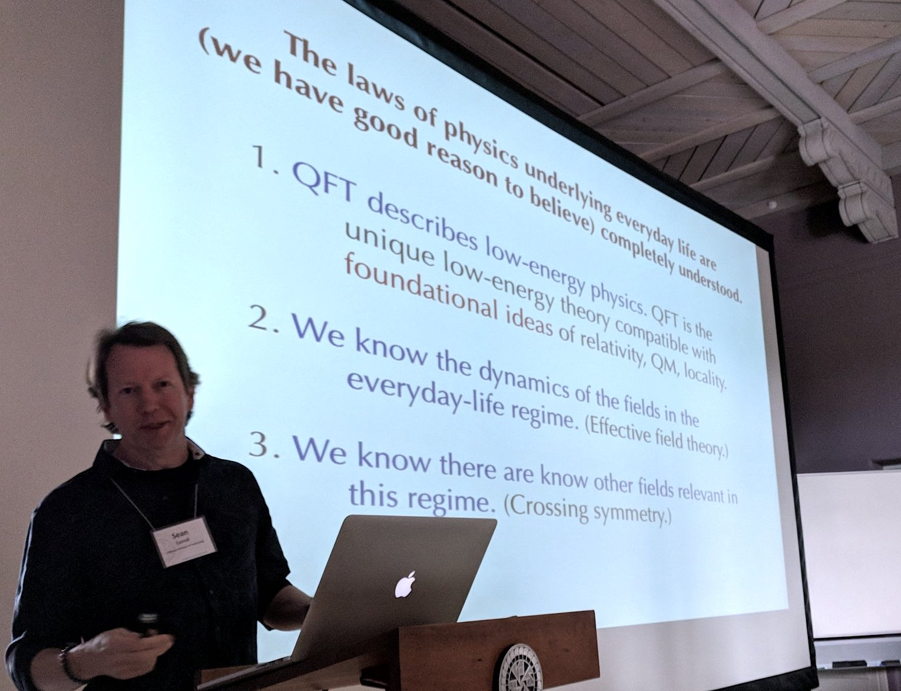

Philosophy of physics
================================================================================

What are good theories of the world?

Lorem ipsum dolor sit amet, consectetur adipisicing elit, sed do eiusmod tempor
incididunt ut labore et dolore magna aliqua. Ut enim ad minim veniam, quis
nostrud exercitation ullamco laboris nisi ut aliquip ex ea commodo consequat.
Duis aute irure dolor in reprehenderit in voluptate velit esse cillum dolore
eu fugiat nulla pariatur. Excepteur sint occaecat cupidatat non proident,
sunt in culpa qui officia deserunt mollit anim id est laborum.

<!-- PAGETOC -->

Theories of matter
--------------------------------------------------------------------------------

### Ancient atomism

-   [Kanada](https://en.wikipedia.org/wiki/Kanada_(philosopher)) (c. 700-100 BCE)
-   Empedocles (c. 494-434 BCE)
    -   theory of the four elements
-   ...
-   [Leucippus](https://en.wikipedia.org/wiki/Leucippus) (fl. 5th century BCE)
-   [Democritus](https://en.wikipedia.org/wiki/Democritus) (c. 460-370 BCE)
-   [Epicurus](https://en.wikipedia.org/wiki/Epicurus) (341-270 BCE)
-   [Lucretius](https://en.wikipedia.org/wiki/Lucretius) (c. 99-55 BCE)
    -   *De Rerum Natura* translated by Esolen [^Lucretius1995pX]

Discussion:

-   Weinberg
-   Nail
    -   Nail claims that Lecretius was _not_ an atomist,
        and that translations of Lecretius are colored by readings of his
        teacher, Epicurus. [^Nail2018]
    -   Crespo, H. (2018). [Intro to book review of ontology of motion: On the subject of definitions](https://theautarkist.wordpress.com/2018/12/03/intro-to-book-review-of-ontology-of-motion-on-the-subject-of-definitions-physics-lucretius/).

[^Lucretius1995pX]: @Lucretius_1995_On_the_Nature_of_Things_De_Rerum_Natura\, p. TODO.
[^Nail2018]: @Nail_2018_Lucretius_I_An_Ontology_of_Motion\.

### Modern atomism

-   [Corpuscularianism](https://en.wikipedia.org/wiki/Corpuscularianism)
-   [Isaac Beeckman](https://en.wikipedia.org/wiki/Isaac_Beeckman) (1588-1637)
-   [Ren&eacute; Descartes](https://en.wikipedia.org/wiki/Ren%C3%A9_Descartes) (1596-1650)
-   Boyle, Newton, Locke, Dalton
-   Yock, P. (2018). [Newton's hypotheses on the structure of matter](https://arxiv.org/abs/1807.05486). [^Yock2018]
-   ...
-   Boltzmann
-   [Johannes Diderik van der Waals](https://en.wikipedia.org/wiki/Johannes_Diderik_van_der_Waals) (1837-1923)
-   Modern [Atomism](https://en.wikipedia.org/wiki/Atomism)
-   Planck, J.J. Thomson, Rutherford
-   [Brownian motion](https://en.wikipedia.org/wiki/Brownian_motion)
    -   Einstein [^Einstein1905b]
    -   Perrin, J. (1913). *Les Atomes*. [^Perrin1913]
    -   Patterson [^Patterson2007]
-   Russell [^Russell1992]

[^Einstein1905b]: @Einstein_1905_Uber_die_von_der_molekularkinetischen_theorie\.
[^Patterson2007]: @Patterson_2007_Jean_Perrin_and_the_triumph_of_the_atomic\.
[^Perrin1913]: @Perrin_1913_Les_Atomes\.
[^Russell1992]: @Russell_1992_The_Analysis_of_Matter\.
[^Yock2018]: @Yock_2018_Newtons_hypotheses_on_the_structure_of_matter\.

### Contemporary views of matter

-   Quantum field theory
-   Statistical mechanics and condensed matter physics
-   TODO: Brief nod to upcoming sections.

See also:

-   [Quantum field theory](#quantum-field-theory)
-   [Statistical mechanics](#statistical-mechanics)

Classical physics
--------------------------------------------------------------------------------

### Mechanics

History:

-   [Isaac Newton](http://en.wikipedia.org/wiki/Isaac_Newton) (1642-1727)
-   [Edmond Halley](http://en.wikipedia.org/wiki/Edmond_Halley) (1656-1742)
-   [Gottfried Wilhelm Leibniz](http://en.wikipedia.org/wiki/Gottfried_Leibniz) (1646-1716)
-   [Leonhard Euler](http://en.wikipedia.org/wiki/Euler) (1707-1783)
-   [Joseph-Louis Lagrange](http://en.wikipedia.org/wiki/Joseph-Louis_Lagrange) (1736-1813)
-   [Pierre-Simon Laplace](https://en.wikipedia.org/wiki/Pierre-Simon_Laplace) (1749-1827)
-   [Carl Friedrich Gauss](http://en.wikipedia.org/wiki/Gauss) (1777-1855)
-   [Joseph von Fraunhofer](http://en.wikipedia.org/wiki/Joseph_von_Fraunhofer) (1787-1826)
-   [Augustin-Louis Cauchy](http://en.wikipedia.org/wiki/Augustin-Louis_Cauchy) (1789-1857)
-   [William Rowan Hamilton](http://en.wikipedia.org/wiki/William_Rowan_Hamilton) (1805-1865)
-   [Emmy Noether](https://en.wikipedia.org/wiki/Emmy_Noether) (1882-1935)

Lagrangian mechanics:

-   TODO: explain
-   Complaint about explanations of the Lagrangian:      
    Howe, A.R. (2020). [Why does the Lagrangian equal T-V?](https://sciencemeetsfiction.com/2020/07/04/why-does-the-lagrangian-equal-t-v/)
-   Relationship to the path-intergral formulation of quantum mechanics.

Pedagogy:

-   *The Feynman Lectures on Physics* [^Feynman1963]
-   Holm's *Geometric Mechanics* [^Holm2011]
-   't Hooft, G. [How to become a GOOD Theoretical Physicist](https://www.goodtheorist.science/).

Dimensional analysis:

-   Tao, T. (2012). [A mathematical formalisation of dimensional analysis](https://terrytao.wordpress.com/2012/12/29/a-mathematical-formalisation-of-dimensional-analysis/).
-   Buckingham $\pi$ theorem [^Buckingham1914]
-   physics.stackexchange.com: [On the dot product of vectors in different vector spaces](https://physics.stackexchange.com/questions/541168/given-two-vectors-with-no-common-point-is-a-dot-product-between-them-possible/541304#541304).
-   Kasprzak, W., Lysik, B., & Rybaczuk, M. (1990). *Dimensional Analysis in the Identification of Mathematical Models*. [^Kasprzak1990]
-   Duff, M.J., Okun, L.B., & Veneziano, G. (2001). [Trialogue on the number of fundamental constants](https://arxiv.org/abs/physics/0110060). [^Duff2001]
-   Janyska, J., Modugno, M., & Vitolo, R. (2007). [Semi-vector spaces and units of measurement](https://arxiv.org/abs/0710.1313). [^Janyska2007]
-   Zapata-Carratala, C. (2021). [Dimensioned algebra: The mathematics of physical quantities](https://arxiv.org/abs/2108.08703). [^ZapataCarratala2021]
-   TODO: Dimensional analysis can be formalized with each type of physical
    dimension having a corresponding vector space in a trivial vector bundle over
    a spacetime manifold, $M$. Because the bundle projection, $\pi$, is trivial,
    $\pi: M \times \mathbb{R}^{n_1} \times \mathbb{R}^{n_2} \times \cdots \rightarrow M$,
    vectors in each vector space can be directly compared.

See also:

-   [Fiber bundles](#fiber-bundles)

[^Buckingham1914]: @Buckingham_1914_On_physically_similar_systems_Illustrations\.
[^Duff2001]: @Duff_2001_Trialogue_on_the_number_of_fundamental_constants\.
[^Feynman1963]: @Feynman_1963_The_Feynman_Lectures_on_Physics_Volume_I\.
[^Holm2011]: @Holm_2011_Geometric_Mechanics_Part_I_Dynamics and
    @Holm_2011_Geometric_Mechanics_Part_II_Rotating\.
[^Janyska2007]: @Janyska_2007_Semi_vector_spaces_and_units_of_measurement\.
[^Kasprzak1990]: @Kasprzak_1990_Dimensional_Analysis_in_the_Identification\.
[^ZapataCarratala2021]: @Zapata_Carratala_2021_Dimensioned_algebra_The_mathematics_of_physical\.

### Electrodynamics

History:

-   [Michael Faraday](http://en.wikipedia.org/wiki/Michael_Faraday) (1791-1867)
    -   Invented the concept of a *field*
-   [James Clerk Maxwell](http://en.wikipedia.org/wiki/James_Clerk_Maxwell) (1831-1879)
-   [Josiah Willard Gibbs](https://en.wikipedia.org/wiki/Josiah_Willard_Gibbs) (1839-1903)
-   [Oliver Heaviside](https://en.wikipedia.org/wiki/Oliver_Heaviside) (1850-1925)

Pedagogy:

-   TODO

### Special relativity

History:

-   [Ernst Mach](https://en.wikipedia.org/wiki/Ernst_Mach) (1838-1916)
    -   Mach's principle
-   [Hendrik Lorentz](https://en.wikipedia.org/wiki/Hendrik_Lorentz) (1853-1928)
-   [Henri Poincar&eacute;](https://en.wikipedia.org/wiki/Henri_Poincar%C3%A9) (1854-1912)
-   [Hermann Minkowski](https://en.wikipedia.org/wiki/Hermann_Minkowski) (1864-1909)
-   [Albert Einstein](https://en.wikipedia.org/wiki/Albert_Einstein) (1879-1955)
    -   Einstein, A. (1905). On the electrodynamics of moving bodies. [^Einstein1905c]
    -   Einstein, A. (1905). Does the inertia of a body depend upon its energy content? [^Einstein1905d]

Stein:

>   And this is the crucial difference, as I see it, between Poincar&eacute;'s
>   relation to the special theory of relativity and Einstein’s. Both of them
>   discovered this theory---and did so independently. So far as its
>   mathematical structure is concerned, Poincar&eacute;'s grasp of the theory
>   was in some important respects superior to Einstein's. But Einstein "took
>   the theory seriously" in the sense that he looked to it for NEW INFORMATION
>   about the physical world---that is, in Poincar&eacute;'s language, he
>   regarded it as "fertile": as a source of new "real generalizations"---of
>   empirically testable consequences. And in doing so, Einstein attributed
>   physical significance to the basic notions of the theory itself in a way
>   that Poincar&eacute; did not. [^Stein2021p69]

Pedagogy:

-   Maudlin [^Maudlin2012pX]
-   Schroeder, D.V. (2022). [Relativity in five lessons](https://physics.weber.edu/schroeder/r5/).

See also:

-   [General relativity](physics.html#general-relativity)

[^Einstein1905c]: @Einstein_1905_Zur_elektrodynamik_bewegter_korper\.
[^Einstein1905d]: @Einstein_1905_Ist_die_tragheit_eines_korpers_von_seinem\.
[^Maudlin2012pX]: @Maudlin_2012_Philosophy_of_Physics_Space_and_Time\, p. TODO.
[^Stein2021p69]: @Stein_2021_Physics_and_philosophy_meet_The_strange_case\, p. 69.

Statistical physics
--------------------------------------------------------------------------------

### Introduction

TODO:

-   The goal of statistical mechanics.
-   How statistical mechanics can be seen as pure mathematics.
-   Statistical mechanics and thermodynamics
-   Entropy

### History

-   [James Clerk Maxwell](http://en.wikipedia.org/wiki/James_Clerk_Maxwell) (1831-1879)
-   [Josiah Willard Gibbs](https://en.wikipedia.org/wiki/Josiah_Willard_Gibbs) (1839-1903)
-   [Ludwig Boltzmann](http://en.wikipedia.org/wiki/Ludwig_Boltzmann) (1844-1906)

### Thermodynamics

-   Denker, J. (2021). [*Modern Thermodynamics*](http://www.av8n.com/physics/thermo/).
-   The 2nd Law of Thermodynamics said simply: Things tend to happen in ways for which there are many ways to happen like that.

### Canonical ensemble 

-   Canonical ensemble

### Phase translations

-   Phase transitions
-   Renormalization
-   Universality
    -   Wu, J. (2021). [Explaining universality: infinite limit systems in the renormalization group method](https://link.springer.com/article/10.1007/s11229-021-03448-2). [^Wu2021]

See also:

-   [Emergence](#emergence)
-   [Renormalization](#renormalization)

[^Wu2021]: @Wu_2021_Explaining_universality_infinite_limit_systems\.

Symmetry-first physics
--------------------------------------------------------------------------------

### Curie's principle

-   Pierre Curie (1859-1906)
-   "The symmetries of the causes are to be found in the effects."
-   Counting degrees of freedom
-   Totalitarian principle: "Everything not forbidden is compulsory." - Murray Gell-Mann
-   Caulton, A. (2015). [The role of symmetry in the interpretation of physical theories](http://philsci-archive.pitt.edu/11571/). [^Caulton2015]
-   Caulton, A. & Butterfield, J. (2012). [Symmetries and paraparticles as a motivation for structuralism](https://arxiv.org/abs/1002.3730). [^Caulton2012]

[^Caulton2012]: @Caulton_2012_Symmetries_and_paraparticles_as_a_motivation\.
[^Caulton2015]: @Caulton_2015_The_role_of_symmetry_in_the_interpretation\.

See also:

-   [Structural realism](#scientific-realism#structural-realism)

### Noether's theorems

-   Principle of least action, Lagrangians
-   Canonical dynamics
-   Noether, E. (1918). Invariante variationsprobleme. [^Noether1918]
    -   TODO: Noether's first and second theorem.
    -   Wigner, E.P. (1954). Conservation laws in classical and quantum physics. [^Wigner1954]
    -   Brading, K.A. (2002). Which symmetry? Noether, Weyl, and conservation of electric charge. [^Brading2002]
    -   Baez, J.C. (2018). [Getting to the bottom of Noether’s theorem](https://math.ucr.edu/home/baez/noether/noether_web.pdf). Talk given at [The Philosophy and Physics of Noether’s Theorems](https://philosophy.nd.edu/news/events/noether/). [^Baez2018]
-   Goyal, P. (2020). Derivation of classical mechanics in an energetic framework via conservation and relativity. [^Goyal2020]

[^Baez2018]: @Baez_2018_Getting_to_the_bottom_of_Noethers_theorem\.
[^Brading2002]: @Brading_2002_Which_symmetry_Noether_Weyl_and_conservation\.
[^Goyal2020]: @Goyal_2020_Derivation_of_classical_mechanics_in_an_energetic\.
[^Noether1918]: @Noether_1918_Invariante_variationsprobleme\.
[^Wigner1954]: @Wigner_1954_Conservation_laws_in_classical_and_quantum\.

### Gauge principle

-   Weyl, H. (1918). *Raum, Zeit, Materie*. [^Weyl1918]
-   Weyl, H. (1929). Elektron und gravitation. [^Weyl1929]
-   Pauli, W. (1941). Relativistic field theories of elementary particles. [^Pauli1941]
-   Yang C.N. & Mills R.L. (1954). Conservation of isotopic spin and isotopic gauge invariance. [^Yang1954]
-   't Hooft, G. (1994). *Under the Spell of the Gauge Principle*. [^tHooft1994a]
-   Teller, P. (2000). The gauge argument. [^Teller2000]
-   't Hooft, G. (2007). [Lie groups in physics](http://www.staff.science.uu.nl/~hooft101/lectures/lieg07.pdf). [^tHooft2007]
-   Afriat, A. (2013). Weyl's gauge argument. [^Afriat2013]
-   Schwichtenberg, J. (2015). *Physics from Symmetry*. [^Schwichtenberg2015]
-   Dewar, N. (2019). Sophistication about symmetries. [^Dewar2019]

Weyl:

>   It seems to me that this new principle of gauge invariance, which
>   follows not from speculation but from experiment, compellingly
>   indicates that the electromagnetic field is a necessary accompanying
>   phenomenon, not of gravitation, but of the material wave field
>   represented by $\psi$. Since gauge invariance includes an arbitrary
>   function $\lambda$ it has the character of "general" relativity
>   and can naturally only be understood in that context. [^Weyl1929pX]

[^Afriat2013]: @Afriat_2013_Weyls_gauge_argument\.
[^Dewar2019]: @Dewar_2019_Sophistication_about_symmetries\.
[^Pauli1941]: @Pauli_1941_Relativistic_field_theories_of_elementary\.
[^Schwichtenberg2015]: @Schwichtenberg_2015_Physics_from_Symmetry\.
[^Teller2000]: @Teller_2000_The_gauge_argument\.
[^tHooft1994a]: @tHooft_1994_Under_the_Spell_of_the_Gauge_Principle\.
[^tHooft2007]: @tHooft_2007_Lie_groups_in_physics\.
[^Weyl1918]: @Weyl_1918_Raum_Zeit_Materie\.
[^Weyl1929]: @Weyl_1929_Elektron_und_gravitation\.
[^Weyl1929pX]: @Weyl_1929_Elektron_und_gravitation\, p. TODO.
[^Yang1954]: @Yang_1954_Conservation_of_isotopic_spin_and_isotopic_gauge\.

### Wigner-Stone theorems

-   Wigner, E.P. (1959). *Group Theory and its Application to the Quantum Mechanics of Atomic Spectra*. [^Wigner1959]
-   Simon, B. (1976). Quantum dynamics: from automorphism to Hamiltonian. [^Simon1976]
-   Summers, S.J. (1999). On the Stone-von Neumann uniqueness theorem and its ramifications. [^Summers1999]
-   Keller, K.J., Papadopoulos, M.A., & Reyes-Lega, A.F. (2007). [On the realization of symmetries in quantum mechanics](https://arxiv.org/abs/0712.0997). [^Keller2007]
-   Wigner-Stone theorems as cornerstones of QM (Ovrut) [^Reece2007pX1]
-   Wigner's classification
    -   See also: disucssuion of symmetry in the section on [Fields](physics.html#fields)
-   Schweber, S.S. (1961). *An Introduction to Relativistic Quantum Field Theory*. [^Schweber1961]
-   Schroeren, D. (2021). Symmetry fundamentalism in quantum mechanics. [^Schroeren2021]

See also:

-   [Quantum field theory](#quantum-field-theory)

[^Keller2007]: @Keller_2007_On_the_realization_of_symmetries_in_quantum\.
[^Reece2007pX1]: @Reece_2007_Quantum_field_theory_An_introduction\, p. X.
[^Schroeren2021]: @Schroeren_2021_Symmetry_fundamentalism_in_quantum_mechanics\.
[^Schweber1961]: @Schweber_1961_An_Introduction_to_Relativistic_Quantum_Field\, p. TODO.
[^Simon1976]: @Simon_1976_Quantum_dynamics_From_automorphism_to_Hamiltonian\.
[^Summers1999]: @Summers_1999_On_the_Stone_von_Neumann_uniqueness_theorem\.
[^Wigner1959]: @Wigner_1959_Group_Theory_and_its_Application_to_the_Quantum\.

Quantum mechanics
--------------------------------------------------------------------------------

### Introduction

-   Hilbert spaces.  Wigner's theorem.  The Born rule.
-   Wave-particle duality misconceptions.  Fields are more fundamental than particles.
-   Philosophy of QM traditionally focus on NRQM. [^Ney2013]
-   The measurement problem.  Decoherence.  The Born rule again.
-   Uncertainty principle
-   Decoherence brings quantum logic to classical logic?

Feynman and Hibbs on wave-principle duality:

>   What is remarkable is that this dual use of wave and particle ideas does not
>   lead to contradictions. This is so only if great care is taken as to what
>   kind of statements one is permitted to make about the experimental
>   situation. [^FeynmanHibbs1965p6]

Feynman and Hibbs on the uncertainty principle:

>   Any determination of the alternative taken by a process capable of following
>   more than one alternative destroys the interference between the
>   alternatives. [^FeynmanHibbs1965p9]

[^FeynmanHibbs1965p6]: @Feynman_1965_Quantum_Mechanics_and_Path_Integrals\, p. 6.
[^FeynmanHibbs1965p9]: @Feynman_1965_Quantum_Mechanics_and_Path_Integrals\, p. 9.
[^Ney2013]: @Ney_2013_The_Wave_Function_Essays_on_the_metaphysics\.

### History

-   [History of quantum mechanics](https://en.wikipedia.org/wiki/History_of_quantum_mechanics)
-   Kelvin, L. (1901). Nineteenth century clouds over the dynamical theory of heat and light. [^Kelvin1901]
-   [Hendrik Lorentz](https://en.wikipedia.org/wiki/Hendrik_Lorentz) (1853-1928)
-   [Max Planck](https://en.wikipedia.org/wiki/Max_Planck) (1858-1947)
-   [Marie Curie](https://en.wikipedia.org/wiki/Marie_Curie) (1867-1934)
-   [Albert Einstein](https://en.wikipedia.org/wiki/Albert_Einstein) (1879-1955)
-   [Max Born](https://en.wikipedia.org/wiki/Max_Born) (1882-1970)
-   [Niels Bohr](https://en.wikipedia.org/wiki/Niels_Bohr) (1885-1962)
-   [Arnold Sommerfeld](https://en.wikipedia.org/wiki/Arnold_Sommerfeld) (1868-1951)
-   [Erwin Schr&ouml;dinger](https://en.wikipedia.org/wiki/Erwin_Schr%C3%B6dinger) (1887-1961)
-   [Louis de Broglie](https://en.wikipedia.org/wiki/Louis_de_Broglie) (1892-1987)
-   [Lawrence Bragg](https://en.wikipedia.org/wiki/Lawrence_Bragg) (1890-1971)
-   [Wolfgang Pauli](https://en.wikipedia.org/wiki/Wolfgang_Pauli) (1900-1958)
-   [Werner Heisenberg](https://en.wikipedia.org/wiki/Werner_Heisenberg) (1901-1976)
-   [Paul Dirac](https://en.wikipedia.org/wiki/Paul_Dirac) (1902-1984)
-   [An introduction to the Solvay conferences on physics](https://explore.psl.eu/en/discover/focus/introduction-solvay-conferences-physics) - Universit&eacute; PSL
-   Bacciagaluppi, G. & Valentini, A. (2009). [*Quantum Theory at the Crossroads: Reconsidering the 1927 Solvay Conference*](https://arxiv.org/abs/quant-ph/0609184). [^Bacciagaluppi2009]
-   [Proceedings of the Solvay conferences on physics](http://www.solvayinstitutes.be/html/solvayconf_physics.html)

).](img/Solvay-conference-1927.jpg){#fig:Solvay-conference-1927}

-   [Pascual Jordan](https://en.wikipedia.org/wiki/Pascual_Jordan) (1902-1980)
-   [Eugene Wigner](https://en.wikipedia.org/wiki/Eugene_Wigner) (1902-1995)
-   [John von Neumann](https://en.wikipedia.org/wiki/John_von_Neumann) (1903-1957)
    -   *The Mathematical Foundations of Quantum Mechanics* (1932) [^vonNeumann1955]
    -   van Hove, L. (1958). Von Neumann's contributions to quantum theory. [^vanHove1958]
-   [J. Robert Oppenheimer](https://en.wikipedia.org/wiki/J._Robert_Oppenheimer) (1904-1967)
-   [John Archibald Wheeler](https://en.wikipedia.org/wiki/John_Archibald_Wheeler) (1911-2008)

[^Bacciagaluppi2009]: @Bacciagaluppi_2009_Quantum_Theory_at_the_Crossroads_Reconsidering\.
[^Kelvin1901]: @Kelvin_1901_Nineteenth_century_clouds_over_the_dynamical\.
[^vanHove1958]: @vanHove_1958_Von_Neumanns_contributions_to_quantum_theory\.
[^vonNeumann1955]: @vonNeumann_1955_The_Mathematical_Foundations_of_Quantum_Mechanics\.

### Hydrogen atom

-   Factorizable in spherical coordinates, leading to solutions as a product
    of spherical harmonics in ($\theta$, $\phi$) and Laguerre polynomials in $r$.
-   Fine structure
-   Lamb shift
-   Hyperfine structure

### Foundations of QM

-   Hilbert spaces:

$$ \hat{H} \: |n\rangle = E_{n} \: |n\rangle $$

-   Superposition principle:

$$ |\psi\rangle = \sum_{n} a_{n} \: |n\rangle $$

-   Born rule

$$ P(n) = | \langle n | \psi \rangle |^{2} = |a_{n}|^{2} $$

-   Wigner's theorem

The generators of the representation of a transformation in a Hilbert space
are the operators representing the classical Noether charges that are
conserved under that transformation.

$$ \hat{U}(x^{\mu}) = e^{ -i \, \hat{P}_\mu \, x^\mu } $$

-   Somehow, QM is about complex numbers:
    -   [Riesz representation theorem](https://en.wikipedia.org/wiki/Riesz_representation_theorem)
    -   Jordan, P., von Neumann, J., & Wigner, E.P. (1934). On an algebraic generalization of the quantum mechanical formalism. [^Jordan1934]
    -   Baez, J.C. (2011). [Division algebras and quantum theory](https://arxiv.org/abs/1101.5690). [^Baez2011a]

[^Baez2011a]: @Baez_2011_Division_algebras_and_quantum_theory\.
[^Jordan1934]: @Jordan_1934_On_an_algebraic_generalization_of_the_quantum\.

### Secondary properties of QM

-   Wave function:

$$ \langle x | n \rangle = \psi_{n}(x) $$

-   Schr&ouml;dinger equation:

$$ i \hbar \: \partial_{t} \: |\psi\rangle = \hat{H} \: |\psi\rangle $$

-   Heisenberg picture:

$$ i \hbar \: \partial_{t} \: \hat{U}(t) \: |\psi\rangle = \hat{H} \: \hat{U}(t) \: |\psi\rangle $$

Schr&ouml;dinger vs Heisenberg pictures is like Heraclitus vs Parmenides.

-   Decoherence

$$ \mathcal{H} = \mathcal{H}_\mathrm{S} \otimes \mathcal{H}_\mathrm{E} $$

$$ |\psi\rangle \otimes |\alpha\rangle \rightarrow |\psi; \alpha\rangle \otimes |\alpha\rangle $$

See Dutailly [^Dutailly2014p11], for example, for a demonstration
that the Schr&ouml;dinger equation is derivable from Wigner's theorem.

[^Dutailly2014p11]: @Dutailly_2014_Particles_and_Fields\, p. 11--13.

### Decoherence

-   Zurek, W.H. (2003). [Decoherence, einselection, and the quantum origins of the classical](https://arxiv.org/abs/quant-ph/0105127). [^Zurek2003]
-   *Decoherence and the Appearance of a Classical World in Quantum Theory* [^Joos2003]
-   Decoherence times from various scatterings [^Tegmark1993]
-   Schlosshauer, M. (2005). [Decoherence, the measurement problem, and interpretations of quantum mechanics](https://arxiv.org/abs/quant-ph/0312059). [^Schlosshauer2005]
-   My quora answer: [What is currently the best explanation for how and why the quantum wave function collapses?](https://www.quora.com/What-is-currently-the-best-explanation-for-how-and-why-the-quantum-wave-function-collapses/answer/Ryan-Reece)
-   Decoherence and Everett's interpretation
-   Drossel, B. (2015). On the relation between the second law of thermodynamics and classical and quantum mechanics. [^Drossel2015]
-   Zurek, W.H. (2022). [Quantum theory of the classical: Einselection, envariance, quantum Darwinism and extantons](https://arxiv.org/abs/2208.09019). [^Zurek2022]

See also:

-   [Everettian interpretation](#everettian-interpretation)

[^Drossel2015]: @Drossel_2015_On_the_relation_between_the_second_law\, p. 51--2.
[^Joos2003]: @Joos_2003_Decoherence_and_the_Appearance_of_a_Classical\.
[^Schlosshauer2005]: @Schlosshauer_2005_Decoherence_the_measurement_problem\.
[^Tegmark1993]: @Tegmark_1993_Apparent_wave_function_collapse_caused\.
[^Zurek2003]: @Zurek_2003_Decoherence_einselection_and_the_quantum_origins\.
[^Zurek2022]: @Zurek_2022_Quantum_theory_of_the_classical_Einselection\.

### Quantum chemistry

-   Friedrich, B. (2016). [How did the tree of knowledge get its blossom? The rise of physical and theoretical chemistry, with an eye on Berlin and Leipzig](https://onlinelibrary.wiley.com/doi/10.1002/anie.201509260). [^Friedrich2016]
-   Density functional theory
-   Cao, C., Hu, H., Li, J., & Schwarz, W.H.E. (2019). [Physical origin of chemical periodicities in the system of elements](https://www.degruyter.com/document/doi/10.1515/pac-2019-0901/html). [^Cao2019]
-   Cohen, M.L. (2015). [Explaining and predicting the properties of materials using quantum theory](https://www.cambridge.org/core/journals/mrs-bulletin/article/explaining-and-predicting-the-properties-of-materials-using-quantum-theory/0BAF1A2783D41470AAE666F6B916ECE5).

[^Cao2019]: @Cao_2019_Physical_origin_of_chemical_periodicities\.
[^Friedrich2016]: @Friedrich_2016_How_did_the_tree_of_knowledge_get_its_blossom\.

### Quantum computing

-   Feynman
-   Coecke, B. & Kissinger, A. (2017). *Picturing Quantum Processes: A first course in quantum theory and diagrammatic reasoning*. [^Coecke2017]
-   Preskill, J. (2018). [Quantum computing in the NISQ era and beyond](https://arxiv.org/abs/1801.00862). [^Preskill2018]
-   Arute, F. et al. (2019). Quantum supremacy using a programmable superconducting processor. [^Arute2019]
    -   Google AI Blog. (2019). [Quantum supremacy using a programmable superconducting processor](https://ai.googleblog.com/2019/10/quantum-supremacy-using-programmable.html).
-   Broughton, M. et al. (2020). [TensorFlow Quantum: A software framework for quantum machine learning](https://arxiv.org/abs/2003.02989). [^Broughton2020]
    -   TensorFlow. (2020). [tensorflow.org/quantum](https://www.tensorflow.org/quantum).
    -   TensorFlow. (2021). [Quantum machine learning concepts](https://www.tensorflow.org/quantum/concepts).

[^Arute2019]: @Arute_2019_Quantum_supremacy_using_a_programmable\.
[^Broughton2020]: @Broughton_2020_TensorFlow_Quantum_A_software_framework\.
[^Coecke2017]: @Coecke_2017_Picturing_Quantum_Processes_A_first_course\.
[^Preskill2018]: @Preskill_2018_Quantum_computing_in_the_NISQ_era_and_beyond\.

Quantum field theory
--------------------------------------------------------------------------------

### Fields

#### Introduction

-   Field definition - Faraday
-   [Richard Feynman](https://en.wikipedia.org/wiki/Richard_Feynman) (1918-1988)
-   [Julian Schwinger](https://en.wikipedia.org/wiki/Julian_Schwinger) (1918-1994)
-   [Shin'ichir&omacr; Tomonaga](https://en.wikipedia.org/wiki/Shin%27ichir%C5%8D_Tomonaga) (1906-1979)
-   Feynman's Nobel Lecture on QED [^Feynman1965]
-   Weinberg's folk theorem: QFT is the right way to combine Lorentz invariance,
    quantum mechanics, and the cluster decomposition principle. [^Weinberg1997p8]

Baez, Segal, & Zhou:

>   Quantum field theory is quintessentially the algebra and analysis of
>   infinite-dimensional dynamical systems, as constrained by quantum
>   phenomenology, causality, and symmetry. Although it has a clear-cut
>   central goal, that of the realistic description of particle production
>   and annihilation in terms of the localized interactions of fields in
>   space-time, it is clear from this description that it is a multifaceted
>   subject. [^Baez1992p1]

[^Baez1992p1]: @Baez_1992_Introduction_to_Algebraic_and_Constructive_Quantum\, p. 1.
[^Feynman1965]: @Feynman_1965_The_development_of_the_space_time_view_of_quantum\.
[^Weinberg1997p8]: @Weinberg_1997_What_is_quantum_field_theory_and_what_did_we\, p. 8.

#### Pedagogy

-   Peskin and Schroeder [^Peskin1995]
-   Zee [^Zee2013]
-   Schwartz [^Schwartz2014]
-   David Tong [^Tong2006]
-   Zeidler, vol 1 [^Zeidler2007], 2 [^Zeidler2008], and 3 [^Zeidler2011]
-   Cao, T.Y. (1999). *Conceptual Foundations of Quantum Field Theory*. [^Cao1999]
-   't Hooft, G. (2005). [The conceptual basis of quantum field theory](https://dspace.library.uu.nl/bitstream/handle/1874/22670/hooft_05_conceptualbasisofquantumfieldtheory.pdf). [^tHooft2005]

[^Cao1999]: @Cao_1999_Conceptual_Foundations_of_Quantum_Field_Theory\.
[^Peskin1995]: @Peskin_1995_An_Introduction_to_Quantum_Field_Theory\.
[^Schwartz2014]: @Schwartz_2014_Quantum_Field_Theory_and_the_Standard_Model\.
[^tHooft2005]: @tHooft_2005_The_conceptual_basis_of_quantum_field_theory\.
[^Tong2006]: @Tong_2006_Lectures_on_Quantum_Field_Theory\.
[^Zee2013]: @Zee_2003_Quantum_Field_Theory_in_a_Nutshell\.
[^Zeidler2007]: @Zeidler_2007_Quantum_Field_Theory_I_Basics_in_mathematics\.
[^Zeidler2008]: @Zeidler_2008_Quantum_Field_Theory_II_Quantum_electrodynamics\.
[^Zeidler2011]: @Zeidler_2011_Quantum_Field_Theory_III_Gauge_theory_Vol3\.

### Symmetry

#### Introduction

-   TODO
-   Noether's theorem, again
-   Wigner-Stone theorems, again

See also:

-   [Wigner-Stone theorems](physics.html#wigner-stone-theorems)

#### Coleman-Mandula theorem

-   Coleman-Mandula theorem [^Coleman1967]

[^Coleman1967]: @Coleman_1967_All_possible_symmetries_of_the_S_matrix\.

#### Wigner's classification

-   [Wigner's classification](https://en.wikipedia.org/wiki/Wigner%27s_classification) [^WignerClassification]

[^WignerClassification]: @Wigner_1939_On_unitary_representations_of_the_inhomogeneous
    and @Bargmann_1948_Group_theoretical_discussion_of_relativistic_wave\.

#### CPT theorem

-   Bell, J.S. (1955). Time reversal in field theory. [^Bell1955]
-   Streater, R. & Wightman, A. (1964). *PCT, spin and statistics, and all that*. [^Streater1964]
-   Greaves, H. & Thomas, T. (2012). [The CPT Theorem](https://arxiv.org/abs/1204.4674). [^Greaves2012]

[^Bell1955]: @Bell_1955_Time_reversal_in_field_theory\.
[^Greaves2012]: @Greaves_2012_The_CPT_Theorem\.
[^Streater1964]: @Streater_1964_PCT_spin_and_statistics_and_all_that\.

### Spin

#### Introduction

-   Ohanian [^Ohanian1986]
-   Peskin [^Peskin1994]
-   Sebens [^Sebens2019]

[^Ohanian1986]: @Ohanian_1986_What_is_spin\.
[^Peskin1994]: @Peskin_1994_Spin_mass_and_symmetry\.
[^Sebens2019]: @Sebens_2019_How_electrons_spin\.

#### Spinors

-   [Spinor](https://en.wikipedia.org/wiki/Spinor)
-   SU(2) double covers SO(3)
-   [Belt trick](https://en.wikipedia.org/wiki/Plate_trick)
-   [Orientation entanglement](https://en.wikipedia.org/wiki/Orientation_entanglement)
-   Spatial vectors alone are not sufficient to describe fully the properties of rotations in space.
-   Penrose, R. & Weinstein, E. (2020). Video: [Do we understand spinors?](https://www.youtube.com/watch?v=_EasLq6IQIw)
    -   In some sense, a spinor is the square-root of a vector.

Michael Atiyah:

>   No one fully understands spinors. Their algebra is formally understood but
>   their general significance is mysterious. In some sense they describe the
>   "square root" of geometry and, just as understanding the square root of -1
>   took centuries, the same might be true of spinors. [^Dutailly2014p37]

[^Dutailly2014p37]: @Dutailly_2014_Particles_and_Fields\, p. 37.

#### Spin-statistics theorem

-   Spin-statistics theorem - Pauli

### Scattering

-   Interaction picture
-   Correlation AKA Green's functions
-   Wick's theorem
    -   Kontsevich, M. & Segal, G. (2021). [Wick rotation and the positivity of energy in quantum field theory](https://arxiv.org/abs/2105.10161). [^Kontsevich2021]
-   Vaccuum bubble cancelation
-   Dyson series
    -   Dyson, F.J. (1949). The $S$ matrix in quantum electrodynamics. [^Dyson1949]
    -   Dyson, F.J. (1952). Divergence of perturbation theory in quantum electrodynamics. [^Dyson1952]
-   LSZ reduction formula [^Lehmann1955]
-   Haag-Ruelle scattering theory
-   Feynman diagrams and Feynman rules
    -   Weinberg, S. (1964). Feynman rules for any spin. [^Weinberg1964]
-   Martin, S.P. (2011). [Phenomenology of particle physics](https://www.ippp.dur.ac.uk/~mspannow/files/Phenomenology_Particle_Physics_Martin.pdf). [^Martin2011]
-   My notes: Reece, R. (2007). [Quantum field theory: An introduction](http://rreece.github.io/publications/pdf/2007.Reece.Quantum-Field-Theory-An-Introduction.pdf). [^Reece2007]
-   Jaeger, G. (2019). Are virtual particles less real? [^Jaeger2019]

[^Dyson1949]: @Dyson_1949_The_S_matrix_in_quantum_electrodynamics\.
[^Dyson1952]: @Dyson_1952_Divergence_of_perturbation_theory_in_quantum\.
[^Jaeger2019]: @Jaeger_2019_Are_virtual_particles_less_real\.
[^Kontsevich2021]: @Kontsevich_2021_Wick_rotation_and_the_positivity_of_energy\.
[^Lehmann1955]: @Lehmann_1955_Zur_formulierung_quantisierter_feldtheorien\.
[^Martin2011]: @Martin_2011_Phenomenology_of_particle_physics\.
[^Reece2007]: @Reece_2007_Quantum_field_theory_An_introduction\.
[^Weinberg1964]: @Weinberg_1964_Feynman_rules_for_any_spin and
    @Weinberg_1964_Feynman_rules_for_any_spin_II_Massless_particles\.

### Path intergrals

-   Feynman
    -   Feynman and Hibbs (1965) [^FeynmanHibbs1965]
-   Partition functions and generating functionals
-   Show this way of deriving the Feynman rules
-   Nguyen [^Nguyen2016]

[^FeynmanHibbs1965]: @Feynman_1965_Quantum_Mechanics_and_Path_Integrals\.
[^Nguyen2016]: @Nguyen_2016_The_perturbative_approach_to_path_integrals\.

### Renormalization

-   Dyson
-   Dirac, P.A.M. (1963). [The evolution of the physicist's picture of nature](https://www.jstor.org/stable/24936146). [^Dirac1963]
-   't Hooft, G. (1971). Renormalizable Lagrangians for massive Yang-Mills fields. [^tHooft1971]
-   Wilson, K. (1974). The renormalization group and the $\varepsilon$ expansion. [^Wilson1974]
-   Goldenfeld, N. (1992). *Lectures on Phase Transitions and the Renormalization Group*. [^Goldenfeld1992]
-   Butterfield, J. (2014). [Reduction, emergence, and renormalization](https://arxiv.org/abs/1406.4354v1). [^Butterfield2014]
-   Butterfield, J. & Bouatta, N. (2015). [Renormalization for philosophers](https://arxiv.org/abs/1406.4532). [^Butterfield2015]
    -   Universality is multiple realizability
-   't Hooft, G. (1994). *Under the Spell of the Gauge Principle*. (again) [^tHooft1994b]
-   't Hooft, G. (1999). A confrontation with infinity (Nobel lecture). [^tHooft1999]
-   The "renormalization group" isn't a group; it's actually a semigroup.
    The reason that renormalization produces a semigroup is that a block
    transformation loses information. [^Kadanoff2013p50]
-   Borcherds, R.E. & Barnard, A. (2002). [Lectures on quantum field theory](https://arxiv.org/abs/math-ph/0204014). [^Borcherds2002]
-   Video: [Moving Naturalism Forward, Day 1, Afternoon, 2nd Session: Simon DeDeo on renormalization](https://www.youtube.com/watch?v=-ZYLb7D2bQw).
 
[^Borcherds2002]: @Borcherds_2002_Lectures_on_quantum_field_theory\.
[^Butterfield2014]: @Butterfield_2014_Reduction_emergence_and_renormalization\.
[^Butterfield2015]: @Butterfield_2015_Renormalization_for_philosophers\.
[^Dirac1963]: @Dirac_1963_The_evolution_of_the_physicists_picture\.
[^Goldenfeld1992]: @Goldenfeld_1992_Lectures_on_Phase_Transitions\.
[^Kadanoff2013p50]: @Kadanoff_2013_Theories_of_matter_Infinities_and_renormalization\, p. 50.
[^tHooft1971]: @tHooft_1971_Renormalizable_Lagrangians_for_massive_Yang_Mills\.
[^tHooft1994b]: @tHooft_1994_Under_the_Spell_of_the_Gauge_Principle\.
[^tHooft1999]: @tHooft_1999_A_confrontation_with_infinity\.
[^Wilson1974]: @Wilson_1974_The_renormalization_group_and_the_varepsilon\.

### Effective field theory

-   Effective field theory (EFT)
-   Huggett, N., & Weingard, R. (1995). The renormalisation group and effective field theories. [^Huggett1995]
-   Weinberg, S. (1997). [What is quantum field theory, and what did we think it is?](http://arxiv.org/abs/hep-th/9702027). [^Weinberg1997]
-   Bain, J. (2013). Effective field theories. [^Bain2013]
-   Preskill, J. (2013). [We are all Wilsonians now](https://quantumfrontiers.com/2013/06/18/we-are-all-wilsonians-now/). [^Preskill2013]
-   Williams, P. (2019). [Scientific realism made effective](https://www.journals.uchicago.edu/doi/full/10.1093/bjps/axx043). [^Williams2019]
-   Rosaler, J. (2022). [Dogmas of effective field theory: Scheme dependence, fundamental parameters, and the many faces of the Higgs naturalness principle](https://link.springer.com/article/10.1007/s10701-021-00510-4). [^Rosaler2022]

[^Bain2013]: @Bain_2013_Effective_field_theories and
    @Bain_2013_Emergence_in_effective_field_theories\.
[^Huggett1995]: @Huggett_1995_The_renormalisation_group_and_effective_field\.
[^Preskill2013]: @Preskill_2013_We_are_all_Wilsonians_now\.
[^Rosaler2022]: @Rosaler_2022_Dogmas_of_effective_field_theory_Scheme\.
[^Weinberg1997]: @Weinberg_1997_What_is_quantum_field_theory_and_what_did_we\.
[^Williams2019]: @Williams_2019_Scientific_realism_made_effective\.

### Foundations of QFT

#### Introduction

-   Weinberg
-   Struggles with the continuum [^Baez2016]
-   [Reeh-Schlieder theorem](https://en.wikipedia.org/wiki/Reeh%E2%80%93Schlieder_theorem)
    -   Taj Mahal principle
-   Auyang, S.Y. (1995). *How Is Quantum Field Theory Possible?* [^Auyang1995]

Baez:

>   Nobody has found a fully rigorous formulation of QED, nor has anyone proved
>   such a thing cannot be found. [^Baez2016p17]

Baez:

>   In practice, quantum field theory is marvelously good for calculating
>   answers to many physics questions. The answers involve approximations.
>   These approximations seem to work very well: that is, the answers match
>   experiments. Unfortunately we do not fully understand, in a mathematically
>   rigorous way, what these approximations are supposed to be
>   approximating. [^Baez2016p18]

[^Auyang1995]: @Auyang_1995_How_Is_Quantum_Field_Theory_Possible\.
[^Baez2016]: @Baez_2016_Struggles_with_the_continuum\.
[^Baez2016p17]: @Baez_2016_Struggles_with_the_continuum\, p. 17.
[^Baez2016p18]: @Baez_2016_Struggles_with_the_continuum\, p. 18.

#### Wave-particle duality

-   Einstein, A. (1905). On a heuristic point of view about the creation and conversion of light. [^Einstein1905a]
-   Wolchover, N. (2020). [What is a particle?](https://www.quantamagazine.org/what-is-a-particle-20201112/)

Weinberg on wave-particle duality:

>   In its mature form, the idea of quantum field theory is that quantum
>   fields are the basic ingredients of the universe, and particles are
>   just bundles of energy and momentum of the fields. In a relativistic
>   theory the wave function is a functional of these fields, not a
>   function of particle coordinates. Quantum field theory hence led to a
>   more unified view of nature than the old dualistic interpretation in
>   terms of both fields and particles. [^Weinberg1997p2]

-   Weinberg, S. (1997). [What is an elementary particle?](https://www.slac.stanford.edu/pubs/beamline/27/1/27-1-weinberg.pdf) [^Weinberg1997a]

Baez, Segal, & Zhou on wave-particle duality:

>   The treatment of the dynamics of quantum systems turns out to be naturally
>   undertaken in terms of field rather than particle concepts, by virtue of
>   the local character of relativistic interactions. In mathematical terms,
>   the *field* is diagonalizcd in the functional integration representation,
>   just as the *particle numbers* are diagonalized in the tensor product
>   representation. [^Baez1992p59]

-   Fraser, D. (2008). [The fate of 'particles' in quantum field theories with interactions](http://philsci-archive.pitt.edu/4038/). [^Fraser2008]
-   Pessa, E. (2009). [The concept of particle in quantum field theory](https://arxiv.org/abs/0907.0178). [^Pessa2009]
-   Duncan, A. (2012). *The Conceptual Framework of Quantum Field Theory*. [^Duncan2012p163]
-   Myrvold, W.C. (2015). [What is a wavefunction?](http://philsci-archive.pitt.edu/11117/) [^Myrvold2015]
-   Lazarovici, D. (2018). [Against fields](https://arxiv.org/abs/1809.00855). [^Lazarovici2018]
-   Baker, D.J. (2009). [Against field interpretations of quantum field theory](http://philsci-archive.pitt.edu/4350/). [^Baker2009]
-   Caulton, A. (2018). A persistent particle ontology for quantum field theory. [^Caulton2018]

[^Baez1992p59]: @Baez_1992_Introduction_to_Algebraic_and_Constructive_Quantum\, p. 59.
[^Baker2009]: @Baker_2009_Against_field_interpretations_of_quantum_field\.
[^Caulton2018]: @Caulton_2018_A_persistent_particle_ontology_for_quantum_field\.
[^Duncan2012p163]: @Duncan_2012_Conceptual_Framework_of_Quantum_Field_Theory\, p. 163--4.
[^Einstein1905a]: @Einstein_1905_Uber_einen_die_erzeugung_und_verwandlung_des\.
[^Fraser2008]: @Fraser_2008_The_fate_of_particles_in_quantum_field_theories\.
[^Lazarovici2018]: @Lazarovici_2018_Against_fields\.
[^Myrvold2015]: @Myrvold_2015_What_is_a_wavefunction\.
[^Pessa2009]: @Pessa_2009_The_concept_of_particle_in_quantum_field_theory\.
[^Weinberg1997p2]: @Weinberg_1997_What_is_quantum_field_theory_and_what_did_we\, p. 2.
[^Weinberg1997a]: @Weinberg_1997_What_is_an_elementary_particle\.

#### Haag's theorem

-   Haag's theorem [^Haag1955]
    -   The interaction picture does not exist in interacting relativistic QFT.
    -   States in the free theory are unitarily inequivalent to those in interacting relativistic QFT.
-   Discussion:
    -   Malament [^Malament1996]
    -   Teller [^Teller1997p115]
    -   Earman and Fraser's analysis [^Earman2006]
    -   Klaczynski's analysis [^Klaczynski2016]
    -   Ruetsche, L. (2002). Interpreting quantum field theory. [^Ruetsche2002]
-   Resolution:
    -   Bain [^Bain2000]
    -   Duncan [^Duncan2012]
    -   Wallace
    -   QFT requires an ultraviolet regulator (a cutoff, a lattice),
        and Haag's theorem does not apply when the regulator is in place.
    -   Seidewitz, E. (2017). [Avoiding Haag's theorem with parameterized quantum field theory](https://arxiv.org/abs/1501.05658). [^Seidewitz2017]

<blockquote class="twitter-tweet">

I have really fallen into a rabbit hole over Haag&#39;s theorem. 
<a href="https://twitter.com/hashtag/HaagsTheorem?src=hash&amp;ref_src=twsrc%5Etfw">#HaagsTheorem</a> 
<a href="https://twitter.com/hashtag/philsci?src=hash&amp;ref_src=twsrc%5Etfw">#philsci</a> 
<a href="https://twitter.com/hashtag/philqft?src=hash&amp;ref_src=twsrc%5Etfw">#philqft</a> 
<a href="https://t.co/6DhBpnWPKQ">pic.twitter.com/6DhBpnWPKQ</a>
&mdash; Ryan Reece (&commm;RyanDavidReece) 
<a href="https://twitter.com/RyanDavidReece/status/908051901219971072?ref_src=twsrc%5Etfw">September 13, 2017</a>
</blockquote>

<blockquote class="twitter-tweet">

You all weren&#39;t much help on Haag&#39;s theorem. Duncan, A. (2012). Conceptual Framework of QFT. Oxford. p. 359. 
<a href="https://t.co/NIHgfNh7s6">pic.twitter.com/NIHgfNh7s6</a>
&mdash; Ryan Reece (&commm;RyanDavidReece)
<a href="https://twitter.com/RyanDavidReece/status/910703819515871233?ref_src=twsrc%5Etfw">September 21, 2017</a>
</blockquote>

[^Bain2000]: @Bain_2000_Against_particlefield_duality_Asymptotic\.
[^Duncan2012]: @Duncan_2012_Conceptual_Framework_of_Quantum_Field_Theory\.
[^Earman2006]: @Earman_2006_Haags_theorem_and_its_implications\.
[^Haag1955]: @Haag_1955_On_quantum_field_theories\.
[^Klaczynski2016]: @Klaczynski_2016_Haags_theorem_in_renormalised_quantum_field\.
[^Malament1996]: @Malament_1996_In_defence_of_dogma_Why_there_cannot_be\.
[^Ruetsche2002]: @Ruetsche_2002_Interpreting_quantum_field_theory\.
[^Seidewitz2017]: @Seidewitz_2017_Avoiding_Haags_theorem_with_parameterized_quantum\.
[^Teller1997p115]: @Teller_1997_An_Interpretive_Introduction_to_Quantum_Field\, p. 115.

#### Quantization

-   Canonical quantization
-   Path integral quantization
-   No "2nd quantization"
-   Redhead [^Redhead1982]
-   Redhead [^Redhead1988]
-   Instead of quantizing classical theories, should we be finding the classical limit of quantum theories?
-   Geometric quantization

[^Redhead1982]: @Redhead_1982_Quantum_field_theory_for_philosophers\.
[^Redhead1988]: @Redhead_1988_A_philosopher_looks_at_quantum_field_theory\.

#### Algebraic vs constructive QFT

-   AQFT vs LQFT
-   *Local Quantum Physics* [^Haag1992]
-   Wallace [^Wallace2011]
-   Fraser [^Fraser2011]
-   Buchholz [^Buchholz1998]

Kastler:

>   Rudolf [Haag] is not satisfied by a notion of local observables relying
>   plainly on space and time. Instead he wishes to base the theory on concepts
>   related to individual processes. This attitude seems to me to move towards a
>   basic "algebra of procedures", pointing towards a theory of (non-commutative)
>   space-time. I know that, coming from a very different angle, Alain Connes
>   also believes the ultimate algebra of basic physics to be a discrete algebra
>   of elements standing for experimental procedures---following the idea 
>   that the spatial notions man acquires in his cradle are less basic than
>   his procedures at [particle] accelerators. [^Kastler2003p6]

[^Buchholz1998]: @Buchholz_1998_Current_trends_in_axiomatic_quantum_field_theory\.
[^Fraser2011]: @Fraser_2011_How_to_take_particle_physics_seriously_A_further\.
[^Haag1992]: @Haag_1992_Local_Quantum_Physics_Fields_Particles_Algebras\.
[^Kastler2003p6]: @Kastler_2003_Rudolf_Haag_Eighty_Years\, p. 6.
[^Wallace2011]: @Wallace_2011_Taking_particle_physics_seriously_A_critique\.

Exotics in quantum field theory
--------------------------------------------------------------------------------

### Higher gauge theory

#### Aharanov-Bohm effect

-   Aharonov, Y. & Bohm, D. (1959). Significance of electromagnetic potentials in quantum theory. [^Aharonov1959]
-   Healey on the Aharonov-Bohm effect [^Healey2007ch2]
-   Holonomy
-   Batterman, R. (2003). Falling cats, parallel parking and polarized light. [^Batterman2003]
-   Maudlin, T. (2018). [Ontological clarity via canonical presentation: Electromagnetism and the Aharonov-Bohm effect](https://www.mdpi.com/1099-4300/20/6/465). [^Maudlin2018]

Wikipedia discussion in the [magnetic moment](https://ncatlab.org/nlab/show/fiber+bundles+in+physics) article:

>   A gauge theory like electromagnetism is defined by a gauge field, which associates a group element to each path in space time. For infinitesimal paths, the group element is close to the identity, while for longer paths the group element is the successive product of the infinitesimal group elements along the way.
>   
>   In electrodynamics, the group is $U(1)$, unit complex numbers under multiplication. For infinitesimal paths, the group element is $1 + i\,A_\mu\,dx^\mu$ which implies that for finite paths parametrized by $s$, the group element is:
>   
>   $\prod _{s}\left(1+i\,e\,A_\mu\,\frac{dx^\mu}{ds}\,ds\right) = \exp\left(i\,e\int A\cdot dx\right) \,.$
>   
>   The map from paths to group elements is called the Wilson loop or the holonomy, and for a $U(1)$ gauge group it is the phase factor which the wavefunction of a charged particle acquires as it traverses the path. For a loop:
>   
>   $e\oint_{\partial D}A\cdot dx = e\int_{D}(\nabla \times A)\,dS = e\int_{D}B\,dS \,.$
>   
>   So that the phase a charged particle gets when going in a loop is the magnetic flux through the loop. When a small solenoid has a magnetic flux, there are interference fringes for charged particles which go around the solenoid, or around different sides of the solenoid, which reveal its presence.

[^Aharonov1959]: @Aharonov_1959_Significance_of_electromagnetic_potentials\.
[^Batterman2003]: @Batterman_2003_Falling_cats_parallel_parking_and_polarized\.
[^Healey2007ch2]: @Healey_2007_Gauging_Whats_Real\, ch. 2-4.
[^Maudlin2018]: @Maudlin_2018_Ontological_clarity_via_canonical_presentation\.

#### Fiber bundles

-   [Fiber bundles in physics](https://ncatlab.org/nlab/show/fiber+bundles+in+physics) - nLab
    -   Fiber bundles embody two central principles of modern physics:
        1.  the principle of locality
        2.  the gauge principle.
-   [Vector bundle](https://en.wikipedia.org/wiki/Vector_bundle)
-   Frankel, T. (2004). *The Geometry of Physics*. [^Frankel2004]

>   Bundles are the *global* structure of physical fields and they are irrelevant
>   only for the crude local and perturbative description of reality. [^nLab2021Fiber]

-   [Higher gauge field](https://ncatlab.org/nlab/show/higher+gauge+field) - nLab
    -   An ordinary gauge field is a field which is locally represented by a
        differential 1-form, the gauge potential, and whose field strength is locally
        a differential 2-form.
    -   [Principal bundle](https://en.wikipedia.org/wiki/Principal_bundle)
    -   [Ehresmann connection](https://en.wikipedia.org/wiki/Ehresmann_connection)
-   Way, R. (2010). [Introduction to connections on principal fibre bundles](http://personal.maths.surrey.ac.uk/T.Bridges/GEOMETRIC-PHASE/Connections_intro.pdf). [^Way2010]
-   V&aacute;k&aacute;r, M. (2011). [Principal bundles and gauge theories](https://arxiv.org/abs/2110.06334). [^Vakar2011]

Maudlin on fiber bundles:

>   If we adopt the metaphysics of the fiber bundle to represent chromodynamics,
>   then we must reject the notion that quark color is a universal, or that there are
>   color tropes which can be duplicates, or that quarks are parts of 'natural sets'
>   which include all and only the quarks of the same color, for there is no fact
>   about whether any two quarks are the same color or different. Further, we must
>   reject the notion that there is any metaphysically pure relation of comparison
>   between quarks at different points, since the only comparisons available are
>   necessarily dependent on the existence of a continuous path in space-time
>   connecting the points. So it seems that there are no color properties and no
>   metaphysically pure internal relations between quarks. [^Maudlin2007p96]

>   But if one asks whether, in this picture, the electromagnetic field is a
>   substance or an instance of a universal or a trope, or some combination of
>   these, none of the options seems very useful. If the electromagnetic field
>   is a connection on a fiber bundle, then one understands what it is by studying
>   fiber bundles directly, not by trying to translate modern mathematics into
>   archaic philosophical terminology. [^Maudlin2007p101]

-   Baez, J.C. & Muniain, J.P. (1994). *Gauge Fields, Knots and Gravity*. [^Baez1994]
-   Baez, J.C. & Schreiber, U. (2005). [Higher gauge theory](https://arxiv.org/abs/math/0511710). [^Baez2005]
-   Baez, J.C. & Huerta, J. (2011). [An invitation to higher gauge theory](https://arxiv.org/abs/1003.4485). [^Baez2011b]

See also:

-   [Differential geometry](math.html#differential-geometry)
    in the Outline on [mathematics](math.html).

[^Baez1994]: @Baez_1994_Gauge_Fields_Knots_and_Gravity\.
[^Baez2005]: @Baez_2005_Higher_gauge_theory\.
[^Baez2011b]: @Baez_2011_An_invitation_to_higher_gauge_theory\.
[^Frankel2004]: @Frankel_2004_The_Geometry_of_Physics\.
[^Maudlin2007p96]: @Maudlin_2007_The_Metaphysics_Within_Physics\, p. 96.
[^Maudlin2007p101]: @Maudlin_2007_The_Metaphysics_Within_Physics\, p. 101.
[^nLab2021Fiber]: @nLab_2021_Fiber_bundles_in_physics\.
[^Vakar2011]: @Vakar_2011_Principal_bundles_and_gauge_theories\.
[^Way2010]: @Way_2010_Introduction_to_connections_on_principal_fibre\.

#### Topological QFT

-   Topological QFT (TQFT)
-   Simon Donaldson and Edward Witten
-   [Chern-Simons theory](https://en.wikipedia.org/wiki/Chern%E2%80%93Simons_theory)
-   [Cobordism hypothesis](https://ncatlab.org/nlab/show/cobordism+hypothesis) - nLab
-   Schreiber, U. (2020). [Differential cohomology in a cohesive $\infty$-topos](https://ncatlab.org/schreiber/show/differential+cohomology+in+a+cohesive+topos). [^Schreiber2020]
-   Baez, J.C. & Stay, M. (2009). [Physics, topology, logic, and computation: A Rosetta Stone](https://arxiv.org/abs/0903.0340). [^Baez2009b]

See also:

-   [Category theory](math.html#category-theory)
    in the Outline on [mathematics](math.html).
-   [Differential geometry](math.html#differential-geometry)
    in the Outline on [mathematics](math.html).

[^Baez2009b]: @Baez_2009_Physics_topology_logic_and_computation\.
[^Schreiber2020]: @Schreiber_2020_Differential_cohomology_in_a_cohesive\.

### Non-perturbative features

-   Extended objects [^tHooft1978]
-   't Hooft [^tHooft1994c]
-   Sphalerons
-   Instanton
-   Shifman [^Shifman2012]
-   Q-balls

[^Shifman2012]: @Shifman_2012_Advanced_Topics_in_Quantum_Field_Theory_A_lecture\.
[^tHooft1978]: @tHooft_1978_Extended_objects_in_gauge_field_theories\.
[^tHooft1994c]: @tHooft_1994_Under_the_Spell_of_the_Gauge_Principle\.

### Supersymmetry

-   Graded Lie algebras
    -   $\mathbb{Z}/2\mathbb{Z}$
    -   The supersymmetry algebra is a graded Lie algebra which closes under a
        combination of commutation and anti-commutation relations.
-   Haag-&#321;opusza&#324;ski-Sohnius theorem [^Haag1975]
    -   The unique loop-hole in the Coleman-Mandula theorem
-   Deligne's theorem on tensor categories
    -   [Deligne's theorem](https://www.physicsforums.com/insights/supersymmetry-delignes-theorem/) - physicsforums.com
    -   [Deligne's theorem on tensor categories](https://ncatlab.org/nlab/show/Deligne%27s+theorem+on+tensor+categories) - nLab
    -   [Supersymmetry](https://ncatlab.org/nlab/show/supersymmetry) - nLab
    -   [Superalgebra](https://en.wikipedia.org/wiki/Superalgebra)
-   Non-commutative geometry
    -   Connes, A. (1985).

Urs Schreiber:

>   not just that local spacetime supersymmetry is one possibility to have
>   sensible particle content under Wigner classification, but that the class of
>   (algebraic) super-groups precisely exhausts the moduli space of possible
>   consistent local spacetime symmetry groups. [^Schreiber2016]

-   Minimal Supersymmetric Standard Model (MSSM)
    -   Dimopoulos, S. & Georgi, H. (1981). Softly broken supersymmetry and SU(5). [^Dimopoulos1981]
    -   Murayama, H. (2000). [Supersymmetry_phenomenology](https://arxiv.org/abs/hep-ph/0002232). [^Murayama2000]
-   SUSY GUTs
    -   Supersymmetry allows unification of the couplings at the GUT scale.
-   Supergravity
    -   Supersymmetry as a gauge theory makes gravity arise in a natural way.
    -   Freedman, D.Z., van Nieuwenhuizen, P., & Ferrara, S. (1976). Progress toward a theory of supergravity. [^Freedman1976]
    -   van Nieuwenhuizen, P. (1981). Supergravity. [^vanNieuwenhuizen1981]
    -   Reviewed by Fr&egrave; [^Fre2013v2ch6]
-   Pedagogy
    -   Martin, S.P. (2016). [A supersymmetry primer](https://arxiv.org/abs/hep-ph/9709356). [^Martin2016]
    -   Ellis, J. (2020). [The Higgs, supersymmetry and all that](https://cerncourier.com/a/the-higgs-supersymmetry-and-all-that/). *CERN Courier*. January 10, 2020.
    -   Tong, D. (2022). [Lectures on Supersymmetric Field Theory](https://www.damtp.cam.ac.uk/user/tong/susy.html). [^Tong2022]

See also:

-   [Grand unification](physics.html#grand-unification)
-   [Non-commutative geometry](math.html#differential-geometry)

[^Dimopoulos1981]: @Dimopoulos_1981_Softly_broken_supersymmetry_and_SU5\.
[^Fre2013v2ch6]: @Fre_2013_Gravity_a_Geometrical_Course_Volume_2_Black\, ch. 6.
[^Freedman1976]: @Freedman_1976_Progress_toward_a_theory_of_supergravity\.
[^Haag1975]: @Haag_1975_All_possible_generators_of_supersymmetries\.
[^Martin2016]: @Martin_2016_A_supersymmetry_primer\.
[^Murayama2000]: @Murayama_2000_Supersymmetry_phenomenology\.
[^Schreiber2016]: @Schreiber_2016_Learn_about_supersymmetry_and_Delignes_theorem\.
[^Tong2022]: @Tong_2022_Lectures_on_Supersymmetric_Field_Theory\.
[^vanNieuwenhuizen1981]: @vanNieuwenhuizen_1981_Supergravity\.

Interpretations of quantum mechanics
--------------------------------------------------------------------------------

>   The withdrawal of philosophy into a "professional" shell of its own has had 
>   disastrous consequences. The younger generation of physicists, the Feynmans,
>   the Schwingers, etc., may be very bright; they may be more intelligent than
>   their predecessors, than Bohr, Einstein, Schr&ouml;dinger, Boltzmann, 
>   Mach and so on. But they are uncivilized savages, they lack in philosophical 
>   depth---and this is the fault of the very same idea of professionalism which
>   you are now defending.

-- from a letter in Appendix B of Feyerabend's *Against Method*

-   TODO: Maudlin [^Maudlin2019pX]

[^Maudlin2019pX]: @Maudlin_2019_Philosophy_of_Physics_Quantum_Theory\, p. TODO.

### Measurement problem

-   Maudlin, T. (1995). Three measurement problems. [^Maudlin1995]
-   Schr&ouml;dinger's cat
    -   Video: Veritasium. (2020). [Parallel worlds probably exist. Here’s why](https://www.youtube.com/watch?v=kTXTPe3wahc&ab_channel=Veritasium).
-   Penrose: $U$ and $R$ operators
-   D&uuml;rr, D. & Lazarovici, D. (2020). *Understanding Quantum Mechanics: The World According to Modern Quantum Foundations*. [^Durr2020]
-   Mermin, N.D. (2022). [A note on the quantum measurement problem](https://arxiv.org/abs/2206.10741). [^Mermin2022]

[^Durr2020]: @Durr_2020_Understanding_Quantum_Mechanics_The_World\.
[^Maudlin1995]: @Maudlin_1995_Three_measurement_problems\.
[^Mermin2022]: @Mermin_2022_A_note_on_the_quantum_measurement_problem\.

### Copenhagen "interpretation"

-   [Niels Bohr (1885-1962)](https://en.wikipedia.org/wiki/Niels_Bohr)
-   Complementarity
-   Becker, A. (2018). *What is Real?* [^Becker2018]

).](img/interpretations-of-quantum-mechanics-v2.png){#fig:interpretations-of-quantum-mechanics-v2}

[^Becker2018]: @Becker_2018_What_is_Real_The_unfinished_quest_for_the_meaning\.

### EPR paradox

-   Einstein, A., Podolsky, B. & Rosen, N. (1935). Can quantum-mechanical description of physical reality be considered complete? [^Einstein1935]
-   Bohm, D. & Aharonov, Y. (1957). Discussion of experimental proof for the paradox of Einstein, Rosen, and Podolsky. [^Bohm1957]
-   Mermin, N.D. (1985). Is the moon there when nobody looks? [^Mermin1985]
-   Caulton, A. (2014). [Physical entanglement in permutation-invariant quantum mechanics](https://arxiv.org/abs/1409.0246). [^Caulton2014]

[^Bohm1957]: @Bohm_1957_Discussion_of_experimental_proof_for_the_paradox\.
[^Caulton2014]: @Caulton_2014_Physical_entanglement_in_permutation_invariant\.
[^Einstein1935]: @Einstein_1935_Can_quantum_mechanical_description_of_physical\.
[^Mermin1985]: @Mermin_1985_Is_the_moon_there_when_nobody_looks_Reality\.

### Bell's theorem

-   Bell, J.S. (1964). On the Einstein Podolsky Rosen Paradox. [^Bell1964]
-   Bell, J.S. (1966). On the problem of hidden variables in quantum mechanics. [^Bell1966]
-   Kochen, S. & Specker, E.P. (1967). The problem of hidden variables in quantum mechanics. [^Kochen1967]
-   Clauser, J., Horne, M., Shimony, A., & Holt, R. (1969). Proposed experiment to test local hidden-variable theories. [^Clauser1969]
-   *Epistemological Letters*
-   Aspect experiments (1982)
-   Gisin's theorem [^Gisin1991]
-   La Nouvelle Cuisine [^Bell2004p232]
-   Maudlin, T. (2014). What Bell did. [^Maudlin2014]
-   Ahmed, A., & Caulton, A. (2014). [Causal decision theory and EPR correlations](http://philsci-archive.pitt.edu/10992/). [^Ahmed2014]
-   Wigner's friend
    -   Deutsch, D. (1985). Quantum theory as a universal physical theory. [^Deutsch1985]
    -   Bong, K.W. et al. (2020). [A strong no-go theorem on the Wigner's friend paradox](https://arxiv.org/abs/1907.05607). [^Bong2020]

[^Ahmed2014]: @Ahmed_2014_Causal_decision_theory_and_EPR_correlations\.
[^Bell1964]: @Bell_1964_On_the_Einstein_Podolsky_Rosen_Paradox\.
[^Bell1966]: @Bell_1966_On_the_problem_of_hidden_variables_in_quantum\.
[^Bell2004p232]: @Bell_2004_Speakable_and_Unspeakable_in_Quantum_Mechanics\, pp. 232--248.
[^Bong2020]: @Bong_2020_A_strong_no_go_theorem_on_the_Wigners_friend\.
[^Clauser1969]: @Clauser_1969_Proposed_experiment_to_test_local_hidden_variable\.
[^Deutsch1985]: @Deutsch_1985_Quantum_theory_as_a_universal_physical_theory\.
[^Gisin1991]: @Gisin_1991_Bells_inequality_holds_for_all_non_product\,
    @Gisin_1992_Maximal_violation_of_Bells_inequality\, and
    @Gisin_1999_Bell_inequality_for_arbitrary_many_settings\.
[^Kochen1967]: @Kochen_1967_The_problem_of_hidden_variables_in_quantum\.
[^Maudlin2014]: @Maudlin_2014_What_Bell_did\.

### Bohmian mechanics

-   de Broglie-Bohm theory
-   version of quantum theory discovered by Louis de Broglie in 1927 and rediscovered by David Bohm in 1952.
-   Bohm, D. (1952). A suggested interpretation of the quantum theory in terms of 'hidden' variables, I and II. [^Bohm1952]
-   Bohm, D. (1953). Proof that probability density approaches $|\psi|^2$ in causal interpretation of quantum theory. [^Bohm1953]
-   Sch&ouml;nberg, M. (1954). On the hydrodynamical model of the quantum mechanics. [^Schonberg1954]
-   Bell, J.S. (1987). *Speakable and Unspeakable in Quantum Mechanics*. [^Bell1987]
-   D&uuml;rr, D., Goldstein, S., & Zangh&igrave;, N. (1995). [Bohmian mechanics as the foundation of quantum mechanics](https://arxiv.org/abs/quant-ph/9511016) [^Durr1995]
-   D&uuml;rr, D., Goldstein, S., Tumulka, R., & Zangh&igrave;, N. (2004). [Bohmian mechanics and quantum field theory](https://arxiv.org/abs/quant-ph/0303156). [^Durr2004]
-   D&uuml;rr, D., Goldstein, S., Tumulka, R., & Zangh&igrave;, N. (2005). [Bell-type quantum field theories](https://arxiv.org/abs/quant-ph/0407116). [^Durr2005]
-   D&uuml;rr, D., Goldstein, S., & Zangh&igrave;, N. (2013). *Quantum Physics Without Quantum Philosophy*. Springer. [^Durr2013]
-   Tumulka, R. (2017). [Bohmian_mechanics](https://arxiv.org/abs/1704.08017). [^Tumulka2017]
-   Das, S. & D&uuml;rr, D. (2019). [Arrival time distributions of spin-1/2 particles](https://www.nature.com/articles/s41598-018-38261-4). [^Das2019]
-   Stopp, F., Ortiz-Guti&eacute;rrez, L., Lehec, H., & Schmidt-Kaler, F. (2021). [Single ion thermal wave packet analyzed via time-of-flight detection](https://iopscience.iop.org/article/10.1088/1367-2630/abffc0). [^Stopp2021]
-   Ananthaswamy, A. (2021). [This simple experiment could challenge standard quantum theory](https://www.scientificamerican.com/article/this-simple-experiment-could-challenge-standard-quantum-theory/). [^Ananthaswamy2021]

[^Ananthaswamy2021]: @Ananthaswamy_2021_This_simple_experiment_could_challenge_standard\.
[^Bell1987]: @Bell_2004_Speakable_and_Unspeakable_in_Quantum_Mechanics\.
[^Bohm1952]: @Bohm_1952_A_suggested_interpretation_of_the_quantum_theory\.
[^Bohm1953]: @Bohm_1953_Proof_that_probability_density_approaches\.
[^Das2019]: @Das_2019_Arrival_time_distributions_of_spin_12_particles\.
[^Durr1995]: @Durr_1995_Bohmian_mechanics_as_the_foundation_of_quantum\.
[^Durr2004]: @Durr_2004_Bohmian_mechanics_and_quantum_field_theory\.
[^Durr2005]: @Durr_2005_Bell_type_quantum_field_theories\.
[^Durr2013]: @Durr_2013_Quantum_Physics_Without_Quantum_Philosophy\.
[^Schonberg1954]: @Schonberg_1954_On_the_hydrodynamical_model_of_the_quantum\.
[^Stopp2021]: @Stopp_2021_Single_ion_thermal_wave_packet_analyzed_via_time\.
[^Tumulka2017]: @Tumulka_2017_Bohmian_mechanics\.

### Everettian interpretation

>   A theory containing many _ad hoc_ constants and restrictions,
>   or many independent hypotheses, in no way impresses us as much
>   as one which is largely free of arbitrariness. [^Everett2012p171]

-   Schr&ouml;dinger himself suggested in 1952 that the different terms
    of a superposition evolving under the Schr&ouml;dinger equation are
    "not alternatives but all really happen simultaneously" (Wikipedia)
-   Hugh Everett, III
    -   Everett, H. (1956). *Theory of the Universal Wave Function*. Ph.D. thesis. [^Everett1956]
    -   Everett, H. (1957). "Relative state" formulation of quantum mechanics. [^Everett1957]
    -   Wheeler, J.A. (1957). Assessment of Everett's "relative state" formulation of quantum theory. [^Wheeler1957]
    -   Everett's collected works [^Everett2012]
    -   Shikhovtsev, E. (2003). [Biographical sketch of Hugh Everett, III](https://space.mit.edu/home/tegmark/everett/everettbio.pdf).
-   DeWitt, B.S. (1970). [Quantum mechanics and reality](https://physicstoday.scitation.org/doi/10.1063/1.3022331). [^DeWitt1970]
-   DeWitt, B.S. & Graham, N. (1973). *The Many-Worlds Interpretation of Quantum Mechanics*. [^DeWitt1973]
-   Barrett, J.A. (2011). Everett's pure wave mechanics and the notion of worlds. [^Barrett2011]
-   Barrett, J.A. (2016). Quantum worlds. [^Barrett2016]

>   It is therefore improper to attribute any less validity or "reality"
>   to any element of a superposition than any other element, due to this ever
>   present possibility of obtaining interference effects between the elements.
>   All elements of a superposition must be regarded as simultaneously
>   existing. [^Everett2012p150]

-   Wallace, D. (2012). *The Emergent Multiverse*. [^Wallace2012]
-   Carroll's mad-dog Everettianism [^Carroll2019-2]
-   Carroll, S.M. (2019). *Something Deeply Hidden*.[^Carroll2019]
-   Everett's later influence on the theory of decoherence
-   Wilhelm, I. (2022). [Centering the Everett interpretation](https://philpapers.org/rec/WILCTE-4). [^Wilhelm2022]

>   A way out of this dilemma [the measurement problem]
>   within quantum mechanical concepts requires
>   one of two possibilities: a modification of the Schr&ouml;dinger equation that
>   explicitly describes a collapse (also called "spontaneous localization"),
>   or an Everett type interpretation, in which all measurement outcomes are
>   assumed to exist in one formal superposition, but to be *perceived*
>   separately as a consequence of their dynamical autonomy resulting from
>   decoherence. While this latter suggestion has been called "extravagant" (as it
>   requires myriads of co-existing quasi-classical "worlds"), it is similar in prin-
>   ciple to the conventional (though nontrivial) assumption, made tacitly in all
>   classical descriptions of observation, that consciousness is *localized* in certain
>   semi-stable and sufficiently complex *subsystems* (such as human brains or
>   parts thereof) of a much larger external world. Occam's razor, often applied
>   to the "other worlds", is a dangerous instrument: philosophers of the past
>   used it to deny the existence of the interior of stars or of the back side of the
>   moon, for example. So it appears worth mentioning at this point that
>   environmental decoherence, derived by tracing out unobserved variables from a
>   universal wave function, readily describes precisely the apparently observed
>   "quantum jumps" or "collapse events" (as will be discussed in great detail in
>   various parts of this book). [^Joos2003p22]

See also:

-   [Decoherence](physics.html#decoherence)

[^Barrett2011]: @Barrett_2011_Everetts_pure_wave_mechanics_and_the_notion\.
[^Barrett2016]: @Barrett_2016_Quantum_Worlds\.
[^Everett2012p150]: @Everett_2012_The_Everett_Interpretation_of_Quantum_Mechanics\, p. 150.
[^Everett2012p171]: @Everett_2012_The_Everett_Interpretation_of_Quantum_Mechanics\, p. 171.
[^Everett1956]: @Everett_1956_Theory_of_the_Universal_Wave_Function\.
[^Everett1957]: @Everett_1957_Relative_state_formulation_of_quantum_mechanics\.
[^Everett2012]: @Everett_2012_The_Everett_Interpretation_of_Quantum_Mechanics\.
[^Carroll2019-2]: @Carroll_2019_Mad_Dog_Everettianism_Quantum_mechanics_at_its\.
[^Carroll2019]: @Carroll_2019_Something_Deeply_Hidden\.
[^DeWitt1970]: @DeWitt_1970_Quantum_mechanics_and_reality\.
[^DeWitt1973]: @DeWitt_1973_The_Many_Worlds_Interpretation_of_Quantum\.
[^Joos2003p22]: @Joos_2003_Decoherence_and_the_Appearance_of_a_Classical\, p. 22.
[^Wallace2012]: @Wallace_2012_The_Emergent_Multiverse\.
[^Wheeler1957]: @Wheeler_1957_Assessment_of_Everetts_relative_state\.
[^Wilhelm2022]: @Wilhelm_2022_Centering_the_Everett_interpretation\.

### Collapse interpretations

-   Ghirardi-Rimini-Weber theory (GRW) [^Ghirardi1986]
-   TODO: find ref that GRW is empirical
-   Putnam, H. (1965). A philosopher looks at quantum mechanics. [^Putnam1965]
-   Putnam, H. (2005). [A philosopher looks at quantum mechanics (again)](https://www.jstor.org/stable/3541860). [^Putnam2005]
-   Wuthrich, C. (2014). [Putnam looks at quantum mechanics (again and again)](https://arxiv.org/abs/1406.5737). [^Wuthrich2014]

[^Ghirardi1986]: @Ghirardi_1986_Unified_dynamics_for_microscopic_and_macroscopic\.
[^Putnam1965]: @Putnam_1975_A_philosopher_looks_at_quantum_mechanics\.
[^Putnam2005]: @Putnam_2005_A_philosopher_looks_at_quantum_mechanics_again\.
[^Wuthrich2014]: @Wuthrich_2014_Putnam_looks_at_quantum_mechanics_again\.

### Epistemic interpretations

-   $\psi$-epistemic interpretations
-   Quantum Bayesianism (QBism)
    -   Caves, C.M., Fuchs, C.A., & Schack, R. (2001). [Quantum probabilities as Bayesian probabilities](https://arxiv.org/abs/quant-ph/0106133). [^Caves2001]
    -   Fuchs, C.A. (2002). [Quantum mechanics as quantum information (and only a little more)](https://arxiv.org/abs/quant-ph/0205039). [^Fuchs2002]
    -   Fuchs, C.A. (2010). [QBism, the perimeter of quantum Bayesianism](https://arxiv.org/abs/1003.5209). [^Fuchs2010]
    -   Fuchs, C.A. & Schack, R. (2013). [Quantum-Bayesian coherence: The no-nonsense version](https://arxiv.org/abs/1301.3274). [^Fuchs2013]
    -   Fuchs, C.A., Mermin, N.D., & Schack, R. (2014). [An introduction to QBism with an application to the locality of quantum mechanics](https://arxiv.org/abs/1311.5253). [^Fuchs2014]
    -   Fuchs, C.A. & Stacey, B.C. (2016). [QBism: Quantum theory as a hero's handbook](https://arxiv.org/abs/1612.07308). [^Fuchs2016]
-   Harrigan, N., & Spekkens, R.W. (2010). [Einstein, incompleteness, and the epistemic view of quantum states](https://arxiv.org/abs/0706.2661). [^Harrigan2010]
-   Leifer, M.S. & Spekkens, R.W. (2013). [Towards a formulation of quantum theory as a causally neutral theory of bayesian inference](https://arxiv.org/abs/1107.5849). [^Leifer2013]

[^Caves2001]: @Caves_2001_Quantum_probabilities_as_Bayesian_probabilities\.
[^Fuchs2002]: @Fuchs_2002_Quantum_mechanics_as_quantum_information_and_only\.
[^Fuchs2010]: @Fuchs_2010_QBism_the_perimeter_of_quantum_Bayesianism\.
[^Fuchs2013]: @Fuchs_2013_Quantum_Bayesian_coherence_The_no_nonsense\.
[^Fuchs2014]: @Fuchs_2014_An_introduction_to_QBism_with_an_application\.
[^Fuchs2016]: @Fuchs_2016_QBism_Quantum_theory_as_a_heros_handbook\.
[^Harrigan2010]: @Harrigan_2010_Einstein_incompleteness_and_the_epistemic_view\.
[^Leifer2013]: @Leifer_2013_Towards_a_formulation_of_quantum_theory_as\.

### PBR theorem

-   Pusey, M.F., Barrett, J., & Rudolph, T. (2012). [On the reality of the quantum state](https://arxiv.org/abs/1111.3328). [^Pusey2012]
-   Wikipedia: Either the quantum state corresponds to a physically
    real object and is not merely a statistical tool, or else all quantum states,
    including non-entangled ones, can communicate by action at a distance. 
-   Leifer, M.S. (2011). [Can the quantum state be interpreted statistically?](https://mattleifer.info/2011/11/20/can-the-quantum-state-be-interpreted-statistically/)
-   Schlosshauer, M. & Fine, A. (2012). [Implications of the Pusey-Barrett-Rudolph quantum no-go theorem](https://arxiv.org/abs/1203.4779). [^Schlosshauer2012]
-   Nigg, D. et al. (2015). [Can different quantum state vectors correspond to the same physical state? An experimental test](https://arxiv.org/abs/1211.0942). [^Nigg2015]
-   Ontological vs nomological interpretations of wavefunctions

[^Pusey2012]: @Pusey_2012_On_the_reality_of_the_quantum_state\.
[^Nigg2015]: @Nigg_2015_Can_different_quantum_state_vectors_correspond\.
[^Schlosshauer2012]: @Schlosshauer_2012_Implications_of_the_Pusey_Barrett_Rudolph_quantum\.

### Other interpretations

-   Relational quantum mechanics
    -   Martin-Dussaud, P., Rovelli, C., & Zalamea, F. (2018). [The notion of locality in relational quantum mechanics](https://arxiv.org/abs/1806.08150). [^MartinDussaud2018]
-   Transactional quantum mechanics
-   Superdeterminism
    -   't Hooft, G. (2021). [An unorthodox view on quantum mechanics](https://arxiv.org/abs/2104.03179). [^tHooft2021]
-   Frauchiger, D. & Renner, R. (2018). [Quantum theory cannot consistently describe the use of itself](https://www.nature.com/articles/s41467-018-05739-8). [^Frauchiger2018]

From [Sabine Hossenfelder](https://www.youtube.com/watch?v=hpkgPJo_z6Y),
some examples for models that violate measurement independence are here:

-   Brans , C.H. (1988). [Bell's theorem does not eliminate fully causal hidden variables](https://link.springer.com/article/10.1007/BF00670750). [^Brans1988]
-   Palmer, T.N. (1995). [A local deterministic model of quantum spin measurement](https://arxiv.org/abs/quant-ph/9505025). [^Palmer1995]
-   Degorre, J., Laplante, S., & Roland, J. (2005). [Simulating quantum correlations as a distributed sampling problem](https://arxiv.org/abs/quant-ph/0507120). [^Degorre2005]
-   Hall, M.J.W. (2010). [Local deterministic model of singlet state correlations based on relaxing measurement independence](https://arxiv.org/abs/1007.5518). [^Hall2010]
-   Ciepielewski, G.S, Okon, E., & Sudarsky, D. (2020). [On superdeterministic rejections of settings independence](https://arxiv.org/abs/2008.00631). [^Ciepielewski2020]
-   Donadi, S. & Hossenfelder, S. (2022). [A toy model for local and deterministic wave-function collapse](https://arxiv.org/abs/2010.01327). [^Donadi2022]

[^Brans1988]: @Brans_1988_Bells_theorem_does_not_eliminate_fully_causal\.
[^Ciepielewski2020]: @Ciepielewski_2020_On_superdeterministic_rejections_of_settings\.
[^Degorre2005]: @Degorre_2005_Simulating_quantum_correlations_as_a_distributed\.
[^Donadi2022]: @Donadi_2022_A_toy_model_for_local_and_deterministic_wave\.
[^Frauchiger2018]: @Frauchiger_2018_Quantum_theory_cannot_consistently_describe\.
[^Hall2010]: @Hall_2010_Local_deterministic_model_of_singlet_state\.
[^MartinDussaud2018]: @Martin_Dussaud_2018_The_notion_of_locality_in_relational_quantum\.
[^Palmer1995]: @Palmer_1995_A_local_deterministic_model_of_quantum_spin\.
[^tHooft2021]: @tHooft_2021_An_unorthodox_view_on_quantum_mechanics\.

### Bad takes

-   MIT Technology Review. (2019). [A quantum experiment suggests there's no such thing as objective reality](https://www.technologyreview.com/2019/03/12/136684/a-quantum-experiment-suggests-theres-no-such-thing-as-objective-reality/).
    -   Proietti [^Proietti2019]
    -   Weinberg, J. et al. (2019). [Philosophers on a physics experiment that "suggests there's no such thing as objective reality"](http://dailynous.com/2019/03/21/philosophers-physics-experiment-suggests-theres-no-thing-objective-reality/). *Daily Nous*. March 21, 2019.

Press release for [The Nobel Prize in Physics 2022](https://www.nobelprize.org/uploads/2022/10/press-physicsprize2022-2.pdf):

>   This means that quantum mechanics cannot be replaced by a theory that
>   uses hidden variables.

*which is wrong!* The violation of Bell's inequality means that QM
cannot be explained by fully *local hidden variables*.
Bohmian mechanics exists as a counter example that hidden variables
can explain QM, but require a non-local guiding equation.

[^Proietti2019]: @Proietti_2019_Experimental_test_of_local_observer_independence\.

The standard model of particle physics
--------------------------------------------------------------------------------

### History of particle physics

-   [Particle accelerator](https://en.wikipedia.org/wiki/Particle_accelerator)
-   [Particle physics](https://en.wikipedia.org/wiki/Particle_physics)
-   [Ernest Rutherford](https://en.wikipedia.org/wiki/Ernest_Rutherford) (1871-1937)
-   [Rolf Wider&oslash;e](https://en.wikipedia.org/wiki/Rolf_Wider%C3%B8e) (1902-1996)
-   [Lawrence Berkeley National Laboratory](https://en.wikipedia.org/wiki/Lawrence_Berkeley_National_Laboratory) (est. 1931)
-   [Ernest Lawrence](https://en.wikipedia.org/wiki/Ernest_Lawrence) (1901-1958)
-   [Luis Walter Alvarez](https://en.wikipedia.org/wiki/Luis_Walter_Alvarez) (1911-1988)
-   [Brookhaven National Laboratory](https://en.wikipedia.org/wiki/Brookhaven_National_Laboratory) (est. 1947)
-   [Murray Gell-Mann](https://en.wikipedia.org/wiki/Murray_Gell-Mann) (1929-219)
    -    First *Review of Particle Physics* (1957)
    -   [*Review of Particle Physics*](https://pdg.lbl.gov/2021/reviews/contents_sports.html) [^PDG2021]
-   [European Organization for Nuclear Research (CERN)](https://en.wikipedia.org/wiki/CERN) (est. 1954)
-   [Carlo Rubbia](https://en.wikipedia.org/wiki/Carlo_Rubbia) (b. 1934)
-   [SLAC National Accelerator Laboratory](https://en.wikipedia.org/wiki/SLAC_National_Accelerator_Laboratory) (est. 1962)
-   [$J/\psi$ meson](https://en.wikipedia.org/wiki/J/psi_meson) - "November Revolution" (1974)
-   [Fermilab](https://en.wikipedia.org/wiki/Fermilab) (est. 1969)
-   [Robert R. Wilson](https://en.wikipedia.org/wiki/Robert_R._Wilson) (1914-2000)
-   [Physics Problems for the Next Millennium](https://web.archive.org/web/20070527084922/http://feynman.physics.lsa.umich.edu/strings2000/millennium.html)

[^PDG2021]: @Zyla_2021_Review_of_Particle_Physics\.

### Mixing

-   Cabibbo angle (1963) [^Cabibbo1963]
-   CP violation
-   CKM matrix
-   Kaons
-   B-mesons

[^Cabibbo1963]: @Cabibbo_1963_Unitary_symmetry_and_leptonic_decays\.

### Higgs mechanism

In 1964, three groups: Robert Brout and Francois Englert [^Englert1964];
Peter Higgs [^Higgs1964]; and Gerald Guralnik, Carl R. Hagen, and Tom Kibble [^Guralnik1964],
independently demonstrated an exception to Goldstone’s theorem,
showing that Goldstone bosons do not occur when a spontaneously broken symmetry is
local. Instead, the Goldstone mode provides the third polarization of a massive vector field,
resulting in massive gauge bosons. The other mode of the original scalar doublet remains as a
massive spin-zero particle, the Higgs boson. This is the Englert-Brout-Higgs-Guralnik-Hagen-Kibble mechanism,
or *Higgs mechanism*. In the Standard Model, the Higgs boson also couples
to the fermions, generating their bare masses.

-   Georgi: Is the Higgs real? [^Georgi1999p280]
-   Lyre, H. (2008). [Does the Higgs mechanism exist?](https://arxiv.org/abs/0806.1359) [^Lyre2008]

On July 4 of 2012, the [ATLAS](https://arxiv.org/abs/1207.7214) [^ATLAS2012]
and [CMS](https://arxiv.org/abs/1207.7235) [^CMS2012]
experiments both [announced discovering a new particle consistent with the long-sought-after Higgs boson](http://www.nytimes.com/2012/07/05/science/cern-physicists-may-have-discovered-higgs-boson-particle.html),
a key to explaining electroweak symmetry breaking in the Standard Model of particle physics.

-   Cao, T.Y. (2016). The Englert-Brout-Higgs mechanism: An unfinished project. [^Cao2016]
-   't Hooft, G. (2022). [A triumph for theory](https://cerncourier.com/a/a-triumph-for-theory/).

[^ATLAS2012]: @ATLAS_2012_Observation_of_a_new_particle_in_the_search\.
[^CMS2012]: @CMS_2012_Observation_of_a_new_boson_at_a_mass_of_125_GeV\.
[^Cao2016]: @Cao_2016_The_Englert_Brout_Higgs_mechanism_An_unfinished\.
[^Englert1964]: @Englert_1964_Broken_symmetry_and_the_mass_of_gauge_vector\.
[^Georgi1999p280]: @Georgi_1999_Lie_Algebras_in_Particle_Physics\, p. 280.
[^Guralnik1964]: @Guralnik_1964_Global_conservation_laws_and_massless_particles\.
[^Higgs1964]: @Higgs_1964_Broken_symmetries_massless_particles_and_gauge\.
[^Lyre2008]: @Lyre_2008_Does_the_Higgs_mechanism_exist\.

### A model of leptons

-   Glashow, S. (1961). Partial symmetries of weak interactions. [^Glashow1961]
-   Weinberg, S. (1967). A model of leptons. [^Weinberg1967]
-   Salam, A. & Ward, J.C. (1964). Gauge theory of elementary interactions. [^Salam1964a]
-   Salam, A. & Ward, J.C. (1964). Electromagnetic and weak interactions.  [^Salam1964b]
-   GWS electroweak theory: SU(2) $\times$ U(1)
-   Weinberg, S. (1979). [Conceptual foundations of the unified theory of weak and electromagnetic interactions](https://www.nobelprize.org/uploads/2018/06/weinberg-lecture.pdf). Nobel Lecture, December 8, 1979. [^Weinberg1979]
-   UA1 and UA2 Collaborations discovered the $W$ and $Z$ bosons in 1983.
-   Rubbia, C. (1984). [Experimental observation of the intermediate vector bosons $W^{+}$, $W^{-}$, and $Z^{0}$](https://www.nobelprize.org/uploads/2018/06/rubbia-lecture.pdf). Nobel lecture, December 8, 1984. [^Rubbia1984]
-   Weinberg - Model physicst [^Chalmers2017]
-   Woit, P. (2022). [Glashow interview](https://www.math.columbia.edu/~woit/wordpress/?p=13004).

[^Chalmers2017]: @Chalmers_2017_Model_physicist\.
[^Glashow1961]: @Glashow_1961_Partial_symmetries_of_weak_interactions\.
[^Rubbia1984]: @Rubbia_1984_Experimental_observation_of_the_intermediate\.
[^Salam1964a]: @Salam_1964_Gauge_theory_of_elementary_interactions\.
[^Salam1964b]: @Salam_1964_Electromagnetic_and_weak_interactions\.
[^Weinberg1967]: @Weinberg_1967_A_model_of_leptons\.
[^Weinberg1979]: @Weinberg_1979_Conceptual_foundations_of_the_unified_theory\.

### Quantum chromodynamics

-   QCD: SU(3)
-   SU(3) $\times$ SU(2) $\times$ U(1)
-   Asymptotic freedom

### Three generations of fermions

-   Discovery of charm: "November revolution" at SLAC and BNL (1974)
-   Discovery of tau at SLAC + LBL (1975)
-   Discovery of bottom at Fermilab (1977)
-   Discovery of three neutrino generations from the $Z$ width at LEP (1989)
-   Discovery of top at Fermilab (1995)

.
    In this all encompassing equation, fermions are the quanta of the $\psi$ fields and
    bosons are the quanta of the $g$, $A$, and $\Phi$ fields.
    ](img/carroll-standard-model-action.jpg){#fig:carroll-standard-model-action}

More:

-   Nima Arkani-Hamed doing particle physics *a priori*: ["Why is there a Macroscopic Universe?"](https://www.youtube.com/watch?v=F2Fxt_yCrcc)
-   Nima Arkani-Hamed on [Collider Physics from the Bottom Up](https://www.youtube.com/watch?v=uG8VJb3jRzU)

### Experimental methods

-   Hamamatsu. (2007). [*Photomultiplier Tubes: Basics and Applications*](https://www.hamamatsu.com/content/dam/hamamatsu-photonics/sites/documents/99_SALES_LIBRARY/etd/PMT_handbook_v3aE.pdf). [^Hamamatsu2007]

[^Hamamatsu2007]: @Hamamatsu_2007_Photomultiplier_Tubes_Basics_and_Applications\.

Beyond the standard model
--------------------------------------------------------------------------------

-   Beyond the standard model (BSM)

### Neutrino masses

-   Neutrino masses and mixings
-   PMNS matrix and CP-violation
-   Are neutrinos Marojana or Dirac fermions?
-   Solar neutrino problem
-   LSND anomaly
    -   LSND: 1996 [^LSND1996] and 2001 [^LSND2001]
    -   MiniBooNE [^MiniBooNE2018]
    -   MicroBooNE [^MicroBooNE2021]
-   Vitagliano, E., Tamborra, I., & Raffelt, G. (2020). [Grand unified neutrino spectrum at Earth: Sources and spectral components](https://arxiv.org/abs/1910.11878). [^Vitagliano2020]

[^LSND1996]: @LSND_1996_Evidence_for_neutrino_oscillations_from_muon_decay\.
[^LSND2001]: @LSND_2001_Evidence_for_neutrino_oscillations_from\.
[^MiniBooNE2018]: @MiniBooNE_2018_Significant_excess_of_electron_like_events\.
[^MicroBooNE2021]: @MicroBooNE_2021_Search_for_neutrino_induced_neutral_current\.
[^Vitagliano2020]: @Vitagliano_2020_Grand_unified_neutrino_spectrum_at_Earth_Sources\.

### Ad hoc structures

-   Why SU(3) $\times$ SU(2) $\times$ U(1)?
-   Strong $CP$ problem
    -   Axions
-   Matter-antimatter asymmetry
-   3 generations
-   Hierarchy problem(s)
-   Dark matter and dark energy

See also:

-   [Dark matter](physics.html#dark-matter)
-   [Dark energy](physics.html#dark-energy)

### Experimental anomalies

-   Ultra-high-energy cosmic rays
    -   [Greisen-Zatsepin-Kuzmin (GZK) limit](https://en.wikipedia.org/wiki/Greisen%E2%80%93Zatsepin%E2%80%93Kuzmin_limit)
    -   Pierre Auger Collaboration [^PierreAuger]
-   LSND anomaly, again
-   PRL. (2016). [Theorists react to the CERN 750 GeV diphoton data](https://journals.aps.org/prl/pdf/10.1103/PhysRevLett.116.150001).
-   Garisto, D. (2018). [The era of anomalies](https://physics.aps.org/articles/v13/79).
-   Lepton universality at LHCb
    -   LHCb Collaboration. (2021). [Test of lepton universality in beauty-quark decays](https://arxiv.org/abs/2103.11769).
    -   LHCb Collaboration. (2021). [Tests of lepton universality using $B^{0}\rightarrow{}K^{0}_{S}\ell^{+}\ell^{-}$ and $B^{+}\rightarrow{}K^{*+}\ell^{+}\ell^{-}$ decays](https://arxiv.org/abs/2110.09501).
-   Muon $g-2$
    -   A no-lose theorem for discovering the new physics of $(g-2)_\mu$ at muon colliders [^Capdevilla2021]
    -   [Muon collider physics summary](https://arxiv.org/abs/2203.07256) [^Aime2022]
-   $W$ mass
    -   CDF Collaboration. (2022). [High-precision measurement of the $W$ boson mass with the CDF II detector](https://www.science.org/doi/10.1126/science.abk1781). [^CDF2022]
    -   Conway, J. (2022). [A decade of science and trillions of collisions show the W boson is more massive than expected – a physicist on the team explains what it means for the Standard Model](https://theconversation.com/a-decade-of-science-and-trillions-of-collisions-show-the-w-boson-is-more-massive-than-expected-a-physicist-on-the-team-explains-what-it-means-for-the-standard-model-181028).

[^Aime2022]: @Aime_2022_Muon_collider_physics_summary\.
[^Capdevilla2021]: @Capdevilla_2021_A_no_lose_theorem_for_discovering_the_new_physics\.
[^CDF2022]: @CDF_2022_High_precision_measurement_of_the_W_boson_mass\.
[^PierreAuger]: TODO: @Pierre_2007_Correlation_of_the_highest_energy_cosmic_rays\,
    @Pierre_2010_Measurement_of_the_depth_of_maximum_of_extensive\,
    @Pierre_2020_Features_of_the_energy_spectrum_of_cosmic_rays\, and
    @Pierre_2020_Measurement_of_the_cosmic_ray_energy_spectrum.

### Grand unification

-   Running of the couplings
-   Supersymmetry
    -   Baez, J.C. & Huerta, J. (2009). [Division algebras and supersymmetry I](https://arxiv.org/abs/0909.0551). [^Baez2009c]
    -   Baez, J.C. & Huerta, J. (2010). [Division algebras and supersymmetry II](https://arxiv.org/abs/1003.3436). [^Baez2010]
-   Grand Unified Theories (GUTs)
    -   Pati & Salam [^Pati1974]
    -   Georgi & Glashow [^Glashow1974]
    -   Slansky [^Slansky1981]
    -   Georgi, H. (1982). *Lie Algebras in Particle Physics*. [^Georgi1982]
    -   Baez, J.C. & Huerta, J. (2009). [The algebra of grand unified theories](https://arxiv.org/abs/0904.1556). [^Baez2009d]
    -   Lisi, A.G. (2007). [An exceptionally simple theory of everything](https://arxiv.org/abs/0711.0770). [^Lisi2007]
    -   Chester, D., Marrani, A., & Rios, M. (2023). [Beyond the Standard Model with six-dimensional spinors](https://arxiv.org/abs/2002.02391). [^Chester2023]

![Two-loop renormalization group evolution of the inverse gauge couplings, $\alpha^{-1}$,
    in the Standard Model (dashed lines) and the MSSM (solid lines).
    In the MSSM case, the sparticle masses are treated as a common
    threshold varied between 750 GeV (blue) and 2.5 TeV (red). [^Martin2016p66]
    ](img/martin-running-of-the-couplings.png){#fig:martin-running-of-the-couplings}

See also:

-   [Supersymmetry](physics.html#supersymmetry)

[^Baez2009c]: @Baez_2009_Division_algebras_and_supersymmetry_I\.
[^Baez2010]: @Baez_2010_Division_algebras_and_supersymmetry_II\.
[^Baez2009d]: @Baez_2009_The_algebra_of_grand_unified_theories\.
[^Chester2023]: @Chester_2023_Beyond_the_Standard_Model_with_six_dimensional\.
[^Glashow1974]: @Georgi_1974_Unity_of_all_elementary_particle_forces\.
[^Georgi1982]: @Georgi_1999_Lie_Algebras_in_Particle_Physics\.
[^Lisi2007]: @Lisi_2007_An_exceptionally_simple_theory_of_everything\.
[^Martin2016p66]: @Martin_2016_A_supersymmetry_primer\, p. 66.
[^Pati1974]: @Pati_1974_Lepton_number_as_the_fourth_color\.
[^Slansky1981]: @Slansky_1981_Group_theory_for_unified_model_building\.

### Baryogenesis

-   Matter-antimatter asymmetry
-   Dine, M. & Kusenko, A. (2004). [The origin of the matter-antimatter asymmetry](https://arxiv.org/abs/hep-ph/0303065). [^Dine2004]

[^Dine2004]: @Dine_2004_The_origin_of_the_matter_antimatter_asymmetry\.

### Future colliders and criticisms

-   Baggot, J. (2013). *Farewell to Reality*. [^Baggott2013]
-   CERN. (2020). [Press Release: Particle physicists update strategy for the future of the field in Europe](https://home.cern/news/news/physics/particle-physicists-update-strategy-future-field-europe). ("FCC")
-   Hossenfelder, S. (2020). [The world doesn't need a new gigantic particle collider](https://www.scientificamerican.com/article/the-world-doesnt-need-a-new-gigantic-particle-collider/).

[^Baggott2013]: @Baggott_2013_Farewell_to_Reality_How_modern_physics_has\.

### Quantum gravity

-   Penrose, R. (1971). [Angular momentum: an approach to combinatorial spacetime](https://math.ucr.edu/home/baez/penrose/). [^Penrose1971]
-   Candelas, P., Horowitz, G.T., Strominger, A., & Witten, E. (1985). Vacuum configurations for superstrings. [^Candelas1985]
    -   Start of string phenomenology
-   Maldacena, J.M. (1998). The large $N$ limit of superconformal field theories and supergravity. [^Maldacena1998]
-   Witten, E. (1998). Anti-de Sitter space and holography. [^Witten1998]
-   Ney, A. (2021). From quantum entanglement to spatiotemporal distance. [^Ney2021c]

[^Candelas1985]: @Candelas_1985_Vacuum_configurations_for_superstrings\.
[^Maldacena1998]: @Maldacena_1998_The_large_N_limit_of_superconformal_field\.
[^Ney2021c]: @Ney_2021_From_quantum_entanglement_to_spatiotemporal\.
[^Penrose1971]: @Penrose_1971_Angular_momentum_an_approach_to_combinatorial\.
[^Witten1998]: @Witten_1998_Anti_de_Sitter_space_and_holography\.

Gravity and cosmology
--------------------------------------------------------------------------------

### General relativity

-   Recall [Special relativity](#special-relativity).
-   [Bernhard Riemann](https://en.wikipedia.org/wiki/Bernhard_Riemann) (1826-1866)
-   Einstein, A. & Grossmann, M. (1913). Outline of a generalized theory of relativity and of a theory of gravitation. [^Einstein1913]
-   Misner, C.W., Thorne, K.S., & Wheeler, J.A. (1973). *Gravitation*. [^Misner1973]
-   Carroll, S.M. (2004). *Spacetime and Geometry*. [^Carroll2004]
-   Arntzenius, F. (2012). *Space, Time, and Stuff*. [^Arntzenius2012]
-   Diffeomorphism invariance, background independence

[^Arntzenius2012]: @Arntzenius_2012_Space_Time_and_Stuff\.
[^Carroll2004]: @Carroll_2004_Spacetime_and_Geometry\.
[^Einstein1913]: @Einstein_1913_Entwurf_einer_verallgemeinerten\.
[^Misner1973]: @Misner_1973_Gravitation\.
[^Ryden2003]: @Ryden_2003_Introduction_to_Cosmology\.

### Newtonian gravity

-   History of Newton and calculus.
-   Newtonian gravity is the right law to conserve gravitational force flux in three dimensions.
-   Derive Newtonian gravity as the low-velocity, low-curavature limit of GR.

### Big bang model

-   Alexander Friedmann solves the Einstein field equations for an expanding universe in 1922.
-   Edwin Hubble discovered that our galaxy is one of many in 1923.
-   Georges Lema&icirc;tre independently solved the Einstein field equations in 1927.
-   Edwin Hubble observationally confirmed the expansion of the universe in 1929.
-   Arno Penzias and Robert Wilson discovered the cosmic background radiation (CMB) in 1964.
-   See history reviewed by Fr&egrave; [^Fre2013v2ch4]
-   *The First Three Minutes* [^Weinberg1977]
-   Ryden, B. (2003). *Introduction to Cosmology*. [^Ryden2003]
-   Big Bang Nucleosynthesis (BBN)
-   Bahcall, N.A., Ostriker, J.P., Perlmutter, S., & Steinhardt, P.J. (1999). [The cosmic triangle: Revealing the state of the universe](https://arxiv.org/abs/astro-ph/9906463). [^Bahcall1999]

[^Bahcall1999]: @Bahcall_1999_The_cosmic_triangle_Revealing_the_state\.
[^Fre2013v2ch4]: @Fre_2013_Gravity_a_Geometrical_Course_Volume_2_Black\, ch. 4.
[^Weinberg1977]: @Weinberg_1977_The_First_Three_Minutes\.

### Spacetime

-   Substantivalism vs relationism
-   Leibniz, Mach, Barbour
-   Romero, G.E. (2015). On the ontology of spacetime: Substantivalism, relationism, eternalism, and emergence. [^Romero2015]
-   Video: [A mock debate on time with Julian Barbour and Tim Maudlin](https://www.youtube.com/watch?v=lKIjXJZASCg&ab_channel=FQXi) (2011).

[^Romero2015]: @Romero_2015_On_the_ontology_of_spacetime_Substantivalism\.

### Blackholes

-   Penington, G. (2019). [Entanglement wedge reconstruction and the information paradox](https://arxiv.org/abs/1905.08255). [^Penington2019]

[^Penington2019]: @Penington_2019_Entanglement_wedge_reconstruction\.

### Gravitational waves

-   Poincar&eacute;
-   Einstein
-   [Hulse–Taylor binary pulsar](https://en.wikipedia.org/wiki/Hulse%E2%80%93Taylor_binary)
-   LIGO
-   [Multi-messenger astronomy](https://en.wikipedia.org/wiki/Multi-messenger_astronomy)
-   NANOGrav

### Dark matter

-   [Bullet Cluster](https://en.wikipedia.org/wiki/Bullet_Cluster)
    -   "A direct empirical proof of the existence of dark matter" [^Clowe2006]
-   Galaxy formation
    -   Millennium Simulation
-   WIMP Miracle
    -   Disfavored by LHC thus far.
-   Bahcall, N.A. (2015). [Dark matter universe](https://www.pnas.org/doi/10.1073/pnas.1516944112). [^Bahcall2015]
-   Howe, A.R. (2019). [The dark matter flowchart, annotated](https://sciencemeetsfiction.com/nonfiction-essays/the-dark-matter-flowchart-annotated/).
-   Arbey, A. & Mahmoudi, F. (2021). [Dark matter and the early Universe: a review](https://arxiv.org/abs/2104.11488). [^Arbey2021]
-   Martens, N. (2022). [Dark matter realism](https://link.springer.com/article/10.1007/s10701-021-00524-y). [^Martens2022]

[^Arbey2021]: @Arbey_2021_Dark_matter_and_the_early_Universe_a_review\.
[^Bahcall2015]: @Bahcall_2015_Dark_matter_universe\.
[^Clowe2006]: @Clowe_2006_A_direct_empirical_proof_of_the_existence_of_dark\.
[^Martens2022]: @Martens_2022_Dark_matter_realism\.

### Inflation

-   Proposed by Alan Guth in 1979.
-   Dark energy
    -   Vaccuum energy
    -   Inflaton field and slow-roll inflation
-   $\Lambda$-CDM Cosmological Standard Model

![How the $\Lambda$-CDM concordance model of cosmology was developed. [^Debono2016f4]](img/concordance-model-LCDM.png){#fig:concordance-model-LCDM}

[^Debono2016f4]: @Debono_2016_General_relativity_and_cosmology_Unsolved\, figure 4.

### Alternative theories of gravity

-   Einstein-Cartan theory
-   Modified Newtonian dynamics (MOND)
    -   TODO: Sabine Hossenfelder
-   Entropic gravity

Fine-tuning
--------------------------------------------------------------------------------

-   Fine-tuning and naturalness
-   Anthropic principle
-   TODO: Find Weinberg on AP and naturalness
-   Relationship to evolution
-   [Richard Dawkins and Steven Weinberg discuss science and religion](https://www.youtube.com/watch?v=EGL8SesIo6Y)
-   Meta-stability of the Higgs vaccuum in $m_t$ vs $m_H$

Complexity and emergence
--------------------------------------------------------------------------------

-   nonlinear systems
    -   chaos
-   [Universality](https://en.wikipedia.org/wiki/Universality_(dynamical_systems))
-   Thermodynamics, statistical mechanics, renormalization.
-   Anderson, P.W. (1972). More is different. [^Anderson1972]
-   Bedau, M.A. (1997). Weak emergence. [^Bedau1997]
-   Bunge, M. (2001). *Philosophy in Crisis: The Need for Reconstruction*.
    -   Emergence [^Bunge2001p72]
-   DeDeo, S. (2012). Video: [Lecture 1: Coarse-graining, renormalization & universality](https://www.youtube.com/watch?v=nqbWVoZVOfQ).
-   Lisi, A.G. (2017). [Emergence](https://www.edge.org/response-detail/27149). [^Lisi2017]
-   Bain
    -   TODO
-   Jard&oacute;n, R. (2020). [Emergence](https://philosophytweet.blogspot.com/2020/04/emergence.html).
-   Views on reductionism
    -   [Mariam Thalos - 3:AM Magazine interview](https://www.3ammagazine.com/3am/multi-scale-existentialist-freedoms/)
-   Video: [Closer To Truth: What's Strong Emergence?](https://www.youtube.com/watch?v=zkffv2nVF64)
    -   George F. R. Ellis vs Barry Loewer
-   John, Y.J. (2020). [An emergence reading list](https://yohanjohn.com/axispraxis/an-emergence-reading-list/).
    -   [My tweet rebutting some anti-reductionism](https://twitter.com/RyanDavidReece/status/1481730862001446917)

Anderson:

>   The ability to reduce everything to simple fundamental laws does not imply
>   the ability to start from those laws and reconstruct the universe.
>   The constructionist hypothesis breaks down when confronted with the twin
>   difficulties of scale and complexity. At each level of complexity entirely
>   new properties appear. Psychology is not applied biology, nor is biology
>   applied chemistry. We can now see that the whole becomes not merely more,
>   but very different from the sum of its parts. [^Anderson1972p393]

See also:

-   [Reductionism](naturalism.html#reductionism)
    in the [Outline on naturalism](naturalism.html#reductionism)

[^Anderson1972]: @Anderson_1972_More_is_different\.
[^Anderson1972p393]: @Anderson_1972_More_is_different\, p. 393.
[^Bedau1997]: @Bedau_1997_Weak_emergence\.
[^Bunge2001p72]: @Bunge_2001_Philosophy_in_Crisis_The_Need_for_Reconstruction\, p. 72.
[^Lisi2017]: @Lisi_2017_Emergence\.

Bracketing human experience
--------------------------------------------------------------------------------

-   entailment, reductionism
-   crossing symmetry in QFT
-   Bokulich, P. (2011). Hempel's dilemma and domains of physics. [^Bokulich2011]
-   Carroll, S. (2013). Talk: [Poetic Naturalism](https://www.youtube.com/watch?v=xv0mKsO2goA).
-   Carroll, S. (2014). Talk: [Has science refuted religion?](https://www.youtube.com/watch?v=40eiycH077A#t=402)
    Acceptance speech for the FFRF's the emperor has no clothes award.
-   Carroll, S. (2015). [Quantum field theory and the limits of knowledge](http://www.preposterousuniverse.com/blog/2015/04/21/quantum-field-theory-and-the-limits-of-knowledge/).
-   Carroll, S. & Wallace, A. (2017). Talk: [The Nature of Reality: A Dialogue Between a Buddhist Scholar and a Theoretical Physicist](https://www.youtube.com/watch?v=pLbSlC0Pucw).
-   Carroll, S. (2021). [The quantum field theory on which the everyday world supervenes](https://philpapers.org/rec/CARTQF-5).
-   Carroll, S. (2022). Talk: [Quantum Field Theory and the Limits of Knowledge](https://www.youtube.com/watch?v=REITVohWOO0).

{#fig:carroll-entailment}

See also:

-   [Physicalism](naturalism.html#physicalism)
    in the [Outline on naturalism](#naturalism.html)

[^Bokulich2011]: @Bokulich_2011_Hempels_dilemma_and_domains_of_physics\.

My thoughts
--------------------------------------------------------------------------------

-   Sean Carroll QM: what there is, is more than we can see.
-   Reece, R. (2017). [Quora: What is currently the best explanation for how and why the quantum wave function collapses?](https://www.quora.com/What-is-currently-the-best-explanation-for-how-and-why-the-quantum-wave-function-collapses/answer/Ryan-Reece)

Annotated bibliography
--------------------------------------------------------------------------------

<a id="link:annotated_bibliography" class="closed" onclick="toggle_more('annotated_bibliography')">
Click to show annotated bibliography
</a>

### Einstein, A., Podolsky, B. & Rosen, N. (1935). Can quantum-mechanical description of physical reality be considered complete?

-   @Einstein_1935_Can_quantum_mechanical_description_of_physical

#### My thoughts

-   TODO.

--------------------------------------------------------------------------------

### Anderson, P. (1972). More is different.

-   @Anderson_1972_More_is_different

#### My thoughts

-   TODO.

--------------------------------------------------------------------------------

### Redhead, M. (1988). A philosopher looks at quantum field theory.

-   @Redhead_1988_A_philosopher_looks_at_quantum_field_theory

#### My thoughts

-   TODO.

--------------------------------------------------------------------------------

### Joos, E., Zeh, H.D., Kiefer, C., Kupsch, J., Stamatescu, I.O. (2003). *Decoherence and the Appearance of a Classical World in Quantum Theory*.

-   @Joos_2003_Decoherence_and_the_Appearance_of_a_Classical\.

#### My thoughts

-   TODO.

--------------------------------------------------------------------------------

### Pusey, M.F., Barrett, J., & Rudolph, T. (2012). On the reality of the quantum state.

-   @Pusey_2012_On_the_reality_of_the_quantum_state
-   [arxiv:1111.3328](http://arxiv.org/abs/1111.3328)

#### My thoughts

-   TODO.

--------------------------------------------------------------------------------

### More articles to do

-   [Aaronson, S. (2015). "Bell inequality violation finally done right."](http://www.scottaaronson.com/blog/?p=2464)
-   [Hensen, B. et al. (2015). "Experimental loophole-free violation of a Bell inequality using entangled electron spins separated by 1.3 km."](http://arxiv.org/abs/1508.05949)

Links and encyclopedia articles
--------------------------------------------------------------------------------

<a id="link:encyclopedia_articles" class="closed" onclick="toggle_more('encyclopedia_articles')">
Click to show links
</a>

### SEP

-   [Being and Becoming in Modern Physics](http://plato.stanford.edu/entries/spacetime-bebecome/)
-   [Bell's Theorem](http://plato.stanford.edu/entries/bell-theorem/)
-   [Bohmian Mechanics](http://plato.stanford.edu/entries/qm-bohm/)
-   [Boltzmann's Work in Statistical Physics](https://plato.stanford.edu/entries/statphys-Boltzmann/)
-   [Chaos](http://plato.stanford.edu/entries/chaos/)
-   [Collapse Theories](http://plato.stanford.edu/entries/qm-collapse/)
-   [Computer Simulations in Science](http://plato.stanford.edu/entries/simulations-science/)
-   [Copenhagen Interpretation of Quantum Mechanics](http://plato.stanford.edu/entries/qm-copenhagen/)
-   [Decoherence](http://plato.stanford.edu/entries/qm-decoherence/)
-   [Emergent Properties](http://plato.stanford.edu/entries/properties-emergent/)
-   [Everett's Relative-State Formulation of Quantum Mechanics](http://plato.stanford.edu/entries/qm-everett/)
-   [Fine-tuning](https://seop.illc.uva.nl/entries/fine-tuning/)
-   [General relativity, Early philosophical interpretations of](http://plato.stanford.edu/entries/genrel-early/)
-   [Holism and Nonseparability in Physics](http://plato.stanford.edu/entries/physics-holism/)
-   [Identity and Individuality in Quantum Theory](http://plato.stanford.edu/entries/qt-idind/)
-   [Identity of Indiscernibles](http://plato.stanford.edu/entries/identity-indiscernible/)
-   [Kochen-Specker Theorem](http://plato.stanford.edu/entries/kochen-specker/)
-   [Many-Worlds Interpretation of Quantum Mechanics](http://plato.stanford.edu/entries/qm-manyworlds/)
-   [Modal Interpretations of Quantum Mechanics](http://plato.stanford.edu/entries/qm-modal/)
-   [Measurement in Quantum Theory](http://plato.stanford.edu/entries/qt-measurement/)
-   [Philosophical Issues in Quantum Theory](http://plato.stanford.edu/entries/qt-issues/)
-   [Poincar&eacute;, Henri (1854-1912)](https://plato.stanford.edu/entries/poincare/)
-   [Quantum-Bayesian and Pragmatist Views of Quantum Theory](https://plato.stanford.edu/entries/quantum-bayesian/)
-   [Quantum Entanglement and Information](http://plato.stanford.edu/entries/qt-entangle/)
-   [Quantum Field Theory](http://plato.stanford.edu/entries/quantum-field-theory/)
-   [Quantum Field Theory, History of](http://plato.stanford.edu/entries/quantum-field-theory/qft-history.html)
-   [Quantum Gravity](https://plato.stanford.edu/entries/quantum-gravity/)
-   [Quantum Logic and Probability Theory](http://plato.stanford.edu/entries/qt-quantlog/)
-   [Quantum Mechanics](http://plato.stanford.edu/entries/qm/)
-   [Quantum Theory: von Neumann vs Dirac](https://plato.stanford.edu/entries/qt-nvd/)
-   [Relational Quantum Mechanics](http://plato.stanford.edu/entries/qm-relational/)
-   [Statistical mechanics, Philosophy of](http://plato.stanford.edu/entries/statphys-statmech/)
-   [Supertasks](http://plato.stanford.edu/entries/spacetime-supertasks/)
-   [Symmetry and Symmetry Breaking](http://plato.stanford.edu/entries/symmetry-breaking/)
-   [Time](http://plato.stanford.edu/entries/time/)
-   [Weyl, Hermann (1885-1955)](https://plato.stanford.edu/entries/weyl/)

### IEP

-   [Einstein-Podolsky-Rosen Argument and the Bell Inequalities](http://www.iep.utm.edu/epr/)
-   [Emergence](http://www.iep.utm.edu/emergenc/)
-   [Interpretations of Quantum Mechanics](http://www.iep.utm.edu/int-qm/)
-   [Laws of nature](http://www.iep.utm.edu/lawofnat/)
-   [What Else Science Requires of Time](http://www.iep.utm.edu/requires/)

### Scholarpedia

-   [Algebraic renormalization](http://www.scholarpedia.org/article/Algebraic_renormalization)
-   [ATLAS experiment](http://www.scholarpedia.org/article/The_ATLAS_experiment)
-   [Bjorken scaling](http://www.scholarpedia.org/article/Bjorken_scaling)
-   [Coleman-Mandula theorem](http://www.scholarpedia.org/article/Coleman-Mandula_theorem)
-   [Coleman-Weinberg mechanism](http://www.scholarpedia.org/article/Coleman-Weinberg_mechanism)
-   [CP violation in electroweak interactions](http://www.scholarpedia.org/article/CP_violation_in_electroweak_interactions)
-   [Critical Phenomena: field theoretical approach](http://www.scholarpedia.org/article/Critical_Phenomena:_field_theoretical_approach)
-   [Daya Bay Experiment](http://www.scholarpedia.org/article/The_Daya_Bay_Experiment)
-   [Englert-Brout-Higgs-Guralnik-Hagen-Kibble mechanism](http://www.scholarpedia.org/article/Englert-Brout-Higgs-Guralnik-Hagen-Kibble_mechanism)
-   [Englert-Brout-Higgs-Guralnik-Hagen-Kibble mechanism (history)](http://www.scholarpedia.org/article/Englert-Brout-Higgs-Guralnik-Hagen-Kibble_mechanism_(history))
-   [Faddeev-Popov ghosts](http://www.scholarpedia.org/article/Faddeev-Popov_ghosts)
-   [Gauge invariance](http://www.scholarpedia.org/article/Gauge_invariance)
-   [Gauge theories](http://www.scholarpedia.org/article/Gauge_theories)
-   [Glashow-Iliopoulos-Maiani mechanism](http://www.scholarpedia.org/article/Glashow-Iliopoulos-Maiani_mechanism)
-   [Grand unification](http://www.scholarpedia.org/article/Grand_unification)
-   [Lagrangian formalism for fields](http://www.scholarpedia.org/article/Lagrangian_formalism_for_fields)
-   [Lattice gauge theories](http://www.scholarpedia.org/article/Lattice_gauge_theories)
-   [Lattice quantum field theory](http://www.scholarpedia.org/article/Lattice_quantum_field_theory)
-   [Leptogenesis](http://www.scholarpedia.org/article/Leptogenesis)
-   [Local operator](http://www.scholarpedia.org/article/Local_operator)
-   [MS-bar definition of parton distribution functions](http://www.scholarpedia.org/article/MS-bar_definition_of_parton_distribution_functions)
-   [Multiloop Feynman integrals](http://www.scholarpedia.org/article/Multiloop_Feynman_integrals)
-   [Operator product expansion](http://www.scholarpedia.org/article/Operator_product_expansion)
-   [Parton shower Monte Carlo event generators](http://www.scholarpedia.org/article/Parton_shower_Monte_Carlo_event_generators)
-   [Path integral](http://www.scholarpedia.org/article/Path_integral)
-   [Path integral: mathematical aspects](http://www.scholarpedia.org/article/Path_integral:_mathematical_aspects)
-   [Principle of least action](http://www.scholarpedia.org/article/Principle_of_least_action)
-   [QCD evolution equations for parton densities](http://www.scholarpedia.org/article/QCD_evolution_equations_for_parton_densities)
-   [Second quantization](http://www.scholarpedia.org/article/Second_quantization)
-   [Symmetry breaking in classical systems](http://www.scholarpedia.org/article/Symmetry_breaking_in_classical_systems)
-   [Wightman quantum field_theory](http://www.scholarpedia.org/article/Wightman_quantum_field_theory)

### Wikipedia

-   [AdS/CFT correspondence](http://en.wikipedia.org/wiki/AdS/CFT_correspondence)
-   [Aharonov-Bohm effect](https://en.wikipedia.org/wiki/Aharonov%E2%80%93Bohm_effect)
-   [Amp&egrave;re, Andr&eacute;-Marie (1775-1836)](https://en.wikipedia.org/wiki/Andr%C3%A9-Marie_Amp%C3%A8re)
-   [Atomism](https://en.wikipedia.org/wiki/Atomism)
-   [Background independence](http://en.wikipedia.org/wiki/Background_independence)
-   [Bargmann, Valentine (1908-1989)](https://en.wikipedia.org/wiki/Valentine_Bargmann)
-   [Bargmann-Wigner equations](https://en.wikipedia.org/wiki/Bargmann%E2%80%93Wigner_equations)
-   [Beeckman, Isaac (1588-1637)](https://en.wikipedia.org/wiki/Isaac_Beeckman)
-   [Bell's theorem](http://en.wikipedia.org/wiki/Bell%27s_theorem)
-   [Bekenstein bound](https://en.wikipedia.org/wiki/Bekenstein_bound)
-   [Black hole information paradox](http://en.wikipedia.org/wiki/Black_hole_information_paradox)
-   [Bohm, David (1917-1992)](https://en.wikipedia.org/wiki/David_Bohm)
-   [Bohr, Niels (1885-1962)](https://en.wikipedia.org/wiki/Niels_Bohr)
-   [Bohr-Einstein debates](http://en.wikipedia.org/wiki/Bohr%E2%80%93Einstein_debates)
-   [Born rule](http://en.wikipedia.org/wiki/Born_rule)
-   [Bullet Cluster](https://en.wikipedia.org/wiki/Bullet_Cluster)
-   [C*-algebra](https://en.wikipedia.org/wiki/C*-algebra)
-   [Casimir effect](https://en.wikipedia.org/wiki/Casimir_effect)
-   [Cauchy, Augustin-Louis (1789-1857)](http://en.wikipedia.org/wiki/Augustin-Louis_Cauchy)
-   [Causal Processes](http://plato.stanford.edu/entries/causation-process/)
-   [Causal perturbation theory](https://en.wikipedia.org/wiki/Causal_perturbation_theory)
-   [Central limit theorem](http://en.wikipedia.org/wiki/Central_limit_theorem)
-   [Causality](http://en.wikipedia.org/wiki/Causality_(physics))
-   [CHSH inequality](http://en.wikipedia.org/wiki/CHSH_inequality)
-   [Chronology of the universe](http://en.wikipedia.org/wiki/Chronology_of_the_universe)
-   [Church-Turing-Deutsch principle](https://en.wikipedia.org/wiki/Church%E2%80%93Turing%E2%80%93Deutsch_principle)
-   [Church-Turing thesis](https://en.wikipedia.org/wiki/Church%E2%80%93Turing_thesis)
-   [Clinamen](https://en.wikipedia.org/wiki/Clinamen)
-   [Complexity](http://en.wikipedia.org/wiki/Complexity)
-   [Constructor theory](http://en.wikipedia.org/wiki/Constructor_theory)
-   [Corpuscularianism](https://en.wikipedia.org/wiki/Corpuscularianism)
-   [CP violation](https://en.wikipedia.org/wiki/CP_violation)
-   [Curie's Principle](https://en.wikipedia.org/wiki/Curie%E2%80%99s_Principle)
-   [de Broglie, Louis (1892-1987)](https://en.wikipedia.org/wiki/Louis_de_Broglie)
-   [De Broglie-Bohm theory](http://en.wikipedia.org/wiki/De_Broglie%E2%80%93Bohm_theory)
-   [Democritus (c. 460-370 BCE)](https://en.wikipedia.org/wiki/Democritus)
-   [Descartes, Ren&eacute; (1596-1650)](https://en.wikipedia.org/wiki/Ren%C3%A9_Descartes)
-   [Determinism](http://en.wikipedia.org/wiki/Determinism)
-   [Digital philosophy](http://en.wikipedia.org/wiki/Digital_philosophy)
-   [Digital physics](http://en.wikipedia.org/wiki/Digital_physics)
-   [Effective field theory](http://en.wikipedia.org/wiki/Effective_field_theory)
-   [Einselection](https://en.wikipedia.org/wiki/Einselection)
-   [Equivalence principle](http://en.wikipedia.org/wiki/Equivalence_principle)
-   [Emergence](http://en.wikipedia.org/wiki/Emergence)
-   [Entropic gravity](http://en.wikipedia.org/wiki/Entropic_gravity)
-   [Entropy](http://en.wikipedia.org/wiki/Entropy)
-   [Entropy, Introduction to](http://en.wikipedia.org/wiki/Introduction_to_entropy)
-   [Epicurus (341-270 BCE)](https://en.wikipedia.org/wiki/Epicurus)
-   [Equipartition theorem](https://en.wikipedia.org/wiki/Equipartition_theorem)
-   [Erlangen program](https://en.wikipedia.org/wiki/Erlangen_program)
-   [Eternalism (philosophy of time)](https://en.wikipedia.org/wiki/Eternalism_(philosophy_of_time))
-   [Franklin, Benjamin (1706-1790)](https://en.wikipedia.org/wiki/Benjamin_Franklin)
-   [Fraunhofer, Joseph von (1787-1826)](http://en.wikipedia.org/wiki/Joseph_von_Fraunhofer)
-   [Four-dimensionalism](https://en.wikipedia.org/wiki/Four-dimensionalism)
-   [Field](http://en.wikipedia.org/wiki/Field_(physics))
-   [Firewall](http://en.wikipedia.org/wiki/Firewall_%28physics%29)
-   [Gauss, Carl Friedrich (1777-1855)](http://en.wikipedia.org/wiki/Gauss)
-   [Gelfand-Naimark theorem](https://en.wikipedia.org/wiki/Gelfand%E2%80%93Naimark_theorem)
-   [Gelfand-Naimark-Segal construction](https://en.wikipedia.org/wiki/Gelfand%E2%80%93Naimark%E2%80%93Segal_construction)
-   [General relativity](https://en.wikipedia.org/wiki/General_relativity)
-   [Ghirardi-Rimini-Weber theory](https://en.wikipedia.org/wiki/Ghirardi%E2%80%93Rimini%E2%80%93Weber_theory)
-   [Gibbs, Josiah Willard (1839-1903)](https://en.wikipedia.org/wiki/Josiah_Willard_Gibbs)
-   [Grand Unified Theory](http://en.wikipedia.org/wiki/Grand_Unified_Theory)
-   [Haag, Rudolf (1922-2016)](https://en.wikipedia.org/wiki/Rudolf_Haag)
-   [Haag-&#321;opusza&#324;ski-Sohnius theorem](https://en.wikipedia.org/wiki/Haag%E2%80%93%C5%81opusza%C5%84ski%E2%80%93Sohnius_theorem)
-   [Haag's theorem](https://en.wikipedia.org/wiki/Haag%27s_theorem)
-   [Hidden variable theory](https://en.wikipedia.org/wiki/Hidden_variable_theory)
-   [Hierarchy problem](https://en.wikipedia.org/wiki/Hierarchy_problem)
-   [Hilbert, David (1862-1943)](https://en.wikipedia.org/wiki/David_Hilbert)
-   [Hilbert space](http://en.wikipedia.org/wiki/Hilbert_space)
-   [Holographic principle](http://en.wikipedia.org/wiki/Holographic_principle)
-   [Holomovement](https://en.wikipedia.org/wiki/Holomovement)
-   [Holonomy](https://en.wikipedia.org/wiki/Holonomy)
-   [Kaluza-Klein theory](https://en.wikipedia.org/wiki/Kaluza%E2%80%93Klein_theory)
-   [Kanada (c. 600-100 BCE)](https://en.wikipedia.org/wiki/Kanada_(philosopher))
-   [Kochen-Specker Theorem](https://en.wikipedia.org/wiki/Kochen%E2%80%93Specker_theorem)
-   [Lambda-CDM model](https://en.wikipedia.org/wiki/Lambda-CDM_model)
-   [Landau pole](https://en.wikipedia.org/wiki/Landau_pole)
-   [Leucippus (fl. 5th century BCE)](https://en.wikipedia.org/wiki/Leucippus)
-   [Little hierarchy problem](https://en.wikipedia.org/wiki/Little_hierarchy_problem)
-   [Locality, Principle of](https://en.wikipedia.org/wiki/Principle_of_locality)
-   [Local hidden variable theory](https://en.wikipedia.org/wiki/Local_hidden_variable_theory)
-   [Local (algebraic) quantum field theory](https://en.wikipedia.org/wiki/Local_quantum_field_theory)
-   [Loopholes in Bell test experiments](https://en.wikipedia.org/wiki/Loopholes_in_Bell_test_experiments)
-   [Lucretius (c. 99-55 BCE)](https://en.wikipedia.org/wiki/Lucretius)
-   [Mach's principle](https://en.wikipedia.org/wiki/Mach%27s_principle)
-   [Measurement in quantum mechanics](https://en.wikipedia.org/wiki/Measurement_in_quantum_mechanics)
-   [Measurement problem](http://en.wikipedia.org/wiki/Measurement_problem)
-   [M-theory](http://en.wikipedia.org/wiki/M-theory)
-   [M-theory, Introduction to](http://en.wikipedia.org/wiki/Introduction_to_M-theory)
-   [Mu problem](https://en.wikipedia.org/wiki/Mu_problem)
-   [No-cloning theorem](http://en.wikipedia.org/wiki/No-cloning_theorem)
-   [Noether, Emmy (1882-1935)](https://en.wikipedia.org/wiki/Emmy_Noether)
-   [Noether's theorem](http://en.wikipedia.org/wiki/Noether%27s_theorem)
-   [Objective collapse theory](https://en.wikipedia.org/wiki/Objective_collapse_theory)
-   [Particle physics](http://en.wikipedia.org/wiki/Particle_physics)
-   [Particle physics and representation theory](http://en.wikipedia.org/wiki/Particle_physics_and_representation_theory)
-   [PBR theorem](http://en.wikipedia.org/wiki/PBR_theorem)
-   [Physical cosmology](http://en.wikipedia.org/wiki/Physical_cosmology)
-   [Physicalism](http://en.wikipedia.org/wiki/Physicalism)
-   [Physics, Philosophy of](http://en.wikipedia.org/wiki/Philosophy_of_physics)
-   [Poincar&eacute;, Henri (1854-1912)](https://en.wikipedia.org/wiki/Henri_Poincar%C3%A9)
-   [Poincar&eacute; group](https://en.wikipedia.org/wiki/Poincar%C3%A9_group)
-   [Quantization](https://en.wikipedia.org/wiki/Quantization_(physics))
-   [Quantization, Canonical](https://en.wikipedia.org/wiki/Canonical_quantization)
-   [Quantization, Geometric](https://en.wikipedia.org/wiki/Geometric_quantization)
-   [Quantum decoherence](http://en.wikipedia.org/wiki/Quantum_decoherence)
-   [Quantum entanglement](http://en.wikipedia.org/wiki/Quantum_entanglement)
-   [Quantum field theory](http://en.wikipedia.org/wiki/Quantum_field_theory)
-   [Quantum gravity](http://en.wikipedia.org/wiki/Quantum_gravity)
-   [Quantum mechanics](http://en.wikipedia.org/wiki/Quantum_mechanics)
-   [Quantum mechanics, Mathematical formulation of](http://en.wikipedia.org/wiki/Mathematical_formulation_of_quantum_mechanics)
-   [Quantum triviality](https://en.wikipedia.org/wiki/Quantum_triviality)
-   [Reeh-Schlieder theorem](https://en.wikipedia.org/wiki/Reeh%E2%80%93Schlieder_theorem)
-   [Regularization](https://en.wikipedia.org/wiki/Regularization_(physics))
-   [Relational quantum mechanics](https://en.wikipedia.org/wiki/Relational_quantum_mechanics)
-   [Relativity](http://en.wikipedia.org/wiki/Theory_of_relativity)
-   [Relativity, General](http://en.wikipedia.org/wiki/General_relativity)
-   [Relativity, Introduction to General](http://en.wikipedia.org/wiki/Introduction_to_general_relativity)
-   [Renormalization](http://en.wikipedia.org/wiki/Renormalization)
-   [Renormalization group](http://en.wikipedia.org/wiki/Renormalization_group)
-   [Representation theory](http://en.wikipedia.org/wiki/Representation_theory)
-   [Rietdijk-Putnam argument](https://en.wikipedia.org/wiki/Rietdijk%E2%80%93Putnam_argument)
-   [Shape dynamics](https://en.wikipedia.org/wiki/Shape_dynamics)
-   [Standard Model](http://en.wikipedia.org/wiki/Standard_Model)
-   [Standard Model (mathematical formulation)](http://en.wikipedia.org/wiki/Standard_Model_(mathematical_formulation))
-   [Statistical mechanics](http://en.wikipedia.org/wiki/Statistical_mechanics)
-   [Stone-von Neumann theorem](https://en.wikipedia.org/wiki/Stone%E2%80%93von_Neumann_theorem)
-   [String theory](http://en.wikipedia.org/wiki/String_theory)
-   [Strong CP problem](https://en.wikipedia.org/wiki/Strong_CP_problem)
-   [Supertask](https://en.wikipedia.org/wiki/Supertask)
-   [Supergravity](https://en.wikipedia.org/wiki/Supergravity)
-   [Supersymmetry](http://en.wikipedia.org/wiki/Supersymmetry)
-   [Thermal and statistical physics, Philosophy of](http://en.wikipedia.org/wiki/Philosophy_of_thermal_and_statistical_physics)
-   [Timeline of cosmological theories](http://en.wikipedia.org/wiki/Timeline_of_cosmological_theories)
-   [Timeline of particle physics](http://en.wikipedia.org/wiki/Timeline_of_particle_physics)
-   [Timeline of particle physics technology](http://en.wikipedia.org/wiki/Timeline_of_particle_physics_technology)
-   [Timeline of quantum mechanics](http://en.wikipedia.org/wiki/Timeline_of_quantum_mechanics)
-   [Topological order](https://en.wikipedia.org/wiki/Topological_order)
-   [Ultraviolet catastrophe](https://en.wikipedia.org/wiki/Ultraviolet_catastrophe)
-   [Universality](https://en.wikipedia.org/wiki/Universality_(dynamical_systems))
-   [Unruh effect](https://en.wikipedia.org/wiki/Unruh_effect)
-   [Unsolved problems in physics, List of](http://en.wikipedia.org/wiki/List_of_unsolved_problems_in_physics)
-   [van der Waals, Johannes Diderik](https://en.wikipedia.org/wiki/Johannes_Diderik_van_der_Waals) (1837-1923)
-   [Volta, Alessandro (1745-1827)](https://en.wikipedia.org/wiki/Alessandro_Volta)
-   [von Neumann, John (1903-1957)](https://en.wikipedia.org/wiki/John_von_Neumann)
-   [Wave function](http://en.wikipedia.org/wiki/Wave_function)
-   [Wave function collapse](http://en.wikipedia.org/wiki/Wave_function_collapse)
-   [Wave-particle duality](http://en.wikipedia.org/wiki/Wave%E2%80%93particle_duality)
-   [Weinberg-Witten theorem](https://en.wikipedia.org/wiki/Weinberg%E2%80%93Witten_theorem)
-   [Weyl, Hermann (1885-1955)](https://en.wikipedia.org/wiki/Hermann_Weyl)
-   [Wightman axioms](https://en.wikipedia.org/wiki/Wightman_axioms)
-   [Wigner, Eugene (1902-1995)](https://en.wikipedia.org/wiki/Eugene_Wigner)
-   [Wigner's classification](https://en.wikipedia.org/wiki/Wigner%27s_classification)
-   [Wigner's theorem](http://en.wikipedia.org/wiki/Wigner%27s_theorem)
-   [Wigner-Eckart theorem](http://en.wikipedia.org/wiki/Wigner%E2%80%93Eckart_theorem)

### Others

-   [bohmianmechanics.org](http://www.bohmianmechanics.org/)
-   [Can the quantum state be interpreted statistically?](http://mattleifer.info/2011/11/20/can-the-quantum-state-be-interpreted-statistically/) - Matt Leifer
-   [Can we trivialize the equivalence between canonical quantization of fields and second quantization of particles?](http://physics.stackexchange.com/questions/86920/can-we-trivialize-the-equivalence-between-canonical-quantization-of-fields-and/87194) - physics.stackexchange
-   [Could one argue that $h$ (Planck constant) and $\hbar/2$ (Dirac constant) are in fact independant constants?](http://physics.stackexchange.com/questions/51631/could-one-argue-that-h-planck-constant-and-hbar-2-dirac-constant-are-in-f/51636) - physics.stackexchange
-   [Effective field theory](http://ncatlab.org/nlab/show/effective+quantum+field+theory) - nlab
-   [Emergence](http://rationalwiki.org/wiki/Emergence) - RationalWiki.org
-   [Fiber bundles in physics](https://ncatlab.org/nlab/show/fiber+bundles+in+physics) - nlab
-   [Intuitively, why are bundles so important in Physics?](https://physics.stackexchange.com/questions/77368/intuitively-why-are-bundles-so-important-in-physics/77416#77416) - nlab
-   [Is a third quantization possible?](http://physics.stackexchange.com/questions/625/is-a-third-quantization-possible/823) - physics.stackexchange
-   [Kochen-Specker theorem](https://ncatlab.org/nlab/show/Kochen-Specker+theorem)
-   [lqp2.org](http://www.lqp2.org/) - serving several papers on AQFT
-   [Philosophy of general relativity](http://faculty.poly.edu/~jbain/philrel/) - Jonathan Bain
-   [Philosophy of quantum mechanics](http://ls.poly.edu/~jbain/philqm/) - Jonathan Bain
-   [Quantization](https://ncatlab.org/nlab/show/quantization) - nLab
-   [What is a gauge?](https://terrytao.wordpress.com/2008/09/27/what-is-a-gauge/) - Terence Tao
-   [Struggles With the Continuum](https://www.physicsforums.com/insights/struggles-continuum-part-1/) - John Baez
-   [Kelvin's "Clouds" Speech](https://www.thoughtco.com/kelvins-clouds-speech-2699230)

### Videos

-   Al-Khalili, J. (2009). ["Atom" BBC documentary](http://topdocumentaryfilms.com/atom-tim/) (3 episodes)
-   Carroll, S. (2013). [Particles, Fields and The Future of Physics.](https://www.youtube.com/watch?v=gEKSpZPByD0)
-   Carroll, S. (2019). [Something Deeply Hidden - talk at Google.](https://www.youtube.com/watch?v=F6FR08VylO4)
-   Kuhn, R.L. (2020). [Closer To Truth: What's Strong Emergence?](https://www.youtube.com/watch?v=zkffv2nVF64)
-   Maudlin, T. (2018). [Ontological clarity, electromagnetism, Aharanov-Bohm effect.](https://www.fetzer-franklin-fund.org/media/ontological-clarity-electromagnetism-aharanov-bohm-effect-maudlin-video/)
-   Tong, D. (2017). [Quantum Fields: The Real Building Blocks of the Universe.](https://www.youtube.com/watch?v=zNVQfWC_evg)

<!-- REFERENCES -->
