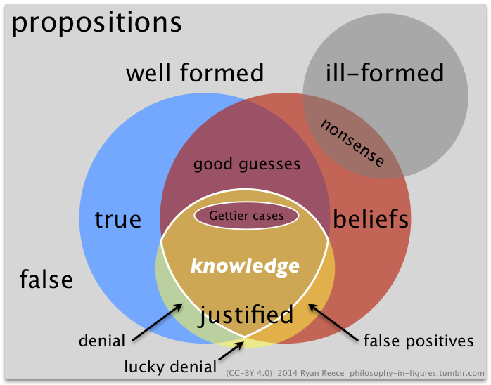

The Scientific Method
================================================================================

This outline discusses the definition of the scientific method,
its central role in founding a scientific epistemology,
demarcating science from pseudoscience,
and other *epistemological* topics concerning the methods and
philosophy of science.  The metaphysical implications of science
are discussed in the outline on [scientific realism](scientific-realism.html).

**Contents:**

-   [Issues and Positions](#issues-and-positions)
    1.  [Skepticism](#skepticism)
    1.  [Empiricism](#empiricism)
    1.  [Is there a universal scientific method?](#is-there-a-universal-scientific-method)
    1.  [Scientific Realism](#scientific-realism)
    1.  [Scientific Knowledge](#scientific-knowledge)
    1.  [Pseudoscience](#Pseudoscience)
    1.  [Naturalism](#naturalism)
    1.  [Reductionism](#reductionism)
    1.  [Monism](#monism)
    1.  [Abduction](#abduction)
    1.  [Statistical Measurement](#statistical-measurement)
    1.  [Scientism](#scientism)
-   [My Thoughts](#my-thoughts)
-   [Annotated Bibliography](#annotated-bibliography)
    1.  [More articles to do](#more-articles-to-do)
-   [Links and Encyclopedia Articles](#links-and-encyclopedia-articles)
-   [References](#fn1)

Issues and Positions
--------------------------------------------------------------------------------

### Skepticism

Lorem ipsum dolor sit amet, consectetur adipisicing elit, sed do eiusmod tempor
incididunt ut labore et dolore magna aliqua. Ut enim ad minim veniam, quis
nostrud exercitation ullamco laboris nisi ut aliquip ex ea commodo consequat.
Duis aute irure dolor in reprehenderit in voluptate velit esse cillum dolore
eu fugiat nulla pariatur. Excepteur sint occaecat cupidatat non proident,
sunt in culpa qui officia deserunt mollit anim id est laborum.

1.  blah
2.  blah

### Empiricism

TODO.

### Is there a universal scientific method?

TODO.

### Scientific Realism

TODO.

Unless we have a collective conspiracy,
probablistically justifying assumptions of uniformity.

See the outline on [scientific realism](scientific-realism.html).

### Scientific Knowledge

JTB-G.  Systematic uncertanties.  Gettier cases.

TODO.

### Pseudoscience

TODO.

### Naturalism

TODO.

See the outline on [Naturalism](naturalism.html).

### Reductionism

TODO.

### Monism

TODO.

### Abduction

Natural kinds.  TODO.

### Statistical Measurement

TODO.

### Scientism

Lorem ipsum dolor sit amet, consectetur adipisicing elit, sed do eiusmod tempor
incididunt ut labore et dolore magna aliqua. Ut enim ad minim veniam, quis
nostrud exercitation ullamco laboris nisi ut aliquip ex ea commodo consequat.
Duis aute irure dolor in reprehenderit in voluptate velit esse cillum dolore
eu fugiat nulla pariatur. Excepteur sint occaecat cupidatat non proident,
sunt in culpa qui officia deserunt mollit anim id est laborum.

My Thoughts
--------------------------------------------------------------------------------

Lorem ipsum dolor sit amet, consectetur adipisicing elit, sed do eiusmod tempor
incididunt ut labore et dolore magna aliqua. Ut enim ad minim veniam, quis
nostrud exercitation ullamco laboris nisi ut aliquip ex ea commodo consequat.
Duis aute irure dolor in reprehenderit in voluptate velit esse cillum dolore
eu fugiat nulla pariatur. Excepteur sint occaecat cupidatat non proident,
sunt in culpa qui officia deserunt mollit anim id est laborum.

Annotated Bibliography
--------------------------------------------------------------------------------

### Hume, D. (1748). An Enquiry Concerning Human Understanding.

-   TODO.

#### My thoughts

-   TODO.

### Sellars, W. (1963). Empircism and Philosophy of Mind.

-   TODO.

#### My thoughts

-   TODO.

### Quine, W.V.O. (1969). Epistemology Naturalized.

-   TODO.

#### My thoughts

-   TODO.

### Pigliucci, M. (2010). Nonsense on Stilts - How to Tell Science From Bunk.

TODO.

#### My thoughts

-   TODO.

--------------------------------------------------------------------------------

### More articles to do

-   TODO.

Links and Encyclopedia Articles
--------------------------------------------------------------------------------

SEP

-   [Francis Bacon](http://plato.stanford.edu/entries/francis-bacon/)
-   [Science and Pseudo-Science](http://plato.stanford.edu/entries/pseudo-science/)
-   [Popper](http://plato.stanford.edu/entries/popper/)

IEP

-   [Contemporary Metaphilosophy](http://www.iep.utm.edu/con-meta/)
-   [Hume](http://www.iep.utm.edu/hume-cau/)
-   [Reductionism](http://www.iep.utm.edu/red-ism/)
-   [William of Ockham (Occam, 1280-1349 CE)](http://www.iep.utm.edu/ockham/)

  [^Carnap-1950]:       Carnap, R. (1950). Empiricism, Semantics, and Ontology.
  [^Carnap-1955]:       Carnap, R. (1955). The Logical Foundations of the Unity of Science.
  [^van-Frassen-1980]:  van Frassen, B. (1980). Arguments Concerning Scientific Realism.
  [^Putnam-1981]:       Putnam, H. (1981). Reason, Truth, and History.

