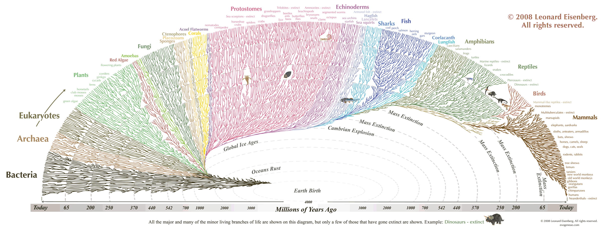

The scientific method
================================================================================

This outline discusses the history of science, 
the definition of the scientific method,
its central role in founding a scientific epistemology,
the demarcation of science from pseudoscience,
and other *epistemological* topics concerning the methods
and philosophy of science. 
The metaphysical implications of science
are discussed in the [Outline on scientific realism](scientific-realism.html).

<!-- PAGETOC -->

Issues and positions
--------------------------------------------------------------------------------

### History of science

In this first section, we briefly outline chronologically highlights in
the development of science, after which there are sections focusing on topics
in the epistemology of science,
starting with [rationalism vs empiricism](#rationalism-vs-empiricism).

](img/timeline-of-major-philosophers-since-1200.png){#fig:timeline-of-major-philosophers-since-1200}

#### Antiquity

-   [Ionian Enlightenment](https://en.wikipedia.org/wiki/Ionian_Enlightenment)
-   [Thales of Miletus (c. 624/623-548/545 BCE)](https://en.wikipedia.org/wiki/Thales_of_Miletus)
-   [Pythagoras (570-495 BCE)](https://en.wikipedia.org/wiki/Pythagoras)
    -   first philosopher
    -   radical mathematical realist
-   [Mozi (470-391 BCE)](http://en.wikipedia.org/wiki/Mozi)
    -   Chinese, not part of the Ionian Enlightenment, but contemporary with it
    -   skepticism, anti-dogmatism
-   [Democritus (460-370 BCE)](http://en.wikipedia.org/wiki/Democritus)
    -   atomic theory
-   [Plato (428/7 or 424/3 - 348/7 BCE)](https://en.wikipedia.org/wiki/Plato)
    -   revolutionized western thought
    -   epistemology
    -   abstract Platonism
    -   [Platonic Academy (387 BCE - 529 CE)](https://en.wikipedia.org/wiki/Platonic_Academy) from which we derive academia 
-   [Aristotle (384-322 BCE)](http://en.wikipedia.org/wiki/Aristotle)
    -   teleological: things have "natural" purposes or tendencies 
-   [Epicurus (341-270 BCE)](https://en.wikipedia.org/wiki/Epicurus)
    -   Emphasized skepticism until something can be demonstrated 
    -   Principle of Multiple Explanations: "if several theories are consistent with the observed data, retain them all"
-   [Aristarchus of Samos (310-230 BCE)](http://en.wikipedia.org/wiki/Aristarchus_of_Samos)
-   [Euclid (fl. 300 BCE)](http://en.wikipedia.org/wiki/Euclid)
    -    logico-deductive method founded by Euclid's *Elements*
-   [Archimedes (c. 287 - c. 212) BCE](https://en.wikipedia.org/wiki/Archimedes)
-   [Eratosthenes (276-195/194 BCE)](http://en.wikipedia.org/wiki/Eratosthenes)
    -   Estimated the circumference of the Earth to be 50 times the distance between Alexandria and Syene,
        which was pretty acurate as it is actually 47.9 times! [^Weinberg2015p76]
-   [Lucretius (99-55 BCE)](http://en.wikipedia.org/wiki/Lucretius)

Weinberg:

>   Like modern scientists, these early Greeks were willing to look beneath
>   the surface appearance of the world, pursuing knowledge about a deeper
>   level of reality. The matter of the world does not appear at first glance
>   as if it is all made of water, or air, or earth, or fire, or all four
>   together, or even atoms. [^Weinberg2015p7]

>   Nevertheless, I think one should not overemphasize the modern aspects
>   of Archaic or Greek science. There is an important feature of modern
>   science that is almost completely missing in all the thinkers I have
>   mentioned, from Thales to Plato: none of them attempted to verify or
>   even (aside perhaps from Zeno) seriously to justify their speculations.
>   In reading their writings, one continually wants to ask, "How do you know?"
>   This is just as true of Democritus as of others. Nowhere in the fragments
>   of his books that survive do we see any effort to show that matter
>   really is composed of atoms. [^Weinberg2015p11]

>   This did not occur to the early Greeks, or to many of their successors,
>   for a very simple reason: *they had never seen it done*. [^Weinberg2015p13]

-   TODO: on removing Aristotle's teleology from physics.
-   Review of *To Explain the World* [^Davis2015]

[^Davis2015]: @Davis_2015_To_Explain_the_World_review\.
[^Weinberg2015p7]: @Weinberg_2015_To_Explain_The_World_The_discovery_of_modern\, p. 7.
[^Weinberg2015p11]: @Weinberg_2015_To_Explain_The_World_The_discovery_of_modern\, p. 11.
[^Weinberg2015p13]: @Weinberg_2015_To_Explain_The_World_The_discovery_of_modern\, p. 13.
[^Weinberg2015p76]: @Weinberg_2015_To_Explain_The_World_The_discovery_of_modern\, p. 76.

#### The Middle Ages

-   [Islamic Golden Age](https://en.wikipedia.org/wiki/Islamic_Golden_Age)
-   [Academy of Gondishapur](https://en.wikipedia.org/wiki/Academy_of_Gondishapur)
    -   in what is now Khuzestan Province, Iran
-   [House of Wisdom](https://en.wikipedia.org/wiki/House_of_Wisdom)
    -   in Abbasid-era Baghdad, Iraq
-   [Ibn Sina (980-1037)](https://en.wikipedia.org/wiki/Avicenna) AKA "Avicenna"
-   [Ibn al-Haytham (965-1040)](http://en.wikipedia.org/wiki/Alhazen) AKA "Alhazen"
    -   *Book of Optics*
    -   intromission over extramission theories of vision
    -   *Doubts Concerning Ptolemy*
    -   "But for a man to imagine a circle in the heavens, and to imagine the planet moving in it does not bring about the planet's motion... And therefore the arrangements assumed by Ptolemy for the five planets are false, and he asserted them knowing them to be false, and there exists for the planets a true arrangement in existing bodies which Ptolemy failed to grasp." [^Sabra1978]
-   [Scholasticism](http://en.wikipedia.org/wiki/Scholasticism)
-   [Bacon, Roger (1214-1292)](http://en.wikipedia.org/wiki/Roger_Bacon)
-   [Ockham, William of (1287-1347)](http://en.wikipedia.org/wiki/William_of_Ockham)
    -   Ockham's razor as a hint at parsimony and abduction

#### Early Modern Period

-   [Renaissance](https://en.wikipedia.org/wiki/Renaissance)
-   [da Vinci, Leonardo (1452-1519)](https://en.wikipedia.org/wiki/Leonardo_da_Vinci)
-   [Copernicus, Nicolaus (1473-1543)](http://en.wikipedia.org/wiki/Copernicus)
-   [Tycho Brahe (1546-1601)](https://en.wikipedia.org/wiki/Tycho_Brahe)
-   [Bacon, Francis (1561-1626)](http://en.wikipedia.org/wiki/Francis_Bacon)
    -   [Dyson quoting Francis Bacon](https://www.edge.org/conversation/freeman_dyson-progress-in-religion)
    -   [Oxford Essential Quotations: Francis Bacon](https://www.oxfordreference.com/view/10.1093/acref/9780191843730.001.0001/q-oro-ed5-00000644)
    -   "God forbid that we should give out a dream of our own imagination for a pattern of the world."
        -   *The Great Instauration* (1620) tr. J. Spedding
    -   "The subtlety of nature is greater many times over than the subtlety of the senses and understanding."
        -   *Novum Organum* (1620) bk. 1, Aphorism 10 (tr. J. Spedding)
    -   "Read not to contradict and confute, nor to believe and take for granted, nor to find talk and discourse, but to weigh and consider."
        -   *Essays* (1625) "Of Studies"
-   [Galileo Galilei (1564-1642)](http://en.wikipedia.org/wiki/Galileo_Galilei)
-   [Johannes Kepler (1571-1630)](https://en.wikipedia.org/wiki/Johannes_Kepler)
-   [Hobbes, Thomas (1588-1679)](http://en.wikipedia.org/wiki/Thomas_Hobbes)
-   [Gassendi, Pierre (1592-1655)](http://en.wikipedia.org/wiki/Pierre_Gassendi)
-   [Descartes, Ren&eacute; (1596-1650)](http://en.wikipedia.org/wiki/Ren%C3%A9_Descartes)
    -   No teleology. Matter plenum, vorticies.
    -   *Meditations on First Philosophy* (1641) [^Descartes2008]

#### The Age of Enlightenment

-   [The Age of Enlightenment](http://en.wikipedia.org/wiki/Age_of_Enlightenment)
-   [Boyle, Robert (1627-1691)](http://en.wikipedia.org/wiki/Robert_Boyle)
-   [Barrow, Isaac (1630-1677)](https://en.wikipedia.org/wiki/Isaac_Barrow)
-   [Locke, John (1632-1704)](http://en.wikipedia.org/wiki/John_Locke)
    -   corpuscules
-   [Spinoza, Baruch (1632-1677)](http://en.wikipedia.org/wiki/Baruch_Spinoza)
-   [Hooke, Robert (1635-1703)](https://en.wikipedia.org/wiki/Robert_Hooke)
-   [Newton, Isaac (1642-1727)](http://en.wikipedia.org/wiki/Isaac_Newton)
    -   *The Principia* (1687) [^Newton2016]
-   [Leibniz, Gottfried Wilhelm (1646-1716)](http://en.wikipedia.org/wiki/Gottfried_Leibniz)
-   [Halley, Edmond (1656-1742)](http://en.wikipedia.org/wiki/Edmond_Halley)
-   [Berkeley, George (1685-1753)](https://en.wikipedia.org/wiki/George_Berkeley)
-   [Hume, David (1711-1776)](http://en.wikipedia.org/wiki/David_Hume)
    -   *An Enquiry Concerning Human Understanding* (1748) [^Hume2007]
-   [Kant, Immanuel (1724-1804)](https://en.wikipedia.org/wiki/Immanuel_Kant)
    -   *Critique of Pure Reason* (1781) [^Kant1996]

#### Canonical classical physics

-   [Franklin, Benjamin (1706-1790)](https://en.wikipedia.org/wiki/Benjamin_Franklin)
-   [Euler, Leonhard (1707-1783)](http://en.wikipedia.org/wiki/Euler)
-   [Lagrange, Joseph-Louis (1736-1813)](http://en.wikipedia.org/wiki/Joseph-Louis_Lagrange)
-   [Volta, Alessandro (1745-1827)](https://en.wikipedia.org/wiki/Alessandro_Volta)
-   [Laplace, Pierre-Simon (1749-1827)](https://en.wikipedia.org/wiki/Pierre-Simon_Laplace)
-   [Amp&egrave;re, Andr&eacute;-Marie (1775-1836)](https://en.wikipedia.org/wiki/Andr%C3%A9-Marie_Amp%C3%A8re)
-   [Gauss, Carl Friedrich (1777-1855)](http://en.wikipedia.org/wiki/Gauss)
-   [Poisson, Sim&eacute;on Denis (1781-1840)](https://en.wikipedia.org/wiki/Sim%C3%A9on_Denis_Poisson)
-   [Fraunhofer, Joseph von (1787-1826)](http://en.wikipedia.org/wiki/Joseph_von_Fraunhofer)
-   [Cauchy, Augustin-Louis (1789-1857)](http://en.wikipedia.org/wiki/Augustin-Louis_Cauchy)
-   [Faraday, Michael (1791-1867)](http://en.wikipedia.org/wiki/Michael_Faraday)
-   [Carnot, Nicolas L&eacute;onard Sadi (1796-1832)](https://en.wikipedia.org/wiki/Nicolas_L%C3%A9onard_Sadi_Carnot)
-   [Jacobi, Carl Gustav Jacob (1804-1851)](https://en.wikipedia.org/wiki/Carl_Gustav_Jacob_Jacobi)
-   [Hamilton, William Rowan (1805-1865))](https://en.wikipedia.org/wiki/William_Rowan_Hamilton)
-   [Kelvin, William Thomson (1824-1907)](https://en.wikipedia.org/wiki/William_Thomson,_1st_Baron_Kelvin)
-   [Maxwell, James Clerk (1831-1879)](http://en.wikipedia.org/wiki/James_Clerk_Maxwell)
-   [Gibbs, Josiah Willard (1839-1903)](https://en.wikipedia.org/wiki/Josiah_Willard_Gibbs)
-   [Boltzmann, Ludwig (1844-1906)](https://en.wikipedia.org/wiki/Ludwig_Boltzmann)

#### "Scientists"

-   [Dalton, John (1766-1844)](https://en.wikipedia.org/wiki/John_Dalton)
    -   atomic theory
-   [Somerville, Mary (1780-1872)](https://en.wikipedia.org/wiki/Mary_Somerville)
    -   *On the Connexion of the Physical Sciences* (1834)
-   [Babbage, Charles (1791-1871)](https://en.wikipedia.org/wiki/Charles_Babbage)
-   [Herschel, John (1792-1871)](https://en.wikipedia.org/wiki/John_Herschel)
    -   *Preliminary Discourse* (1831)
-   [Whewell, William (1794-1866)](http://en.wikipedia.org/wiki/William_Whewell)
    -   Coined the term "scientist" (previously natural philosopher)
-   [Mill, John Stuart (1806-1873)](https://en.wikipedia.org/wiki/John_Stuart_Mill)
-   [Pasteur, Louis (1822-1895)](https://en.wikipedia.org/wiki/Louis_Pasteur)
-   [Ladd-Franklin, Christine (1847-1930)](https://en.wikipedia.org/wiki/Christine_Ladd-Franklin)
-   [Discovery of Neptune (1846)](https://en.wikipedia.org/wiki/Discovery_of_Neptune)

#### Biological evolution

-   [Democritus on the historical development of human communities](https://plato.stanford.edu/entries/democritus/)
-   Hume on humans being animals [^Hume2007]
-   [Darwin, Charles (1809-1882)](http://en.wikipedia.org/wiki/Charles_Darwin)
-   [Mendel, Gregor (1822-1884)](https://en.wikipedia.org/wiki/Gregor_Mendel)
-   [Wallace, Alfred Russel (1823-1913)](https://en.wikipedia.org/wiki/Alfred_Russel_Wallace)
-   [Huxley, Thomas Henry (1825-1895)](http://en.wikipedia.org/wiki/Thomas_Henry_Huxley)

. Source:[here](https://visual.ly/community/infographic/science/great-tree-life).](img/great-tree-of-life.png){#fig:great-tree-of-life}

#### Modern physics

-   [Mach, Ernst (1838-1916)](https://en.wikipedia.org/wiki/Ernst_Mach)
-   [Lorentz, Hendrik (1853-1928)](https://en.wikipedia.org/wiki/Hendrik_Lorentz)
-   [Poincar&eacute;, Henri (1854-1912)](https://en.wikipedia.org/wiki/Henri_Poincar%C3%A9)
-   [Planck, Max (1858-1947)](https://en.wikipedia.org/wiki/Max_Planck)
-   [Hilbert, David (1862-1943)](https://en.wikipedia.org/wiki/David_Hilbert)
-   [Curie, Marie (1867-1934)](https://en.wikipedia.org/wiki/Marie_Curie)
-   [Einstein, Albert (1879-1955)](https://en.wikipedia.org/wiki/Albert_Einstein)
-   [Born, Max (1882-1970)](https://en.wikipedia.org/wiki/Max_Born)
-   [Bohr, Niels (1885-1962)](https://en.wikipedia.org/wiki/Niels_Bohr)
-   [Schr&ouml;dinger, Edwin (1887-1961)](https://en.wikipedia.org/wiki/Erwin_Schr%C3%B6dinger)
-   [de Broglie, Louis (1892-1987)](https://en.wikipedia.org/wiki/Louis_de_Broglie)
-   [Pauli, Wolfgang (1900-1958)](https://en.wikipedia.org/wiki/Wolfgang_Pauli)
-   [Heisenberg, Werner (1901-1976)](https://en.wikipedia.org/wiki/Werner_Heisenberg)
-   [Jordan, Pascual (1902-1980)](https://en.wikipedia.org/wiki/Pascual_Jordan)
-   [Dirac, Paul (1902-1984)](https://en.wikipedia.org/wiki/Paul_Dirac)
-   [von Neumann, John (1903-1957)](https://en.wikipedia.org/wiki/John_von_Neumann)
-   ...

#### Modern statistics

-   [Pearson, Karl (1857-1936)](https://en.wikipedia.org/wiki/Karl_Pearson)
-   [Fisher, Ronald (1890-1962)](https://en.wikipedia.org/wiki/Ronald_Fisher)
-   [Jeffreys, Harold (1891-1989)](https://en.wikipedia.org/wiki/Harold_Jeffreys)
-   [Neyman, Jerzy (1894-1981)](https://en.wikipedia.org/wiki/Jerzy_Neyman)
-   [Pearson, Egon (1895-1980)](https://en.wikipedia.org/wiki/Egon_Pearson)

[^Descartes2008]: @Descartes_2008_Meditations_on_First_Philosophy\.
[^Hume2007]: @Hume_2007_An_Enquiry_Concerning_Human_Understanding\.
[^Sabra1978]: @Sabra_1978_An_eleventh_century_refutation_of_Ptolemys\, p. 121--2.

### Rationalism vs empiricism

-   Early modern philosophy, coming out of scholasticism
-   Debates over the foundations of epistemology
-   *a priori* vs *a posteriori*
-   Skepticism
-   Lead to the Age of Enlightenment
-   Development of calculus

#### Early empiricists

-   Francis Bacon (1561-1626)
-   Thomas Hobbes (1588-1679)

#### Rationalists

-   Ren&eacute; Descartes (1596-1650)
-   Baruch Spinoza (1632-1677)
-   Gottfried Wilhelm Leibniz (1646-1716)

#### British empiricists

-   John Locke (1632-1704)
-   George Berkeley (1685-1753)
-   David Hume (1711-1776)

](img/mandik-2016-11-1-eyeballs.jpg){#fig:mandik-2016-11-1-eyeballs}

#### Important synthesizers

-   Isaac Newton (1642-1727)
    -   *The Principia* (1687) [^Newton2016]
-   Immanuel Kant (1724-1804)
    -   *Critique of Pure Reason* (1781) [^Kant1996]

[^Kant1996]: @Kant_1996_Critique_of_Pure_Reason\. 
[^Newton2016]: @Newton_2016_The_Principia_Mathematical_Principles_of_Natural\.

### Analytic/synthetic distinction

-   Locke
    -   *An Essay Concerning Human Understanding* (1689)
-   Kant

Kant in his *Critique of Pure Reason* (1781):

>   In all judgments in which we think the relation of a subject to the predicate...
>   this relation is possible in two ways. Either the predicate B belongs to the
>   subject A as something that is (covertly) contained in this concept A;
>   or B, though connected with concept A, lies quite outside it.
>   In the first case I call the judgment _analytic_; in the second, _synthetic_.
>   Hence (affirmative) analytic judgments are those in which the predicate's
>   connection with the subject is thought by [thinking] identity, whereas those
>   judgments in which this connection is thought without [thinking] identity are
>   to be called synthetic. Analytic judgments could also be called _elucidatory_.
>   For they do not through the predicate add anything to the concept of the subject;
>   rather, they only dissect the concept, breaking it up into its component concepts
>   which had already been thought in it (although thought confusedly).
>   Synthetic judgments, on the other hand, could also be called _expansive_.
>   For they do add to the concept of the subject a predicate that had not been
>   thought in that concept at all and could not have been extracted from it
>   by any dissection. [^Kant1996pB10]

-   Carnap: "Empiricism semantics and ontology" [^Carnap1950a]
-   Quine: "Two dogmas of empiricism" [^Quine1951]
-   Carnap vs Quine [^Quine1990]
-   Gillian Russell [^Russell2008]
-   Cory Juhl [^Juhl2009]

de Swart:

>   Sometimes one speaks of logically necessary truths instead of analytic truths
>   and of logically contingent truths instead of synthetic truths,
>   to be distinguished from physically necessary truths (truths which physically
>   could not be otherwise, true in all physically possible worlds). The
>   distinction between necessary and contingent truth is a metaphysical one,
>   to be distinguished from the epistemological distinction
>   between a priori and a posteriori truths. Although
>   these---the metaphysical and the epistemological---are certainly different
>   distinctions, it was controversial whether they coincide in extension,
>   that is, whether all and only necessary truths are a priori and all and only
>   contingent truths are a posteriori. [^deSwart2018p141]

TODO: 2x2 figure *a priori--a posteriori* vs analytic--synthetic.

[^Carnap1950a]: @Carnap_1950_Empiricism_semantics_and_ontology\.
[^deSwart2018p141]: @deSwart_2018_Philosophical_and_Mathematical_Logic\, p. 141--2.
[^Kant1996pB10]: @Kant_1996_Critique_of_Pure_Reason\, p. A6--7, B10--11\.
[^Quine1951]: @Quine_1951_Two_dogmas_of_empiricism\.
[^Quine1990]: @Quine_1990_Dear_Carnap_Dear_van_The_Quine_Carnap\.
[^Juhl2009]: @Juhl_2009_Analyticity\.
[^Russell2008]: @Russell_2008_Truth_in_Virtue_of_Meaning_A_defence\.

### Induction

#### Problem of induction

-   How do we infer universals from particulars?

Sextus Empiricus:

>   When they propose to establish the universal from the particulars by means of induction, 
>   they will effect this by a review of either all or some of the particulars. 
>   But if they review some, the induction will be insecure, since some of the 
>   particulars omitted in the induction may contravene the universal; 
>   while if they are to review all, they will be toiling at the impossible, 
>   since the particulars are infinite and indefinite. [^SextusEmpiricus]

-   Hume and the problem of induction [^Hume2007pX]
    -   Uniformity of nature
    -   Humeanism
    -   Weintraub [^Weintraub1995]
-   Russell's inductive turkey
    -   TODO: find Russell ref
    -   Note discussion by French

[^Hume2007pX]: @Hume_2007_An_Enquiry_Concerning_Human_Understanding\, p. X.
[^SextusEmpiricus]: @Sextus_1933_Outlines_of_Pyrrhonism\, p. 283.
[^Weintraub1995]: @Weintraub_1995_What_was_Humes_contribution_to_the_problem\.

#### Inductive logic

Newton:

>   In experimental philosophy, propositions gathered from phenomena by induction
>   should be considered exactly or very nearly true not withstanding any contrary
>   hypothesis, until yet other phenomena make such propositions either more exact
>   or liable to exceptions. [^NewtonpX]

-   Mill
    -   *A System of Logic* (1843) [^Mill1843]
-   Peirce

Vickers:

>   [I]n Peirce's phrase, inductions are _ampliative_. Induction can amplify and
>   generalize our experience, broaden and deepen our empirical knowledge.
>   Deduction on the other hand is explicative. Deduction orders and
>   rearranges our knowledge without adding to its content. [^Vickers2014]

Peirce on _merely_ the denial of any major failures of induction
and the wonderful self-correcting nature of ampliative inference:

Peirce:

>   I maintain that it has been shown that the modes of inference in question are
>   necessarily valid, whatever the constitution of the universe, so long as it
>   admits of the premises being true.
>   Yet I am willing to concede, in order to concede as much as possible,
>   that when a man draws instances at random, all that he knows is that he
>   _tries_ to follow a certain precept; so that the sampling process might be
>   rendered generally fallacious by the existence of a mysterious and malign
>   connection between the mind and the universe, such that the possession by an
>   object of an _unperceived_ character might influence the will toward choosing
>   it or rejecting it. Such a circumstance would, however, be as fatal to
>   deductive as to ampliative inference. Suppose, for example, that I were
>   to enter a great hall where people were playing _rouge et noir_ at many tables;
>   and suppose that I knew that the red and black were turned up with equal
>   frequency. Then, if I were to make a large number of mental bets with myself,
>   at this table and at that, I might, by statistical deduction, expect to win
>   about half of them, ---precisely as I might expect, from the results of these
>   samples, to infer by induction the probable ratio of frequency of the
>   turnings of red and black in the long run, if I did not know it.
>   But could some devil look at each card before it was turned, and then
>   influence me mentally to bet upon it or to refrain therefrom, the observed
>   ratio in the cases upon which I had bet might be quite different from the
>   observed ratio in those cases upon which I had not bet. I grant, then,
>   that even upon my theory some fact has to be supposed to make induction
>   and hypothesis valid processes; namely, it is supposed that the supernal powers
>   withhold their hands and let me alone, and that no mysterious uniformity or
>   adaptation interferes with the action of chance. But then this negative
>   fact supposed by my theory plays a totally different part from the facts
>   supposed to be requisite by the logicians of whom I have been speaking.
>   So far as facts like those they suppose can have any bearing,
>   they serve as major premises from which the fact inferred by induction or 
>   hypothesis might be deduced; while the negative fact supposed by me is
>   merely the denial of any major premise from which the falsity of the
>   inductive or hypothetic conclusion could in general be deduced.
>   Nor is it necessary to deny altogether the existence of mysterious
>   influences adverse to the validity of the inductive and hypothetic processes.
>   So long as their influence were not too over whelming, the wonderful
>   self-correcting nature of the ampliative inference would enable us,
>   even if they did exist, to detect and make allowance for them. [^Peirce1883p176]

Dewey:

>   The methods by which generalizations are arrived at have received the
>   name "induction"; the methods by which already existing generalizations
>   are employed have received the name "deduction." [^Dewey1938p419]

-   Reichenbach [^Reichenbach1938]
-   Carnap
    -   "On inductive logic" [^Carnap1945a]
    -   *Logical Foundations of Probability* [^Carnap1950b]
    -   *The Continuum of Inductive Methods* [^Carnap1952]
    -   "The aim of inductive logic" [^Carnap1966]
    -   "Notes on probability and induction" [^Carnap1973]

[^Carnap1945a]: @Carnap_1945_On_inductive_logic\.
[^Carnap1950b]: @Carnap_1950_Logical_Foundations_of_Probability\.
[^Carnap1952]: @Carnap_1952_The_Continuum_of_Inductive_Methods\.
[^Carnap1966]: @Carnap_1966_The_aim_of_inductive_logic\.
[^Carnap1973]: @Carnap_1973_Notes_on_probability_and_induction\.
[^Dewey1938p419]: @Dewey_1938_Logic_The_Theory_of_Inquiry\, p. 419.
[^Mill1843]: @Mill_1843_A_System_of_Logic\.
[^Peirce1883p176]: @Peirce_1883_Studies_in_Logic\, p. 176--7.
[^Reichenbach1938]: @Reichenbach_1938_Experience_and_Prediction and
    @Reichenbach_1940_On_the_justification_of_induction\.
[^Vickers2014]: @Vickers_2014_The_problem_of_induction (emphasis added).

#### Abduction

-   Peirce
-   Douven [^Douven2011]
-   Ockham, parsimony
-   Karl Popper
-   Inference to the best explanation 
-   Quine: Natural kinds, abstraction
-   Bhaskar
-   Convergence

Wikipedia:

>    R. Bhaskar also offers a practical solution to the problem. He argues that the problem of induction only arises if we deny the possibility of a reason for the predicate, located in the enduring nature of something. For example, we know that all emeralds are green, not because we have only ever seen green emeralds, but because the chemical make-up of emeralds insists that they must be green. If we were to change that structure, they would not be green. For instance, emeralds are a kind of green beryl, made green by trace amounts of chromium and sometimes vanadium. Without these trace elements, the gems would be colourless. [^Bhaskar2008pX]

Wikipedia:

>   Today abduction remains most commonly understood as induction from characters
>   and extension of a known rule to cover unexplained circumstances. [^WikipediaAbductiveReasoning1]

Peirce:

>   The surprising fact, C, is observed;
>   
>   But if A were true, C would be a matter of course,          
>   Hence, there is reason to suspect that A is true. [^WikipediaAbductiveReasoning2]

-   [Holmesian fallacy](https://rationalwiki.org/wiki/Holmesian_fallacy)

Arthur Conan Doyle:

>   [W]hen you have eliminated the impossible, whatever remains, however improbable,
>   must be the truth.  [^Doyle1890]

[^Bhaskar2008pX]: @Bhaskar_2008_A_Realist_Theory_of_Science\.
[^Douven2011]: @Douven_2011_Abduction\.
[^Doyle1890]: @Doyle_1890_The_Sign_of_the_Four\, ch. 6.
[^WikipediaAbductiveReasoning1]: <https://en.wikipedia.org/wiki/Abductive_reasoning>
[^WikipediaAbductiveReasoning2]: Ibid.

#### Statistics as a solution to the problem of induction

-   Weisberg [^Weisberg2019appD] - nope
-   Salmon [^Salmon1963]
-   Good [^Good1988]
-   Hacking [^Hacking2001]
-   Huber [^Huber2007]
-   See also:
    -   [Outline of philosophy of statistics](statistics.html#problem-of-induction)
    -   Note the further discussion of Humeanism and laws of nature in
        the [Outline on scientific realism](scientific-realism.html#humeanism).

[^Hacking2001]: @Hacking_2001_An_Introduction_to_Probability_and_Inductive_Logic\.
[^Huber2007]: @Huber_2007_Confirmation_and_induction\.
[^Good1988]: @Good_1988_The_interface_between_statistics_and_philosophy\.
[^Salmon1963]: @Salmon_1963_On_vindicating_induction\,
    @Salmon_1966_The_Foundations_of_Scientific_Inference\,
    @Salmon_1967_Carnaps_inductive_logic\,
    @Salmon_1991_Hans_Reichenbachs_vindication_of_induction\.
[^Weisberg2019appD]: @Weisberg_2019_Odds__Ends_Introducing_Probability__Decision\, Appendix D\.

### Models in science

French:

>   [S]cientist *don't* simply deduce experimental/observational consequences;
>   they construct models that 'mediate' between theories and the observations.
>   There are a number of reasons why scientists will proceed in this way
>   but one is that theories are often quite complex and difficult to work with.
>   So a scientist may build a simplified model, containing significant
>   idealizations that allow the scientist to ignore certain factors,
>   for example, and [more] easily relate the theory to observations. [^French2007p81]

Model the theory:

$$ T(\theta_k, \psi_m) \longrightarrow M(X_i | \theta_k, \nu_\ell) $$

Fit the model to the data to make inferences on the theory:

$$
    \{X_i\}_j
    \longrightarrow M(X_{ij} | \theta_k, \nu_\ell)
    \longrightarrow \hat{\theta}_k \pm \sigma_{\hat{\theta}_k} , \hat{\nu}_\ell \pm \sigma_{\hat{\nu}_\ell}
    \longrightarrow T(\hat{\theta}_k \pm \sigma_{\hat{\theta}_k}, \psi_m)
$$

Frigg:

>   Morgan and Morrison (1999) rally around the idea that models are instruments
>   that mediate between theories and the world. Models are "autonomous agents"
>   in that they are independent from both theories and their target systems,
>   and it is this independence that allows them to mediate between the two.
>   Theories do not provide us with algorithms for the construction of a model;
>   they are not "vending machines" into which one can insert a problem and a
>   model pops out (Cartwright 1999). The construction of a model often requires
>   detailed knowledge about materials, approximation schemes, and the setup,
>   and these are not provided by the corresponding theory. Furthermore,
>   the inner workings of a model are often driven by a number of different
>   theories working cooperatively. In contemporary climate modeling,
>   for instance, elements of different theories---among them fluid dynamics,
>   thermodynamics, electromagnetism---are put to work cooperatively.
>   What delivers the results is not the stringent application of one theory,
>   but the voices of different theories when put to use in chorus with each
>   other in one model. [^Frigg2020]

-   "Surrogative Reasoning Condition" [^Frigg2017]
-   ["What is the difference between a model and a theory?"](https://physics.stackexchange.com/questions/187967/what-is-the-difference-between-a-model-and-a-theory) - physics.stackexchange.com
-   "A comparison of the meaning and uses of models in mathematics and the empirical sciences" [^Suppes1961]
-   "What is a scientific theory?" [^Suppes1967]
-   *Models as Mediators* [^Morgan1999]

[^French2007p81]: @French_2007_Science_Key_Concepts_in_Philosophy\, p. 81.
[^Frigg2017]: @Frigg_2017_Models_and_representation\.
[^Frigg2020]: @Frigg_2020_Models_in_science\.
[^Morgan1999]: @Morgan_1999_Models_as_Mediators\.
[^Suppes1961]: @Suppes_1961_A_comparison_of_the_meaning_and_uses_of_models\.
[^Suppes1967]: @Suppes_1967_What_is_a_scientific_theory\.

### Is there a universal scientific method?

#### First pass

Feynman:

>   [S]cience is a method of finding things out. This method is based on
>   the principle that observation is the judge of whether something is
>   so or not. All other aspects and characteristics of science can be
>   understood directly when we understand that observation is the ultimate
>   and final judge of the truth of an idea...
>   That is the principle of science. If there is an exception to any rule,
>   and it can be proved by observation, that rule is wrong. [^Feynman1998p15]

Feynman:

>   There are in science a number of technical consequences that follow from
>   the principle of observation as judge. For example, the observation
>   cannot be rough. You have to be very careful. There may have been a
>   piece of dirt in the apparatus that made the color change; it was not
>   what you thought. You have to check the observations very carefully,
>   and then recheck them, to be sure that you understand what all the
>   conditions are and that you did not misinterpret what you did. [^Feynman1998p17]

[^Feynman1998p15]: @Feynman_1998_The_Meaning_of_It_All\, p. 15--16.
[^Feynman1998p17]: @Feynman_1998_The_Meaning_of_It_All\, p. 17.

#### Models of science

-   Hypothetico-deductive model
-   Positivism, verificationism
    -   Auguste Comte, Ernst Mach, David Hilbert, Rudolf Carnap
-   Deductive-nomological model
    -   Hempel, C.G. & Oppenheim, P. (1948): "Studies in the logic of explanation" [^Hempel1948]
    -   Covering law model
    -   Logical empiricism
-   Falsification, deductivism
    -   Karl Popper
    -   *The Logic of Scientific Discovery* [^Popper1959]
-   Pragmatic model
    -   C.S. Peirce
-   Normal vs revolutionary science
    -   Thomas Kuhn
    -   *The Structure of Scientific Revolutions* [^Kuhn1962]
-   Distinction between [exploratory data analysis](https://en.wikipedia.org/wiki/Exploratory_data_analysis)
    and [confirmatory data analysis](https://en.wikipedia.org/wiki/Confirmatory_data_analysis)
    -   [Tukey, John (1915-2000)](https://en.wikipedia.org/wiki/John_Tukey)
    -   See the [Outline of philosophy of statistics](http://rreece.github.io/outline-of-philosophy/statistics.html#exploratory-data-analysis)
-   Error-catching filters
    -   Ladyman: Error-catching filters [^Ladyman2007]
    -   community, honesty, openness
    -   Mayo: Error statistics [^Mayo2011]
-   Not a seven-step program
    -   Evidence based, anti-conspiracy, parsimony
    -   Madsen, M.E. (2017). [The real core of the scientific method and why we should trust it](http://notebook.madsenlab.org/essays/2017/06/23/core-scientific-method.html).
    -   Scientism
    -   See the [Outline on naturalism](http://rreece.github.io/outline-of-philosophy/naturalism.html)

[^Hempel1948]: @Hempel_1948_Studies_in_the_logic_of_explanation\.
[^Kuhn1962]: @Kuhn_1962_The_Structure_of_Scientific_Revolutions\.
[^Ladyman2007]: @Ladyman_2007_Every_Thing_Must_Go_Metaphysics_Naturalised\.
[^Mayo2011]: @Mayo_2011_Error_statistics\.
[^NewtonpX]: @Newton_2016_The_Principia_Mathematical_Principles_of_Natural\, p. TODO.
[^Popper1959]: @Popper_1959_The_Logic_of_Scientific_Discovery\.

### Scientific knowledge and realism

-   Knowledge = JTB-G. Plato.
-   Systematic uncertainties.  Failed justification.
-   Gettier cases.
-   Feynman

Feynman:

>   All scientific knowledge is uncertain...
>   [W]hat we call scientific knowledge today is a body of statements of
>   varying degrees of certainty. Some of them are most unsure. Some of
>   them nearly sure; but none of them is certain. [^Feynman1998p26]

-   Hume on the problem of induction and the uniformity of nature.
-   Uniformitarianism: Unless we have a collective and/or non-local conspiracies,
    we can probablistically justify assumptions of uniformity.
-   Ontological implications of science.
-   Sean Carroll on scientific epistemology: [debate with Hans Halvorson](https://www.youtube.com/watch?v=H864JH1tPYU#t=3930)
-   See the [Outline on scientific realism](scientific-realism.html).

).](img/knowledge.png){#fig:knowledge-jtb-g}

The stopped clock from Russell's *Human Knowledge: Its Scope and Limits*

Russell:

>   You're walking by a clock that you've always known
>   to be accurate in the past. You glance up at it and see that it reads
>   five o'clock; on the basis of this you believe that it's five o'clock.
>   Your belief is justified, and as it happens it is five o'clock.
>   But unbeknownst to you, the clock stopped exactly twelve hours ago. [^Russell2009]

[^Feynman1998p26]: @Feynman_1998_The_Meaning_of_It_All\, p. 26--27.
[^Russell2009]: @Russell_2009_Human_Knowledge_Its_Scope_and_Limits\.

### Naturalism, monism, and reductionism

-   Hume on the problem of induction and the uniformity of nature, again
-   Monism
-   Parmenides
-   Reductionism
-   See the [Outline on naturalism](naturalism.html).

### Pseudoscience

-   The demarcation problem
-   Bad justification
-   [James Ladyman on Pseudoscience and Bullshit](https://www.youtube.com/watch?v=32ZaTKa2IRg)

My thoughts
--------------------------------------------------------------------------------

Lorem ipsum dolor sit amet, consectetur adipisicing elit, sed do eiusmod tempor
incididunt ut labore et dolore magna aliqua. Ut enim ad minim veniam, quis
nostrud exercitation ullamco laboris nisi ut aliquip ex ea commodo consequat.
Duis aute irure dolor in reprehenderit in voluptate velit esse cillum dolore
eu fugiat nulla pariatur. Excepteur sint occaecat cupidatat non proident,
sunt in culpa qui officia deserunt mollit anim id est laborum.

Annotated bibliography
--------------------------------------------------------------------------------

### Hume, D. (1748). *An Enquiry Concerning Human Understanding*.

-   @Hume_2007_An_Enquiry_Concerning_Human_Understanding

#### 1. Of the different Species of Philosophy

#### 2. Of the Origin of Ideas

#### 3. Of the Association of Ideas

#### 4. Sceptical Doubts concerning the Operations of the Understanding

#### 5. Sceptical Solution of these Doubts

#### 6. Of Probability

#### 7. Of the Idea of necessary Connexion

#### 8. Of Liberty and Necessity

#### 9. Of the Reason of Animals

#### 10. Of Miracles

#### 11. Of a particular Providence and of a future State

#### 12. Of the academical or sceptical Philosophy

#### My thoughts

-   TODO.

--------------------------------------------------------------------------------

### Pigliucci, M. (2010). *Nonsense on Stilts: How to Tell Science From Bunk*.

-   @Pigliucci_2010_Nonsense_on_Stilts_How_to_Tell_Science_From_Bunk

#### My thoughts

-   TODO.

--------------------------------------------------------------------------------

### French, S. (2007). *Science: Key Concepts in Philosophy*.

-   @French_2007_Science_Key_Concepts_in_Philosophy

#### 1. Introduction

>   Do not become archivists of facts. Try to penetrate to the secret of their
>   occurrence, persistently search for the laws which govern them.

-- Ivan Pavlov

>   The important thing in science is not so much to obtain new facts as to
>   discover new ways of thinking about them.

-- W.L. Bragg

TODO:

-   summarize
-   Feynman
-   Giere
-   Darwin
-   Einstein

#### 2. Discovery

-   Eureka moments
    -   Archimedes
    -   Kary Mullis - Nobel Prize 1993 for Polymerase Chain Reaction (PCR)
    -   "Eureka moments" fit well with the "romantic view" of discovery - Kant
    -   "In other words, discovery is ultimately *irrational* and *unanalysable*."
-   Hypothetico-deductive account of discovery
    -   Hypotheses arrived at via creative Eureka moments.
    -   (Make a number of relevant observations.)
    -   Verification via deductive account of observations.
-   Inductive account of discovery
    -   (Hypotheses arrived at via creative Eureka moments.)
    -   Make a number of relevant observations.
    -   Inductively support hypotheses.

#### 3. Heuristics

#### 4. Justification

#### 5. Observation

#### 6. Experiment

#### 7. Realism

#### 8. Anti-realism

#### 9. Independence

#### 10. Gender Bias

#### My thoughts

-   TODO.

--------------------------------------------------------------------------------

### More articles to do

-   TODO.

Links and encyclopedia articles
--------------------------------------------------------------------------------

<a id="link:encyclopedia_articles" class="closed" onclick="toggle_more('encyclopedia_articles')">
Click to show links
</a>

### SEP

-   [Abduction](http://plato.stanford.edu/entries/abduction/)
-   [Analysis of Knowledge](http://plato.stanford.edu/entries/knowledge-analysis/)
-   [Ancient Atomism](https://plato.stanford.edu/entries/atomism-ancient/)
-   [Aristotle's Metaphysics](http://plato.stanford.edu/entries/aristotle-metaphysics/)
-   [Bacon, Francis (1561-1626)](http://plato.stanford.edu/entries/francis-bacon/)
-   [Bayesian Epistemology](https://plato.stanford.edu/entries/epistemology-bayesian/)
-   [Berkeley, George (1685-1753)](http://plato.stanford.edu/entries/berkeley/)
-   [Coherentist Theories of Epistemic Justification](http://plato.stanford.edu/entries/justep-coherence/)
-   [Democritus (460-370 BCE)](http://plato.stanford.edu/entries/democritus/)
-   [Descartes, Ren&eacute; (1596-1650)](http://plato.stanford.edu/entries/descartes/)
-   [Descartes' Epistemology](http://plato.stanford.edu/entries/descartes-epistemology/)
-   [Epistemological Problems of Perception](http://plato.stanford.edu/entries/perception-episprob/)
-   [Epistemological Problems of Testimony](http://plato.stanford.edu/entries/testimony-episprob/)
-   [Epistemology](http://plato.stanford.edu/entries/epistemology/)
-   [Formal Epistemology](https://plato.stanford.edu/entries/formal-epistemology/)
-   [Foundationalist Theories of Epistemic Justification](http://plato.stanford.edu/entries/justep-foundational/)
-   [Galileo Galilei](http://plato.stanford.edu/entries/galileo/)
-   [Gassendi, Pierre (1592-1655)](http://plato.stanford.edu/entries/gassendi/)
-   [Hobbes, Thomas (1588-1679)](http://plato.stanford.edu/entries/hobbes/)
-   [Hume, David (1711-1776)](http://plato.stanford.edu/entries/hume/)
-   [Ibn Sina (980-1037)](https://plato.stanford.edu/entries/ibn-sina/)
-   [Identity of Indiscernibles](http://plato.stanford.edu/entries/identity-indiscernible/)
-   [Induction, The problem of](http://plato.stanford.edu/entries/induction-problem/)
-   [Kant, Immanuel (1724-1804)](http://plato.stanford.edu/entries/kant/)
-   [Kant's account of reason](http://plato.stanford.edu/entries/kant-reason/)
-   [Kant's critique of metaphysics](http://plato.stanford.edu/entries/kant-metaphysics/)
-   [Laws of nature](http://plato.stanford.edu/entries/laws-of-nature/)
-   [Leibniz, Gottfried Wilhelm (1646-1716)](http://plato.stanford.edu/entries/leibniz/)
-   [Leibniz's philosophy of physics](http://plato.stanford.edu/entries/leibniz-physics/)
-   [Leibniz's modal metaphysics](http://plato.stanford.edu/entries/leibniz-modal/)
-   [Locke, John (1632-1704)](http://plato.stanford.edu/entries/locke/)
-   [Locke's philosophy of science](http://plato.stanford.edu/entries/locke-philosophy-science/)
-   [Mach, Ernst (1838-1916)](http://plato.stanford.edu/entries/ernst-mach/)
-   [Measurement in science](https://plato.stanford.edu/entries/measurement-science/)
-   [Mechanisms in science](http://plato.stanford.edu/entries/science-mechanisms/)
-   [Miracles](http://plato.stanford.edu/entries/miracles/)
-   [Naturalized epistemology](http://plato.stanford.edu/entries/epistemology-naturalized/)
-   [Newton, Isaac (1642-1727)](http://plato.stanford.edu/entries/newton/)
-   [Newton's philosophy](http://plato.stanford.edu/entries/newton-philosophy/)
-   [Newton's *Philosophiae Naturalis Principia Mathematica*](http://plato.stanford.edu/entries/newton-principia/)
-   [Ockham, William of (1287-1347)](https://plato.stanford.edu/entries/ockham/)
-   [Parmenides](http://plato.stanford.edu/entries/parmenides/)
-   [Popper, Karl (1902-1994)](http://plato.stanford.edu/entries/popper/)
-   [Presocratic philosophy](https://plato.stanford.edu/entries/presocratics/)
-   [Principle of sufficient reason](http://plato.stanford.edu/entries/sufficient-reason/)
-   [Pythagoras (570-495 BCE)](https://plato.stanford.edu/entries/pythagoras/)
-   [Pythagoreanism](https://plato.stanford.edu/entries/pythagoreanism/)
-   [Rationalism vs. Empircism](http://plato.stanford.edu/entries/rationalism-empiricism/)
-   [Reproducibility of scientific results](https://plato.stanford.edu/entries/scientific-reproducibility/)
-   [Science and pseudo-science](http://plato.stanford.edu/entries/pseudo-science/)
-   [Scientific explanation](http://plato.stanford.edu/entries/scientific-explanation/)
-   [Scientific method](http://plato.stanford.edu/entries/scientific-method/)
-   [Skepticism](http://plato.stanford.edu/entries/skepticism/)
-   [Spinoza, Baruch (1632-1677)](http://plato.stanford.edu/entries/spinoza/)
-   [Statistics, Philosophy of](http://plato.stanford.edu/entries/statistics/)
-   [Thought experiments](http://plato.stanford.edu/entries/thought-experiment/)

### IEP

-   [A priori and a posteriori](https://www.iep.utm.edu/apriori/)
-   [Berkeley, George (1685-1753)](http://www.iep.utm.edu/berkeley/)
-   [Contemporary Metaphilosophy](http://www.iep.utm.edu/con-meta/)
-   [Democritus (460-370 BCE)](http://www.iep.utm.edu/democrit/)
-   [Epistemology](http://www.iep.utm.edu/epistemo/)
-   [Epistemology of Testimony](http://www.iep.utm.edu/ep-testi/)
-   [Explanation, Theories of](http://www.iep.utm.edu/explanat/)
-   [Gettier Problems](http://www.iep.utm.edu/gettier/)
-   [Hempel, Carl Gustav (1905-1997)](http://www.iep.utm.edu/hempel/)
-   [Hume, David (1711-1776)](http://www.iep.utm.edu/hume-cau/)
-   [Ibn Sina (980-1037)](http://www.iep.utm.edu/avicenna/)
-   [Locke, John (1632-1704)](http://www.iep.utm.edu/locke/)
-   [Naturalism](http://www.iep.utm.edu/naturali/)
-   [Naturalistic Epistemology](http://www.iep.utm.edu/nat-epis/)
-   [Parmenides](http://www.iep.utm.edu/parmenid/)
-   [Peirce, Charles Sanders (1839-1914): Logic](http://www.iep.utm.edu/peir-log/)
-   [Popper, Karl (1902-1994) : Philosophy of Science](http://www.iep.utm.edu/pop-sci/)
-   [Plato (428/7 or 424/3 - 348/7 BCE)](http://www.iep.utm.edu/plato/)
-   [Plato's Academy (387 BCE - 529 CE)](http://www.iep.utm.edu/academy/)
-   [Pythagoras (570-495 BCE)](http://www.iep.utm.edu/pythagor/)
-   [Reductionism](http://www.iep.utm.edu/red-ism/)
-   [Safety Condition for Knowledge, The](http://www.iep.utm.edu/safety-c/)
-   [Simplicity in the philosophy of science](http://www.iep.utm.edu/simplici/)
-   [Skepticism, Ancient Greek](http://www.iep.utm.edu/skepanci/)
-   [Skepticism, Contemporary](http://www.iep.utm.edu/skepcont/)
-   [Spinoza, Baruch (1632-1677): Metaphysics](http://www.iep.utm.edu/spinoz-m/)
-   [Thales of Miletus (c. 624/623-548/545 BCE)](https://www.iep.utm.edu/thales/)
-   [William of Ockham (1280-1349)](http://www.iep.utm.edu/ockham/)

### Wikipedia

-   [Abductive reasoning](http://en.wikipedia.org/wiki/Abductive_reasoning)
-   [Academy of Gondishapur](https://en.wikipedia.org/wiki/Academy_of_Gondishapur)
-   [Alhazen AKA Ibn al-Haytham (965-1040)](http://en.wikipedia.org/wiki/Alhazen)
-   [Amp&egrave;re, Andr&eacute;-Marie (1775-1836)](https://en.wikipedia.org/wiki/Andr%C3%A9-Marie_Amp%C3%A8re)
-   [Ancient higher-learning institutions](https://en.wikipedia.org/wiki/Ancient_higher-learning_institutions)
-   [Archimedes (c. 287 - c. 212) BCE](https://en.wikipedia.org/wiki/Archimedes)
-   [Aristarchus of Samos (310-230 BCE)](http://en.wikipedia.org/wiki/Aristarchus_of_Samos)
-   [Aristotle (384-322 BCE)](http://en.wikipedia.org/wiki/Aristotle)
-   [Aumann's agreement theorem](https://en.wikipedia.org/wiki/Aumann%27s_agreement_theorem)
-   [Babbage, Charles (1791-1871)](https://en.wikipedia.org/wiki/Charles_Babbage)
-   [Bacon, Francis (1561-1626)](http://en.wikipedia.org/wiki/Francis_Bacon)
-   [Baconian method](https://en.wikipedia.org/wiki/Baconian_method)
-   [Bacon, Roger (1214-1292)](http://en.wikipedia.org/wiki/Roger_Bacon)
-   [Berkeley, George (1685-1753)](https://en.wikipedia.org/wiki/George_Berkeley)
-   [Bohr, Niels (1885-1962)](https://en.wikipedia.org/wiki/Niels_Bohr)
-   [Boltzmann, Ludwig (1844-1906)](http://en.wikipedia.org/wiki/Ludwig_Boltzmann)
-   [Bootstrapping](http://en.wikipedia.org/wiki/Bootstrapping_(statistics))
-   [Born, Max (1882-1970)](https://en.wikipedia.org/wiki/Max_Born)
-   [Boyle, Robert (1627-1691)](http://en.wikipedia.org/wiki/Robert_Boyle)
-   [Carnot, Nicolas L&eacute;onard Sadi (1796-1832)](https://en.wikipedia.org/wiki/Nicolas_L%C3%A9onard_Sadi_Carnot)
-   [Cartesian doubt](http://en.wikipedia.org/wiki/Cartesian_doubt)
-   [Cauchy, Augustin-Louis (1789-1857)](http://en.wikipedia.org/wiki/Augustin-Louis_Cauchy)
-   [Copernicus, Nicolaus (1473-1543)](http://en.wikipedia.org/wiki/Copernicus)
-   [Copernican Revolution](https://en.wikipedia.org/wiki/Copernican_Revolution)
-   [Cram&#233;r-Rao bound](http://en.wikipedia.org/wiki/Cram%C3%A9r%E2%80%93Rao_bound)
-   [Critical thinking](https://en.wikipedia.org/wiki/Critical_thinking)
-   [Curie, Marie (1867-1934)](https://en.wikipedia.org/wiki/Marie_Curie)
-   [Dalton, John (1766-1844)](https://en.wikipedia.org/wiki/John_Dalton)
-   [Darwin, Charles (1809-1882)](http://en.wikipedia.org/wiki/Charles_Darwin)
-   [da Vinci, Leonardo (1452-1519)](https://en.wikipedia.org/wiki/Leonardo_da_Vinci)
-   [de Broglie, Louis (1892-1987)](https://en.wikipedia.org/wiki/Louis_de_Broglie)
-   [Deductive-nomological model](https://en.wikipedia.org/wiki/Deductive-nomological_model)
-   [Democritus (460-370 BCE)](http://en.wikipedia.org/wiki/Democritus)
-   [Descartes, Ren&eacute; (1596-1650)](http://en.wikipedia.org/wiki/Ren%C3%A9_Descartes)
-   [Dewey, John (1859-1952)](https://en.wikipedia.org/wiki/John_Dewey)
-   [Dirac, Paul (1902-1984)](https://en.wikipedia.org/wiki/Paul_Dirac)
-   [Einstein, Albert (1879-1955)](https://en.wikipedia.org/wiki/Albert_Einstein)
-   [Empircism](http://en.wikipedia.org/wiki/Empiricism)
-   [Epicurus (341-270 BCE)](https://en.wikipedia.org/wiki/Epicurus)
-   [Epistemology](http://en.wikipedia.org/wiki/Epistemology)
-   [Eratosthenes (276-195/194 BCE)](http://en.wikipedia.org/wiki/Eratosthenes)
-   [Euclid (fl. 300 BCE)](http://en.wikipedia.org/wiki/Euclid)
-   [Euler, Leonhard (1707-1783)](http://en.wikipedia.org/wiki/Euler)
-   [Evolution](http://en.wikipedia.org/wiki/Evolution)
-   [Evolution, Introduction to](http://en.wikipedia.org/wiki/Introduction_to_evolution)
-   [Evolution, Outline of](http://en.wikipedia.org/wiki/Outline_of_evolution)
-   [Explanation](https://en.wikipedia.org/wiki/Explanation)
-   [Faraday, Michael (1791-1867)](http://en.wikipedia.org/wiki/Michael_Faraday)
-   [Fisher, Ronald (1890-1962)](https://en.wikipedia.org/wiki/Ronald_Fisher)
-   [Franklin, Benjamin (1706-1790)](https://en.wikipedia.org/wiki/Benjamin_Franklin)
-   [Fraunhofer, Joseph von (1787-1826)](http://en.wikipedia.org/wiki/Joseph_von_Fraunhofer)
-   [Galileo Galilei (1564-1642)](http://en.wikipedia.org/wiki/Galileo_Galilei)
-   [Gassendi, Pierre (1592-1655)](http://en.wikipedia.org/wiki/Pierre_Gassendi)
-   [Gauss, Carl Friedrich (1777-1855)](http://en.wikipedia.org/wiki/Gauss)
-   [Gettier problem](http://en.wikipedia.org/wiki/Gettier_problem)
-   [Halley, Edmond (1656-1742)](http://en.wikipedia.org/wiki/Edmond_Halley)
-   [Hamilton, William Rowan (1805-1865)](http://en.wikipedia.org/wiki/William_Rowan_Hamilton)
-   [Heisenberg, Werner (1901-1976)](https://en.wikipedia.org/wiki/Werner_Heisenberg)
-   [Herschel, John (1792-1871)](https://en.wikipedia.org/wiki/John_Herschel)
-   [Hilbert, David (1862-1943)](https://en.wikipedia.org/wiki/David_Hilbert)
-   [History of science](http://en.wikipedia.org/wiki/History_of_science)
-   [History of the scientific method](http://en.wikipedia.org/wiki/History_of_scientific_method)
-   [Hobbes, Thomas (1588-1679)](http://en.wikipedia.org/wiki/Thomas_Hobbes)
-   [House of Wisdom](https://en.wikipedia.org/wiki/House_of_Wisdom)
-   [Human evolution](http://en.wikipedia.org/wiki/Human_evolution)
-   [Human migrations, Early](http://en.wikipedia.org/wiki/Early_human_migrations)
-   [Hume, David (1711-1776)](http://en.wikipedia.org/wiki/David_Hume)
-   [Hume's fork](http://en.wikipedia.org/wiki/Hume%27s_fork)
-   [Huxley, Thomas Henry (1825-1895)](http://en.wikipedia.org/wiki/Thomas_Henry_Huxley)
-   [Hypothetico-deductive model](https://en.wikipedia.org/wiki/Hypothetico-deductive_model)
-   [Ibn al-Haytham (965-1040)](http://en.wikipedia.org/wiki/Alhazen) AKA "Alhazen"
-   [Ibn Sina (980-1037)](https://en.wikipedia.org/wiki/Avicenna)
-   [Induction, The problem of](http://en.wikipedia.org/wiki/Problem_of_induction)
-   [Inductivism](https://en.wikipedia.org/wiki/Inductivism)
-   [Interval estimation](http://en.wikipedia.org/wiki/Interval_estimation)
-   [Ionian Enlightenment](https://en.wikipedia.org/wiki/Ionian_Enlightenment)
-   [Islamic Golden Age](https://en.wikipedia.org/wiki/Islamic_Golden_Age)
-   [Jacobi, Carl Gustav Jacob (1804-1851)](https://en.wikipedia.org/wiki/Carl_Gustav_Jacob_Jacobi)
-   [Jordan, Pascual (1902-1980)](https://en.wikipedia.org/wiki/Pascual_Jordan)
-   [Justification, Theory of](https://en.wikipedia.org/wiki/Theory_of_justification)
-   [Kelvin, William Thomson (1824-1907)](https://en.wikipedia.org/wiki/William_Thomson,_1st_Baron_Kelvin)
-   [Knowledge](https://en.wikipedia.org/wiki/Knowledge)
-   [Ladd-Franklin, Christine (1847-1930)](https://en.wikipedia.org/wiki/Christine_Ladd-Franklin)
-   [Lagrange, Joseph-Louis (1736-1813)](http://en.wikipedia.org/wiki/Joseph-Louis_Lagrange)
-   [Laplace, Pierre-Simon (1749-1827)](https://en.wikipedia.org/wiki/Pierre-Simon_Laplace)
-   [Leibniz, Gottfried Wilhelm (1646-1716)](http://en.wikipedia.org/wiki/Gottfried_Leibniz)
-   [Leibniz-Newton calculus controversy](https://en.wikipedia.org/wiki/Leibniz%E2%80%93Newton_calculus_controversy)
-   [Likelihood principle](http://en.wikipedia.org/wiki/Likelihood_principle)
-   [Locke, John (1632-1704)](http://en.wikipedia.org/wiki/John_Locke)
-   [Lucretius (99-55 BCE)](http://en.wikipedia.org/wiki/Lucretius)
-   [Mach, Ernst (1838-1916)](https://en.wikipedia.org/wiki/Ernst_Mach)
-   [Maxwell, James Clerk (1831-1879)](http://en.wikipedia.org/wiki/James_Clerk_Maxwell)
-   [Mendel, Gregor (1822-1884)](https://en.wikipedia.org/wiki/Gregor_Mendel)
-   [Mill, John Stuart (1806-1873)](https://en.wikipedia.org/wiki/John_Stuart_Mill)
-   [Mill's Methods](https://en.wikipedia.org/wiki/Mill%27s_Methods)
-   [Models of scientific inquiry](http://en.wikipedia.org/wiki/Models_of_scientific_inquiry)
-   [Mozi (470-391 BCE)](http://en.wikipedia.org/wiki/Mozi)
-   [Natural philosophy](http://en.wikipedia.org/wiki/Natural_philosophy)
-   [Naturalized epistemology](http://en.wikipedia.org/wiki/Naturalized_epistemology)
-   [Neptune, Discovery of](https://en.wikipedia.org/wiki/Discovery_of_Neptune)
-   [Neyman, Jerzy (1894-1981)](https://en.wikipedia.org/wiki/Jerzy_Neyman)
-   [Neyman-Pearson lemma](http://en.wikipedia.org/wiki/Neyman%E2%80%93Pearson_lemma)
-   [Newton, Isaac (1642-1727)](http://en.wikipedia.org/wiki/Isaac_Newton)
-   [Ockham, William of (1287-1347)](http://en.wikipedia.org/wiki/William_of_Ockham)
-   [Outline of science](http://en.wikipedia.org/wiki/Outline_of_science)
-   [Outline of scientific method](http://en.wikipedia.org/wiki/Outline_of_scientific_method)
-   [Parmenides](https://en.wikipedia.org/wiki/Parmenides)
-   [Pauli, Wolfgang (1900-1958)](https://en.wikipedia.org/wiki/Wolfgang_Pauli)
-   [Pearson, Egon (1895-1980)](https://en.wikipedia.org/wiki/Egon_Pearson)
-   [Pearson, Karl (1857-1936)](https://en.wikipedia.org/wiki/Karl_Pearson)
-   [Peirce, Charles Sanders (1839-1914)](https://en.wikipedia.org/wiki/Charles_Sanders_Peirce)
-   [*Philosophi&aelig; Naturalis Principia Mathematica* (1687)](https://en.wikipedia.org/wiki/Philosophi%C3%A6_Naturalis_Principia_Mathematica)
-   [Phlogiston theory](http://en.wikipedia.org/wiki/Phlogiston_theory)
-   [Planck, Max (1858-1947)](https://en.wikipedia.org/wiki/Max_Planck)
-   [Plato (428/7 or 424/3 - 348/7 BCE)](https://en.wikipedia.org/wiki/Plato)
-   [Platonic Academy (387 BCE - 529 CE)](https://en.wikipedia.org/wiki/Platonic_Academy)
-   [Plato's problem](http://en.wikipedia.org/wiki/Plato%27s_Problem) from Noam Chomsky 
-   [Poincar&eacute;, Henri (1854-1912)](https://en.wikipedia.org/wiki/Henri_Poincar%C3%A9)
-   [Popper, Karl (1902-1994)](https://en.wikipedia.org/wiki/Karl_Popper)
-   [Principle of sufficient reason](https://en.wikipedia.org/wiki/Principle_of_sufficient_reason)
-   [Pseudoscience](http://en.wikipedia.org/wiki/Pseudoscience)
-   [Pseudoscience, List of topics characterized as](http://en.wikipedia.org/wiki/List_of_topics_characterized_as_pseudoscience)
-   [Pythagoras (570-495 BCE)](https://en.wikipedia.org/wiki/Pythagoras)
-   [Pythagoreanism](https://en.wikipedia.org/wiki/Pythagoreanism)
-   [Razor (philosophy)](https://en.wikipedia.org/wiki/Razor_(philosophy))
-   [Renaissance](https://en.wikipedia.org/wiki/Renaissance)
-   [Russell, Bertrand (1872-1970)](https://en.wikipedia.org/wiki/Bertrand_Russell)
-   [Scholasticism](http://en.wikipedia.org/wiki/Scholasticism)
-   [Schr&ouml;dinger, Edwin (1887-1961)](https://en.wikipedia.org/wiki/Erwin_Schr%C3%B6dinger)
-   [Science](http://en.wikipedia.org/wiki/Science)
-   [Science, Philosophy of](http://en.wikipedia.org/wiki/Philosophy_of_science)
-   [Scientific skepticism](http://en.wikipedia.org/wiki/Scientific_skepticism)
-   [Scientific method](http://en.wikipedia.org/wiki/Scientific_method)
-   [Scientism](http://en.wikipedia.org/wiki/Scientism)
-   [Skepticism, Philosophical](http://en.wikipedia.org/wiki/Philosophical_skepticism)
-   [Somerville, Mary (1780-1729)](https://en.wikipedia.org/wiki/Mary_Somerville)
-   [Spinoza, Baruch (1632-1677)](http://en.wikipedia.org/wiki/Baruch_Spinoza)
-   [Statistical classification](http://en.wikipedia.org/wiki/Statistical_classification)
-   [Statistical hypothesis testing](http://en.wikipedia.org/wiki/Statistical_hypothesis_testing)
-   [Statistical inference](http://en.wikipedia.org/wiki/Statistical_inference)
-   [Statistical sensitivity and specificity](http://en.wikipedia.org/wiki/Sensitivity_and_specificity)
-   [Statistical significance](http://en.wikipedia.org/wiki/Statistical_significance)
-   [Statistics](http://en.wikipedia.org/wiki/Statistics)
-   [Statistics, Founders of](http://en.wikipedia.org/wiki/Founders_of_statistics)
-   [Statistics, History of](http://en.wikipedia.org/wiki/History_of_statistics)
-   [Statistics, Outline of](http://en.wikipedia.org/wiki/Outline_of_statistics)
-   [Statistics, Philosophy of](https://en.wikipedia.org/wiki/Philosophy_of_statistics)
-   [Superseded scientific theories](http://en.wikipedia.org/wiki/Superseded_scientific_theories)
-   [Systematic error](http://en.wikipedia.org/wiki/Systematic_error)
-   [Thales of Miletus (c. 624/623-548/545 BCE)](https://en.wikipedia.org/wiki/Thales_of_Miletus)
-   [Timeline of the history of the scientific method](http://en.wikipedia.org/wiki/Timeline_of_the_history_of_scientific_method)
-   [Timeline of scientific thought](https://en.wikipedia.org/wiki/Timeline_of_scientific_thought)
-   [Tukey, John (1915-2000)](https://en.wikipedia.org/wiki/John_Tukey)
-   [Type-I and type-II errors](http://en.wikipedia.org/wiki/Type_I_and_type_II_errors)
-   [Uniformitarianism](http://en.wikipedia.org/wiki/Uniformitarianism)
-   [Unsolved problems in statistics, List of](http://en.wikipedia.org/wiki/List_of_unsolved_problems_in_statistics)
-   [Volta, Alessandro (1745-1827)](https://en.wikipedia.org/wiki/Alessandro_Volta)
-   [von Neumann, John (1903-1957)](https://en.wikipedia.org/wiki/John_von_Neumann)
-   [Whewell, William (1794-1866)](http://en.wikipedia.org/wiki/William_Whewell)

### Others

-   [Accommodationism](http://rationalwiki.org/wiki/Accommodationism) - RationalWiki.org, coined by [Austin Dacey](http://en.wikipedia.org/wiki/Austin_Dacey)
-   [Holmesian fallacy](https://rationalwiki.org/wiki/Holmesian_fallacy)
-   [Hume's fork](http://www.mathmonism.com/humesfork.html) - mathmonism.com
-   [Inference to the Best Explanation](http://www.informationphilosopher.com/knowledge/best_explanation.html) - informationphilosopher.com
-   [Is Hume's fork self-refuting?](http://philosophy.stackexchange.com/questions/7609/is-humes-fork-self-refuting) - Philosophy StackExchange
-   [Scientism](http://rationalwiki.org/wiki/Scientism) - RationalWiki.org
-   [Newton's Flaming Laser Sword](https://philosophynow.org/issues/46/Newtons_Flaming_Laser_Sword) - Mike Alder, Philosophy Now
-   [The African Enlightenment: The highest ideals of Locke, Hume and Kant were first proposed more than a century earlier by an Ethiopian in a cave](https://aeon.co/essays/yacob-and-amo-africas-precursors-to-locke-hume-and-kant)
-   Aldrich, John. (?). [Earliest uses of symbols of calculus](http://jeff560.tripod.com/calculus.html).
-   Starbird, M. (2016). [Who invented calculus?](https://www.thegreatcoursesdaily.com/invented-calculus-newton-leibniz/)

<!-- REFERENCES -->

