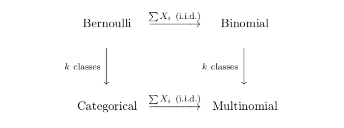
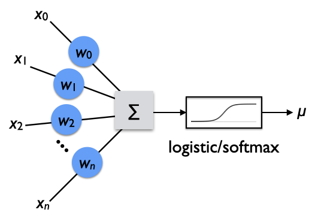

Philosophy of statistics
================================================================================

\newcommand*{\trans}{^{\mathsf{T}}}

Statistical analysis is very important in addressing the problem of induction.
Can inductive inference be formalized?
What are the caveats?
Can inductive inference be automated?
How does machine learning work?

>   All knowledge is, in final analysis, history.
>   All sciences are, in the abstract, mathematics.
>   All judgements are, in their rationale, statistics.
>
>   -- C. R. Rao

<!-- PAGETOC -->

Introduction to the foundations of statistics
--------------------------------------------------------------------------------

### Problem of induction

A key issue for the scientific method, as discussed in the
[previous outline](scientific-method.html#induction),
is the [problem of induction](scientific-method.html#induction).
Inductive inferences are used in the scientific method
to make generalizations from finite data.
This introduces unique avenues of error not found in purely deductive
inferences, like in logic and mathematics.
Compared to deductive inferences, which are sound and necessarily follow
if an argument is valid and all of its premises obtain,
inductive inferences can be valid and probably (not certainly) sound,
and therefore can still result in error in some cases because the support of
the argument is ultimately probabilistic.

A skeptic may further probe if we are even justified in using the probabilities
we use in inductive arguments. What is the probability the Sun will rise tomorrow?
What kind of probabilities are reasonable?

In this outline, we sketch and explore how the mathematical theory of statistics
has arisen to wrestle with the problem of induction, and how it equips us with
careful ways of framing inductive arguments and notions of confidence in them.

See also:

-   [Statistics as a solution to the problem of induction](scientific-method.html#statistics-as-a-solution-to-the-problem-of-induction)

### Early investigators

-   "Ibn al-Haytham was an early proponent of the concept that a hypothesis must be supported by experiments based on confirmable procedures or mathematical evidence—an early pioneer in the scientific method five centuries before Renaissance scientists." - Wikipedia
-   [Gerolamo Cardano](https://en.wikipedia.org/wiki/Gerolamo_Cardano) (1501-1576)
    -   *Book on Games of Chance* (1564)
-   [John Graunt](https://en.wikipedia.org/wiki/John_Graunt) (1620-1674)
-   [Jacob Bernoulli](https://en.wikipedia.org/wiki/Jacob_Bernoulli) (1655-1705)
    -   *Ars Conjectandi* (1713, posthumous)
    -   First modern phrasing of the problem of parameter estimation [^Edwards1974p9]
    -   See Hacking [^Hacking1971]
    -   Early vision of decision theory:

>   The art of measuring, as precisely as possible, probabilities of things,
>   with the goal that we would be able always to choose or follow in our
>   judgments and actions that course, which will have been determined to be
>   better, more satisfactory, safer or more advantageous. [^Bernoulli1713]

-   [Thomas Bayes](https://en.wikipedia.org/wiki/Thomas_Bayes) (1701-1761)
-   [Pierre-Simon Laplace](https://en.wikipedia.org/wiki/Pierre-Simon_Laplace) (1749-1827)
    -   The rule of succession, bayesian
-   [Carl Friedrich Gauss](http://en.wikipedia.org/wiki/Gauss) (1777-1855)
-   [John Stuart Mill](https://en.wikipedia.org/wiki/John_Stuart_Mill) (1806-1873)
-   [Francis Galton](https://en.wikipedia.org/wiki/Francis_Galton) (1822-1911)
    -   Regression towards the mean in phenotypes
-   [John Venn](https://en.wikipedia.org/wiki/John_Venn) (1834-1923)
    -   *The Logic of Chance* (1866) [^Venn1888]

[^Bernoulli1713]: Bernoulli, J. (1713). *Ars Conjectandi*, Chapter II, Part IV, defining the art of conjecture [[wikiquote](https://en.wikiquote.org/wiki/Jacob_Bernoulli)].
[^Edwards1974p9]: @Edwards_1974_The_history_of_likelihood\, p. 9.
[^Hacking1971]: @Hacking_1971_Jacques_Bernoullis_Art_of_conjecturing\.
[^Venn1888]: @Venn_1888_The_Logic_of_Chance\.

### Foundations of modern statistics

-   [Central limit theorem](https://en.wikipedia.org/wiki/Central_limit_theorem)
    -   [De Moivre-Laplace theorem](https://en.wikipedia.org/wiki/De_Moivre%E2%80%93Laplace_theorem) (1738)
    -   [Glivenko-Cantelli theorem](https://en.wikipedia.org/wiki/Glivenko%E2%80%93Cantelli_theorem) (1933)
-   [Charles Sanders Peirce](https://en.wikipedia.org/wiki/Charles_Sanders_Peirce) (1839-1914)
    -   Formulated modern statistics in "Illustrations of the Logic of Science",
        a series published in *Popular Science Monthly* (1877-1878),
        and also "A Theory of Probable Inference" in *Studies in Logic* (1883). [^Peirce1883]
    -   With a repeated measures design, introduced blinded, controlled randomized experiments (before Fisher).
-   [Karl Pearson](https://en.wikipedia.org/wiki/Karl_Pearson) (1857-1936)
    -   [*The Grammar of Science*](https://en.wikipedia.org/wiki/The_Grammar_of_Science) (1892)
    -   "On the criterion that a given system of deviations..." (1900) [^Pearson1900]
        -   Proposed testing the validity of hypothesized values by evaluating the chi distance
            between the hypothesized and the empirically observed values via the $p$-value.
    -   With Frank Raphael Weldon, he established the journal *Biometrika* in 1902.
    -   Founded the world's first university statistics department at University College, London in 1911.
-   [Ronald Fisher](https://en.wikipedia.org/wiki/Ronald_Fisher) (1890-1972)
    -   Fisher significance of the null hypothesis ($p$-values)
        -   "On an absolute criterion for fitting frequency curves" [^Fisher1912]
        -   "Frequency distribution of the values of the correlation coefficient in samples of indefinitely large population" [^Fisher1915]
    -   "On the 'probable error' of a coefficient of correlation deduced from a small sample" [^Fisher1921]
        -   Definition of *likelihood*
        -   ANOVA
    -   *Statistical Methods for Research Workers* (1925)
    -   *The Design of Experiments* (1935)
    -   "Statistical methods and scientific induction" [^Fisher1955]
    -   *The Lady Tasting Tea* [^Salsburg2001]
-   [Jerzy Neyman](https://en.wikipedia.org/wiki/Jerzy_Neyman) (1894-1981)
    -   biography by Reid [^Reid1998]
    -   Neyman, J. (1955). [The problem of inductive inference](https://errorstatistics.files.wordpress.com/2017/04/neyman-1955-the-problem-of-inductive-inference-searchable.pdf). [^Neyman1955]
        -   Shows that Neyman read Carnap, but did Carnap read Neyman?
        -   Discussion: Mayo, D.G. (2014). [Power taboos: Statue of Liberty, Senn, Neyman, Carnap, Severity](https://errorstatistics.com/2014/03/19/power-taboos-statue-of-liberty-senn-neyman-carnap-severity/).
-   [Egon Pearson](https://en.wikipedia.org/wiki/Egon_Pearson) (1895-1980)
    -   Neyman-Pearson confidence intervals with fixed error probabilities (also $p$-values but considering two hypotheses involves two types of errors)
-   [Harold Jeffreys](https://en.wikipedia.org/wiki/Harold_Jeffreys) (1891-1989)
    -   objective (non-informative) Jeffreys priors
-   [Andrey Kolmogorov](https://en.wikipedia.org/wiki/Andrey_Kolmogorov) (1903-1987)
-   [C.R. Rao](https://en.wikipedia.org/wiki/C._R._Rao) (1920-2023)
-   [Ray Solomonoff](https://en.wikipedia.org/wiki/Ray_Solomonoff) (1926-2009)
-   [Shun'ichi Amari](https://en.wikipedia.org/wiki/Shun%27ichi_Amari) (b. 1936)
-   [Judea Pearl](https://en.wikipedia.org/wiki/Judea_Pearl) (b. 1936)

[^Fisher1912]: @Fisher_1912_On_an_absolute_criterion_for_fitting_frequency\.
[^Peirce1883]: @Peirce_1883_Studies_in_Logic\, p. 126--181.
[^Fisher1915]: @Fisher_1915_Frequency_distribution_of_the_values\.
[^Fisher1921]: @Fisher_1921_On_the_probable_error_of_a_coefficient\.
[^Fisher1955]: @Fisher_1955_Statistical_methods_and_scientific_induction\.
[^Neyman1955]: @Neyman_1955_The_problem_of_inductive_inference\.
[^Pearson1900]: @Pearson_1900_On_the_criterion_that_a_given_system_of_deviations\.
[^Reid1998]: @Reid_1998_Neyman\.
[^Salsburg2001]: @Salsburg_2001_The_Lady_Tasting_Tea\.

### Pedagogy

-   Kendall [^Stuart2010]
-   James [^James2006]
-   Cowan [^Cowan1998]
-   Cranmer [^Cranmer2015]
-   Lista: book [^Lista2016a], notes [^Lista2016b]
-   Cox [^Cox2006]
-   Behnke, O., Kr&ouml;ninger, K., Schott, G., & Sch&ouml;rner-Sadenius, T. (2013). *Data Analysis in High Energy Physics: A Practical Guide to Statistical Methods*. [^Behnke2013]
-   Cousins [^Cousins2018]
-   Weisberg [^Weisberg2019]
-   Cranmer, K. (2020). [*Statistics and Data Science*](https://cranmer.github.io/stats-ds-book/intro.html).
-   Cosma Shalizi's notes on
    -   [probability theory](http://bactra.org/notebooks/probability.html)
    -   [statistics](http://bactra.org/notebooks/statistics.html)
    -   [teaching statistics](http://bactra.org/notebooks/teaching-statistics.html)
    -   [information geometry](http://bactra.org/notebooks/info-geo.html)
    -   [*Advanced Data Analysis from an Elementary Point of View*](https://www.stat.cmu.edu/~cshalizi/ADAfaEPoV/)
-   Gelman, A. & Vehtari, A. (2021). [What are the most important statistical ideas of the past 50 years?](https://www.tandfonline.com/doi/full/10.1080/01621459.2021.1938081) [^Gelman2021]
-   Taboga, M. (2022). [statlect.com](https://www.statlect.com/).
-   Otsuka, J. (2023). *Thinking About Statistics: The Philosophical Foundations*. [^Otsuka2023]
    -   Otsuka, J. (2023). Talk: [What machine learning tells us about the mathematical structures of concepts](https://www.youtube.com/watch?v=Lqt7TgYk8rU).

[^Behnke2013]: @Behnke_2013_Data_Analysis_in_High_Energy_Physics_A_Practical\.
[^Cousins2018]: @Cousins_2018_Lectures_on_statistics_in_theory_Prelude\.
[^Cowan1998]: @Cowan_1998_Statistical_Data_Analysis and @Cowan_2016_StatisticsIn_CPatrignani_et_alParticle_Data\.
[^Cox2006]: @Cox_2006_Principles_of_Statistical_Inference\.
[^Cranmer2015]: @Cranmer_2015_Practical_statistics_for_the_LHC\.
[^Gelman2021]: @Gelman_2021_What_are_the_most_important_statistical_ideas\.
[^James2006]: @James_2006_Statistical_Methods_in_Experimental_Particle\.
[^Lista2016a]: @Lista_2016_Statistical_Methods_for_Data_Analysis_in_Particle\.
[^Lista2016b]: @Lista_2016_Practical_statistics_for_particle_physicists\.
[^Otsuka2023]: @Otsuka_2023_Thinking_About_Statistics_The_Philosophical\.
[^Stuart2010]: @Stuart_2010_Kendalls_Advanced_Theory_of_Statistics_Vol_2A\.
[^Weisberg2019]: @Weisberg_2019_Odds__Ends_Introducing_Probability__Decision\.

Probability and its related concepts
--------------------------------------------------------------------------------

### Probability

Probability is of epistemic interest, being in some sense
a measure of inductive confidence.

TODO:

-   Kolmogorov axioms
-   Probability vs odds: $p/(p+q)$ vs $p/q$
-   Carnap, R. (1947). Probability as a guide in life. [^Carnap1947a]

[^Carnap1947a]: @Carnap_1947_Probability_as_a_guide_in_life\.

### Expectation and variance

Expectation:

$$ \mathbb{E}(y) \equiv \int dx \: p(x) \: y(x) \label{eq:expectation} $$

Expectation values can be approximated with a partial sum over some data
or Monte Carlo sample:

$$ \mathbb{E}(y) \approx \frac{1}{n} \sum_s^n y(x_s) \label{eq:expectation_sum} $$

The variance of a random variable, $y$, is defined as

\begin{align}
    \mathrm{Var}(y) &\equiv \mathbb{E}((y - \mathbb{E}(y))^2) \nonumber \\
    &= \mathbb{E}(y^2 - 2 \: y \: \mathbb{E}(y) + \mathbb{E}(y)^2) \nonumber \\
    &= \mathbb{E}(y^2) - 2 \: \mathbb{E}(y) \: \mathbb{E}(y) + \mathbb{E}(y)^2 \nonumber \\
    &= \mathbb{E}(y^2) - \mathbb{E}(y)^2 \label{eq:variance}
\end{align}

The covariance matrix, $\boldsymbol{V}$, of random variables $x_i$ is

\begin{align}
    V_{ij} &= \mathrm{Cov}(x_i, x_j) \equiv \mathbb{E}[(x_i - \mathbb{E}(x_i)) \: (x_j - \mathbb{E}(x_j))] \nonumber \\
           &= \mathbb{E}(x_i \: x_{j} - \mu_i \: x_j - x_i \: \mu_j + \mu_i \: \mu_j ) \nonumber \\
           &= \mathbb{E}(x_i \: x_{j}) - \mu_i \: \mu_j \label{eq:covariance_matrix_indexed}
\end{align}

\begin{equation}
\boldsymbol{V} = 
\begin{pmatrix}
    \mathrm{Var}(x_1) & \mathrm{Cov}(x_1, x_2) & \cdots & \mathrm{Cov}(x_1, x_n) \\
    \mathrm{Cov}(x_2, x_1) & \mathrm{Var}(x_2) & \cdots & \mathrm{Cov}(x_2, x_n) \\
    \vdots & \vdots & \ddots &  \vdots \\
    \mathrm{Cov}(x_n, x_1) & \mathrm{Cov}(x_n, x_2) & \cdots & \mathrm{Var}(x_n)
\end{pmatrix}
\label{eq:covariance_matrix_array}
\end{equation}

Diagonal elements of the covariance matrix are the variances of each
variable.

$$ \mathrm{Cov}(x_i, x_i) = \mathrm{Var}(x_i) $$

Off-diagonal elements of a covariance matrix measure
how related two variables are, linearly.
Covariance can be normalized to give the correlation coefficient between
variables:

$$ \mathrm{Cor}(x_i, x_j) \equiv \frac{ \mathrm{Cov}(x_i, x_j) }{ \sqrt{ \mathrm{Var}(x_i) \: \mathrm{Var}(x_j)  }  } \label{eq:correlation_matrix} $$

which is bounded: $-1 \leq \mathrm{Cor}(x_i, x_j)  \leq 1$.

The covariance of two random vectors is given by

$$ \boldsymbol{V} = \mathrm{Cov}(\vec{x}, \vec{y}) = \mathbb{E}(\vec{x} \: \vec{y}\trans) - \vec{\mu}_x \: \vec{\mu}_{y}\trans \label{eq:covariance_matrix_vectors} $$

### Cross entropy

TODO: discuss the Shannon entropy and Kullback-Leibler (KL) divergence. [^Goodfellow2016p72]

Shannon entropy:

$$ H(p) = - \underset{x\sim{}p}{\mathbb{E}}\big[ \log p(x) \big] \label{eq:shannon_entropy} $$

Cross entropy:

$$ H(p, q) = - \underset{x\sim{}p}{\mathbb{E}}\big[ \log q(x) \big] = - \sum_{x} p(x) \: \log q(x) \label{eq:cross_entropy} $$

Kullback-Leibler (KL) divergence:

\begin{align}
D_\mathrm{KL}(p, q)
    &= \underset{x\sim{}p}{\mathbb{E}}\left[ \log \left(\frac{p(x)}{q(x)}\right) \right] = \underset{x\sim{}p}{\mathbb{E}}\big[ \log p(x) - \log q(x) \big] \label{eq:kl_divergence} \\
    &= - H(p) + H(p, q) \\
\end{align}

See also the section on [logistic regression](#logistic-regression).

[^Goodfellow2016p72]: @Goodfellow_2016_Deep_Learning\, p. 72-73.

### Uncertainty

#### Quantiles and standard error

TODO:

-   Quantiles
-   Practice of standard error for uncertainty quantification.

#### Propagation of error

Given some vector of random variables, $\vec{x}$, with estimated means, 
$\vec{\mu}$, and estimated covariance matrix, $\boldsymbol{V}$, suppose we are
concerned with estimating the variance of some variable, $y$, that is a
function of $\vec{x}$. The variance of $y$ is given by

$$ \sigma^2_y   = \mathbb{E}(y^2) - \mathbb{E}(y)^2 \,. $$

Taylor expanding $y(\vec{x})$ about $x=\mu$ gives

$$ y(\vec{x}) \approx y(\vec{\mu}) + \left.\frac{\partial y}{\partial x_i}\right|_{\vec{x}=\vec{\mu}} (x_i - \mu_i) \,. $$

Therefore, to first order

$$ \mathbb{E}(y) \approx y(\vec{\mu}) $$

and

\begin{align}
\mathbb{E}(y^2)
    &\approx y^2(\vec{\mu}) + 2 \, y(\vec{\mu}) \, \left.\frac{\partial y}{\partial x_i}\right|_{\vec{x}=\vec{\mu}} \mathbb{E}(x_i - \mu_i) \nonumber \\
    &+ \mathbb{E}\left[ \left(\left.\frac{\partial y}{\partial x_i}\right|_{\vec{x}=\vec{\mu}}(x_i - \mu_i)\right) \left(\left.\frac{\partial y}{\partial x_j}\right|_{\vec{x}=\vec{\mu}}(x_j - \mu_j)\right) \right] \\
    &= y^2(\vec{\mu}) + \, \left.\frac{\partial y}{\partial x_i}\frac{\partial y}{\partial x_j}\right|_{\vec{x}=\vec{\mu}} V_{ij} \\
\end{align}

TODO: clarify above, then specific examples.

See:

-   Cowan. [^Cowan1998p20]
-   Arras, K.O. (1998). [An introduction to error propagation: Derivation, meaning and examples of $C_y= F_x C_x F_{x}^{\top}$](http://srl.informatik.uni-freiburg.de/papers/arrasTR98.pdf). [^Arras1998]

[^Arras1998]: @Arras_1998_An_introduction_to_error_propagation_Derivation\.
[^Cowan1998p20]: @Cowan_1998_Statistical_Data_Analysis\, p. 20-22.

### Bayes' theorem

-   [Bayes, Thomas](https://en.wikipedia.org/wiki/Thomas_Bayes) (1701-1761)
-   Bayes' theorem

$$ P(A|B) = P(B|A) \: P(A) \: / \: P(B) \label{eq:bayes_theorem} $$

-   Extended version of Bayes theorem
-   Example of conditioning with medical diagnostics

### Likelihood and frequentist vs bayesian probability

-   Frequentist vs bayesian probability
-   Frequentism grew out of theories of statistical sampling error.
-   Bayesianism grew out of what used to be called "inverse probability".
    -   Fienberg, S.E. (2006). [When did Bayesian inference become "Bayesian"?](https://projecteuclid.org/journals/bayesian-analysis/volume-1/issue-1/When-did-Bayesian-inference-become-Bayesian/10.1214/06-BA101.full) [^Fienberg2006]
-   Weisberg: ["Two Schools"](https://jonathanweisberg.org/vip/two-schools.html) [^Weisberg2019ch15]  

$$ P(H|D) = P(D|H) \: P(H) \: / \: P(D) \label{eq:bayes_theorem_hd} $$

-   Likelihood

$$ L(\theta) = P(D|\theta) \label{eq:likelihood_def_x} $$

-   We will return to the frequentist vs bayesian debate in the section on the
    ["Statistics Wars"](#statistics-wars).

Fisher:

>   To appeal to such a result is absurd. Bayes' theorem ought only to be
>   used where we have in past experience, as for example in the case of
>   probabilities and other statistical ratios, met with every admissible
>   value with roughly equal frequency. There is no such experience in
>   this case. [^Fisher1921p15]

[^Fienberg2006]: @Fienberg_2006_When_did_Bayesian_inference_become_Bayesian\.
[^Fisher1921p15]: @Fisher_1921_On_the_probable_error_of_a_coefficient\, p. 15.
[^Weisberg2019ch15]: @Weisberg_2019_Odds__Ends_Introducing_Probability__Decision\, ch. 15\.

### Curse of dimensionality

-   [Curse of dimensionality](https://en.wikipedia.org/wiki/Curse_of_dimensionality)
    -   The volume of the space increases so fast that the available data become sparse.
-   [Stein's paradox](https://en.wikipedia.org/wiki/Stein%27s_example)
    -   The ordinary decision rule for estimating the mean of a multivariate Gaussian
        distribution (with dimensions, $n \geq 3$) is inadmissible under mean squared error risk.
    -   Stein, C. (1956). Inadmissibility of the usual estimator for the mean of a multivariate normal distribution. [^Stein1956]
    -   James, W. & Stein, C. (1961). [Estimation with quadratic loss](https://projecteuclid.org/accountAjax/Download?urlId=bsmsp%2F1200512173&downloadType=presschapter&isResultClick=True). [^James1961]
    -   [Proof of Stein's example](https://en.wikipedia.org/wiki/Proof_of_Stein%27s_example)
-   van Handel, R. (2016). [Probability in high dimensions](https://web.math.princeton.edu/~rvan/APC550.pdf). [^vanHandel2016]
-   Vershynin, R. (2018). *High-Dimensional Probability: An Introduction with Applications in Data Dcience*. [^Vershynin2018]

[^James1961]: @James_1961_Estimation_with_quadratic_loss\.
[^Stein1956]: @Stein_1956_Inadmissibility_of_the_usual_estimator\.
[^vanHandel2016]: @vanHandel_2016_Probability_in_high_dimensions\.
[^Vershynin2018]: @Vershynin_2018_High_Dimensional_Probability_An_Introduction\.

Statistical models
--------------------------------------------------------------------------------

### Parametric models

-   Data: $x_i$
-   Parameters: $\theta_j$
-   Model: $f(\vec{x} ; \vec{\theta})$

### Canonical distributions

#### Bernoulli distribution

$$ \mathrm{Ber}(k; p) = \begin{cases} p & \mathrm{if}\ k = 1 \\ 1-p & \mathrm{if}\ k = 0 \end{cases} \label{eq:bernoulli} $$

which can also be written as

$$ \mathrm{Ber}(k; p) = p^k \: (1-p)^{(1-k)} \quad \mathrm{for}\ k \in \{0, 1\} $$

or

$$ \mathrm{Ber}(k; p) = p k + (1-p)(1-k) \quad \mathrm{for}\ k \in \{0, 1\} $$

-   Binomial distribution
-   Poisson distribution

TODO: explain, another important relationship is

{#fig:bernoulli-binomial-multinomial}

#### Normal/Gaussian distribution

$$ N(x \,|\, \mu, \sigma^2) = \frac{1}{\sqrt{2\,\pi\:\sigma^2}} \: \exp\left(\frac{-(x-\mu)^2}{2\,\sigma^2}\right) \label{eq:gaussian} $$

and in $k$ dimensions:

$$ N(\vec{x} \,|\, \vec{\mu}, \boldsymbol{\Sigma}) = (2 \pi)^{-k/2}\:\left|\boldsymbol{\Sigma}\right|^{-1/2} \: \exp\left(\frac{-1}{2}\:(\vec{x}-\vec{\mu})\trans \:\boldsymbol{\Sigma}^{-1}\:(\vec{x}-\vec{\mu})\right) \label{eq:gaussian_k_dim} $$

where $\boldsymbol{\Sigma}$ is the covariance matrix
(defined in [@eq:covariance_matrix_indexed])
of the distribution.

-   Central limit theorem
-   $\chi^2$ distribution
-   Univariate distribution relationships

 [^Leemis2008].](img/Leemis-univariate-distribution-relationships.png ){#fig:Leemis-univariate-distribution-relationships}

-   The exponential family of distributions are maximum entropy distributions.

[^Leemis2008]: @Leemis_2008_Univariate_distribution_relationships\.

### Mixture models

-   Gaussian mixture models (GMM)
-   Marked poisson
    -   [pyhf model description](https://scikit-hep.org/pyhf/intro.html)
    -   HistFactory [^Cranmer2012]

[^Cranmer2012]: @Cranmer_2012_HistFactory_A_tool_for_creating_statistical\.

Point estimation and confidence intervals
--------------------------------------------------------------------------------

### Inverse problems

Recall that in the context of parametric models of data, $x_i$
the pdf of which is modeled by a function, $f(x_i ; \theta_j)$ with parameters, $\theta_j$.
In a statistical [inverse problem](https://en.wikipedia.org/wiki/Inverse_problem),
the goal is to infer values of the model parameters, $\theta_j$
given some finite set of data, $\{x_i\}$ sampled from a probability density,
$f(x_i; \theta_j)$ that models the data reasonably well [^NoteClass3].

-   [Inverse problem](https://en.wikipedia.org/wiki/Inverse_problem)
    -   [Inverse probability](https://en.wikipedia.org/wiki/Inverse_probability) (Fisher)
    -   [Statistical inference](https://en.wikipedia.org/wiki/Statistical_inference)
    -   See also: [Structural realism](scientific-realism.html#structural-realism)
-   Estimators
-   Regression
-   Accuracy vs precision [^Cowan1998pX]

[^Cowan1998pX]: @Cowan_1998_Statistical_Data_Analysis and @Cowan_2016_StatisticsIn_CPatrignani_et_alParticle_Data\, p. TODO. 
[^NoteClass3]: This assumption that the model models the data "reasonably" well
    reflects that to the degree required by your analysis, the important features
    of the data match well within the systematic uncertainties parametrized within
    the model.  If the model is incomplete because it is missing an important
    feature of the data, then this is the "*ugly*" (class-3) error in the
    [Sinervo classification of systematic uncertainties](#sinervo-classification-of-systematic-uncertainties).

### Bias and variance

The bias of an estimator, $\hat\theta$, is defined as

$$ \mathrm{Bias}(\hat{\theta}) \equiv \mathbb{E}(\hat{\theta} - \theta) = \int dx \: P(x|\theta) \: (\hat{\theta} - \theta) \label{eq:bias} $$

The mean squared error (MSE) of an estimator has a similar formula to variance
([@eq:variance])
except that instead of quantifying the square of the difference of the estimator
and its expected value, the MSE uses the square of the difference of the estimator
and the true parameter:

$$ \mathrm{MSE}(\hat{\theta}) \equiv \mathbb{E}((\hat{\theta} - \theta)^2) \label{eq:mse} $$

The MSE of an estimator can be related
to its bias and its variance by the following proof:

\begin{align}
    \mathrm{MSE}(\hat{\theta}) &= \mathbb{E}(\hat{\theta}^2 - 2 \: \hat{\theta} \: \theta + \theta^2) \nonumber \\
    &= \mathbb{E}(\hat{\theta}^2) - 2 \: \mathbb{E}(\hat{\theta}) \: \theta + \theta^2
\end{align}

noting that

$$ \mathrm{Var}(\hat{\theta}) = \mathbb{E}(\hat{\theta}^2) - \mathbb{E}(\hat{\theta})^2 $$

and

\begin{align}
    \mathrm{Bias}(\hat{\theta})^2 &= \mathbb{E}(\hat{\theta} - \theta)^2 \nonumber \\
    &= \mathbb{E}(\hat{\theta})^2 - 2 \: \mathbb{E}(\hat{\theta}) \: \theta + \theta^2
\end{align}

we see that MSE is equivalent to

$$ \mathrm{MSE}(\hat{\theta}) = \mathrm{Var}(\hat{\theta}) + \mathrm{Bias}(\hat{\theta})^2 \label{eq:mse_variance_bias} $$

For an unbiased estimator, the MSE is the variance of the estimator.

TODO:

-   Note the discussion of the bias-variance tradeoff by [Cranmer](http://theoryandpractice.org/stats-ds-book/statistics/bias-variance.html).
-   Note the new deep learning view. See [Deep learning](#deep-learning).

See also:

-   [Deep double descent](#deep-double-descent)

### Maximum likelihood estimation

A maximum likelihood estimator (MLE) was first used by Fisher. [^Aldrich1997]

$$\hat{\theta} \equiv \underset{\theta}{\mathrm{argmax}} \: \mathrm{log} \: L(\theta) \label{eq:mle} $$

Maximizing $\mathrm{log} \: L(\theta)$ is equivalent to maximizing $L(\theta)$,
and the former is more convenient because for data that are
independent and identically distributed (*i.i.d.*)
the joint likelihood can be factored
into a product of individual measurements:

$$ L(\theta) = \prod_i L(\theta|x_i) = \prod_i P(x_i|\theta) $$

and taking the log of the product makes it a sum:

$$ \mathrm{log} \: L(\theta) = \sum_i \mathrm{log} \: L(\theta|x_i) = \sum_i \mathrm{log} \: P(x_i|\theta) $$

Maximizing $\mathrm{log} \: L(\theta)$ is also equivalent to minimizing $-\mathrm{log} \: L(\theta)$, the negative log-likelihood (NLL). For distributions that are *i.i.d.*,

$$ \mathrm{NLL} \equiv - \log L = - \log \prod_i L_i = - \sum_i \log L_i = \sum_i \mathrm{NLL}_i $$

[^Aldrich1997]: @Aldrich_1997_RAFisher_and_the_making_of_maximum_likelihood\.

#### Invariance of likelihoods under reparametrization

-   Likelihoods are invariant under reparametrization. [^James2006p234]
-   Bayesian posteriors are not invariant in general.

See also:

-   [Bayesian credibility intervals](#bayesian-credibility-intervals)

[^James2006p234]: @James_2006_Statistical_Methods_in_Experimental_Particle\, p. 234.

#### Ordinary least squares

-   Least squares from MLE of gaussian models: $\chi^2$
-   Ordinary Least Squares (OLS)
-   Geometric interpretation
    -   Cox [^Cox2006p11]
    -   Murphy [^Murphy2012p222]

[^Cox2006p11]: @Cox_2006_Principles_of_Statistical_Inference\, p. 11.
[^Murphy2012p222]: @Murphy_2012_Machine_Learning_A_probabilistic_perspective\, p. 222.

### Variance of MLEs

-   Taylor expansion of a likelihood near its maximum
-   Cram&eacute;r-Rao bound [^Cramer-Rao]
    -   Define efficiency of an estimator.
    -   Common formula for variance of unbiased and efficient estimators
    -   Proof in Rice [^Rice2007p300]
    -   Cranmer: [Cram&eacute;r-Rao bound](http://theoryandpractice.org/stats-ds-book/statistics/cramer-rao-bound.html)
    -   Nielsen, F. (2013). [Cramer-Rao lower bound and information geometry](https://arxiv.org/abs/1301.3578). [^Nielsen2013]
    -   Under some reasonable conditions, one can show that MLEs are efficient and unbiased. TODO: find ref.
-  [Fisher information matrix](https://en.wikipedia.org/wiki/Fisher_information)
    -   "is the key part of the proof of Wilks' theorem, which allows confidence region estimates for maximum likelihood estimation (for those conditions for which it applies) without needing the Likelihood Principle."
-   Variance of MLEs
    -   [Wilks's theorem](https://en.wikipedia.org/wiki/Wilks%27_theorem)
    -   Method of $\Delta\chi^2$ or $\Delta{}L$
    -   Frequentist confidence intervals (e.g. at 95% CL)
    -   Cowan [^Cowan1998p130]
    -   Likelihood need not be Gaussian [^James2006p234again]
    -   Minos method in particle physics in MINUIT [^James1975]
    -   See slides for my talk: [Primer on statistics: MLE, Confidence Intervals, and Hypothesis Testing](http://rreece.github.io/talks/pdf/2018-02-16-RReece-statistics-workshop-insight.pdf)
-   Asymptotics
    -   Cowan, G., Cranmer, K., Gross, E., & Vitells, O. (2012). [Asymptotic distribution for two-sided tests with lower and upper boundaries on the parameter of interest](https://arxiv.org/abs/1210.6948). [^Cowan2012]

, recreation of @James_2006_Statistical_Methods_in_Experimental_Particle\, p. 235).](img/DeltaL_nonparabolic.png){#fig:DeltaL_nonparabolic}

-   Common error bars
    -   Poisson error bars
        -   Gaussian approximation: $\sqrt{n}$
        -   [Wilson-Hilferty approximation](https://www.johndcook.com/blog/wilson_hilferty/)
    -   Binomial error bars
        -   Error on efficiency or proportion
        -   See: [Statistical classification](#statistical-classification)
-   Discussion
    -   Wainer, H. (2007). [The most dangerous equation](https://sites.stat.washington.edu/people/peter/498.Sp16/Equation.pdf). (de Moivre's equation for variance of means) [^Wainer2007]
-   Misc
    -   Karhunen-Lo&egrave;ve eigenvalue problems in cosmology: How should we tackle large data sets? [^Tegmark1997]

[^Cowan2012]: @Cowan_2012_Asymptotic_distribution_for_two_sided_tests\.
[^Cowan1998p130]: @Cowan_1998_Statistical_Data_Analysis\, p. 130-5.
[^Cramer-Rao]: @Frechet_1943_Sur_lextension_de_certaines_evaluations\,
    @Cramer_1946_A_contribution_to_the_theory_of_statistical\,
    @Rao_1945_Information_and_the_accuracy_attainable\, and
    @Rao_1947_Minimum_variance_and_the_estimation_of_several\.
[^James2006p234again]: @James_2006_Statistical_Methods_in_Experimental_Particle\, p. 234.
[^James1975]: @James_1975_MINUIT_A_system_for_function_minimization\.
[^Nielsen2013]: @Nielsen_2013_Cramer_Rao_lower_bound_and_information_geometry\.
[^Rice2007p300]: @Rice_2007_Mathematical_Statistics_and_Data_Analysis\, p. 300--2.
[^Tegmark1997]: @Tegmark_1997_Karhunen_Loeve_eigenvalue_problems_in_cosmology\.
[^Wainer2007]: @Wainer_2007_The_most_dangerous_equation\.

### Bayesian credibility intervals

-   [Inverse problem](https://en.wikipedia.org/wiki/Inverse_problem) to find a posterior probability distribution.
    -   See also: [Likelihood and frequentist vs bayesian probability](#likelihood-and-frequentist-vs-bayesian-probability)
-   Maximum a posteriori estimation (MAP)
-   Prior sensitivity
    -   Betancourt, M. (2018). [Towards a principled Bayesian workflow](https://github.com/betanalpha/jupyter_case_studies/blob/master/principled_bayesian_workflow/principled_bayesian_workflow.ipynb) - ipynb
-   Not invariant to reparametrization in general
    -   Jeffreys priors are
    -   TODO: James

### Uncertainty on measuring an efficiency

-   [Binomial proportion confidence interval](https://en.wikipedia.org/wiki/Binomial_proportion_confidence_interval)
-   Normal/Gaussian/Wald interval
    -   [Derivation of the Wald interval](https://math.stackexchange.com/questions/1448233/the-derivation-of-the-wald-interval)
-   Wilson score interval
-   Clopper-Pearson interval (1934) [^Clopper1934]
-   Agresti-Coull interval (1998) [^Agresti1998]
    -   [The modified Wald method for computing the confidence interval of a proportion](https://www.graphpad.com/support/faq/the-modified-wald-method-for-computing-the-confidence-interval-of-a-proportion/)
-   [Rule of three](https://en.wikipedia.org/wiki/Rule_of_three_(statistics)) (1983) [^Hanley1983]
-   Review by Brown, Cai, & DasGupta (2001) [^Brown2001]
-   Casadei, D. (2012). [Estimating the selection efficiency](https://arxiv.org/abs/0908.0130). [^Casadei2012]
-   Precision vs recall for classification, again
-   Classification and logistic regression
-   See also:
    -   [Logistic regression](#logistic-regression) in the section on [Classical machine learning](#classical-machine-learning).
    -   [Clustering](#clustering) in the section on [Classical machine learning](#classical-machine-learning).

[^Agresti1998]: @Agresti_1998_Approximate_is_better_than_exact_for_interval\.
[^Brown2001]: @Brown_2001_Interval_estimation_for_a_binomial_proportion\.
[^Casadei2012]: @Casadei_2012_Estimating_the_selection_efficiency\.
[^Clopper1934]: @Clopper_1934_The_use_of_confidence_or_fiducial_limits\.
[^Hanley1983]: @Hanley_1983_If_nothing_goes_wrong_is_everything_all_right\.

### Examples

-   Some sample mean
-   Bayesian lighthouse
-   [Measuring an efficiency](#uncertainty-on-measuring-an-efficiency)
-   Some HEP fit

Statistical hypothesis testing
--------------------------------------------------------------------------------

### Null hypothesis significance testing

-   Karl Pearson observing how rare sequences of roulette spins are
-   Null hypothesis significance testing (NHST)
-   goodness of fit
-   Fisher

Fisher:

>   [T]he null hypothesis is never proved or established,
>   but is possibly disproved, in the course of experimentation. [^Fisher1935p16]

[^Fisher1935p16]: @Fisher_1935_The_Design_of_Experiments\, p. 16.

### Neyman-Pearson theory

#### Introduction

-   probes an alternative hypothesis [^Goodman1999p998]
-   Type-1 and type-2 errors
-   Power and confidence
-   Cranmer, K. (2020). [Thumbnail of LHC statistical procedures](http://theoryandpractice.org/stats-ds-book/statistics/lhc_stats_thumbnail.html).
-   ATLAS and CMS Collaborations. (2011). [Procedure for the LHC Higgs boson search combination in Summer 2011](http://cds.cern.ch/record/1379837). [^ATLAS2011b]
-   Cowan, G., Cranmer, K., Gross, E., & Vitells, O. (2011). [Asymptotic formulae for likelihood-based tests of new physics](https://arxiv.org/abs/1007.1727). [^Cowan2011again]

, 2015).](img/ROC-explainer.png){#fig:ROC-explainer}

See also:

-   [Statistical classification](#statistical-classification)

[^ATLAS2011b]: @ATLAS_2011_Procedure_for_the_LHC_Higgs_boson_search\.
[^Cowan2011again]: @Cowan_2011_Asymptotic_formulae_for_likelihood_based_tests\.
[^Goodman1999p998]: @Goodman_1999_Toward_evidence_based_medical_statistics_1_The_P\. p. 998.

#### Neyman-Pearson lemma

Neyman-Pearson lemma: [^Neyman1933]

For a fixed signal efficiency, $1-\alpha$, the selection that corresponds to the lowest
possible misidentification probability, $\beta$, is given by

$$ \frac{L(H_1)}{L(H_0)} > k_{\alpha} \,, \label{eq:np-lemma} $$

where $k_{\alpha}$ is the cut value required to achieve a type-1 error rate
of $\alpha$.

Neyman-Pearson test statistic:

$$ q_\mathrm{NP} = - 2 \ln \frac{L(H_1)}{L(H_0)} \label{eq:qnp-test-stat} $$

Profile likelihood ratio:

$$ \lambda(\mu) = \frac{ L(\mu, \hat{\theta}_\mu) }{ L(\hat{\mu}, \hat{\theta}) } \label{eq:profile-llh-ratio} $$

where $\hat{\theta}$ is the (unconditional) maximum-likelihood estimator that maximizes $L$,
while $\hat{\theta}_\mu$ is the conditional maximum-likelihood estimator that maximizes $L$
for a specified signal strength, $\mu$,
and $\theta$ as a vector includes all other parameters of interest and nuisance parameters.

[^Neyman1933]: @Neyman_1933_On_the_problem_of_the_most_efficient_tests\.

#### Neyman construction

Cranmer: [Neyman construction](http://theoryandpractice.org/stats-ds-book/statistics/neyman_construction.html).

, 2020).](img/neyman-construction.png){#fig:neyman-construction}

TODO: fix

$$ q = - 2 \ln \frac{L(\mu\,s + b)}{L(b)} \label{eq:q0-test-stat} $$

#### Flip-flopping

-   Flip-flopping and Feldman-Cousins confidence intervals [^Feldman1998]

[^Feldman1998]: @Feldman_1998_A_unified_approach_to_the_classical_statistical\.

### *p*-values and significance

-   $p$-values and significance [^Cowan2012b]
-   Coverage
-   Fisherian vs Neyman-Pearson $p$-values

Cowan _et al._ define a $p$-value as

>   a probability, under assumption of $H$, of finding data of equal or
>   greater incompatibility with the predictions of $H$. [^Cowan2011p2]

Also:

>   It should be emphasized that in an actual scientific context,
>   rejecting the background-only hypothesis in a statistical sense is
>   only part of discovering a new phenomenon. One’s degree of belief
>   that a new process is present will depend in general on other factors
>   as well, such as the plausibility of the new signal hypothesis and the
>   degree to which it can describe the data. Here, however, we only
>   consider the task of determining the $p$-value of the background-only
>   hypothesis; if it is found below a specified threshold, we regard
>   this as “discovery”. [^Cowan2011p3]

[^Cowan2011p2]: @Cowan_2011_Asymptotic_formulae_for_likelihood_based_tests\, p. 2--3.
[^Cowan2011p3]: @Cowan_2011_Asymptotic_formulae_for_likelihood_based_tests\, p. 3.
[^Cowan2012b]: @Sinervo_2002_Signal_significance_in_particle_physics and @Cowan_2012_Discovery_sensitivity_for_a_counting_experiment\.

#### Uppper limits

-   Cousins, R.D. & Highland, V.L. (1992). [Incorporating systematic uncertainties into an upper limit](http://citeseerx.ist.psu.edu/viewdoc/download?doi=10.1.1.193.1581&rep=rep1&type=pdf). [^Cousins1992]

[^Cousins1992]: @Cousins_1992_Incorporating_systematic_uncertainties_into\.

#### CLs method

-   Conservative coverage; used in particle physics
-   Junk [^Junk1999]
-   Read [^Read2002]
-   ATLAS [^ATLAS2011]

[^ATLAS2011]: @ATLAS_2011_The_CLs_method_Information_for_conference\.
[^Junk1999]: @Junk_1999_Confidence_level_computation_for_combining\.
[^Read2002]: @Read_2002_Presentation_of_search_results_the_CLs_technique\.

### Asymptotics

-   Analytic variance of the likelihood-ratio of gaussians: $\chi^2$
    -   Wilks [^Wilks1938]
        -   Under the null hypothesis, $-2 \ln(\lambda) \sim \chi^{2}_{k}$,
            where $k$, the degrees of freedom for the $\chi^{2}$ distribution
            is the number of parameters of interest (including signal strength)
            in the signal model but not in the null hypothesis background model.
    -   Wald [^Wald1943]
        -   Wald generalized the work of Wilks for the case of testing some
            nonzero signal for exclusion, showing
            $-2 \ln(\lambda) \approx (\hat{\theta} - \theta)\trans V^{-1} (\hat{\theta} - \theta) \sim \mathrm{noncentral}\:\chi^{2}_{k}$.
        -   In the simplest case where there is only one parameter of interest
            (the signal strength, $\mu$), then
            $-2 \ln(\lambda) \approx \frac{ (\hat{\mu} - \mu)^{2} }{ \sigma^2 }  \sim \mathrm{noncentral}\:\chi^{2}_{1}$.
    -   Pearson $\chi^2$-test
-   Cowan _et al._ [^Cowan2011]
    -   Wald approximation
    -   Asimov dataset
    -   Talk by Armbruster: [Asymptotic formulae](https://indico.cern.ch/event/233551/contributions/493678/attachments/389871/542293/asymptotics_armbruster.pdf) (2013).
-   Criteria for projected discovery and exclusion sensitivities of counting experiments [^Bhattiprolu2020]
    -   [github.com/prudhvibhattiprolu/Zstats](https://github.com/prudhvibhattiprolu/Zstats)

[^Bhattiprolu2020]: @Bhattiprolu_2020_Criteria_for_projected_discovery_and_exclusion\.
[^Cowan2011]: @Cowan_2011_Asymptotic_formulae_for_likelihood_based_tests\.
[^Wald1943]: @Wald_1943_Tests_of_statistical_hypotheses_concerning_several\.
[^Wilks1938]: @Wilks_1938_The_large_sample_distribution_of_the_likelihood\.

### Student's *t*-test

-   Student's *t*-test
-   ANOVA
-   A/B-testing

### Frequentist vs bayesian decision theory

-   Frequentist vs bayesian decision theory [^Murphy2012p197]
-   Goodman, S.N. (1999). [Toward evidence-based medical statistics 2: The Bayes factor](https://courses.botany.wisc.edu/botany_940/06EvidEvol/papers/goodman2.pdf). [^Goodman1999b]

Support for using Bayes factors:

>   which properly separates issues of long-run behavior from evidential
>   strength and allows the integration of background knowledge with
>   statistical findings. [^Goodman1999p995]

See also:

-   ["Statistics Wars"](#statistics-wars)

[^Goodman1999p995]: @Goodman_1999_Toward_evidence_based_medical_statistics_1_The_P\. p. 995.
[^Goodman1999b]: @Goodman_1999_Toward_evidence_based_medical_statistics_2\.
[^Murphy2012p197]: @Murphy_2012_Machine_Learning_A_probabilistic_perspective\, p. 197.

### Examples

-   Difference of two means: $t$-test
-   A/B-testing
-   New physics
    -   [Slides by Me, Ryan Reece: "ATLAS, data reduction, and epistemology"](http://rreece.github.io/talks/pdf/2016-11-29-RReece-ATLAS-Epistemology.pdf)
    -   [Talk by Tommaso Dorigo: "Frequentist Statistics, the Particle Physicists' Way"](https://www.youtube.com/watch?v=NA5u5X23QLo)

Uncertainty quantification
--------------------------------------------------------------------------------

### Sinervo classification of systematic uncertainties

-   Class-1, class-2, and class-3 systematic uncertanties (good, bad, ugly), Classification by Pekka Sinervo (PhyStat2003) [^Sinervo2003]
-   Not to be confused with type-1 and type-2 errors in Neyman-Pearson theory
-   Heinrich, J. & Lyons, L. (2007). Systematic errors. [^Heinrich2007]
-   Caldeira & Nord [^Caldeira2020]

Lyons:

>   In analyses involving enough data to achieve reasonable statistical
>   accuracy, considerably more effort is devoted to assessing the
>   systematic error than to determining the parameter of interest
>   and its statistical error. [^Lyons2008p890]

, 2016).](img/systematic-uncertainties-sinervo.png){#fig:systematic-uncertainties-sinervo}

-   Poincar&eacute;'s three levels of ignorance

[^Caldeira2020]: @Caldeira_2020_Deeply_uncertain_comparing_methods_of_uncertainty\.
[^Heinrich2007]: @Heinrich_2007_Systematic_errors\.
[^Lyons2008p890]: @Lyons_2008_Open_statistical_issues_in_particle_physics\, p. 890.
[^Sinervo2003]: @Sinervo_2003_Definition_and_treatment_of_systematic\.

### Profile likelihoods

-   Profiling and the profile likelihood
    -   Importance of Wald and Cowan _et al_.
    -   hybrid Bayesian-frequentist method

### Examples of poor estimates of systematic uncertanties

-   Unaccounted-for effects
-   CDF $Wjj$ bump
    -   Phys.Rev.Lett.106:171801 (2011) / [arxiv:1104.0699](https://arxiv.org/abs/1104.0699)
    -   [Invariant mass distribution of jet pairs produced in association with a $W$ boson in $p\bar{p}$ collisions at $\sqrt{s}$ = 1.96 TeV](https://www-cdf.fnal.gov/physics/ewk/2011/wjj/7_3.html)
    -   Dorigo, T. (2011). [The jet energy scale as an explanation of the CDF signal](https://www.science20.com/quantum_diaries_survivor/blog/jet_energy_scale_explanation_cdf_signal-77886).

 (see also: [GIF](img/AnimatedDijet.gif)).](img/cdf-wjj.png){#fig:cdf-wjj}

-   OPERA. (2011). [Faster-than-light neutrinos](https://arxiv.org/abs/1109.4897v1).
-   BICEP2 claimed evidence of B-modes in the CMB as evidence of cosmic inflation without accounting for cosmic dust.

Statistical classification
--------------------------------------------------------------------------------

### Introduction

-   Precision vs recall
-   Recall is sensitivity
-   Sensitivity vs specificity
-   Accuracy

### Examples

-   TODO

See also:

-   [Decision trees](#decision-trees)

Causal inference
--------------------------------------------------------------------------------

### Introduction

-   Rubin, D. B. (1974). [Estimating causal effects of treatments in randomized and nonrandomized studies](https://psycnet.apa.org/fulltext/1975-06502-001.pdf). [^Rubin1974]
-   Lewis, D. (1981). [Causal decision theory](https://www.andrewmbailey.com/dkl/Causal_Decision_Theory.pdf). [^Lewis1981]
-   Pearl, J. (2018). *The Book of Why: The new science of cause and effect*. [^Pearl2018]

See also:

-   [Causation](scientific-method.html#causation)
-   [Induction](scientific-method.html#induction)

[^Lewis1981]: @Lewis_1981_Causal_decision_theory\.
[^Pearl2018]: @Pearl_2018_The_Book_of_Why_The_new_science_of_cause\.
[^Rubin1974]: @Rubin_1974_Estimating_causal_effects_of_treatments\.

### Causal models

-   Structural Causal Model (SCM)
-   Pearl, J. (2009). [Causal inference in statistics: An overview](https://projecteuclid.org/journals/statistics-surveys/volume-3/issue-none/Causal-inference-in-statistics-An-overview/10.1214/09-SS057.pdf). [^Pearl2009]
-   Robins, J.M. & Wasserman, L. (1999). On the impossibility of inferring causation from association without background knowledge. [^Robins1999]
-   Peters, J., Janzing, D., & Sch&ouml;lkopf, B. (2017). *Elements of Causal Inference*. [^Peters2017]

[^Pearl2009]: @Pearl_2009_Causal_inference_in_statistics_An_overview\.
[^Peters2017]: @Peters_2017_Elements_of_Causal_Inference\.
[^Robins1999]: @Robins_1999_On_the_impossibility_of_inferring_causation_from\.

### Counterfactuals

-   Counterfactuals
-   Regret
-   Interventionist conception of causation
-   Ismael, J. (2023). [Reflections on the asymmetry of causation](https://royalsocietypublishing.org/doi/pdf/10.1098/rsfs.2022.0081). [^Ismael2023]

[^Ismael2023]: @Ismael_2023_Reflections_on_the_asymmetry_of_causation\.

Exploratory data analysis
--------------------------------------------------------------------------------

### Introduction

-   [Tukey, John (1915-2000)](https://en.wikipedia.org/wiki/John_Tukey)
    -   [Exploratory data analysis](https://en.wikipedia.org/wiki/Exploratory_data_analysis)
    -   *Exploratory Data Analysis* (1977) [^Tukey1977]

[^Tukey1977]: @Tukey_1977_Exploratory_Data_Analysis\.

### Look-elsewhere effect

-   Look-elsewhere effect (LEE)
    -   AKA File-drawer effect
-   Stopping rules
    -   validation dataset
    -   statistical issues, violates the likelihood principle

### Archiving and data science

-   "Data science"
    -   Data collection, quality, analysis, archival, and reinterpretation
    -   [Scientific research and big data](https://plato.stanford.edu/entries/science-big-data/)
-   Reproducible an reinterpretable
    -   RECAST
    -   Chen, X. et al. (2018). [Open is not enough](https://www.nature.com/articles/s41567-018-0342-2). [^Chen2018]

[^Chen2018]: @Chen_2018_Open_is_not_enough\.

"Statistics Wars"
--------------------------------------------------------------------------------

### Introduction

-   Kruschke
-   Carnap
    -   "The two concepts of probability" [^Carnap1945b]
-   Royall
    -   "What do these data say?" [^Royall1997p171]

Cranmer:

>   Bayes's theorem is a theorem, so there's no debating it. It is not the case that
>   Frequentists dispute whether Bayes's theorem is true. The debate is whether the
>   necessary probabilities exist in the first place. If one can define the joint
>   probability $P (A, B)$ in a frequentist way, then a Frequentist is perfectly
>   happy using Bayes theorem. Thus, the debate starts at the very definition of
>   probability. [^Cranmer2015p6]

Neyman:

>   Without hoping to know whether each separate hypothesis is true or false,
>   we may search for rules to govern our behaviour with regard to them,
>   in following which we insure that, in the long run of experience,
>   we shall not be too often wrong. [^Neyman1933longrun]

![From Kruschke. [^Kruschke2018fig1]](img/Kruschke-bayes-freq-grid.png){#fig:Kruschke-bayes-freq-grid}

[^Carnap1945b]: @Carnap_1945_The_two_concepts_of_probability\.
[^Cranmer2015p6]: @Cranmer_2015_Practical_statistics_for_the_LHC\, p. 6.
[^Kruschke2018fig1]: @Kruschke_2018_The_Bayesian_New_Statistics_Hypothesis_testing\.
[^Neyman1933longrun]: @Neyman_1933_On_the_problem_of_the_most_efficient_tests\.
[^Royall1997p171]: @Royall_1997_Statistical_Evidence_A_likelihood_paradigm\, p. 171--2.

### Likelihood principle

-   [Likelihood principle](http://en.wikipedia.org/wiki/Likelihood_principle)
-   The likelihood principle is the proposition that, given a statistical model and a data sample,
    all the evidence relevant to model parameters is contained in the likelihood function.
-   The history of likelihood [^Edwards1974]
    -   Allan Birnbaum proved that the likelihood principle follows from two more primitive
        and seemingly reasonable principles,
        the [conditionality principle](https://en.wikipedia.org/wiki/Conditionality_principle)
        and the [sufficiency principle](https://en.wikipedia.org/wiki/Sufficient_statistic).  [^Birnbaum1962]
    -   Hacking identified the "law of likelihood". [^Hacking1965]
-   Berger & Wolpert. (1988). *The Likelihood Principle*. [^Berger1988]

O'Hagan:

>   The first key argument in favour of the Bayesian approach can be called the
>   axiomatic argument. We can formulate systems of axioms of good inference,
>   and under some persuasive axiom systems it can be proved that Bayesian inference
>   is a consequence of adopting any of these systems...
>   If one adopts two principles known as ancillarity and sufficiency principles,
>   then under some statement of these principles it follows that one must adopt
>   another known as the likelihood principle. Bayesian inference conforms to the
>   likelihood principle whereas classical inference does not.
>   Classical procedures regularly violate the likelihood principle
>   or one or more of the other axioms of good inference.
>   There are no such arguments in favour of classical inference. [^OHagan2010]

-   Gandenberger
    -   "A new proof of the likelihood principle" [^Gandenberger2015]
    -   Thesis: [*Two Principles of Evidence and Their Implications for the Philosophy of Scientific Method*](http://d-scholarship.pitt.edu/24634/) (2015)
    -   [gandenberger.org/research](http://gandenberger.org/research/)
    -   [Do frequentist methods violate the likelihood principle?](http://gandenberger.org/2014/04/28/do-frequentist-methods-violate-lp/)
-   Criticisms:
    -   Evans [^Evans2013]
    -   Mayo [^Mayo2014]
    -   Mayo: [The law of likelihood and error statistics](https://errorstatistics.com/2019/04/04/excursion-1-tour-ii-error-probing-tools-versus-logics-of-evidence-excerpt/) [^Mayo2019]
    -   [Mayo’s response to Hennig and Gandenberger](https://errorstatistics.com/2013/02/11/u-phil-mayos-response-to-hennig-and-gandenberger/)
    -   Dawid, A.P. (2014). [Discussion of "On the Birnbaum Argument for the Strong Likelihood Principle"](https://projecteuclid.org/journals/statistical-science/volume-29/issue-2/Discussion-of-On-the-Birnbaum-Argument-for-the-Strong-Likelihood/10.1214/14-STS470.full). [^Dawid2014]
-   [Likelihoodist statistics](https://en.wikipedia.org/wiki/Likelihoodist_statistics)

Mayo:

>   Likelihoods are vital to all statistical accounts, but they are often
>   misunderstood because the data are fixed and the hypothesis varies.
>   Likelihoods of hypotheses should not be confused with their probabilities.
>   ...
>   [T]he same phenomenon may be perfectly predicted or explained by two rival
>   theories; so both theories are equally likely on the data, even though they
>   cannot both be true. [^Mayo2019]

[^Berger1988]: @Berger_1988_The_Likelihood_Principle\.
[^Dawid2014]: @Dawid_2014_Discussion_of_On_the_Birnbaum_Argument\.
[^Evans2013]: @Evans_2013_What_does_the_proof_of_Birnbaums_theorem_prove\.
[^Edwards1974]: @Edwards_1974_The_history_of_likelihood\.
[^Gandenberger2015]: @Gandenberger_2015_A_new_proof_of_the_likelihood_principle\.
[^Hacking1965]: @Hacking_1965_Logic_of_Statistical_Inference\.
[^OHagan2010]: @OHagan_2010_Kendalls_Advanced_Theory_of_Statistics_Vol_2B\, p. 17--18\.
[^Mayo2014]: @Mayo_2014_On_the_Birnbaum_Argument_for_the_Strong_Likelihood\.
[^Mayo2019]: @Mayo_2019_The_law_of_likelihood_and_error_statistics\.

### Discussion

Lyons:

>   Particle Physicists tend to favor a frequentist method. This is because
>   we really do consider that our data are representative as samples drawn
>   according to the model we are using (decay time distributions often are
>   exponential; the counts in repeated time intervals do follow a Poisson
>   distribution, etc.), and hence we want to use a statistical approach
>   that allows the data "to speak for themselves," rather than our analysis
>   being dominated by our assumptions and beliefs, as embodied in Bayesian
>   priors. [^Lyons2008p891]

[^Lyons2008p891]: @Lyons_2008_Open_statistical_issues_in_particle_physics\, p. 891.

-   Carnap
    -   Sznajder on the alleged evolution of Carnap's views of inductive logic [^Sznajder2018]
-   David Cox
-   Ian Hacking
    -   *Logic of Statistical Inference* [^Hacking1965]
-   Neyman
    -   "Frequentist probability and frequentist statistics" [^Neyman1977]
-   Rozeboom
    -   Rozeboom, W.W. (1960). The fallacy of the null-hypothesis significance test. [^Rozeboom1960]
-   Meehl
    -   Meehl, P. E. (1978). Theoretical risks and tabular asterisks: Sir Karl, Sir Ronald, and the slow progress of soft psychology. [^Meehl1978]
-   Zech
    -   "Comparing statistical data to Monte Carlo simulation" [^Zech1995]
-   Richard Royall
    -   *Statistical Evidence: A likelihood paradigm* [^Royall1997]
-   Jim Berger
    -   "Could Fisher, Jeffreys, and Neyman have agreed on testing?" [^Berger2003]
-   Deborah Mayo
    -   "In defense of the Neyman-Pearson theory of confidence intervals" [^Mayo1981]
    -   Concept of "Learning from error" in *Error and the Growth of Experimental Knowledge* [^Mayo1996]
    -   "Severe testing as a basic concept in a Neyman-Pearson philosophy of induction" [^Mayo2006]
    -   "Error statistics" [^Mayo2011b]
    -   *Statistical Inference as Severe Testing* [^Mayo2018]
    -   [Statistics Wars: Interview with Deborah Mayo](https://blog.apaonline.org/2019/03/07/interview-with-deborah-mayo/) - APA blog
    -   [Review of *SIST* by Prasanta S. Bandyopadhyay](https://ndpr.nd.edu/news/statistical-inference-as-severe-testing-how-to-get-beyond-the-statistics-wars/)
    -   [LSE Research Seminar: Current Controversies in Phil Stat](https://phil-stat-wars.com/2020/05/22/lse-research-seminar-ph500-may-15/) (May 21, 2020)
        -   [Meeting 5](https://phil-stat-wars.com/2020/06/11/meeting-5-june-18/) (June 18, 2020)
    -   Slides: [The Statistics Wars and Their Casualties](https://philstatwars.files.wordpress.com/2022/09/deborah-g.-mayo-final-21-september-.pdf)
-   Andrew Gelman
    -   [Confirmationist and falsificationist paradigms of science](https://statmodeling.stat.columbia.edu/2014/09/05/confirmationist-falsificationist-paradigms-science/) - Sept. 5, 2014
    -   Beyond subjective and objective in statistics [^Gelman2017]
    -   [Retire Statistical Significance: The discussion](https://statmodeling.stat.columbia.edu/2019/03/20/retire-statistical-significance-the-discussion/)
    -   [Exchange with Deborah Mayo on abandoning statistical significance](https://statmodeling.stat.columbia.edu/2019/09/11/exchange-with-deborah-mayo-on-abandoning-statistical-significance/)
    -   [Several reviews of *SIST*](https://statmodeling.stat.columbia.edu/2019/04/12/several-reviews-of-deborah-mayos-new-book-statistical-inference-as-severe-testing-how-to-get-beyond-the-statistics-wars/)
-   Larry Wasserman
    -   [Statistical Principles?](https://normaldeviate.wordpress.com/2012/07/28/statistical-principles/)
-   Kevin Murphy
    -   Pathologies of frequentist statistics [^Murphy2012ch6]
    -   $p$-values considered harmful [^Murphy2022p195]
-   Greg Gandenberger
    -   [An introduction to likelihoodist, bayesian, and frequentist methods (1/3)](http://gandenberger.org/2014/07/21/intro-to-statistical-methods/)
    -   As Neyman and Pearson put it in their original presentation of the frequentist approach,
        "without hoping to know whether each separate hypothesis is true or false,
        we may search for rules to govern our behavior with regard to them, in the
        following which we insure that, in the long run of experience, we shall not
        too often be wrong" (1933, 291). 
    -   [An introduction to likelihoodist, bayesian, and frequentist methods (2/3)](http://gandenberger.org/2014/07/28/intro-to-statistical-methods-2/)
    -   [An introduction to likelihoodist, bayesian, and frequentist methods (3/3)](http://gandenberger.org/2014/08/26/intro-to-statistical-methods-3/)
    -   [An argument against likelihoodist methods as genuine alternatives to bayesian and frequentist methods](http://gandenberger.org/2013/10/21/against-likelihoodist-methods/)
    -   "Why I am not a likelihoodist" [^Gandenberger2016]
-   Jon Wakefield
    -   *Bayesian and Frequentist Regression Methods* [^Wakefield2013]
-   Efron & Hastie
    -   "Flaws in Frequentist Inference" [^Efron2016p30]
-   Kruschke & Liddel [^Kruschke2018]
-   Steinhardt, J. (2012). Beyond Bayesians and frequentists. [^Steinhardt2012]
-   VanderPlas, J. (2014). [Frequentism and Bayesianism III: Confidence, credibility, and why frequentism and science do not mix](https://jakevdp.github.io/blog/2014/06/12/frequentism-and-bayesianism-3-confidence-credibility/).
-   Kent, B. (2021). [No, your confidence interval is not a worst-case analysis](https://www.crosstab.io/articles/confidence-interval-interpretation).

, 2015).](img/gandenberger-thesis-venn-diagram.png){#fig:gandenberger-thesis-venn-diagram}

Goodman:

>   The idea that the $P$ value can play both of these roles is based on a
>   fallacy: that an event can be viewed simultaneously both from a long-run
>   and a short-run perspective. In the long-run perspective, which is
>   error-based and deductive, we group the observed result together with
>   other outcomes that might have occurred in hypothetical repetitions of
>   the experiment. In the "short run" perspective, which is evidential and
>   inductive, we try to evaluate the meaning of the observed result from a
>   single experiment. If we could combine these perspectives, it would mean
>   that inductive ends (drawing scientific conclusions) could be served
>   with purely deductive methods (objective probability calculations). [^Goodman1999p999]

[^Berger2003]: @Berger_2003_Could_Fisher_Jeffreys_and_Neyman_have_agreed_on\.
[^Birnbaum1962]: @Birnbaum_1962_On_the_foundations_of_statistical_inference\.
[^Efron2016p30]: @Efron_2016_Computer_Age_Statistical_Inference_Algorithms\, p. 30--36.
[^Gandenberger2016]: @Gandenberger_2016_Why_I_am_not_a_likelihoodist\.
[^Gelman2017]: @Gelman_2017_Beyond_subjective_and_objective_in_statistics\.
[^Goodman1999p999]: @Goodman_1999_Toward_evidence_based_medical_statistics_1_The_P\. p. 999.
[^Kruschke2018]: @Kruschke_2018_The_Bayesian_New_Statistics_Hypothesis_testing\.
[^Mayo1981]: @Mayo_1981_In_defense_of_the_Neyman_Pearson_theory\.
[^Mayo1996]: @Mayo_1996_Error_and_the_Growth_of_Experimental_Knowledge\.
[^Mayo2006]: @Mayo_2006_Severe_testing_as_a_basic_concept_in_a_Neyman\.
[^Mayo2011b]: @Mayo_2011_Error_statistics\.
[^Mayo2018]: @Mayo_2018_Statistical_Inference_as_Severe_Testing_How\.
[^Meehl1978]: @Meehl_1978_Theoretical_risks_and_tabular_asterisks_Sir_Karl\.
[^Murphy2012ch6]: @Murphy_2012_Machine_Learning_A_probabilistic_perspective\, ch. 6.6.
[^Murphy2022p195]: @Murphy_2022_Probabilistic_Machine_Learning_An_introduction\, p. 195--198.
[^Neyman1977]: @Neyman_1977_Frequentist_probability_and_frequentist\.
[^Royall1997]: @Royall_1997_Statistical_Evidence_A_likelihood_paradigm\.
[^Rozeboom1960]: @Rozeboom_1960_The_fallacy_of_the_null_hypothesis_significance\.
[^Steinhardt2012]: @Steinhardt_2012_Beyond_Bayesians_and_frequentists\.
[^Sznajder2018]: @Sznajder_2018_Inductive_logic_as_explication_The_evolution\.
[^Wakefield2013]: @Wakefield_2013_Bayesian_and_Frequentist_Regression_Methods\, ch. 4.
[^Zech1995]: @Zech_1995_Comparing_statistical_data_to_Monte_Carlo\.

Replication crisis
--------------------------------------------------------------------------------

### Introduction

-   Ioannidis, J.P. (2005). Why most published research findings are false. [^Ioannidis2005]

[^Ioannidis2005]: @Ioannidis_2005_Why_most_published_research_findings_are_false\.

### *p*-value controversy

-   Wasserstein, R.L. & Lazar, N.A. (2016). The ASA's statement on $p$-values: Context, process, and purpose. [^Wasserstein2016]
-   Wasserstein, R.L., Allen, L.S., & Lazar, N.A. (2019). Moving to a World Beyond "p<0.05". [^Wasserstein2019]
-   [Big names in statistics want to shake up much-maligned P value](http://www.nature.com/news/big-names-in-statistics-want-to-shake-up-much-maligned-p-value-1.22375) [^Benjamin2017]
-   [Hi-Phi Nation, episode 7](https://hiphination.org/episodes/episode-7-hackademics-ii-the-hackers/)
-   Fisher:

>   [N]o isolated experiment, however significant in itself, can suffice
>   for the experimental demonstration of any natural phenomenon;
>   for the "one chance in a million" will undoubtedly occur,
>   with no less and no more than its appropriate frequency,
>   however surprised we may be that it should occur to us.
>   In order to assert that a natural phenomenon is experimentally
>   demonstrable we need, not an isolated record, but a reliable method of
>   procedure. In relation to the test of significance, we may say that a
>   phenomenon is experimentally demonstrable when we know how to conduct an
>   experiment which will rarely fail to give us a statistically significant
>   result. [^Fisher1935p13]

-   Relationship to the LEE
-   [Tukey, John (1915-2000)](https://en.wikipedia.org/wiki/John_Tukey)
    -   [Uncomfortable science](https://en.wikipedia.org/wiki/Uncomfortable_science)
-   Wasserman
    -   [The Higgs boson and the p-value police](https://normaldeviate.wordpress.com/2012/07/11/the-higgs-boson-and-the-p-value-police/)
-   Rao & Lovric
    -   Rao, C.R. & Lovric, M.M. (2016). [Testing point null hypothesis of a normal mean and the truth: 21st century perspective](http://digitalcommons.wayne.edu/jmasm/vol15/iss2/3). [^Rao2016]
-   Mayo
    -   ["Les stats, c'est moi: We take that step here!"](https://errorstatistics.com/2019/12/13/les-stats-cest-moi-we-take-that-step-here-adopt-our-fav-word-or-phil-stat/)
    -   "Significance tests: Vitiated or vindicated by the replication crisis in psychology?" [^Mayo2021]
    -   [At long last! The ASA President’s Task Force Statement on Statistical Significance and Replicability](https://errorstatistics.com/2021/06/20/at-long-last-the-asa-presidents-task-force-statement-on-statistical-significance-and-replicability/)
-   Gorard & Gorard. (2016). What to do instead of significance testing. [^Gorard2016]
-   Vox: [What a nerdy debate about p-values shows about science--and how to fix it](https://www.vox.com/science-and-health/2017/7/31/16021654/p-values-statistical-significance-redefine-0005)
-   Karen Kafadar: [The Year in Review ... And More to Come](https://magazine.amstat.org/blog/2019/12/01/kk_dec2019/)
-   [The JASA Reproducibility Guide](https://jasa-acs.github.io/repro-guide/)

From "The ASA president's task force statement on statistical significance and replicability":

>   *P*-values are valid statistical measures that provide convenient conventions
>   for communicating the uncertainty inherent in quantitative results. Indeed,
>   *P*-values and significance tests are among the most studied and best
>   understood statistical procedures in the statistics literature. They are
>   important tools that have advanced science through their proper
>   application. [^Benjamini2021]

[^Benjamin2017]: @Benjamin_2017_Redefine_statistical_significance\.
[^Benjamini2021]: @Benjamini_2021_The_ASA_presidents_task_force_statement_on\, p. 1.
[^Fisher1935p13]: @Fisher_1935_The_Design_of_Experiments\, p. 13--14.
[^Gorard2016]: @Gorard_2016_What_to_do_instead_of_significance_testing\.
[^Mayo2021]: @Mayo_2021_Significance_tests_Vitiated_or_vindicated\.
[^Rao2016]: @Rao_2016_Testing_point_null_hypothesis_of_a_normal_mean\.
[^Wasserstein2016]: @Wasserstein_2016_The_ASAs_statement_on_p_values_Context_process\.
[^Wasserstein2019]: @Wasserstein_2019_Moving_to_a_World_Beyond_p005\.

Classical machine learning
--------------------------------------------------------------------------------

### Introduction

-   Classification vs regression
-   Supervised and unsupervised learning
    -   Classification = supervised; clustering = unsupervised
-   Hastie, Tibshirani, & Friedman [^Hastie2009]
-   *Information Theory, Inference, and Learning* [^MacKay2003]
-   Murphy, K.P. (2012). *Machine Learning: A probabilistic perspective*. MIT Press. [^Murphy2012]
-   Murphy, K.P. (2022). *Probabilistic Machine Learning: An introduction*. MIT Press. [^Murphy2022]
-   Shalev-Shwarz, S. & Ben-David, S. (2014). [*Understanding Machine Learning: From Theory to Algorithms*](https://www.cs.huji.ac.il/w~shais/UnderstandingMachineLearning/understanding-machine-learning-theory-algorithms.pdf). [^ShalevShwarz2014]
-   VC-dimension
    -   Vapnik (1994) [^Vapnik1994]
    -   Shalev-Shwarz, S. & Ben-David, S. (2014). [^ShalevShwarz2014p67]

[^Hastie2009]: @Hastie_2009_The_Elements_of_Statistical_Learning_Data_Mining\.
[^MacKay2003]: @MacKay_2003_Information_Theory_Inference_and_Learning\.
[^Murphy2012]: @Murphy_2012_Machine_Learning_A_probabilistic_perspective\.
[^Murphy2022]: @Murphy_2022_Probabilistic_Machine_Learning_An_introduction\, p. 195--198.
[^ShalevShwarz2014]: @Shalev_Shwarz_2014_Understanding_Machine_Learning_From_Theory\.
[^ShalevShwarz2014p67]: @Shalev_Shwarz_2014_Understanding_Machine_Learning_From_Theory\, p. 67--82.
[^Vapnik1994]: @Vapnik_1994_Measuring_the_VC_dimension_of_a_learning_machine\.

### History

-   [Arthur Samuel](https://en.wikipedia.org/wiki/Arthur_Samuel) (1901-1990)
-   [Dartmouth workshop](https://en.wikipedia.org/wiki/Dartmouth_workshop) (1956)
    -   McCarthy, J., Minsky, M.L., Rochester, N., & Shannon, C.E. (1955). [A proposal for the Dartmouth Summer Research Project on Artificial Intelligence](http://www-formal.stanford.edu/jmc/history/dartmouth.pdf). [^DartmouthProposal1955a]
    -   Solomonoff, G. (2016). [Ray Solomonoff and the Dartmouth Summer Research Project in Artificial Intelligence, 1956](http://raysolomonoff.com/dartmouth/dartray.pdf). [^Solomonoff2016]
-   Kardum, M. (2020). Rudolf Carnap--The grandfather of artificial neural networks: The influence of Carnap's philosophy on Walter Pitts. [^Kardum2020]
-   Bright, L.K. (2022). [Carnap's contributions](https://sootyempiric.blogspot.com/2022/10/carnaps-contributions.html).

See also:

-   [Honorific reinterpretation](naturalism.html#honorific-reinterpretation) of scientism

[^DartmouthProposal1955a]: @McCarthy_1955_A_proposal_for_the_Dartmouth_Summer_Research\.
[^Kardum2020]: @Kardum_2020_Rudolf_Carnap_The_grandfather_of_artificial\.
[^Solomonoff2016]: @Solomonoff_2016_Ray_Solomonoff_and_the_Dartmouth_Summer_Research\.

### Logistic regression

From a probabilistic point of view, [^Murphy2012p21]
logistic regression can be derived from doing maximum likelihood
estimation of a vector of model parameters, $\vec{w}$, in a dot product
with the input features, $\vec{x}$, and squashed with a logistic
function that yields the probability, $\mu$, of a Bernoulli random variable, $y \in \{0, 1\}$.

$$ p(y | \vec{x}, \vec{w}) = \mathrm{Ber}(y | \mu(\vec{x}, \vec{w})) = \mu(\vec{x}, \vec{w})^y \: (1-\mu(\vec{x}, \vec{w}))^{(1-y)} $$

The negative log-likelihood of multiple trials is

\begin{align}
\mathrm{NLL}
    &= - \sum_i \log p(y_i | \vec{x}_i, \vec{w}) \nonumber \\
    &= - \sum_i \log\left( \mu(\vec{x}_i, \vec{w})^{y_i} \: (1-\mu(\vec{x}_i, \vec{w}))^{(1-y_i)} \right) \nonumber \\
    &= - \sum_i \log\left( \mu_i^{y_i} \: (1-\mu_i)^{(1-y_i)} \right) \nonumber \\
    &= - \sum_i \big( y_i \, \log \mu_i + (1-y_i) \log(1-\mu_i) \big) \label{eq:cross_entropy_loss0}
\end{align}

which is the **cross entropy loss**.
Note that the first term is non-zero only when the true target is $y_i=1$,
and similarly the second term is non-zero only when  $y_i=0$. [^NoteLabelSmoothing]
Therefore, we can reparametrize the target $y_i$ in favor of $t_{ki}$ that
is one-hot in an index $k$ over classes.

$$ \mathrm{CEL} = \mathrm{NLL} = - \sum_i \sum_k \big( t_{ki} \, \log \mu_{ki} \big) \label{eq:cross_entropy_loss1} $$

where

$$ t_{ki} = \begin{cases} 1 & \mathrm{if}\ (k = y_i = 0)\ \mathrm{or}\ (k = y_i = 1) \\ 0 & \mathrm{otherwise} \end{cases} $$

and

$$ \mu_{ki} = \begin{cases} 1-\mu_i & \mathrm{if}\ k = 0 \\ \mu_i & \mathrm{if}\ k =1 \end{cases} $$

This readily generalizes from binary classification to classification over many classes
as we will discuss more below.
Note that in the sum over classes, $k$, only one term for the true class contributes.

$$ \mathrm{CEL} = - \left. \sum_i \log \mu_{ki} \right|_{k\ \mathrm{is\ such\ that}\ y_k=1} \label{eq:cross_entropy_loss2} $$

Logistic regression uses the **logit function** [^Berkson],
which is the logarithm of the odds---the ratio of the chance of success to
failure. Let $\mu$ be the probability of success in a Bernoulli trial,
then the logit function is defined as

$$ \mathrm{logit}(\mu) \equiv \log\left(\frac{\mu}{1-\mu}\right) \label{eq:logit} $$

Logistic regression assumes that the logit function
is a linear function of the explanatory variable, $x$.

$$ \log\left(\frac{\mu}{1-\mu}\right) = \beta_0 + \beta_1 x $$

where $\beta_0$ and $\beta_1$ are trainable parameters.
(TODO: Why would we assume this?)
This can be generalized to a vector of multiple input variables, $\vec{x}$,
where the input vector has a 1 prepended to be its zeroth component in order to
conveniently include the bias, $\beta_0$, in a dot product.

$$ \vec{x} = (1, x_1, x_2, \ldots, x_n)\trans $$

$$ \vec{w} = (\beta_0, \beta_1, \beta_2, \ldots, \beta_n)\trans $$

$$ \log\left(\frac{\mu}{1-\mu}\right) = \vec{w}\trans \vec{x} $$

For the moment, let $z \equiv \vec{w}\trans \vec{x}$.
Exponentiating and solving for $\mu$ gives

$$ \mu = \frac{ e^z }{ 1 + e^z } = \frac{ 1 }{ 1 + e^{-z} } $$

This function is called the **logistic or sigmoid function**.

$$ \mathrm{logistic}(z) \equiv \mathrm{sigm}(z) \equiv \frac{ 1 }{ 1 + e^{-z} }  \label{eq:logistic} $$

Since we inverted the logit function by solving for $\mu$,
the inverse of the logit function is the logistic or sigmoid.

$$ \mathrm{logit}^{-1}(z) = \mathrm{logistic}(z) = \mathrm{sigm}(z) $$

And therefore,

$$ \mu = \mathrm{sigm}(z) = \mathrm{sigm}(\vec{w}\trans \vec{x}) $$

{#fig:logistic-regression}

See also:

-   [Logistic regression](https://en.wikipedia.org/wiki/Logistic_regression)
-   Harlan, W.S. (2007). [Bounded geometric growth: motivation for the logistic function](http://www.billharlan.com/pub/papers/logistic/logistic.html).
-   Heesch, D. [A short intro to logistic regression](http://www.daniel-heesch.com/static/softmax_regression.pdf).
-   Roelants, P. (2019). [Logistic classification with cross-entropy](https://peterroelants.github.io/posts/cross-entropy-logistic/).

[^Berkson]: "Logit" was coined by [Joseph Berkson](https://en.wikipedia.org/wiki/Joseph_Berkson) (1899-1982).
[^Goodfellow2016p129]: @Goodfellow_2016_Deep_Learning\, p. 129.
[^Murphy2012p21]: @Murphy_2012_Machine_Learning_A_probabilistic_perspective\, p. 21.
[^NoteLabelSmoothing]: Note: _Label smoothing_ is a regularization technique that smears the
    activation over other labels, but we don't do that here.

### Softmax regression

Again, from a probabilistic point of view, we can derive the use of multi-class cross entropy loss
by starting with the Bernoulli distribution, generalizing it to multiple classes (indexed by $k$) as

$$ p(y_k | \mu) = \mathrm{Cat}(y_k | \mu_k) = \prod_k {\mu_k}^{y_k} \label{eq:categorical_distribution} $$

which is the categorical or multinoulli distribution.
The negative-log likelihood of multiple independent trials is

$$ \mathrm{NLL} = - \sum_i \log \left(\prod_k {\mu_{ki}}^{y_{ki}}\right) = - \sum_i \sum_k y_{ki} \: \log \mu_{ki} \label{eq:nll_multinomial} $$

Noting again that $y_{ki} = 1$ only when $k$ is the true class, and is 0 otherwise, this simplifies
to [@eq:cross_entropy_loss2].

See also:

-   [Multinomial logistic regression](https://en.wikipedia.org/wiki/Multinomial_logistic_regression)
-   McFadden [^McFadden1973]
-   Softmax is really a soft argmax. TODO: find ref.
-   Softmax is not unique. There are other squashing functions. [^Blondel2020]
    -   [Tweet from PreetumNakkiran](https://twitter.com/PreetumNakkiran/status/1422752757920845825)
    -   [Distributional generalization: A new kind of generalization](https://arxiv.org/abs/2009.08092)
    -   [Early-stopped neural networks are consistent](https://arxiv.org/abs/2106.05932)
-   Roelants, P. (2019). [Softmax classification with cross-entropy](https://peterroelants.github.io/posts/cross-entropy-softmax/).
-   Gradients from backprop through a softmax
-   Goodfellow et al. point out that _any_ negative log-likelihood is a cross entropy
    between the training data and the probability distribution predicted by the model. [^Goodfellow2016p129] 

[^McFadden1973]: @McFadden_1973_Conditional_logit_analysis_of_qualitative_choice\.
[^Blondel2020]: @Blondel_2020_Learning_with_Fenchel_Young_losses\.

### Decision trees

-   Freund, Y. & Schapire, R.E. (1997). [A decision-theoretic generalization of on-line learning and an application to boosting](https://doi.org/10.1006/jcss.1997.1504). (AdaBoost) [^Freund1997]
-   Chen, T. & Guestrin, C. (2016). [Xgboost: A scalable tree boosting system](https://arxiv.org/abs/1603.02754). [^Chen2016]
-   Aytekin, C. (2022). [Neural networks are decision trees](https://arxiv.org/abs/2210.05189). [^Aytekin2022]
-   Grinsztajn, L., Oyallon, E., & Varoquaux, G. (2022). [Why do tree-based models still outperform deep learning on tabular data?](https://arxiv.org/abs/2207.08815) [^Grinsztajn2022]
-   Coadou, Y. (2022). [Boosted decision trees](https://arxiv.org/abs/2206.09645). [^Coadou2022]

[^Aytekin2022]: @Aytekin_2022_Neural_networks_are_decision_trees\.
[^Chen2016]: @Chen_2016_Xgboost_A_scalable_tree_boosting_system\.
[^Coadou2022]: @Coadou_2022_Boosted_decision_trees\.
[^Freund1997]: @Freund_1997_A_decision_theoretic_generalization_of_on_line\.
[^Grinsztajn2022]: @Grinsztajn_2022_Why_do_tree_based_models_still_outperform_deep\.

### Clustering

-   unsupervised
-   Gaussian Mixture Models (GMMs)
    -   Gaussian discriminant analysis
    -   $\chi^2$
-   Generalized Linear Models (GLMs)
    -   Exponential family of PDFs
    -   Multinoulli $\mathrm{Cat}(x|\mu)$
    -   GLMs
-   EM algorithm
    -   $k$-means
-   [Clustering high-dimensional data](https://en.wikipedia.org/wiki/Clustering_high-dimensional_data)
    -   [*t*-distributed stochastic neighbor embedding (t-SNE)](https://en.wikipedia.org/wiki/T-distributed_stochastic_neighbor_embedding)
    -   Slonim, N., Atwal, G.S., Tkacik, G. & Bialek, W. (2005). [Information-based clustering](https://arxiv.org/abs/q-bio/0511043). [^Slonim2005]
-   [Topological data analysis](https://en.wikipedia.org/wiki/Topological_data_analysis)
    -   Dindin, M. (2018). [TDA To Rule Them All: ToMATo Clustering](https://towardsdatascience.com/tda-to-rule-them-all-tomato-clustering-878e03394a1).
-   Relationship of clustering and autoencoding
    -   Olah, C. (2014). [Neural networks, manifolds, and topology](https://colah.github.io/posts/2014-03-NN-Manifolds-Topology/).
    -   Batson et al. (2021). [Topological obstructions to autoencoding](https://arxiv.org/abs/2102.08380). [^Batson2021]
-   "What are the true clusters?" [^Hennig2015a]
    -   See also:
        -   [Algorithmic information theory](#algorithmic-information-theory)
        -   [Constructive empiricism](scientific-realism.html#constructive-empiricism)
-   Lauc, D. (2020). Machine learning and the philosophical problems of induction. [^Lauc2020p103]
-   Ronen, M., Finder, S.E., & Freifeld, O. (2022). [DeepDPM: Deep clustering with an unknown number of clusters](https://arxiv.org/abs/2203.14309). [^Ronen2022]
-   Fang, Z. et al. (2022). [Is out-of-distribution detection learnable?](https://arxiv.org/abs/2210.14707). [^Fang2022]

See also:

-   [Curse of dimensionality](#curse-of-dimensionality)
-   [Surrogate models](#surrogate-models)

[^Batson2021]: @Batson_2021_Topological_obstructions_to_autoencoding\.
[^Fang2022]: @Fang_2022_Is_out_of_distribution_detection_learnable\.
[^Hennig2015a]: @Hennig_2015_What_are_the_true_clusters\.
[^Lauc2020p103]: @Lauc_2020_Machine_learning_and_the_philosophical_problems\, p. 103--4.
[^Ronen2022]: @Ronen_2022_DeepDPM_Deep_clustering_with_an_unknown_number\.
[^Slonim2005]: @Slonim_2005_Information_based_clustering\.

Deep learning
--------------------------------------------------------------------------------

### Introduction

-   Conceptual reviews of deep learning
    -   Lower to higher level representations [^Bengio2009]
    -   LeCun, Y., Bengio, Y., & Hinton, G. (2015). Review: Deep learning. [^LeCun2015]
    -   Sutskever, I. (2015). [A brief overview of deep learning](https://web.archive.org/web/20220728224752/http://yyue.blogspot.com/2015/01/a-brief-overview-of-deep-learning.html). [^Sutskever2015]
    -   *Deep Learning* [^Goodfellow2016]
    -   Kaplan, J. (2019). [Notes on contemporary machine learning](https://sites.krieger.jhu.edu/jared-kaplan/files/2019/04/ContemporaryMLforPhysicists.pdf). [^Kaplan2019]
    -   Raissi, M. (2017). [Deep learning tutorial](https://maziarraissi.github.io/teaching/1_deep_learning_tutorial/).
-   Backpropagation
    -   Rumelhart [^Rumelhart1986]
    -   Schmidhuber's [Critique of Honda Prize for Dr. Hinton](http://people.idsia.ch/~juergen/critique-honda-prize-hinton.html).
    -   Schmidhuber: [Who invented backpropagation?](http://people.idsia.ch/~juergen/who-invented-backpropagation.html)
    -   Scmidhuber: [The most cited neural networks all build on work done in my labs](https://people.idsia.ch/~juergen/most-cited-neural-nets.html).
    -   LeCun, Y. & Bottou, L. (1998). [Efficient BackProp](http://yann.lecun.com/exdb/publis/pdf/lecun-98b.pdf). [^LeCun1998b]
-   Practical guides
    -   Bottou, L. (1998). [Stochastic gradient descent tricks](https://www.microsoft.com/en-us/research/publication/stochastic-gradient-tricks/). [^Bottou1998]
    -   Bengio, Y. (2012). [Practical recommendations for gradient-based training of deep architectures](https://arxiv.org/abs/1206.5533).
    -   Hao, L. et al. (2017). [Visualizing the loss landscape of neural nets](https://arxiv.org/abs/1712.09913).
-   Discussion
    -   Norvig, P. (2011). [On Chomsky and the Two Cultures of Statistical Learning](https://norvig.com/chomsky.html). [^Norvig2011a]
    -   Sutton, R. (2019). [The bitter lesson](http://www.incompleteideas.net/IncIdeas/BitterLesson.html). [^Sutton2019]
    -   Watson, D. & Floridi, L. (2019). The explanation game: A formal framework for interpretable machine learning. [^Watson2019]
    -   [AIMyths.com](https://www.aimyths.org/)

![Raw input image is transformed into gradually higher levels of representation. [^Bengio2009]](img/bengio-raw-to-higher-rep.png){#fig:bengio-raw-to-higher-rep}

[^Bengio2009]: @Bengio_2009_Learning_deep_architectures_for_AI\.
[^Bottou1998]: @Bottou_1998_Stochastic_gradient_descent_tricks\.
[^Goodfellow2016]: @Goodfellow_2016_Deep_Learning\.
[^Kaplan2019]: @Kaplan_2019_Notes_on_contemporary_machine_learning\.
[^LeCun1998b]: @LeCun_1998_Efficient_BackProp\.
[^LeCun2015]: @LeCun_2015_Deep_learning\.
[^Norvig2011a]: @Norvig_2011_On_Chomsky_and_the_Two_Cultures_of_Statistical\.
[^Rumelhart1986]: @Rumelhart_1986_Learning_representations_by_back_propagating\.
[^Sutskever2015]: @Sutskever_2015_A_brief_overview_of_deep_learning\.
[^Sutton2019]: @Sutton_2019_The_bitter_lesson\.
[^Watson2019]: @Watson_2019_The_explanation_game_A_formal_framework\.

### Deep double descent

-   Bias and variance trade-off. See [Bias and variance](#bias-and-variance).
-   MSE vs model capacity

Papers:

-   Belkin, M., Hsu, D., Ma, S., & Mandal, S. (2019). [Reconciling modern machine-learning practice and the classical bias-variance trade-off](https://arxiv.org/abs/1812.11118). [^Belkin2019]
-   Muthukumar, V., Vodrahalli, K., Subramanian, V., & Sahai, A. (2019). [Harmless interpolation of noisy data in regression](https://arxiv.org/abs/1903.09139). [^Muthukumar2019]
-   Nakkiran, P., Kaplun, G., Bansal, Y., Yang, T., Barak, B., & Sutskever, I. (2019). [Deep double descent: Where bigger models and more data hurt](https://arxiv.org/abs/1912.02292). [^Nakkiran2019]
-   Chang, X., Li, Y., Oymak, S., & Thrampoulidis, C. (2020). [Provable benefits of overparameterization in model compression: From double descent to pruning neural networks](https://arxiv.org/abs/2012.08749). [^Chang2020]
-   Holzm&uuml;ller, D. (2020). [On the universality of the double descent peak in ridgeless regression](https://arxiv.org/abs/2010.01851). [^Holzmuller2020]
-   Dar, Y., Muthukumar, V., & Baraniuk, R.G. (2021). [A farewell to the bias-variance tradeoff? An overview of the theory of overparameterized machine learning](https://arxiv.org/abs/2109.02355). [^Dar2021]
-   Balestriero, R., Pesenti, J., & LeCun, Y. (2021). [Learning in high dimension always amounts to extrapolation](https://arxiv.org/abs/2110.09485). [^Balestriero2021]
-   Belkin, M. (2021). [Fit without fear: remarkable mathematical phenomena of deep learning through the prism of interpolation](https://arxiv.org/abs/2105.14368). [^Belkin2021]
-   Nagarajan, V. (2021). [Explaining generalization in deep learning: progress and fundamental limits](https://arxiv.org/abs/2110.08922). [^Nagarajan2021]
-   Bach, F. (2022). [*Learning Theory from First Principles*](https://www.di.ens.fr/~fbach/ltfp_book.pdf). [^Bach2022p225]
-   Barak, B. (2022). [The uneasy relationship between deep learning and (classical) statistics](https://windowsontheory.org/2022/06/20/the-uneasy-relationship-between-deep-learning-and-classical-statistics/).
-   Ghosh, N. & Belkin, M. (2022). [A universal trade-off between the model size, test loss, and training loss of linear predictors](https://arxiv.org/abs/2207.11621). [^Ghosh2022]
-   Singh, S.P., Lucchi, A., Hofmann, T., & Sch&ouml;lkopf, B. (2022). [Phenomenology of double descent in finite-width neural networks](https://arxiv.org/abs/2203.07337). [^Singh2022]
-   Hastie, T., Montanari, A., Rosset, S., & Tibshirani, R. J. (2022). [Surprises in high-dimensional ridgeless least squares interpolation](https://www.ncbi.nlm.nih.gov/pmc/articles/PMC9481183/). [^Hastie2022]
-   Bubeck, S. & Sellke, M. (2023). [A universal law of robustness via isoperimetry](https://dl.acm.org/doi/full/10.1145/3578580). [^Bubeck2023a]
-   Gamba, M., Englesson, E., Bj&ouml;rkman, M., & Azizpour, H. (2022). [Deep double descent via smooth interpolation](https://arxiv.org/abs/2209.10080). [^Gamba2022]
-   Schaeffer, R. et al. (2023). [Double descent demystified: Identifying, interpreting & ablating the sources of a deep learning puzzle](https://arxiv.org/abs/2303.14151). [^Schaeffer2023]
-   Yang, T. & Suzuki, J. (2023). [Dropout drops double descent](https://arxiv.org/abs/2305.16179). [^Yang2023]
-   Maddox, W.J., Benton, G., & Wilson, A.G. (2023). [Rethinking parameter counting in deep models: Effective dimensionality revisited](https://arxiv.org/abs/2003.02139). [^Maddox2023]

Blogs:

-   Hubinger, E. (2019). [Understanding deep double descent](https://www.lesswrong.com/posts/FRv7ryoqtvSuqBxuT/understanding-deep-double-descent). *LessWrong*.
-   OpenAI. (2019). [Deep double descent](https://openai.com/blog/deep-double-descent/).
-   Steinhardt, J. (2022). [More is different for AI](https://bounded-regret.ghost.io/more-is-different-for-ai/). [^Steinhardt2022]
-   Henighan, T. et al. (2023). [Superposition, memorization, and double descent](https://transformer-circuits.pub/2023/toy-double-descent/index.html). [^Henighan2023]

Twitter threads:

-   Daniela Witten. (2020). Twitter thread: [The bias-variance trade-off & double descent](https://twitter.com/daniela_witten/status/1292293104855158784).
-   Fran&ccedil;ois Fleuret. (2020). Twitter thread: [The double descent with polynomial regression](https://twitter.com/francoisfleuret/status/1269301689095503872).
-   adad8m. (2022). Twitter thread: [The double descent with polynomial regression](https://twitter.com/adad8m/status/1582231644223987712).
-   Peyman Milanfar. (2022). Twitter thread: [The perpetually undervalued least-squares](https://twitter.com/docmilanfar/status/1477838376996769792).
-   Pierre Ablin. (2023). Twitter thread: [The double descent with polynomial regression](https://twitter.com/PierreAblin/status/1678689910683836416).

[^Bach2022p225]: @Bach_2022_Learning_Theory_from_First_Principles\, p. 225--230.
[^Balestriero2021]: @Balestriero_2021_Learning_in_high_dimension_always_amounts\.
[^Belkin2019]: @Belkin_2019_Reconciling_modern_machine_learning_practice\.
[^Belkin2021]: @Belkin_2021_Fit_without_fear_remarkable_mathematical\.
[^Bubeck2023a]: @Bubeck_2023_A_universal_law_of_robustness_via_isoperimetry\.
[^Chang2020]: @Chang_2020_Provable_benefits_of_overparameterization_in_model\.
[^Dar2021]: @Dar_2021_A_farewell_to_the_bias_variance_tradeoff\.
[^Gamba2022]: @Gamba_2022_Deep_double_descent_via_smooth_interpolation\.
[^Ghosh2022]: @Ghosh_2022_A_universal_trade_off_between_the_model_size_test\.
[^Hastie2022]: @Hastie_2022_Surprises_in_high_dimensional_ridgeless_least\.
[^Henighan2023]: @Henighan_2023_Superposition_memorization_and_double_descent\.
[^Holzmuller2020]: @Holzmuller_2020_On_the_universality_of_the_double_descent_peak\.
[^Maddox2023]: @Maddox_2023_Rethinking_parameter_counting_in_deep_models\.
[^Muthukumar2019]: @Muthukumar_2019_Harmless_interpolation_of_noisy_data_in_regression\.
[^Nakkiran2019]: @Nakkiran_2019_Deep_double_descent_Where_bigger_models_and_more\.
[^Nagarajan2021]: @Nagarajan_2021_Explaining_generalization_in_deep_learning\.
[^Schaeffer2023]: @Schaeffer_2023_Double_descent_demystified_Identifying\.
[^Singh2022]: @Singh_2022_Phenomenology_of_double_descent_in_finite_width\.
[^Steinhardt2022]: @Steinhardt_2022_More_is_different_for_AI\.
[^Yang2023]: @Yang_2023_Dropout_drops_double_descent\.

### Regularization

Regularization = any change we make to the training algorithm in order to reduce the generalization error but not the training error. [^Mishra2020]

Most common regularizations:

-   L2 Regularization
-   L1 Regularization
-   Data Augmentation
-   Dropout
-   Early Stopping

Papers:

-   Loshchilov, I. & Hutter, F. (2019). [Decoupled weight decay regularization](https://arxiv.org/abs/1711.05101).
-   Chen, S., Dobriban, E., & Lee, J. H. (2020). [A group theoretic framework for data augmentation](https://arxiv.org/abs/1907.10905). [^Chen2020]

[^Chen2020]: @Chen_2020_A_group_theoretic_framework_for_data_augmentation\.
[^Mishra2020]: Mishra, D. (2020). [Weight Decay == L2 Regularization?](https://towardsdatascience.com/weight-decay-l2-regularization-90a9e17713cd)

### Batch size vs learning rate

Papers:

1.  Keskar, N.S. et al. (2016). [On large-batch training for deep learning: Generalization gap and sharp minima](https://arxiv.org/abs/1609.04836).

>   [L]arge-batch methods tend to converge to sharp minimizers of the training and testing
>   functions---and as is well known---sharp minima lead to poorer generalization.
>   In contrast, small-batch methods consistently converge to flat minimizers,
>   and our experiments support a commonly held view that this is due to the
>   inherent noise in the gradient estimation.

2.  Hoffer, E. et al. (2017). [Train longer, generalize better: closing the generalization gap in large batch training of neural networks](https://arxiv.org/abs/1705.08741).
    -   $\eta \propto \sqrt{m}$

3.  Goyal, P. et al. (2017). [Accurate large minibatch SGD: Training ImageNet in 1 hour](https://arxiv.org/abs/1706.02677).
    -   $\eta \propto m$

4.  You, Y. et al. (2017).  [Large batch training of convolutional networks](https://arxiv.org/abs/1708.03888).
    -   Layer-wise Adaptive Rate Scaling (LARS)

5.  You, Y. et al. (2017). [ImageNet training in minutes](https://arxiv.org/abs/1709.05011).
    -   Layer-wise Adaptive Rate Scaling (LARS)

6.  Jastrzebski, S. (2018). [Three factors influencing minima in SGD](https://arxiv.org/abs/1711.04623).
    -   $\eta \propto m$

7.  Smith, S.L. & Le, Q.V. (2018). [A Bayesian Perspective on Generalization and Stochastic Gradient Descent](https://arxiv.org/abs/1710.06451).

8.  Smith, S.L. et al. (2018). [Don't decay the learning rate, increase the batch size](https://arxiv.org/abs/1711.00489).
    -   $m \propto \eta$

9.  Masters, D. & Luschi, C. (2018). [Revisiting small batch training for deep neural networks](https://arxiv.org/abs/1804.07612).

>   This linear scaling rule has been widely adopted, e.g., in Krizhevsky (2014), Chen et al. (2016),
>   Bottou et al. (2016), Smith et al. (2017) and Jastrzebski et al. (2017).
>   
>   On the other hand, as shown in Hoffer et al. (2017), when $m \ll M$, the covariance matrix of the
>   weight update $\mathrm{Cov(\eta \Delta\theta)}$ scales linearly with the quantity $\eta^2/m$.
>   
>   This implies that, adopting the linear scaling rule, an increase in the batch size would 
>   also result in a linear increase in the covariance matrix of the weight update $\eta \Delta\theta$.
>   Conversely, to keep the scaling of the covariance of the weight update vector $\eta \Delta\theta$
>   constant would require scaling $\eta$ with the square root of the batch size $m$ (Krizhevsky, 2014; Hoffer et al., 2017).

10.  Lin, T. et al. (2020). [Don't use large mini-batches, use local SGD](https://arxiv.org/abs/1808.07217).        
    -   Post-local SGD.

11. Golmant, N. et al. (2018). [On the computational inefficiency of large batch sizes for stochastic gradient descent](https://arxiv.org/abs/1811.12941).

>   Scaling the learning rate as $\eta \propto \sqrt{m}$ attempts to keep the weight
>   increment length statistics constant, but the distance between SGD iterates is governed more
>   by properties of the objective function than the ratio of learning rate to batch size.
>   This rule has also been found to be empirically sub-optimal in various problem domains.
>   ...
>   There does not seem to be a simple training heuristic to improve large batch performance in general.

12. McCandlish, S. et al. (2018). [An empirical model of large-batch training](https://arxiv.org/abs/1812.06162).
    -   Critical batch size

13. Shallue, C.J. et al. (2018). [Measuring the effects of data parallelism on neural network training](https://arxiv.org/abs/1811.03600).

>   In all cases, as the batch size grows, there is an initial period of
>   perfect scaling ($b$-fold benefit, indicated with a dashed line on the plots) where the steps
>   needed to achieve the error goal halves for each doubling of the batch size. However, for
>   all problems, this is followed by a region of diminishing returns that eventually leads to
>   a regime of maximal data parallelism where additional parallelism provides no benefit
>   whatsoever.

14. Jastrzebski, S. et al. (2018). [Width of minima reached by stochastic gradient descent is influenced by learning rate to batch size ratio](https://link.springer.com/chapter/10.1007/978-3-030-01424-7_39).
    -   $\eta \propto m$

>   We show this experimentally in Fig. 5, where similar learning dynamics and final performance can be observed when simultaneously multiplying the learning rate and batch size by a factor up to a certain limit.

15. You, Y. et al. (2019). [Large-batch training for LSTM and beyond](https://arxiv.org/abs/1901.08256).
    -   Warmup and use $\eta \propto m$

>   [W]e propose linear-epoch gradual-warmup approach in this paper. We call
>   this approach Leg-Warmup (LEGW). LEGW enables a Sqrt Scaling scheme in practice and as a
>   result we achieve much better performance than the previous Linear Scaling learning rate scheme.
>   For the GNMT application (Seq2Seq) with LSTM, we are able to scale the batch size by a factor
>   of 16 without losing accuracy and without tuning the hyper-parameters mentioned above.

16. You, Y. et al. (2019). [Large batch optimization for deep learning: Training BERT in 76 minutes](https://arxiv.org/abs/1904.00962).
    -   LARS and LAMB

17. Zhang, G. et al. (2019). [Which algorithmic choices matter at which batch sizes? Insights from a Noisy Quadratic Model](https://arxiv.org/abs/1907.04164).

>   Consistent with the empirical results of Shallue et al. (2018), each optimizer shows two distinct
>   regimes: a small-batch (stochastic) regime with perfect linear scaling, and a large-batch (deterministic)
>   regime insensitive to batch size. We call the phase transition between these regimes the critical batch
>   size.

18. Li, Y., Wei, C., & Ma, T. (2019). [Towards explaining the regularization effect of initial large learning rate in training neural networks](https://arxiv.org/abs/1907.04595).

>   Our analysis reveals that more SGD noise, or larger learning rate, biases the model towards learning
>   "generalizing" kernels rather than "memorizing" kernels.

19. Kaplan, J. et al. (2020). [Scaling laws for neural language models](https://arxiv.org/abs/2001.08361).

20. Jastrzebski, S. et al. (2020). [The break-even point on optimization trajectories of deep neural networks](https://arxiv.org/abs/2002.09572).

Blogs:

-   Shen, K. (2018). [Effect of batch size on training dynamics](https://medium.com/mini-distill/effect-of-batch-size-on-training-dynamics-21c14f7a716e).
-   Chang, D. (2020). [Effect of batch size on neural net training](https://medium.com/deep-learning-experiments/effect-of-batch-size-on-neural-net-training-c5ae8516e57).

### Normalization

-   BatchNorm
-   LayerNorm, GroupNorm
-   OnlineNorm: Chiley, V. et al. (2019). [Online normalization for training neural networks](https://arxiv.org/abs/1905.05894). [^Chiley2019]
-   Kiani, B., Balestriero, R., LeCun, Y., & Lloyd, S. (2022). [projUNN: efficient method for training deep networks with unitary matrices](https://arxiv.org/abs/2203.05483). [^Kiani2022]

[^Chiley2019]: @Chiley_2019_Online_normalization_for_training_neural_networks\.
[^Kiani2022]: @Kiani_2022_projUNN_efficient_method_for_training_deep\.

### Computer vision

-   Computer Vision (CV)
-   Fukushima: neocognitron [^Fukushima1982]
-   LeCun: OCR with backpropagation [^LeCun1989]
-   LeCun: LeNet-5 [^LeCun1998a]
-   Ciresan: MCDNN [^Ciresan2012]
-   Krizhevsky, Sutskever, and Hinton: AlexNet [^Krizhevsky2012]
-   VGG [^Simonyan2014]
-   ResNet [^He2015]
    -   ResNet is performing a forward Euler discretisation of the ODE: $\dot{x} = \sigma(F(x))$. [^Haber2017]
-   MobileNet [^Howard2017]
-   Neural ODEs [^Chen2018a]
-   EfficientNet [^Tan2019]
-   VisionTransformer [^Dosovitskiy2020]
-   EfficientNetV2 [^Tan2021]
-   gMLP [^Liu2021]
-   Dhariwal, P. & Nichol, A. (2021). [Diffusion models beat GANs on image synthesis](https://arxiv.org/abs/2105.05233). [^Dhariwal2021]
-   Liu, Y. et al. (2021). [A survey of visual transformers](https://arxiv.org/abs/2111.06091). [^Liu2021Survey]
-   Ingrosso, A. & Goldt, S. (2022). [Data-driven emergence of convolutional structure in neural networks](https://arxiv.org/abs/2202.00565). [^Ingrosso2022]
-   Park, N. & Kim, S. (2022). [How do vision transformers work?](https://arxiv.org/abs/2202.06709) [^Park2022]

Resources:

-   Neptune.ai. (2021). [Object detection algorithms and libraries](https://neptune.ai/blog/object-detection-algorithms-and-libraries).
-   [facebookresearch/vissl](https://github.com/facebookresearch/vissl)
-   [PyTorch Geometric (PyG)](https://pytorch-geometric.readthedocs.io/en/latest/)

[^Chen2018a]: @Chen_2018_Neural_ordinary_differential_equations\.
[^Ciresan2012]: @Ciresan_2012_Multi_column_deep_neural_network_for_traffic_sign\.
[^Dhariwal2021]: @Dhariwal_2021_Diffusion_models_beat_GANs_on_image_synthesis\.
[^Dosovitskiy2020]: @Dosovitskiy_2020_An_image_is_worth_16x16_words_Transformers\.
[^Fukushima1982]: @Fukushima_1982_Neocognitron_A_new_algorithm_for_pattern\.
[^Haber2017]: @Haber_2017_Stable_architectures_for_deep_neural_networks\.
[^He2015]: @He_2015_Deep_residual_learning_for_image_recognition\.
[^Howard2017]: @Howard_2017_MobileNets_Efficient_convolutional_neural\.
[^Ingrosso2022]: @Ingrosso_2022_Data_driven_emergence_of_convolutional_structure\.
[^Krizhevsky2012]: @Krizhevsky_2012_ImageNet_classification_with_deep_convolutional\.
[^LeCun1989]: @LeCun_1989_Backpropagation_applied_to_handwritten_zip_code\.
[^LeCun1998a]: @LeCun_1998_Gradient_based_learning_applied_to_document\.
[^Liu2021]: @Liu_2021_Pay_attention_to_MLPs\.
[^Liu2021Survey]: @Liu_2021_A_survey_of_visual_transformers\.
[^Park2022]: @Park_2022_How_do_vision_transformers_work\.
[^Simonyan2014]: @Simonyan_2014_Very_deep_convolutional_networks_for_large_scale\.
[^Tan2019]: @Tan_2019_EfficientNet_Rethinking_model_scaling\.
[^Tan2021]: @Tan_2021_EfficientNetV2_Smaller_models_and_faster_training\.

### Natural language processing

#### Introduction

-   Natural Language Processing (NLP)
-   History
    -   Firth, J.R. (1957): "You shall know a word by the company it keeps." [^Firth1957]
    -   Nirenburg, S. (1996). [Bar Hillel and Machine Translation: Then and Now](https://web.archive.org/web/20120414235847/http://ilit.umbc.edu/SergeiPub/bar-hillel.pdf). [^Nirenburg1996]
    -   Hutchins, J. (2000). [Yehoshua Bar-Hillel: A philosophers' contribution to machine translation](https://web.archive.org/web/20190702192948/http://www.hutchinsweb.me.uk/Bar-Hillel-2000.pdf). [^Hutchins2000]
-   Textbooks
    -   Jurafsky, D. & Martin, J.H. (2022). [*Speech and Language Processing: An introduction to natural language processing, computational linguistics, and speech recognition*](https://web.stanford.edu/~jurafsky/slp3/ed3book_jan122022.pdf). [^Jurafsky2022]
    -   Liu, Z., Lin, Y., & Sun, M. (2023). [*Representation Learning for Natural Language Processing*](https://link.springer.com/book/10.1007/978-981-99-1600-9). [^Liu2023]

[^Firth1957]: @Firth_1957_A_synopsis_of_linguistic_theory_1930_1955\.
[^Hutchins2000]: @Hutchins_2000_Yehoshua_Bar_Hillel_A_philosophers_contribution\.
[^Jurafsky2022]: @Jurafsky_2022_Speech_and_Language_Processing_An_introduction\.
[^Liu2023]: @Liu_2023_Representation_Learning_for_Natural_Language\.
[^Nirenburg1996]: @Nirenburg_1996_Bar_Hillel_and_Machine_Translation_Then_and_Now\.

#### word2vec

-   Mikolov [^Mikolov2013]
-   Julia Bazi&nacute;ska
-   Olah, C. (2014). [Deep learning, NLP, and representations](https://colah.github.io/posts/2014-07-NLP-RNNs-Representations/).
-   Alammar, J. (2019). [The illustrated word2vec](https://jalammar.github.io/illustrated-word2vec/).
-   Migdal, P. (2017). [king - man + woman is queen; but why?](https://p.migdal.pl/2017/01/06/king-man-woman-queen-why.html)
-   Kun, J. (2018). *A Programmer's Introduction to Mathematics*.
    -   Word vectors have semantic linear structure [^Kun2018p176]
-   Ethayarajh, K. (2019). [Word embedding analogies: Understanding King - Man + Woman = Queen](https://kawine.github.io/blog/nlp/2019/06/21/word-analogies.html).
-   Allen, C. (2019). ["Analogies Explained" ... Explained](https://carl-allen.github.io/nlp/2019/07/01/explaining-analogies-explained.html).

[^Kun2018p176]: @Kun_2018_A_Programmers_Introduction_to_Mathematics\, p. 176--8.
[^Mikolov2013]: @Mikolov_2013_Efficient_estimation_of_word_representations\,
    @Mikolov_2013_Linguistic_regularities_in_continuous_space_word\, and
    @Mikolov_2013_Distributed_representations_of_words_and_phrases\.

#### RNNs

-   RNNs and LSTMs
-   Hochreiter, S. & Schmidhuber, J. (1997). Long short-term memory. [^Hochreiter1997]
-   Graves, A. (2013). [Generating sequences with recurrent neural networks](https://arxiv.org/abs/1308.0850). [^Graves2013]
    -   Auto-regressive language modeling
-   Olah, C. (2015). [Understanding LSTM networks](https://colah.github.io/posts/2015-08-Understanding-LSTMs/).
-   Karpathy, A. (2015). [The unreasonable effectiveness of recurrent neural networks](https://karpathy.github.io/2015/05/21/rnn-effectiveness/).

Chain rule of language modeling (chain rule of probability):

$$ P(x_1, \ldots, x_T) = P(x_1, \ldots, x_{n-1}) \prod_{t=n}^{T} P(x_t | x_1 \ldots x_{t-1}) \label{eq:chain_rule_of_lm} $$

or for the whole sequence:

$$ P(x_1, \ldots, x_T) = \prod_{t=1}^{T} P(x_t | x_1 \ldots x_{t-1}) \label{eq:chain_rule_of_lm_2} $$

$$ = P(x_1) \: P(x_2 | x_1) \: P(x_3 | x_1 x_2) \: P(x_4 | x_1 x_2 x_3) \ldots $$

Auto-regressive inference follows this chain rule.
If done with greedy search:

$$ \hat{x}_t = \underset{x_t \in V}{\mathrm{argmax}} \: P(x_t | x_1 \ldots x_{t-1}) \label{eq:greedy_search} $$

Beam search:

-   Beam search as used in NLP is described in Sutskever. [^Sutskever2014p4]
-   Zhang, W. (1998). [Complete anytime beam search](https://cdn.aaai.org/AAAI/1998/AAAI98-060.pdf). [^Zhang1998]
-   Zhou, R. & Hansen, E. A. (2005). [Beam-stack search: Integrating backtracking with beam search](https://cdn.aaai.org/ICAPS/2005/ICAPS05-010.pdf). [^Zhou2005]
-   Collobert, R., Hannun, A., & Synnaeve, G. (2019). [A fully differentiable beam search decoder](http://proceedings.mlr.press/v97/collobert19a/collobert19a.pdf). [^Collobert2019]

Backpropagation through time (BPTT):

-   Werbos, P.J. (1990). [Backpropagation through time: what it does and how to do it](http://www.werbos.com/Neural/BTT.pdf). [^Werbos1990]

Neural Machine Translation (NMT):

-   Sutskever seq2seq [^Sutskever2014]
-   Bahdanau attention [^Bahdanau2015] and GNMT [^Wu2016]
-   Review by Stahlberg [^Stahlberg2019]

[^Bahdanau2015]: @Bahdanau_2015_Neural_machine_translation_by_jointly_learning\.
[^Collobert2019]: @Collobert_2019_A_fully_differentiable_beam_search_decoder\.
[^Graves2013]: @Graves_2013_Generating_sequences_with_recurrent_neural\.
[^Hochreiter1997]: @Hochreiter_1997_Long_short_term_memory\.
[^Stahlberg2019]: @Stahlberg_2019_Neural_machine_translation_A_review\.
[^Sutskever2014]: @Sutskever_2014_Sequence_to_sequence_learning_with_neural\.
[^Sutskever2014p4]: @Sutskever_2014_Sequence_to_sequence_learning_with_neural\, p. 4.
[^Werbos1990]: @Werbos_1990_Backpropagation_through_time_what_it_does_and_how\.
[^Wu2016]: @Wu_2016_Googles_neural_machine_translation_system\.
[^Zhang1998]: @Zhang_1998_Complete_anytime_beam_search\.
[^Zhou2005]: @Zhou_2005_Beam_stack_search_Integrating_backtracking\.

#### Transformers

).](img/transformer.png){#fig:transformer .tallimg}

$$ \mathrm{attention}(Q, K, V) = \mathrm{softmax}\left(\frac{Q\, K\trans}{\sqrt{d_k}}\right) V \label{eq:attention} $$

-   Attention and Transformers
    -   Transformer [^Vaswani2017]
    -   BERT [^Devlin2018]
    -   Alammar, J. (2018). [The illustrated BERT](https://jalammar.github.io/illustrated-bert/).
    -   Horev, R. (2018). [BERT Explained: State of the art language model for NLP](https://towardsdatascience.com/bert-explained-state-of-the-art-language-model-for-nlp-f8b21a9b6270).
    -   Liu, Y. et al. (2019). RoBERTa: [A robustly optimized BERT pretraining approach](https://arxiv.org/abs/1907.11692). [^Liu2019]
    -   Horan, C. (2021). [10 things you need to know about BERT and the transformer architecture that are reshaping the AI landscape](https://neptune.ai/blog/bert-and-the-transformer-architecture-reshaping-the-ai-landscape).
    -   Video: [What are transformer neural networks?](https://www.youtube.com/watch?v=XSSTuhyAmnI&t=92s&ab_channel=AriSeff)
    -   Video: [How to get meaning from text with language model BERT](https://www.youtube.com/watch?v=-9vVhYEXeyQ&ab_channel=Peltarion).
    -   ALBERT [^Lan2019]
    -   BART [^Lewis2019]
    -   GPT-1 [^Radford2018], 2 [^Radford2019], 3 [^Brown2020GPT3]
    -   Alammar, J. (2019). [The illustrated GPT-2](https://jalammar.github.io/illustrated-gpt2/).
    -   Yang, Z. et al. (2019). [XLNet: Generalized autoregressive pretraining for language understanding](https://arxiv.org/abs/1906.08237). [^Yang2019]
    -   Daily Nous: [Philosophers On GPT-3](https://dailynous.com/2020/07/30/philosophers-gpt-3/).
    -   DeepMind's blog posts for more details: [AlphaFold1](https://deepmind.com/blog/article/AlphaFold-Using-AI-for-scientific-discovery),
        [AlphaFold2](https://deepmind.com/blog/article/alphafold-a-solution-to-a-50-year-old-grand-challenge-in-biology) (2020).
        Slides from the CASP14 conference are publicly available [here](https://predictioncenter.org/casp14/doc/presentations/2020_12_01_TS_predictor_AlphaFold2.pdf).
    -   Joshi, C. (2020). [Transformers are GNNs](https://graphdeeplearning.github.io/post/transformers-are-gnns/).
    -   Lakshmanamoorthy, R. (2020). [A complete learning path to transformers (with guide to 23 architectures)](https://analyticsindiamag.com/a-complete-learning-path-to-transformers/).
    -   Zaheer, M. et al. (2020). [Big Bird: Transformers for longer sequences](https://arxiv.org/abs/2007.14062). [^Zaheer2020]
    -   Edelman, B.L., Goel, S., Kakade, S., & Zhang, C. (2021). [Inductive biases and variable creation in self-attention mechanisms](https://arxiv.org/abs/2110.10090). [^Edelman2021]
    -   Tay, Y., Dehghani, M., Bahri, D., & Metzler, D. (2022). [Efficient transformers: A survey](https://arxiv.org/abs/2009.06732). [^Tay2022]
    -   Phuong, M. & Hutter, M. (2022). [Formal algorithms for transformers](https://arxiv.org/abs/2207.09238). [^Phuong2022]
    -   Chowdhery, A. et al. (2022). [PaLM: Scaling language modeling with pathways](https://arxiv.org/abs/2204.02311). [^Chowdhery2022]
    -   Ouyang, L. et al. (2022). [Training language models to follow instructions with human feedback](https://arxiv.org/abs/2203.02155). (InstructGPT) [^Ouyang2022]
    -   OpenAI. (2022). Blog: [ChatGPT: Optimizing Language Models for Dialogue](https://openai.com/blog/chatgpt/).
    -   Wolfram, S. (2023). [What is ChatGPT doing---and why does it work?](https://writings.stephenwolfram.com/2023/02/what-is-chatgpt-doing-and-why-does-it-work/) [^Wolfram2023]
    -   GPT-4 [^OpenAI2023]

).](img/bert-encoder-block.png){#fig:bert-encoder-block .tallimg}

-   What comes after Transformers?
    -   Gu, A., Goel, K., & R&eacute;, C. (2021). [Efficiently modeling long sequences with structured state spaces](https://arxiv.org/abs/2111.00396). [^Gu2021]
    -   Dao, T. et al. (2022). [FlashAttention: Fast and memory-efficient exact attention with IO-awareness](https://arxiv.org/abs/2205.14135). [^Dao2022]
    -   Bulatov, A., Kuratov, Y., & Burtsev, M.S. (2022). [Recurrent memory transformer](https://arxiv.org/abs/2207.06881). [^Bulatov2022]
    -   Bulatov, A., Kuratov, Y., & Burtsev, M.S. (2023). [Scaling transformer to 1M tokens and beyond with RMT](https://arxiv.org/abs/2304.11062). [^Bulatov2023]
    -   Bertsch, A., Alon, U., Neubig, G., & Gormley, M.R. (2023). [Unlimiformer: Long-range transformers with unlimited length input](https://arxiv.org/abs/2305.01625). [^Bertsch2023]
    -   Mialon, G. et al. (2023). [Augmented Language Models: a Survey](https://arxiv.org/abs/2302.07842). [^Mialon2023]
    -   Peng, B. et al. (2023). [RWKV: Reinventing RNNs for the Transformer Era](https://arxiv.org/abs/2305.13048). [^Peng2023]
    -   Sun, Y. et al. (2023). [Retentive network: A successor to transformer for large language models](https://arxiv.org/abs/2307.08621). [^Sun2023]

[^Bertsch2023]: @Bertsch_2023_Unlimiformer_Long_range_transformers\.
[^Brown2020GPT3]: @Brown_2020_Language_models_are_few_shot_learners\.
[^Bulatov2022]: @Bulatov_2022_Recurrent_memory_transformer\.
[^Bulatov2023]: @Bulatov_2023_Scaling_transformer_to_1M_tokens_and_beyond\.
[^Chowdhery2022]: @Chowdhery_2022_PaLM_Scaling_language_modeling_with_pathways\.
[^Dao2022]: @Dao_2022_FlashAttention_Fast_and_memory_efficient_exact\.
[^Devlin2018]: @Devlin_2018_BERT_Pre_training_of_deep_bidirectional\.
[^Edelman2021]: @Edelman_2021_Inductive_biases_and_variable_creation_in_self\.
[^Gu2021]: @Gu_2021_Efficiently_modeling_long_sequences\.
[^Lan2019]: @Lan_2019_ALBERT_A_lite_BERT_for_self_supervised_learning\.
[^Lewis2019]: @Lewis_2019_BART_Denoising_sequence_to_sequence_pre_training\.
[^Liu2019]: @Liu_2019_RoBERTa_A_robustly_optimized_BERT_pretraining\.
[^Mialon2023]: @Mialon_2023_Augmented_Language_Models_a_Survey\.
[^OpenAI2023]: @OpenAI_2023_GPT_4_Technical_Report\.
[^Ouyang2022]: @Ouyang_2022_Training_language_models_to_follow_instructions\.
[^Peng2023]: @Peng_2023_RWKV_Reinventing_RNNs_for_the_Transformer_Era\.
[^Phuong2022]: @Phuong_2022_Formal_algorithms_for_transformers\.
[^Radford2018]: @Radford_2018_Improving_language_understanding_by_generative\.
[^Radford2019]: @Radford_2019_Language_models_are_unsupervised_multitask\.
[^Sun2023]: @Sun_2023_Retentive_network_A_successor_to_transformer\.
[^Tay2022]: @Tay_2022_Efficient_transformers_A_survey\.
[^Vaswani2017]: @Vaswani_2017_Attention_is_all_you_need\.
[^Wolfram2023]: @Wolfram_2023_What_is_ChatGPT_doing_and_why_does_it_work\.
[^Yang2019]: @Yang_2019_XLNet_Generalized_autoregressive_pretraining\.
[^Zaheer2020]: @Zaheer_2020_Big_Bird_Transformers_for_longer_sequences\.

#### Scaling laws in NLP

-   Hestness, J. et al. (2017). [Deep learning scaling is predictable, empirically](https://arxiv.org/abs/1712.00409). [^Hestness2017]
-   Church, K.W. & Hestness, J. (2019). [Rationalism and empiricism in artificial intellegence: A survey of 25 years of evaluation [in NLP]](https://www.cambridge.org/core/journals/natural-language-engineering/article/survey-of-25-years-of-evaluation/E4330FAEB9202EC490218E3220DDA291). [^Church2019]
-   Kaplan, J. et al. (2020). [Scaling laws for neural language models](https://arxiv.org/abs/2001.08361). [^Kaplan2020]
-   Rae, J.W. et al. (2022). [Scaling language models: Methods, analysis & insights from training Gopher](https://arxiv.org/abs/2112.11446). [^Rae2022]
-   Hoffmann, J. et al. (2022). [Training compute-optimal large language models](https://arxiv.org/abs/2203.15556) (Chinchilla).  [^Hoffmann2022]
-   Constantin, S. (2023). ["Scaling Laws" for AI and some implications](https://sarahconstantin.substack.com/p/scaling-laws-for-ai-and-some-implications).
-   Muennighoff, N. et al. (2023). [Scaling data-constrained language models](https://arxiv.org/abs/2305.16264). [^Muennighoff2023]

[^Church2019]: @Church_2019_A_survey_of_25_years_of_evaluation\.
[^Hestness2017]: @Hestness_2017_Deep_learning_scaling_is_predictable_empirically\.
[^Hoffmann2022]: @Hoffmann_2022_Training_compute_optimal_large_language_models\.
[^Kaplan2020]: @Kaplan_2020_Scaling_laws_for_neural_language_models\.
[^Muennighoff2023]: @Muennighoff_2023_Scaling_data_constrained_language_models\.
[^Rae2022]: @Rae_2022_Scaling_language_models_Methods_analysis\.

#### Language understanding

-   NLU
-   Mahowald, K. et al. (2023). [Dissociating language and thought in large language models: a cognitive perspective](https://arxiv.org/abs/2301.06627). [^Mahowald2023]
-   Kosinski, M. (2023). [Theory of mind may have spontaneously emerged in large language models](https://arxiv.org/abs/2302.02083). [^Kosinski2023]
-   Chitra, T. & Prior, H. (2023). [Do language models possess knowledge (soundness)?](https://hackmd.io/@pinged/zk-and-llms)

See also:

-   [Word meanings](statistics.html#word-meanings)

[^Kosinski2023]: @Kosinski_2023_Theory_of_mind_may_have_spontaneously_emerged\.
[^Mahowald2023]: @Mahowald_2023_Dissociating_language_and_thought_in_large\.

#### Interpretability

-   [Grandmother cell](https://en.wikipedia.org/wiki/Grandmother_cell)
-   Anthropic. (2021). [A mathematical framework for transformer circuits](https://transformer-circuits.pub/2021/framework/index.html).
-   Anthropic. (2022). [In-context learning and induction heads](https://transformer-circuits.pub/2022/in-context-learning-and-induction-heads/index.html).
-   Gurnee, W. et al. (2023). [Finding neurons in a haystack: Case studies with sparse probing](https://arxiv.org/abs/2305.01610). [^Gurnee2023a]
-   Meng, K., Bau, D., Andonian, A., & Belinkov, Y. (2023). [Locating and editing factual associations in GPT](https://arxiv.org/abs/2202.05262). [^Meng2023]
-   McDougall, C., Conmy, A., Rushing, C., McGrath, T., & Nanda, N. (2023). [Copy suppression: Comprehensively understanding an attention head](https://arxiv.org/abs/2310.04625). [^McDougall2023]

Linear probes:

-   Alain, G. & Bengio, Y. (2016). [Understanding intermediate layers using linear classifier probes](https://arxiv.org/abs/1610.01644). [^Alain2016]
-   Belinkov, Y. (2022). Probing classifiers: Promises, shortcomings, and advances. [^Belinkov2022]
-   Gurnee, W. & Tegmark, M. (2023). [Language models represent space and time](https://arxiv.org/abs/2310.02207). [^Gurnee2023b]

[^Alain2016]: @Alain_2016_Understanding_intermediate_layers_using_linear\.
[^Belinkov2022]: @Belinkov_2022_Probing_classifiers_Promises_shortcomings\.
[^Gurnee2023a]: @Gurnee_2023_Finding_neurons_in_a_haystack_Case_studies\.
[^Gurnee2023b]: @Gurnee_2023_Language_models_represent_space_and_time\.
[^McDougall2023]: @McDougall_2023_Copy_suppression_Comprehensively_understanding\.
[^Meng2023]: @Meng_2023_Locating_and_editing_factual_associations_in_GPT\.

### Reinforcement learning

-   Reinforcement Learning (RL)
-   [Dynamic programming](https://en.wikipedia.org/wiki/Dynamic_programming)
-   [Bellman equation](https://en.wikipedia.org/wiki/Bellman_equation)
-   [Backward induction](https://en.wikipedia.org/wiki/Backward_induction)
    -   John von Neumann & Oskar Morgenstern. (1944). *Theory of Games and Economic Behavior*.

Pedagogy:

-   Sutton & Barto [^Sutton2018]
-   Deep Reinforcement Learning: A Brief Survey [^Arulkumaran2017]
-   Cesa-Bianchi, N. & Lugosi, G. (2006). [*Prediction, Learning, and Games*](https://ii.uni.wroc.pl/~lukstafi/pmwiki/uploads/AGT/Prediction_Learning_and_Games.pdf). [^CesaBianchi2006]

Tutorials:

-   [RL course by David Silver](https://www.youtube.com/watch?v=2pWv7GOvuf0&list=PLqYmG7hTraZBiG_XpjnPrSNw-1XQaM_gB&ab_channel=DeepMind)
-   [RL course by Emma Brunskill](https://www.youtube.com/watch?v=FgzM3zpZ55o&list=PLoROMvodv4rOSOPzutgyCTapiGlY2Nd8u&ab_channel=stanfordonline)
-   [DeepMind Reinforcement Learning Lecture Series 2021](https://deepmind.com/learning-resources/reinforcement-learning-series-2021)

More:

-   [List by OpenAI of key RL papers](https://spinningup.openai.com/en/latest/spinningup/keypapers.html)
-   [List of game AI codes by DATA Lab](https://github.com/datamllab/awesome-game-ai)
-   Chen, L. et al. (2021). [Decision Transformer: Reinforcement learning via sequence modeling](https://arxiv.org/abs/2106.01345).

[^Arulkumaran2017]: @Arulkumaran_2017_Deep_Reinforcement_Learning_A_Brief_Survey\.
[^CesaBianchi2006]: @Cesa_Bianchi_2006_Prediction_Learning_and_Games\.
[^Sutton2018]: @Sutton_2018_Reinforcement_Learning\.

#### Q-learning

-   Q-learning and DQN
-   Uses the Markov Decision Process (MDP) framework
-   The Bellman equation [^Bellman1952]
-   Q-learning is a values-based learning algorithm. Value based algorithms
    updates the value function based on an equation (particularly Bellman equation).
    Whereas the other type, policy-based estimates the value function with a
    greedy policy obtained from the last policy improvement
    ([source: towardsdatascience.com](https://towardsdatascience.com/a-beginners-guide-to-q-learning-c3e2a30a653c)). 
-   DQN masters Atari [^Mnih2013]

[^Bellman1952]: @Bellman_1952_On_the_theory_of_dynamic_programming\.
[^Mnih2013]: @Mnih_2013_Playing_Atari_with_deep_reinforcement_learning and
    @Mnih_2015_Human_level_control_through_deep_reinforcement\.

#### AlphaZero

-   AlphaGo Lee [^Silver2016AlphaGoLee] &rarr; AlphaGo Zero [^Silver2017AlphaGoZero] &rarr; AlphaZero [^Silver2017AlphaZero]
-   [OpenAI Five masters Dota2](https://openai.com/blog/openai-five/)
-   [AlphaStar masters StarCraftII](https://deepmind.com/blog/article/alphastar-mastering-real-time-strategy-game-starcraft-ii)
-   AlphaZero
    -   $\pi(a|s)$ and $V(s)$
    -   Monte Carlo Tree Search (MCTS)

[^Silver2016AlphaGoLee]: @Silver_2016_Mastering_the_game_of_Go_with_deep_neural_networks\.
[^Silver2017AlphaGoZero]: @Silver_2017_Mastering_the_game_of_Go_without_human_knowledge\.
[^Silver2017AlphaZero]: @Silver_2017_Mastering_chess_and_shogi_by_self_play\.

#### Regret minimization

**Regret matching (RM)**

-   Hart, S. & Mas‐Colell, A. (2000). [A simple adaptive procedure leading to correlated equilibrium](https://www.ma.imperial.ac.uk/~dturaev/Hart0.pdf). [^Hart2000]

Consider a game like rock-paper-scissors, where there is only one action per round.
Let $v^{t}(a)$ be the value observed when playing action $a$ on iteration $t$.

TODO: explain that the entire rewards vector, $v^{t}(a)$, over $a$ is observable
after the chosen action is played.

Let a strategy, $\sigma^t$, be a probability distribution over actions, $a \in A$.
Then the value of a strategy, $v^{t}(\sigma^{t})$, is the expectation of its value over actions.

$$ v^{t}(\sigma^{t}) = \sum_{a \in A} \sigma^{t}(a) \: v^{t}(a) \label{eq:value_of_strategy} $$

Regret, $R^{T}$, measures how much better some sequence of strategies, $\sigma'$,
would do compared to the chosen sequence of strategies, $\sigma = \{\sigma^1, \sigma^2, \ldots \sigma^T\}$.

$$ R^{T} \equiv \sum_{t=1}^{T} \left( v^{t}({\sigma'}^{t}) - v^{t}(\sigma^{t}) \right) \label{eq:regret} $$

External regret, $R^{T}(a)$, measures the regret of the chosen sequence of strategies versus
a hypothetical stategy where action $a$ is always chosen.

$$ R^{T}(a) \equiv \sum_{t=1}^{T} \left( v^{t}(a) - v^{t}(\sigma^{t}) \right) \label{eq:external_regret} $$

Regret Matching (RM) is a rule to determine the strategy for the next iteration:

$$ \sigma^{t+1}(a) \equiv \frac{ R^{t}_{+}(a) }{ \sum_{b \in A} R^{t}_{+}(b) } \label{eq:regret_matching} $$

where $R_{+} \equiv \mathrm{max}(R, 0)$.

At the end of training, the resulting recommended strategy with convergence bounds
is _not_ the final strategy used in training, $\sigma^{T}$,
but the average strategy over all time steps: 

$$ \bar{\sigma}^{T}(a) = \frac{1}{T} \sum_{t=1}^{T} \sigma^{t}(a) $$

TODO: explain the convergence of $\bar{\sigma}^{t}$ to an $\varepsilon$-Nash equilibrium.

-   Roughgarden, T. (2013). Video: [Twenty Lectures on Algorithmic Game Theory](https://www.youtube.com/watch?v=ssAEgJKRe9o).
-   Roughgarden, T. (2016). *Twenty Lectures on Algorithmic Game Theory*. [^Roughgarden2016]
    -   TODO: Coarse correlated equilibria

[^Brown2020thesisp12]: @Brown_2020_Equilibrium_finding_for_large_adversarial\, p. 12.
[^Hart2000]: @Hart_2000_A_simple_adaptive_procedure_leading_to_correlated\.
[^Roughgarden2016]: @Roughgarden_2016_Twenty_Lectures_on_Algorithmic_Game_Theory\.

**Counterfactual regret minimization (CFR)**

-   CFR
    -   Zinkevich, M., Johanson, M., Bowling, M., & Piccione, C. (2007). [Regret minimization in games with incomplete information](https://proceedings.neurips.cc/paper/2007/file/08d98638c6fcd194a4b1e6992063e944-Paper.pdf). [^Zinkevich2007]
    -   Counterfactual regret minimization (CFR) is an algorithm for extensive-form games that
        independently minimizes regret in each information set. [^Brown2020thesisp12]
    -   "In other words, actions are selected in proportion to the amount of positive counterfactual regret
        for not playing that action." [^Zinkevich2007p4]
    -   CFR differs from traditional RL algorithms in that it does not try to
        maximize expected return. Instead, it minimizes exploitability. CFR does not use the MDP framework; instead, it uses extensive-form games
        ([source: Quora](https://www.quora.com/What-are-the-connection-and-difference-between-reinforcement-learning-and-Counterfactual-Regret-Minimization)).
    -   [Johanson's explanation on Quora](https://www.quora.com/What-is-an-intuitive-explanation-of-counterfactual-regret-minimization).
-   CFR+
    -   Tammelin, O. (2014). [Solving large imperfect information games using CFR+](https://arxiv.org/abs/1407.5042). [^Tammelin2014]
    -   Tammelin, O., Burch, N., Johanson, M., & Bowling, M. (2015). [Solving heads-up limit texas hold'em](http://johanson.ca/publications/poker/2015-ijcai-cfrplus/2015-ijcai-cfrplus.pdf) [^Tammelin2015]
    -   Burch, N., Moravcik, M., & Schmid, M. (2019). [Revisiting CFR+ and alternating updates](https://www.jair.org/index.php/jair/article/view/11370). [^Burch2019]
    -   Brown, N. & Sandholm, T. (2019). [Solving imperfect-information games via discounted regret minimization](https://arxiv.org/abs/1809.04040). [^Brown2019SIIGa]
        -   LCFR+ is worse than CFR+ or LCFR.
-   Examples
    -   Czarnog&oacute;rski, K. (2018). [Counterfactual Regret Minimization: The core of poker AI beating professional players](https://int8.io/counterfactual-regret-minimization-for-poker-ai/).
    -   <https://github.com/tt293/medium-poker-ai/blob/master/part_7/exploitability_two_player_kuhn_poker.py>
    -   <https://github.com/int8/counterfactual-regret-minimization>

TODO: explain extensive-form games.

A finite *extensive game* with imperfect information has the following
components: [^Zinkevich2007andLanctot2009]

-   A finite set $N$ of players. A finite set $H$ of sequences, the possible histories of actions, such
    that the empty sequence is in $H$ and every prefix of a sequence in $H$ is also in $H$. Define
    $h \sqsubseteq h'$ to mean $h$ is a prefix of $h'$. $Z \subseteq H$ are the terminal histories (those which are not
    a prefix of any other sequences). $A(h) = \{a : ha \in H\}$ are the actions available after a
    non-terminal history, $h \in H \backslash Z$.
-   A function $P$ that assigns to each non-terminal history a member of $N \cup \{c\}$. $P$ is the
    player function. $P(h)$ is the player who takes an action after the history $h$. If $P(h) = c$
    then chance determines the action taken after history $h$.
-   For each player $i \in N \cup \{c\}$ a partition $\mathcal{I}_i$ of $\{h \in H : P (h) = i\}$ with the property that
    $A(h) = A(h')$ whenever $h$ and $h'$ are in the same member of the partition. For $I \in \mathcal{I}_i$
    we denote by $A(I_i)$ the set $A(h)$ and by $P(I_i)$ the player $P(h)$ for any $h \in I_i$ . $\mathcal{I}_i$ is the
    information partition of player $i$; a set $I_i \in \mathcal{I}_i$ is an information set of player $i$.
-   A function $f_c$ that associates with every information set $I$ where $P(I) = c$, a probability
    measure $f_c(a|I)$ on $A(h)$; $f_c(a|I)$ is the probability that $a$ occurs given some $h \in I$,
    where each such probability measure is independent of every other such measure.
-   For each player $i \in N$ there is a utility function $u_i$ from the terminal states $Z$ to the reals $\mathbb{R}$.
    If $N = \{1, 2\}$ and $u_1 = -u_2$, it is a zero-sum extensive game.
    Define $\Delta_{u,i} \equiv \mathrm{max}_z \: u_i(z) - \mathrm{min}_z \: u_i(z)$
    to be the range of utilities to player $i$.

The *player reach*, $\pi^{\sigma}_{i}(h)$, of a history $h$ is the product of the
probabilities for all agent $i$ actions leading to $h$. Formally, [^Brown2020thesisp6]

$$ \pi^{\sigma}_{i}(h) \equiv \prod_{h' \cdot a' \sqsubseteq h | P(h') = i} \sigma_{i}(h', a') \label{eq:player_reach} $$

Due to perfect recall, any two histories in infoset $I_i$ have the same player reach
for player $i$. Thus, we similarly define the player reach $\pi^{\sigma}_{i}(I_i)$ of infoset $I_i$ as

$$ \pi^{\sigma}_{i}(I_i) \equiv \prod_{ {I'}_{i} \cdot a' \sqsubseteq I_i | P(I_i) = i } \sigma_{i}({I'}_{i}, a') = \left.\pi^{\sigma}_{i}(h)\right|_{h \in I_i} \label{eq:player_reach_from_infoset} $$

The *external reach* AKA *opponent reach*, $\pi^{\sigma}_{-i}(h)$, of a history $h$ is the contribution of
chance and all other players than $i$. Formally,

$$ \pi^{\sigma}_{-i}(h) \equiv \prod_{h' \cdot a' \sqsubseteq h | P(h') \neq i} \sigma_{i}(h', a') \label{eq:external_reach} $$

We also define the external reach of an infoset as

$$ \pi^{\sigma}_{-i}(I_i) \equiv \sum_{h \in I_{i}} \pi^{\sigma}_{-i}(h) \label{eq:external_reach_from_infoset} $$

The *counterfactual value* of an infoset $I$ is the expected utility to player $i$ given that $I$ has
been reached, weighted by the external reach of $I$ for player $i$. Formally, [^Brown2020thesisp12]

$$ v(I) = \sum_{h \in I} \pi^{\sigma}_{-i}(h) \sum_{z \in Z} \pi^{\sigma}(h, z) \: u_{i}(z) \label{eq:counter_factual_value} $$

The counterfactual value of an action, $a$, is

$$ v(I, a) = \sum_{h \in I} \pi^{\sigma}_{-i}(h) \sum_{z \in Z} \pi^{\sigma}(h \cdot a, z) \: u_{i}(z) \label{eq:counter_factual_value_of_a} $$

Let's consider the case where, like in NLHE, our two private hole cards each make
a single unique history $h$, and we form infosets with a single hand, so $I=h$.
Then

$$ v(h) = \pi^{\sigma}_{-i}(h) \sum_{z \in Z} \pi^{\sigma}(h, z) \: u_{i}(z) $$

making explicit the player reach and the external reach,

$$ v(h) = \pi^{\sigma}_{-i}(h) \sum_{z \in Z} \pi_{i}^{\sigma}(h, z) \: \pi_{-i}^{\sigma}(h, z) \: u_{i}(z) $$

At a leaf node where we finally calculate the rewards,

$$ v(z) = \pi^{\sigma}_{-i}(z) \: u_{i}(z) $$

TODO: explain CFR.

The instantaneous regret is

$$ r^{t}(I, a) = v^{\sigma^t}(I, a) - v^{\sigma^t}(I) $$

The (cummulative) counterfactual regret

$$ R^{t}(I, a) = \sum_{t=1}^{T} r^{t}(I, a) $$

Similar to the single-node game discussed above, eq.\ $\eqref{eq:regret_matching}$,
applying *regret matching* during training means to update strategies according to
the following rule.

$$ \sigma^{t+1}(I, a) \equiv \frac{ R^{t}_{+}(I, a) }{ \sum_{b \in A} R^{t}_{+}(I, b) } \label{eq:regret_matching_cfr} $$

The average strategy is

$$ \bar{\sigma}^{T}(I, a) = \sum_{t=1}^{T} \frac{\pi^{t}_{i}(I) \: \sigma^{t}(I, a) }{\pi^{t}_{i}(I)} $$

[^Brown2019SIIGa]: @Brown_2019_Solving_imperfect_information_games_via_discounted\.
[^Brown2020thesisp6]: @Brown_2020_Equilibrium_finding_for_large_adversarial\, p. 6.
[^Burch2019]: @Burch_2019_Revisiting_CFR_and_alternating_updates\.
[^Tammelin2014]: @Tammelin_2014_Solving_large_imperfect_information_games_using\.
[^Tammelin2015]: @Tammelin_2015_Solving_heads_up_limit_texas_holdem\.
[^Zinkevich2007]: @Zinkevich_2007_Regret_minimization_in_games_with_incomplete\.
[^Zinkevich2007p4]: @Zinkevich_2007_Regret_minimization_in_games_with_incomplete\, p. 4.
[^Zinkevich2007andLanctot2009]: @Zinkevich_2007_Regret_minimization_in_games_with_incomplete and
    @Lanctot_2009_Monte_Carlo_sampling_for_regret_minimization\.

**Monte Carlo Counterfactual Regret Minimization (MCCFR)**

-   Lanctot, M. (2009). [Monte Carlo sampling for regret minimization](https://proceedings.neurips.cc/paper/2009/file/00411460f7c92d2124a67ea0f4cb5f85-Paper.pdf). [^Lanctot2009]
-   Neller, T.W. & Lanctot, M. (2013). [An introduction to counterfactual regret minimization](http://modelai.gettysburg.edu/2013/cfr/cfr.pdf). [^Neller2013]
-   Vectorized and sampling variants
    -   Burch, N., Lanctot, M., Szafron, D., & Gibson, R. (2012). [Efficient Monte Carlo counterfactual regret minimization in games with many player actions](https://proceedings.neurips.cc/paper/2012/file/3df1d4b96d8976ff5986393e8767f5b2-Paper.pdf). [^Burch2012]
    -   Johanson, M., Bard, N., Lanctot, M., Gibson, R.G., & Bowling, M. (2012). [Efficient Nash equilibrium approximation through Monte Carlo counterfactual regret minimization](https://www.idi.ntnu.no/emner/it3105/materials/poker/monte-carlo-cfm-2012.pdf). [^Johanson2012]
        -   Variants of chance sampling with single or vector opponent actions.
    -   Schmid, M. et al. (2019). [Variance reduction in Monte Carlo counterfactual regret minimization (VR-MCCFR) for extensive form games using baselines](https://ojs.aaai.org/index.php/AAAI/article/view/4048/3926). [^Schmid2019]
    -   Li, H. et al. (2020). [Regret minimization via novel vectorized sampling policies and exploration](http://aaai-rlg.mlanctot.info/2020/papers/AAAI20-RLG_paper_14.pdf). [^Li2020]
    -   Habara, K., Fukuda, E.H., & Yamashita, N. (2023). [Convergence analysis and acceleration of the smoothing methods for solving extensive-form games](https://arxiv.org/abs/2303.11046). [^Habara2023]
-   MCCFR Ph.D. theses
    -   Lanctot, M. (2013). [*Monte Carlo Sample and Regret Minimization for Equilibrium Computation and Decision-Making in Large Extensive Form Games*](http://mlanctot.info/files/papers/PhD_Thesis_MarcLanctot.pdf). [^Lanctot2013]
    -   Gibson, R. (2014). [*Regret minimization in games and the development of champion multiplayer computer poker-playing agents*](https://era.library.ualberta.ca/items/15d28cbf-49d4-42e5-a9c9-fc55b1d816af/view/5ee708c7-6b8b-4b96-b1f5-23cdd95b6a46/Gibson_Richard_Spring-202014.pdf). [^Gibson2014]
    -   Johanson, M. (2016). [*Robust Strategies and Counter-Strategies: From Superhuman to Optimal Play*](http://johanson.ca/publications/theses/2016-johanson-phd-thesis/2016-johanson-phd-thesis.pdf). [^Johanson2016]
    -   Burch, N. (2018). [*Time and Space: Why imperfect information games are hard*](https://era.library.ualberta.ca/items/db44409f-b373-427d-be83-cace67d33c41/view/bcb00dca-39e6-4c43-9ec2-65026a50135e/Burch_Neil_E_201712_PhD.pdf). [^Burch2018]

TODO: explain MCCFR.

External sampling MCCFR:

$$ \tilde{v}^{\sigma}_{i}(I) = \sum_{z \in Q} u_{i}(z) \: \pi^{\sigma}_{i}(z[I] \rightarrow z) \label{eq:external_sample_mccfr} $$

[^Burch2012]: @Burch_2012_Efficient_Monte_Carlo_counterfactual_regret\.
[^Burch2018]: @Burch_2018_Time_and_Space_Why_imperfect_information_games\.
[^Gibson2014]: @Gibson_2014_Regret_minimization_in_games_and_the_development\.
[^Habara2023]: @Habara_2023_Convergence_analysis_and_acceleration\.
[^Johanson2012]: @Johanson_2012_Efficient_Nash_equilibrium_approximation_through\.
[^Johanson2016]: @Johanson_2016_Robust_Strategies_and_Counter_Strategies_From\.
[^Lanctot2009]: @Lanctot_2009_Monte_Carlo_sampling_for_regret_minimization\.
[^Lanctot2013]: @Lanctot_2013_Monte_Carlo_Sample_and_Regret_Minimization\.
[^Li2020]: @Li_2020_Regret_minimization_via_novel_vectorized_sampling\.
[^Neller2013]: @Neller_2013_An_introduction_to_counterfactual_regret\.
[^Schmid2019]: @Schmid_2019_Variance_reduction_in_Monte_Carlo_counterfactual\.

**Best response and exploitability**

Best response:

$$ \mathrm{BR}(\sigma_{-i}) = \underset{\sigma_{i}^{\prime}}{\mathrm{argmax}} \: u_{i}(\sigma_{i}^{\prime}, \sigma_{-i}) \label{eq:best_response} $$

TODO: Local Best Response (LBR). [^Lisy2016p2]

Exploitability:

$$ \varepsilon_{i}(\sigma) = u_{i}(\mathrm{BR}(\sigma_{-i}), \sigma_{-i}) - u_{i}(\sigma_{i}, \mathrm{BR}(\sigma_{i})) \label{eq:exploitability} $$

NashConv [^NashConv] exploitability uses the convention:

$$ \varepsilon_{i}(\sigma) = u_{i}(\mathrm{BR}(\sigma_{-i}), \sigma_{-i}) - u_{i}(\sigma_{i}, \sigma_{-i}) \label{eq:nc_exploitability} $$

The average exploitability per player is

$$ \varepsilon(\sigma) = \frac{1}{n} \sum_{i}^{n} \varepsilon_{i}(\sigma) $$

Note that in zero-sum games, when summing over players, the second terms in NashConv sum to zero. [^Timbers2020p3]

$$ \varepsilon(\sigma) = \frac{1}{n} \sum_{i}^{n} u_{i}(\mathrm{BR}(\sigma_{-i}), \sigma_{-i})  \label{eq:average_exploitability} $$

In two-player games:

$$ \varepsilon(\sigma) = \frac{1}{2} \Big( u_{1}(\mathrm{BR}(\sigma_{2}), \sigma_{2}) + u_{2}(\sigma_{1}, \mathrm{BR}(\sigma_{1})) \Big)  \label{eq:average_exploitability_two_player} $$

-   Johanson, M., Waugh, K., Bowling, M., & Zinkevich, M. (2011). [Accelerating best response calculation in large extensive games](http://www.cs.cmu.edu/~kwaugh/publications/johanson11.pdf). [^Johanson2011]
    -   Evaluates range vs range rewards in $O(n \log n)$ + $O(n)$ instead of $O(n^2)$.
-   Ponsen, M., De Jong, S., & Lanctot, M. (2011). [Computing approximate Nash equilibria and robust best-responses using sampling](https://arxiv.org/abs/1401.4591). [^Ponsen2011]
-   Lisy, V. & Bowling, M. (2016). [Equilibrium approximation quality of current no-limit poker bots](https://arxiv.org/abs/1612.07547). [^Lisy2016]
-   Timbers, F. (2020). [Approximate exploitability: Learning a best response in large games](https://arxiv.org/abs/2004.09677). [^Timbers2020]

[^Johanson2011]: @Johanson_2011_Accelerating_best_response_calculation_in_large\.
[^Lisy2016]: @Lisy_2016_Equilibrium_approximation_quality_of_current_no\.
[^Lisy2016p2]: @Lisy_2016_Equilibrium_approximation_quality_of_current_no\, p. 2.
[^NashConv]: See NashConv exploitability defined in @Lanctot_2017_A_unified_game_theoretic_approach_to_multiagent\.
[^Ponsen2011]: @Ponsen_2011_Computing_approximate_Nash_equilibria_and_robust\.
[^Timbers2020]: @Timbers_2020_Approximate_exploitability_Learning_a_best\.
[^Timbers2020p3]: @Timbers_2020_Approximate_exploitability_Learning_a_best\, p. 3.

#### Solving poker

-   Simplified toy pokers
    -   Kuhn poker [^Kuhn1950]
    -   Leduc poker [^Southey2012]
-   Earlier poker work
    -   Billings, D., Davidson, A., Schaeffer, J., & Szafron, D. (2002). [The challenge of poker](https://doi.org/10.1016/S0004-3702(01)00130-8). [^Billings2002]
    -   Billings, D. et al. (2003). [Approximating game-theoretic optimal strategies for full-scale poker](http://webdocs.cs.ualberta.ca/~duane/publications/pdf/2003ijcai.pdf). [^Billings2003]
    -   Johanson, M. (2013). [Measuring the size of large no-limit poker games](https://arxiv.org/abs/1302.7008). [^Johanson2013]
    -   Bowling, M., Burch, N., Johanson, M., & Tammelin, O. (2015). [Heads-up limit hold'em poker is solved](https://www.science.org/doi/10.1126/science.1259433). [^Bowling2015a]
        -   CFR+
    -   Heinrich & Silver. (2016). [Deep reinforcement learning from self play in imperfect-information games](https://arxiv.org/abs/1603.01121). [^Heinrich2016]
        -   Q-learning
    -   Moravcik, M. et al. (2017). [DeepStack: Expert-level artificial intelligence in heads-up no-limit poker](https://arxiv.org/abs/1701.01724). [^Moravcik2017]
-   Libratus
    -   Brown, N. & Sandholm, T. (2018). [Superhuman AI for heads-up no-limit poker: Libratus beats top professionals](https://www.science.org/doi/10.1126/science.aao1733). [^Brown2018Libratus]
        -   bet and card abstraction
        -   MCCFR used to find a solution of the abstracted game: blueprint
    -   Brown, N. & Sandholm, T. (2019). [Solving imperfect-information games via discounted regret minimization](https://arxiv.org/abs/1809.04040). [^Brown2019SIIGb]
    -   Brown, N., Lerer, A., Gross, S., & Sandholm, T. (2019). [Deep counterfactual regret minimization](https://arxiv.org/abs/1811.00164). [^Brown2019DCRM]
-   Pluribus
    -   Brown, N. & Sandholm, T. (2019). [Superhuman AI for multiplayer poker](https://www.science.org/doi/10.1126/science.aay2400). [^Brown2019Pluribus]
    -   Brown, N. (2019). [Facebook, Carnegie Mellon build first AI that beats pros in 6-player poker](https://ai.facebook.com/blog/pluribus-first-ai-to-beat-pros-in-6-player-poker/).
    -   [No limit: AI poker bot is first to beat professionals at multiplayer game](https://www.nature.com/articles/d41586-019-02156-9)
-   ReBeL
    -   Brown, N. et al. (2020). [Combining deep reinforcement learning and search](https://arxiv.org/abs/2007.13544). [^Brown2020]
    -   [ReBeL: A general game-playing AI bot that excels at poker and more](https://ai.facebook.com/blog/rebel-a-general-game-playing-ai-bot-that-excels-at-poker-and-more/)
    -   YouTube by Brown: [Combining deep reinforcement learning and search for imperfect-information games](https://www.youtube.com/watch?v=mCldyXOYNok).
    -   Brown, N. (2020). [*Equilibrium finding for large adversarial imperfect-information games*](http://www.cs.cmu.edu/~noamb/thesis.pdf). [^Brown2020thesis]
-   Player of Games
    -   Schmid, M. et al. (2021). [Player of games](https://arxiv.org/abs/2112.03178). [^Schmid2021]
-   More
    -   Kovarik, V. et al. (2022). [Rethinking formal models of partially observable multiagent decision making](https://arxiv.org/abs/1906.11110). [^Kovarik2022]

[^Billings2002]: @Billings_2002_The_challenge_of_poker\.
[^Billings2003]: @Billings_2003_Approximating_game_theoretic_optimal_strategies\.
[^Brown2018Libratus]: @Brown_2018_Superhuman_AI_for_heads_up_no_limit_poker\.
[^Brown2019Pluribus]: @Brown_2019_Superhuman_AI_for_multiplayer_poker\.
[^Brown2019DCRM]: @Brown_2019_Deep_counterfactual_regret_minimization\.
[^Brown2019SIIGb]: @Brown_2019_Solving_imperfect_information_games_via_discounted\.
[^Bowling2015a]: @Bowling_2015_Heads_up_limit_holdem_poker_is_solved\.
[^Brown2020]: @Brown_2020_Combining_deep_reinforcement_learning_and_search\.
[^Brown2020thesis]: @Brown_2020_Equilibrium_finding_for_large_adversarial\.
[^Heinrich2016]: @Heinrich_2016_Deep_reinforcement_learning_from_self_play\.
[^Johanson2013]: @Johanson_2013_Measuring_the_size_of_large_no_limit_poker_games\.
[^Kovarik2022]: @Kovarik_2022_Rethinking_formal_models_of_partially_observable\.
[^Kuhn1950]: @Kuhn_1950_A_simplified_two_person_poker\.
[^Moravcik2017]: @Moravcik_2017_DeepStack_Expert_level_artificial_intelligence\.
[^Schmid2021]: @Schmid_2021_Player_of_games\.
[^Southey2012]: @Southey_2012_Bayes_bluff_Opponent_modelling_in_poker\.

### Applications in physics

-   [HEPML-LivingReview: A Living Review of Machine Learning for Particle Physics](https://iml-wg.github.io/HEPML-LivingReview/)
-   Spears, B.K. et al. (2018). Deep learning: A guide for practitioners in the physical sciences. [^Spears2018]
-   Cranmer, K., Seljak, U., & Terao, K. (2021). Machine learning (Review in the [PDG](https://pdg.lbl.gov/2021-rev/2021/reviews/contents_sports.html)). [^Cranmer2021]

See also:

-   [Surrogate models](statistics.html#surrogate-models)

[^Cranmer2021]: @Cranmer_2021_Machine_learning\.
[^Spears2018]: @Spears_2018_Deep_learning_A_guide_for_practitioners\.

Theoretical machine learning
--------------------------------------------------------------------------------

### Algorithmic information theory

-   Ray Solomonoff (1926-2009)
-   Solomonoff induction
    -   Naturally formalizes Occam's razor
    -   Incomputable
-   Cilibrasi, R. & Vitanyi, P.M.B. (2005). Clustering by compression. [^Cilibrasi2005]
-   Hutter, M. (2007). [Universal Algorithmic Intelligence: A mathematical top-down approach](http://www.hutter1.net/ai/aixigentle.htm). [^Hutter2007]
-   Rathmanner, S. & Hutter, M. (2011). [A philosophical treatise of universal induction](https://www.mdpi.com/1099-4300/13/6/1076). [^Rathmanner2011]
-   Hutter, M. (2022). Talk: [Introduction to Algorithmic Information Theory and University Learning](https://www.youtube.com/watch?v=8Q2G2OGHm1c).

[^Cilibrasi2005]: @Cilibrasi_2005_Clustering_by_compression\.
[^Hutter2007]: @Hutter_2007_Universal_Algorithmic_Intelligence_A_mathematical\.
[^Rathmanner2011]: @Rathmanner_2011_A_philosophical_treatise_of_universal_induction\.

### No free lunch theorems

-   David Wolpert and William G. Macready
    -   No free lunch theorems for search (1995) [^Wolpert1995]
    -   The lack of a priori distinctions between learning algorithms (1996) [^Wolpert1996]
    -   No free lunch theorems for optimization (1997) [^Wolpert1997]
    -   Shalev-Shwarz, S. & Ben-David, S. (2014). [^ShalevShwarz2014p60]
    -   McDermott, J. (2019). [When and why metaheuristics researchers can ignore "no free lunch" theorems](https://arxiv.org/abs/1906.03280). [^McDermott2019]
    -   Wolpert, D.H. (2007). [Physical limits of inference](https://arxiv.org/abs/0708.1362). [^Wolpert2007]
    -   Wolpert, D.H. & Kinney, D. (2020). [Noisy deductive reasoning: How humans construct math, and how math constructs universes](https://arxiv.org/abs/2012.08298). [^Wolpert2020]
-   Blogs:
    -   Fedden, L. (2017). [The no free lunch theorem](https://medium.com/@LeonFedden/the-no-free-lunch-theorem-62ae2c3ed10c).
    -   Lokesh, M. (2020). [The intuition behind the no free lunch theorem](https://towardsdatascience.com/intuitions-behind-no-free-lunch-theorem-1d160f754513).
    -   Mueller, A. (2019). [Don't cite the no free lunch theorem](https://peekaboo-vision.blogspot.com/2019/07/dont-cite-no-free-lunch-theorem.html).
    -   [Quora answer by Luis Argerich](https://www.quora.com/If-Wolperts-No-free-lunch-theorem-is-true-how-come-most-Kaggle-competitions-winners-use-either-XGBoost-for-structured-data-or-NN-for-unstructured/answer/Luis-Argerich)
-   Inductive bias
    -   Yudkowsky, E. (2007). [Inductive bias](https://www.lesswrong.com/posts/H59YqogX94z5jb8xx/inductive-bias). *LessWrong*.
    -   [Ugly duckling theorem](https://en.wikipedia.org/wiki/Ugly_duckling_theorem)
    -   Hamilton, L.D. (2014). [The inductive biases of various machine learning algorithms](http://www.lauradhamilton.com/inductive-biases-various-machine-learning-algorithms).
    -   Mitchell, T.M. (1980). [The need for biases in learning generalizations](http://www.cs.cmu.edu/afs/cs/usr/mitchell/ftp/pubs/NeedForBias_1980.pdf). [^Mitchell1980]
-   Gerhard Schurz
    -   See also: [Meta-induction as a solution to the problem of induction](scientific-method.html#meta-induction-as-a-solution-to-the-problem-of-induction)
-   Dan A. Roberts. (2021). [Why is AI hard and physics simple?](https://arxiv.org/abs/2104.00008) [^Roberts2021a]
    -   See also: [Unreasonable effectiveness](math.html#unreasonable-effectiveness)
-   More
    -   Goldreich, O. & Ron, D. (1997). [On universal learning algorithms](https://www.wisdom.weizmann.ac.il/~oded/p_ul.html). [^Goldreich1997]
    -   Joyce, T. & Herrmann, J.M. (2017). A review of no free lunch theorems, and their implications for metaheuristic optimisation. [^Joyce2017]
    -   Lauc, D. (2020). Machine learning and the philosophical problems of induction. [^Lauc2020]
    -   Nakkiran, P. (2021). [Turing-universal learners with optimal scaling laws](https://arxiv.org/abs/2111.05321). [^Nakkiran2021]
    -   Bousquet, O., Hanneke, S., Moran, S., Van Handel, R., & Yehudayoff, A. (2021). [A theory of universal learning](https://dl.acm.org/doi/pdf/10.1145/3406325.3451087). [^Bousquet2021]

Raissi et al.:

>   encoding such structured information into a learning
>   algorithm results in amplifying the information content of the data
>   that the algorithm sees, enabling it to quickly steer itself towards
>   the right solution and generalize well even when only a few training
>   examples are available. [^Raissi2017Ip2]

Roberts:

>   From an algorithmic complexity standpoint it is somewhat
>   miraculous that we can compress our huge look-up table of experiment/outcome
>   into such an efficient description. In many senses, this type of compression
>   is precisely what we mean when we say that physics enables us to understand
>   a given phenomenon. [^Roberts2021p7]

-   TODO: Note Dennett's discussion of compression. [^Dennett1991a]

[^Bousquet2021]: @Bousquet_2021_A_theory_of_universal_learning\.
[^Dennett1991a]: @Dennett_1991_Real_patterns\, p. TODO.
[^Goldreich1997]: @Goldreich_1997_On_universal_learning_algorithms\.
[^Joyce2017]: @Joyce_2017_A_review_of_no_free_lunch_theorems_and_their\.
[^Lauc2020]: @Lauc_2020_Machine_learning_and_the_philosophical_problems\.
[^McDermott2019]: @McDermott_2019_When_and_why_metaheuristics_researchers_can_ignore\.
[^Mitchell1980]: @Mitchell_1980_The_need_for_biases_in_learning_generalizations\.
[^Nakkiran2021]: @Nakkiran_2021_Turing_universal_learners_with_optimal_scaling\.
[^Raissi2017Ip2]: @Raissi_2017_Physics_informed_deep_learning_Part_I_Data\, p. 2.
[^Roberts2021a]: @Roberts_2021_Why_is_AI_hard_and_physics_simple\.
[^Roberts2021p7]: @Roberts_2021_Why_is_AI_hard_and_physics_simple\, p. 7.
[^ShalevShwarz2014p60]: @Shalev_Shwarz_2014_Understanding_Machine_Learning_From_Theory\, p. 60--66.
[^Wolpert1995]: @Wolpert_1995_No_free_lunch_theorems_for_search\.
[^Wolpert1996]: @Wolpert_1996_The_lack_of_a_priori_distinctions_between_learning\.
[^Wolpert1997]: @Wolpert_1997_No_free_lunch_theorems_for_optimization\.
[^Wolpert2007]: @Wolpert_2007_Physical_limits_of_inference\.
[^Wolpert2020]: @Wolpert_2020_Noisy_deductive_reasoning_How_humans_construct\.

###  Graphical tensor notation

-   [Penrose graphical notation](https://en.wikipedia.org/wiki/Penrose_graphical_notation)
-   Predrag Cvitanovic
-   [Matrices as Tensor Network Diagrams](https://www.math3ma.com/blog/matrices-as-tensor-network-diagrams)
-   Multi-layer perceptions

### Universal approximation theorem

-   Minsky, M. & Papert, S. (1969). *Perceptrons: An Introduction to Computational Geometry*. [^Minsky1969]
-   Hornik, K., Stinchcombe, M., & White, H. (1989). [Multilayer feedforward networks are universal approximators](https://cognitivemedium.com/magic_paper/assets/Hornik.pdf). [^Hornik1989]
-   Lu, Z., Pu, H., Wang, F., Hu, Z., & Wang, L. (2017). [The expressive power of neural networks: A view from the width](https://proceedings.neurips.cc/paper/2017/file/32cbf687880eb1674a07bf717761dd3a-Paper.pdf). [^Lu2017]
-   Lin, H. & Jegelka, S. (2018). [ResNet with one-neuron hidden layers is a universal approximator](https://arxiv.org/abs/1806.10909). [^Lin2018]
-   Ismailov, V. (2020). [A three layer neural network can represent any multivariate function](https://arxiv.org/abs/2012.03016). [^Ismailov2020]
-   Multi-layer perceptions with two or more layers are universal approximators.  [^Bishop2006p230]
-   Seemed to slow the interest in deeper networks?

[^Bishop2006p230]: @Bishop_2006_Pattern_Recognition_and_Machine_Learning\, p. 230.
[^Hornik1989]: @Hornik_1989_Multilayer_feedforward_networks_are_universal\.
[^Ismailov2020]: @Ismailov_2020_A_three_layer_neural_network_can_represent_any\.
[^Lin2018]: @Lin_2018_ResNet_with_one_neuron_hidden_layers_is\.
[^Lu2017]: @Lu_2017_The_expressive_power_of_neural_networks_A_view\.
[^Minsky1969]: @Minsky_1969_Perceptrons_An_Introduction_to_Computational\.

### Relationship to statistical mechanics

-   Logistic/softmax and Boltzman factors
-   Opper, M. & Kinzel, W. (1996). [Statistical mechanics of generalization](https://gwern.net/doc/ai/nn/1996-opper.pdf). [^Opper1996]
-   Opper, M. (2001). [Learning to generalize](https://t.co/3UYIwKvKeu). [^Opper2001]
-   Wang, L. (2018). [Generative models for physicists](https://wangleiphy.github.io/lectures/PILtutorial.pdf).
-   Bahri [^Bahri2020]
-   Halverson [^Halverson2020]
-   Canatar, A., Bordelon, B., & Pehlevan, C. (2020). [Spectral bias and task-model alignment explain generalization in kernel regression and infinitely wide neural networks](https://arxiv.org/abs/2006.13198). [^Canatar2020]
-   Roberts, Yaida, & Hanin. (2021). [*The Principles of Deep Learning Theory: An Effective Theory Approach to Understanding Neural Networks*](https://deeplearningtheory.com/PDLT.pdf). [^Roberts2021PDLT]
    -   Introduced in [Facebook AI's blog](https://ai.facebook.com/blog/advancing-ai-theory-with-a-first-principles-understanding-of-deep-neural-networks/)
-   Cantwell, G.T. (2022). [Approximate sampling and estimation of partition functions using neural networks](https://arxiv.org/abs/2209.10423). [^Cantwell2022]
-   Wang, L. (2022). [Generative AI for science](https://drive.google.com/file/d/1D1bL--Zmv0J7n-QEqRvRb3erf5abV1o0/view).
-   Dinan, E., Yaida, S., & Zhang, S. (2023). [Effective theory of transformers at initialization](https://arxiv.org/abs/2304.02034). [^Dinan2023]
-   Sohl-Dickstein, J. (2020). [Two equalities expressing the determinant of a matrix in terms of expectations over matrix-vector products](https://arxiv.org/abs/2005.06553). [^SohlDickstein2020]
-   Aifer, M. et al. (2023). [Thermodynamic linear algebra](https://arxiv.org/abs/2308.05660). [^Aifer2023]

[^Aifer2023]: @Aifer_2023_Thermodynamic_linear_algebra\.
[^Bahri2020]: @Bahri_2020_Statistical_mechanics_of_deep_learning\.
[^Canatar2020]: @Canatar_2020_Spectral_bias_and_task_model_alignment_explain\.
[^Cantwell2022]: @Cantwell_2022_Approximate_sampling_and_estimation_of_partition\.
[^Dinan2023]: @Dinan_2023_Effective_theory_of_transformers_at_initialization\.
[^Halverson2020]: @Halverson_2020_Neural_networks_and_quantum_field_theory\.
[^Opper1996]: @Opper_1996_Statistical_mechanics_of_generalization\.
[^Opper2001]: @Opper_2001_Learning_to_generalize\.
[^Roberts2021PDLT]: @Roberts_2021_The_Principles_of_Deep_Learning_Theory\.
[^SohlDickstein2020]: @Sohl_Dickstein_2020_Two_equalities_expressing_the_determinant\.

### Relationship to gauge theory

-   Cohen & Welling. (2016). Group equivariant convolutional networks. [^Cohen2016a]
-   Gauge equivariant convolutional networks and the icosahedral CNN (2019) [^Cohen2019]
-   Pavlus, J. (2020). [An idea from physics helps AI see in higher dimensions](https://www.quantamagazine.org/an-idea-from-physics-helps-ai-see-in-higher-dimensions-20200109/).
-   SE(3)-Transformers [^Fuchs2020] and [blog post](https://fabianfuchsml.github.io/alphafold2/).
-   Bogatskiy, A., Hoffman, T., Miller, D.W., Offermann, J.T., & Liu, X. (2023). [Explainable equivariant neural networks for particle physics: PELICAN](https://arxiv.org/abs/2307.16506). [^Bogatskiy2023]
-   [e3nn: a modular PyTorch framework for Euclidean neural networks](https://e3nn.org/)
-   [List of papers: Chen-Cai-OSU/awesome-equivariant-network](https://github.com/Chen-Cai-OSU/awesome-equivariant-network)

[^Bogatskiy2023]: @Bogatskiy_2023_Explainable_equivariant_neural_networks\.
[^Cohen2016a]: @Cohen_2016_Group_equivariant_convolutional_networks\.
[^Cohen2019]: @Cohen_2019_Gauge_equivariant_convolutional_networks\.
[^Fuchs2020]: @Fuchs_2020_SE3_Transformers_3D_roto_translation\.

### Thermodynamics of computation

-   Wolpert, D. (2018). [Why do computers use so much energy?](https://blogs.scientificamerican.com/observations/why-do-computers-use-so-much-energy/)
-   [Sante Fe Institute: Thermodynamics of Computation](https://centre.santafe.edu/thermocomp/Santa_Fe_Institute_Collaboration_Platform:Thermodynamics_of_Computation_Wiki)

Information geometry
--------------------------------------------------------------------------------

### Introduction

-   Smith, L. (2019). [A gentle introduction to information geometry](http://www.robots.ox.ac.uk/~lsgs/posts/2019-09-27-info-geom.html). [^Smith2019]
-   Nielsen, F. (2020). [An elementary introduction to information geometry](https://arxiv.org/abs/1808.08271). [^Nielsen2020]
-   Amari, S. (1998). Natural gradient works efficiently in learning. [^Amari1998]
-   Amari, S. (2016). *Information Geometry and Its Applications*. [^Amari2016]
-   Geomstats tutorial: [Information geometry](https://geomstats.github.io/notebooks/06_information_geometry.html)

[^Amari1998]: @Amari_1998_Natural_gradient_works_efficiently_in_learning\.
[^Amari2016]: @Amari_2016_Information_Geometry_and_Its_Applications\.
[^Nielsen2020]: @Nielsen_2020_An_elementary_introduction_to_information\.
[^Smith2019]: @Smith_2019_A_gentle_introduction_to_information_geometry\.

### Geometric understanding of classical statistics

-   Balasubramanian, V. (1996). [A geometric formulation of Occam's razor for inference of parametric distributions](https://arxiv.org/abs/adap-org/9601001). [^Balasubramanian1996a]
-   Balasubramanian, V. (1996). [Statistical inference, Occam's razor and statistical mechanics on the space of probability distributions](https://arxiv.org/abs/cond-mat/9601030). [^Balasubramanian1996b]
-   Calin, O. & Udriste, C. (2014). *Geometric Modeling in Probability and Statistics*. [^Calin2014]
-   de Carvalho, M., Page, G.L., & Barney, B.J. (2019). [On the geometry of Bayesian inference](https://projecteuclid.org/journals/bayesian-analysis/volume-14/issue-4/On-the-Geometry-of-Bayesian-Inference/10.1214/18-BA1112.full). [^deCarvalho2019]
-   Cranmer: [Information geometry](http://theoryandpractice.org/stats-ds-book/statistics/information-geometry.html) (coming soon?)

[^Balasubramanian1996a]: @Balasubramanian_1996_A_geometric_formulation_of_Occams_razor\.
[^Balasubramanian1996b]: @Balasubramanian_1996_Statistical_inference_Occams_razor\.
[^Calin2014]: @Calin_2014_Geometric_Modeling_in_Probability_and_Statistics\.
[^deCarvalho2019]: @deCarvalho_2019_On_the_geometry_of_Bayesian_inference\.

### Geometric understanding of deep learning

-   Lei, N. et al. (2018). Geometric understanding of deep learning. [^Lei2018]
-   Gao, Y. & Chaudhari, P. (2020). [An information-geometric distance on the space of tasks](https://arxiv.org/abs/2011.00613). [^Gao2020]
-   Bronstein, M.M. et al. (2021). [Geometric deep learning: Grids, groups, graphs, geodesics, and gauges](https://arxiv.org/abs/2104.13478). [^Bronstein2021]

[^Bronstein2021]: @Bronstein_2021_Geometric_deep_learning_Grids_groups_graphs\.
[^Gao2020]: @Gao_2020_An_information_geometric_distance_on_the_space\.
[^Lei2018]: @Lei_2018_Geometric_understanding_of_deep_learning\.

Automation
--------------------------------------------------------------------------------

### AutoML

-   Neural Architecture Search (NAS)
-   AutoML frameworks
-   RL-driven NAS
-   learned sparsity

### Surrogate models

-   Autoencoders, latent variables
    -   The manifold hypothesis
    -   Olah, C. (2014). [Neural networks, manifolds, and topology](https://colah.github.io/posts/2014-03-NN-Manifolds-Topology/).
    -   Fefferman, C., Mitter, S., & Narayanan, H. (2016). [Testing the manifold hypothesis](https://www.ams.org/journals/jams/2016-29-04/S0894-0347-2016-00852-4/S0894-0347-2016-00852-4.pdf). [^Fefferman2016]
-   Physical constraints in loss functions
    -   Raissi, M., Perdikaris, P., & Karniadakis, G.E. (2017). [Physics informed deep learning (Part I)](https://arxiv.org/abs/1711.10561) and [(Part II)](https://arxiv.org/abs/1711.10566). [^Raissi2017IandII]
    -   Karniadakis, G.E. et al. (2021). [Physics-informed machine learning](https://www.nature.com/articles/s42254-021-00314-5). [^Karniadakis2021]
    -   Howard, J.N. et al. (2021). [Foundations of a fast, data-driven, machine-learned simulator](https://arxiv.org/abs/2101.08944). [^Howard2021]
    -   Thuerey, N. et al. (2021). [Physics-based deep learning](https://arxiv.org/abs/2109.05237). [^Thuerey2021]
    -   [physicsbaseddeeplearning.org](https://physicsbaseddeeplearning.org/intro.html)
-   Simulation-based inference
    -   Cranmer, K., Brehmer, J., & Louppe, G. (2019). [The frontier of simulation-based inference](https://arxiv.org/abs/1911.01429). [^Cranmer2019]
    -   Baydin, A.G. et al. (2019). [Etalumis: Bringing probabilistic programming to scientific simulators at scale](https://arxiv.org/abs/1907.03382). [^Baydin2019]

Lectures:

-   Paul Hand. (2020). [Invertible neural networks and inverse problems](https://www.youtube.com/watch?v=IpbeIwSr7r0).

[^Baydin2019]: @Baydin_2019_Etalumis_Bringing_probabilistic_programming\.
[^Cranmer2019]: @Cranmer_2019_The_frontier_of_simulation_based_inference\.
[^Fefferman2016]: @Fefferman_2016_Testing_the_manifold_hypothesis\.
[^Howard2021]: @Howard_2021_Foundations_of_a_fast_data_driven_machine\.
[^Karniadakis2021]: @Karniadakis_2021_Physics_informed_machine_learning\.
[^Raissi2017IandII]: @Raissi_2017_Physics_informed_deep_learning_Part_I_Data and 
    @Raissi_2017_Physics_informed_deep_learning_Part_II_Data\.
[^Thuerey2021]: @Thuerey_2021_Physics_based_deep_learning\.

### AutoScience

-   Automated discovery
-   Anderson, C. (2008). [The End of Theory: The data deluge makes the scientific method obsolete](https://www.wired.com/2008/06/pb-theory/). [^Anderson2008]
-   Cranmer, K. (2017). [Active sciencing](https://github.com/cranmer/active_sciencing).
-   Asch, M. et al. (2018). Big data and extreme-scale computing: Pathways to Convergence-Toward a shaping strategy for a future software and data ecosystem for scientific inquiry. [^Asch2018]
    -   Note that this description of abduction is missing that it is normative (i.e. "best-fit").
-   D’Agnolo, R.T. & Wulzer, A. (2019). [Learning New Physics from a Machine](https://arxiv.org/abs/1806.02350). [^DAgnolo2019]
-   Udrescu, S. & Tegmark, M. (2020). [Symbolic pregression: Discovering physical laws from raw distorted video](https://arxiv.org/abs/2005.11212). [^Udrescu2020]
-   Cranmer, M. et al. (2020). [Discovering symbolic models from deep learning with inductive biases](https://arxiv.org/abs/2006.11287). [^Cranmer2020]
    -   Video: [Discussion by Yannic Kilcher](https://www.youtube.com/watch?v=LMb5tvW-UoQ)
-   Liu, Z., Madhavan, V., & Tegmark, M. (2022). [AI Poincare 2.0: Machine learning conservation laws from differential equations](https://arxiv.org/abs/2203.12610). [^Liu2022] 
-   Krenn, M. et al. (2022). [On scientific understanding with artificial intelligence](https://arxiv.org/abs/2204.01467). [^Krenn2022]

![The inference cycle for the process of scientific inquiry. The three distinct forms of inference (abduction, deduction, and induction) facilitate an all-encompassing vision, enabling HPC and HDA to converge in a rational and structured manner. HPC: high- performance computing; HDA: high-end data analysis. [^Asch2018fig]](img/BDEC-scientific-method.png){#fig:BDEC-scientific-method}

See also:

-   [Artificial intelligence](http://rreece.github.io/outline-of-philosophy/future.html#artificial-intelligence)
    in the [Outline of futures studies](http://rreece.github.io/outline-of-philosophy/future.html).

[^Anderson2008]: @Anderson_2008_The_End_of_Theory_The_data_deluge_makes\.
[^Asch2018]: @Asch_2018_Big_data_and_extreme_scale_computing_Pathways\.
[^Asch2018fig]: @Asch_2018_Big_data_and_extreme_scale_computing_Pathways\.
[^Cranmer2020]: @Cranmer_2020_Discovering_symbolic_models_from_deep_learning\.
[^DAgnolo2019]: @DAgnolo_2019_Learning_New_Physics_from_a_Machine\.
[^Krenn2022]: @Krenn_2022_On_scientific_understanding_with_artificial\.
[^Liu2022]: @Liu_2022_AI_Poincare_2_Machine_learning_conservation_laws\.
[^Udrescu2020]: @Udrescu_2020_Symbolic_pregression_Discovering_physical_laws\.

Implications for the realism debate
--------------------------------------------------------------------------------

### Introduction

-   Korb [^Korb2001]
-   Williamson [^Williamson2009]
-   Bensusan [^Bensusan2000]

See also:

-   [Outline on scientific realism](scientific-realism.html)

[^Bensusan2000]: @Bensusan_2000_Is_machine_learning_experimental_philosophy\.
[^Korb2001]: @Korb_2001_Machine_learning_as_philosophy_of_science\.
[^Williamson2009]: @Williamson_2009_The_philosophy_of_science_and_its_relation\.

### Real clusters

-   Nope: Hennig

See also:

-   [Clustering](#clustering)
-   [Natural kinds](naturalism.html#natural-kinds)

### Word meanings

-   Note that NLP has implications to the philosophy of language and realism
-   Olah, C. (2014). [Deep learning, NLP, and representations](https://colah.github.io/posts/2014-07-NLP-RNNs-Representations/).
-   Perone, C.S. (2018). [NLP word representations and the Wittgenstein philosophy of language](http://blog.christianperone.com/2018/05/nlp-word-representations-and-the-wittgenstein-philosophy-of-language/). [^Perone2018]
-   Belloni, M. (2019). [Neural networks and philosophy of language: Why Wittgenstein’s theories are the basis of all modern NLP](https://towardsdatascience.com/neural-networks-and-philosophy-of-language-31c34c0796da).
-   Goldhill, O. (2019). [Google Translate is a manifestation of Wittgenstein’s theory of language](https://qz.com/1549212/google-translate-is-a-manifestation-of-wittgensteins-theory-of-language).
-   Tenney, I. et al. (2019). [What do you learn from context? Probing for sentence structure in contextualized word representations](https://arxiv.org/abs/1905.06316). [^Tenney2019]
-   Nissim, M., van Noord, R., & van der Goot, R. (2019). Fair is better than sensational: Man is to doctor as woman is to doctor. [^Nissim2019]
-   Skelac, I. & Jandric, A. (2020). Meaning as use: From Wittgenstein to Google’s Word2vec. [^Skelac2020]
-   Boccelli, D. (2022). [Word embeddings align with Kandinsky’s theory of color](https://towardsdatascience.com/word-embeddings-align-with-kandinskys-theory-of-color-26288b864834).
-   Patel, R. & Pavlick, E. (2022). [Mapping language models to grounded conceptual spaces](https://openreview.net/pdf?id=gJcEM8sxHK). [^Patel2022]
-   Lovering, C. & Pavlick, E. (2022). [Unit testing for concepts in neural networks](https://aclanthology.org/2022.tacl-1.69/). [^Lovering2022]
-   [Tweet by Joscha Bach, Mar 25, 2023](https://twitter.com/Plinz/status/1639629419881873410)
-   [Debate: Do language models need sensory grounding for meaning and understanding?](https://www.youtube.com/watch?v=x10964w00zk) (NYU).
-   Piantadosi, S. (2023). Talk: [Meaning in the age of large language models](https://www.youtube.com/watch?v=lA19zXgObKA).

Wittgenstein in *PI*:

>   The meaning of a word is its use in the language. [^Wittgenstein2009Sec43]

and

>   One cannot guess how a word functions.
>   One has to look at its use, and learn from that. [^Wittgenstein2009Sec340]

Piantadosi:

>   Modern large language models integrate syntax and semantics in the underlying
>   representations: encoding words as vectors in a high-dimensional space,
>   without an effort to separate out e.g. part of speech categories from semantic
>   representations, or even predict at any level of analysis other than the literal
>   word. Part of making these models work well was in determining how to encode
>   semantic properties into vectors, and in fact initializing word vectors via
>   encodings of distribution semantics from e.g. Mikolov et al. 2013 (Radford et al. 2019).
>   Thus, an assumption of the autonomy of syntax is not required to make models
>   that predict syntactic material and may well hinder it. [^Piantadosi2023p15]

See also:

-   [Natural language processing](statistics.html#natural-language-processing)
-   [Ordinary language philosophy](scientific-realism.html#ordinary-language-philosophy)

[^Lovering2022]: @Lovering_2022_Unit_testing_for_concepts_in_neural_networks\.
[^Nissim2019]: @Nissim_2019_Fair_is_better_than_sensational_Man_is_to_doctor\.
[^Patel2022]: @Patel_2022_Mapping_language_models_to_grounded_conceptual\.
[^Perone2018]: @Perone_2018_NLP_word_representations_and_the_Wittgenstein\.
[^Piantadosi2023p15]: @Piantadosi_2023_Modern_language_models_refute_Chomskys_approach\, p. 15.
[^Skelac2020]: @Skelac_2020_Meaning_as_use_From_Wittgenstein_to_Googles\.
[^Tenney2019]: @Tenney_2019_What_do_you_learn_from_context\.
[^Wittgenstein2009Sec43]: @Wittgenstein_2009_Philosophical_Investigations\, &sect;43.
[^Wittgenstein2009Sec340]: @Wittgenstein_2009_Philosophical_Investigations\, &sect;340.

My thoughts
--------------------------------------------------------------------------------

My docs:

-   [Derivation of the Cram&eacute;r-Rao Bound](http://rreece.github.io/publications/pdf/2009.Reece.Derivation-of-the-Cramer-Rao-Bound.pdf)

My talks:

-   [Likelihood functions for supersymmetric observables](http://rreece.github.io/talks/pdf/2009-09-29-RReece-Likelihood-functions-for-SUSY.pdf)
-   [Machine learning and realism](http://rreece.github.io/talks/pdf/2017-03-16-RReece-Machine-learning-and-realism.pdf)
-   [Primer on statistics: MLE, confidence intervals, and hypothesis testing](http://rreece.github.io/talks/pdf/2018-02-16-RReece-statistics-workshop-insight.pdf)

Annotated bibliography
--------------------------------------------------------------------------------

<a id="link:annotated_bibliography" class="closed" onclick="toggle_more('annotated_bibliography')">
Click to show annotated bibliography
</a>

### Mayo, D.G. (1996). *Error and the Growth of Experimental Knowledge*.

-   @Mayo_1996_Error_and_the_Growth_of_Experimental_Knowledge

#### My thoughts

-   TODO

--------------------------------------------------------------------------------

### Cowan, G. (1998). *Statistical Data Analysis*.

-   @Cowan_1998_Statistical_Data_Analysis and @Cowan_2016_StatisticsIn_CPatrignani_et_alParticle_Data

#### My thoughts

-   TODO

--------------------------------------------------------------------------------

### James, F. (2006). *Statistical Methods in Experimental Physics*.

-   @James_2006_Statistical_Methods_in_Experimental_Particle

#### My thoughts

-   TODO

--------------------------------------------------------------------------------

### Cowan, G. *et al.* (2011). Asymptotic formulae for likelihood-based tests of new physics.

-   @Cowan_2011_Asymptotic_formulae_for_likelihood_based_tests
-   Glen Cowan, Kyle Cranmer, Eilam Gross, Ofer Vitells

#### My thoughts

-   TODO

--------------------------------------------------------------------------------

### ATLAS Collaboration. (2012). Combined search for the Standard Model Higgs boson.

-   @ATLAS_2012_Combined_search_for_the_Standard_Model_Higgs_boson
-   [arxiv:1207.0319](http://arxiv.org/abs/1207.0319)

#### My thoughts

-   TODO

--------------------------------------------------------------------------------

### Cranmer, K. (2015). Practical statistics for the LHC.

-   @Cranmer_2015_Practical_statistics_for_the_LHC

#### My thoughts

-   TODO

--------------------------------------------------------------------------------

### More articles to do

-   *All of Statistics* [^Wasserman2003]
-   *The Foundations of Statistics* [^Savage1954]

[^Savage1954]: @Savage_1954_The_Foundations_of_Statistics\.
[^Wasserman2003]: @Wasserman_2003_All_of_Statistics_A_Concise_Course_in_Statistical\.

Links and encyclopedia articles
--------------------------------------------------------------------------------

<a id="link:encyclopedia_articles" class="closed" onclick="toggle_more('encyclopedia_articles')">
Click to show links
</a>

### SEP

-   [Abduction](http://plato.stanford.edu/entries/abduction/)
-   [Analysis of knowledge](http://plato.stanford.edu/entries/knowledge-analysis/)
-   [Bayes' theorem](https://plato.stanford.edu/entries/bayes-theorem/)
-   [Bayesian epistemology](https://plato.stanford.edu/entries/epistemology-bayesian/)
-   [Carnap, Rudolf (1891-1970)](https://plato.stanford.edu/entries/carnap/)
-   [Causal models](https://plato.stanford.edu/entries/causal-models/)
-   [Causal processes](http://plato.stanford.edu/entries/causation-process/)
-   [Confirmation](https://plato.stanford.edu/entries/confirmation/)
-   [Dutch book arguments](https://plato.stanford.edu/entries/dutch-book/)
-   [Epistemology](http://plato.stanford.edu/entries/epistemology/)
-   [Foundationalist Theories of Epistemic Justification](http://plato.stanford.edu/entries/justep-foundational/)
-   [Hume, David (1711-1776)](http://plato.stanford.edu/entries/hume/)
-   [Identity of indiscernibles](http://plato.stanford.edu/entries/identity-indiscernible/)
-   [Induction, The problem of](http://plato.stanford.edu/entries/induction-problem/)
-   [Logic and Probability](https://plato.stanford.edu/entries/logic-probability/)
-   [Naturalized epistemology](http://plato.stanford.edu/entries/epistemology-naturalized/)
-   [Peirce, Charles Sanders (1839-1914)](https://plato.stanford.edu/entries/peirce/)
-   [Popper, Karl (1902-1994)](http://plato.stanford.edu/entries/popper/)
-   [Principle of sufficient reason](http://plato.stanford.edu/entries/sufficient-reason/)
-   [Probability, Interpretations of](https://plato.stanford.edu/entries/probability-interpret/)
-   [Probabilistic pausation](https://plato.stanford.edu/entries/causation-probabilistic/)
-   [Reichenbach, Hans (1891-1953)](https://plato.stanford.edu/entries/reichenbach/)
-   [Scientific explanation](http://plato.stanford.edu/entries/scientific-explanation/)
-   [Scientific research and big data](https://plato.stanford.edu/entries/science-big-data/)
-   [Statistics, Philosophy of](http://plato.stanford.edu/entries/statistics/)

### IEP

-   [Carnap, Rudolf (1891-1970)](http://www.iep.utm.edu/carnap/)
-   [Epistemology](http://www.iep.utm.edu/epistemo/)
-   [Hempel, Carl Gustav (1905-1997)](http://www.iep.utm.edu/hempel/)
-   [Hume, David (1711-1776)](http://www.iep.utm.edu/hume-cau/)
-   [Naturalism](http://www.iep.utm.edu/naturali/)
-   [Naturalistic Epistemology](http://www.iep.utm.edu/nat-epis/)
-   [Peirce, Charles Sanders (1839-1914)](https://www.iep.utm.edu/peircebi/)
-   [Reductionism](http://www.iep.utm.edu/red-ism/)
-   [Safety Condition for Knowledge, The](http://www.iep.utm.edu/safety-c/)
-   [Simplicity in the philosophy of science](http://www.iep.utm.edu/simplici/)
-   [William of Ockham (1280-1349)](http://www.iep.utm.edu/ockham/)

### Scholarpedia

-   [Algorithmic information theory](http://www.scholarpedia.org/article/Algorithmic_information_theory)
-   [Algorithmic probability](http://www.scholarpedia.org/article/Algorithmic_probability)
-   [Universal search](http://www.scholarpedia.org/article/Universal_search)

### Wikipedia

-   [Abductive reasoning](http://en.wikipedia.org/wiki/Abductive_reasoning)
-   [Akaike_information_criterion](https://en.wikipedia.org/wiki/Akaike_information_criterion)
-   [Algorithmic information theory](https://en.wikipedia.org/wiki/Algorithmic_information_theory)
-   [Algorithmic probability](https://en.wikipedia.org/wiki/Algorithmic_probability)
-   [Analysis of variance](https://en.wikipedia.org/wiki/Analysis_of_variance)
-   [Aumann's agreement theorem](https://en.wikipedia.org/wiki/Aumann%27s_agreement_theorem)
-   [Bayes, Thomas (1701-1761)](https://en.wikipedia.org/wiki/Thomas_Bayes)
-   [Bayesian inference](https://en.wikipedia.org/wiki/Bayesian_inference)
-   [Bernoulli, Jacob (1655-1705)](https://en.wikipedia.org/wiki/Jacob_Bernoulli)
-   [Birnbaum, Allan (1923-1976)](https://en.wikipedia.org/wiki/Allan_Birnbaum)
-   [Bootstrapping](http://en.wikipedia.org/wiki/Bootstrapping_(statistics))
-   [Carnap, Rudolf (1891-1970)](http://en.wikipedia.org/wiki/Rudolf_Carnap)
-   [Confidence interval](https://en.wikipedia.org/wiki/Confidence_interval)
-   [Cosmic variance](https://en.wikipedia.org/wiki/Cosmic_variance)
-   [Cram&eacute;r-Rao bound](http://en.wikipedia.org/wiki/Cram%C3%A9r%E2%80%93Rao_bound)
-   [Cram&eacute;r, Harald (1893-1985)](https://en.wikipedia.org/wiki/Harald_Cram%C3%A9r)
-   [Data science](https://en.wikipedia.org/wiki/Data_science)
-   [Decision theory](https://en.wikipedia.org/wiki/Decision_theory)
-   [Deductive-nomological model](https://en.wikipedia.org/wiki/Deductive-nomological_model)
-   [Empiricism](http://en.wikipedia.org/wiki/Empiricism)
-   [Epistemology](http://en.wikipedia.org/wiki/Epistemology)
-   [Exploratory data analysis](https://en.wikipedia.org/wiki/Exploratory_data_analysis)
-   [Fisher, Ronald (1890-1962)](https://en.wikipedia.org/wiki/Ronald_Fisher)
-   [Frequentist inference](https://en.wikipedia.org/wiki/Frequentist_inference)
-   [Foundations of statistics](https://en.wikipedia.org/wiki/Foundations_of_statistics)
-   [Gauss, Carl Friedrich (1777-1855)](http://en.wikipedia.org/wiki/Gauss)
-   [German tank problem](https://en.wikipedia.org/wiki/German_tank_problem)
-   [Gosset, William Sealy (1876-1937)](https://en.wikipedia.org/wiki/William_Sealy_Gosset)
-   [Graunt, John (1620-1674)](https://en.wikipedia.org/wiki/John_Graunt)
-   [History of probability](https://en.wikipedia.org/wiki/History_of_probability)
-   [History of statistics](https://en.wikipedia.org/wiki/History_of_statistics)
-   [Hume, David (1711-1776)](http://en.wikipedia.org/wiki/David_Hume)
-   [Induction, The problem of](http://en.wikipedia.org/wiki/Problem_of_induction)
-   [Inductive reasoning](https://en.wikipedia.org/wiki/Inductive_reasoning)
-   [Interval estimation](http://en.wikipedia.org/wiki/Interval_estimation)
-   [Inverse probability](https://en.wikipedia.org/wiki/Inverse_probability)
-   [Inverse problem](https://en.wikipedia.org/wiki/Inverse_problem)
-   [Ivakhnenko, Alexey (1913-2007)](https://en.wikipedia.org/wiki/Alexey_Ivakhnenko)
-   [Jeffrey, Richard (1926-2002)](https://en.wikipedia.org/wiki/Richard_Jeffrey)
-   [Jeffreys, Harold (1891-1989)](https://en.wikipedia.org/wiki/Harold_Jeffreys)
-   [Jeffreys prior](https://en.wikipedia.org/wiki/Jeffreys_prior)
-   [Kolmogorov, Andrey (1903-1987)](https://en.wikipedia.org/wiki/Andrey_Kolmogorov)
-   [Kolmogorov complexity](https://en.wikipedia.org/wiki/Kolmogorov_complexity)
-   [Lady tasting tea](https://en.wikipedia.org/wiki/Lady_tasting_tea)
-   [Laplace, Pierre-Simon (1749-1827)](https://en.wikipedia.org/wiki/Pierre-Simon_Laplace)
-   [Likelihood principle](http://en.wikipedia.org/wiki/Likelihood_principle)
-   [Likelihoodist statistics](https://en.wikipedia.org/wiki/Likelihoodist_statistics)
-   [List of important publications in statistics](https://en.wikipedia.org/wiki/List_of_important_publications_in_statistics)
-   [Machine learning](https://en.wikipedia.org/wiki/Machine_learning)
-   [Maximum likelihood estimation](https://en.wikipedia.org/wiki/Maximum_likelihood_estimation)
-   [Mill, John Stuart (1806-1873)](https://en.wikipedia.org/wiki/John_Stuart_Mill)
-   [Misuse of p-values](https://en.wikipedia.org/wiki/Misuse_of_p-values)
-   [Neyman, Jerzy (1894-1981)](https://en.wikipedia.org/wiki/Jerzy_Neyman)
-   [Neyman construction](https://en.wikipedia.org/wiki/Neyman_construction)
-   [Neyman-Pearson lemma](http://en.wikipedia.org/wiki/Neyman%E2%80%93Pearson_lemma)
-   [Ockham, William of (1287-1347)](http://en.wikipedia.org/wiki/William_of_Ockham)
-   [Pearson, Egon (1895-1980)](https://en.wikipedia.org/wiki/Egon_Pearson)
-   [Pearson, Karl (1857-1936)](https://en.wikipedia.org/wiki/Karl_Pearson)
-   [Peirce, Charles Sanders (1839-1914)](https://en.wikipedia.org/wiki/Charles_Sanders_Peirce)
-   [Poisson, Sim&eacute;on Denis (1781-1840)](https://en.wikipedia.org/wiki/Sim%C3%A9on_Denis_Poisson)
-   [Popper, Karl (1902-1994)](https://en.wikipedia.org/wiki/Karl_Popper)
-   [Principle of sufficient reason](https://en.wikipedia.org/wiki/Principle_of_sufficient_reason)
-   [Precision and recall](https://en.wikipedia.org/wiki/Precision_and_recall)
-   [Proteus phenomenon](https://en.wikipedia.org/wiki/Proteus_phenomenon)
-   [P-value](https://en.wikipedia.org/wiki/P-value)
-   [Rao, C.R. (b. 1920)](https://en.wikipedia.org/wiki/C._R._Rao)
-   [Replication crisis](https://en.wikipedia.org/wiki/Replication_crisis)
-   [Rule of three](https://en.wikipedia.org/wiki/Rule_of_three_(statistics))
-   [Savage, Leonard Jimmie (1917-1971)](https://en.wikipedia.org/wiki/Leonard_Jimmie_Savage)
-   [Solomonoff, Ray (1926-2009)](https://en.wikipedia.org/wiki/Ray_Solomonoff)
-   [Solomonoff's theory of inductive inference](https://en.wikipedia.org/wiki/Solomonoff%27s_theory_of_inductive_inference)
-   [Statistical classification](http://en.wikipedia.org/wiki/Statistical_classification)
-   [Statistical hypothesis testing](http://en.wikipedia.org/wiki/Statistical_hypothesis_testing)
-   [Statistical inference](http://en.wikipedia.org/wiki/Statistical_inference)
-   [Statistical sensitivity and specificity](http://en.wikipedia.org/wiki/Sensitivity_and_specificity)
-   [Statistical significance](http://en.wikipedia.org/wiki/Statistical_significance)
-   [Statistics](http://en.wikipedia.org/wiki/Statistics)
-   [Statistics, Founders of](http://en.wikipedia.org/wiki/Founders_of_statistics)
-   [Statistics, History of](http://en.wikipedia.org/wiki/History_of_statistics)
-   [Statistics, Mathematical](https://en.wikipedia.org/wiki/Mathematical_statistics)
-   [Statistics, Outline of](http://en.wikipedia.org/wiki/Outline_of_statistics)
-   [Statistics, Philosophy of](https://en.wikipedia.org/wiki/Philosophy_of_statistics)
-   [Student's t-test](https://en.wikipedia.org/wiki/Student%27s_t-test)
-   [Systematic error](http://en.wikipedia.org/wiki/Systematic_error)
-   [Thorp, Edward O. (b. 1932)](https://en.wikipedia.org/wiki/Edward_O._Thorp)
-   [Trial and error](https://en.wikipedia.org/wiki/Trial_and_error)
-   [Tukey, John (1915-2000)](https://en.wikipedia.org/wiki/John_Tukey)
-   [Type-I and type-II errors](http://en.wikipedia.org/wiki/Type_I_and_type_II_errors)
-   [Uncomfortable science](https://en.wikipedia.org/wiki/Uncomfortable_science)
-   [Uniformitarianism](http://en.wikipedia.org/wiki/Uniformitarianism)
-   [Unsolved problems in statistics, List of](http://en.wikipedia.org/wiki/List_of_unsolved_problems_in_statistics)
-   [Venn, John (1834-1923)](https://en.wikipedia.org/wiki/John_Venn)
-   [Wilks, S.S. (1906-1964)](https://en.wikipedia.org/wiki/Samuel_S._Wilks)
-   [Wilks's theorem](https://en.wikipedia.org/wiki/Wilks%27_theorem)

### Others

-   [Deep Learning: Our Miraculous Year 1990-1991](http://people.idsia.ch/~juergen/deep-learning-miraculous-year-1990-1991.html) - Schmidhuber
-   [errorstatistics.com](http://errorstatistics.com/) - Deborah Mayo's blog
-   [Graunt, John (1620-1674)](http://statprob.com/encyclopedia/JohnGRAUNT.html) - statprob.com
-   Peng, R. (2016). [A Simple Explanation for the Replication Crisis in Science.](http://simplystatistics.org/2016/08/24/replication-crisis/) - simplystatistics.org
-   [Why is binary classification not a hypothesis test?](https://stats.stackexchange.com/questions/240138/why-is-binary-classification-not-a-hypothesis-test) - stackexchange.com
-   [If the likelihood principle clashes with frequentist probability then do we discard one of them?](https://stats.stackexchange.com/questions/40856/if-the-likelihood-principle-clashes-with-frequentist-probability-then-do-we-disc) - stackexchange.com
-   [Wilks's theorem](https://stephens999.github.io/fiveMinuteStats/wilks.html) - fiveMinuteStats
-   Dallal, G.E. (2012). [The Little Handbook of Statistical Practice](http://www.jerrydallal.com/LHSP/LHSP.HTM).

<!-- REFERENCES -->
